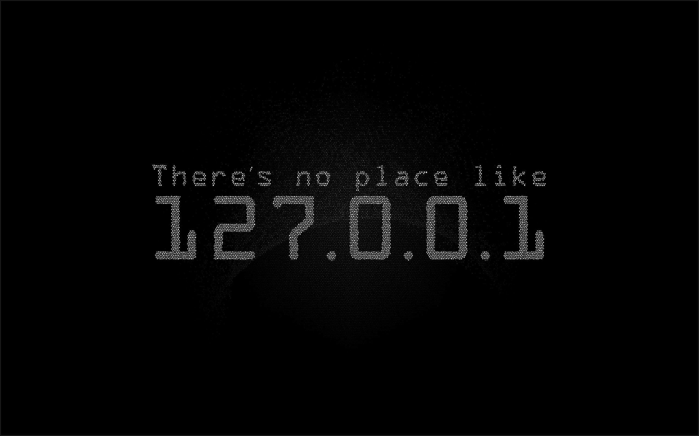

# ℹ️ Home

## 🤝 Introduction

Hi, **syselement** here 🧑‍💻, sharing some interesting Information Technology and Cybersecurity notes and stuff.

Welcome to my notes blog! This blog is intended to provide information and insights on various topics related to **Cybersecurity**, **Ethical Hacking** and **Systems Administration**, based on public open-source material and software, and should not be considered as a substitute for professional advice or guidance.

👈 Check the menu on the left for more!

> ❗ **Disclaimer**
>
> *The content on this notes blog is intended solely for educational, personal, non-commercial, testing, and research purposes. It must not be used for illegal or malicious activities. The information provided is based on publicly available material, as well as on my own interpretations and commentary, which may not always be up-to-date. Use this content at your own risk. By accessing these notes, you agree to absolve me of any liability. All references and comments from external resources will include a link to the original source.*
>
> ✏️ **Copyright ©️ 2025 syselement**
>
> *While much of the material in this blog is derived from public sources and is not subject to copyright, my original commentary, analysis, and writing are protected. You are free to share and redistribute this content as long as proper attribution is provided, including a reference to me (**syselement**) and a link to the utilized resource. Redistribution and adaptations must respect the principles of responsible sharing and this license. **Sharing responsibly helps maintain the integrity and value of the work while encouraging collaboration and learning.***

------

## ✉️ Contact

> 
>
> 
>
> ------
>
> 
>
> 
>
> ------
>
> 
>
> 
>
> ------
>
> 
>
> 

------

## 🍕 Referrals

>  
>
> 🔗 [TryHackMe](https://tryhackme.com/signup?referrer=5f960ba99fb18d5314f76d5f) *(Get 5$ on a Premium Subscription)*
>
> ------
>
> 
>
> 🔗 [HackTheBox](https://referral.hackthebox.com/mzwxh7d)
>
> ------
>
> 
>
> 🔗 [PentesterLab](https://pentesterlab.com/referral/KpBnjOZqb3wbTA) *(Get 10 points with a Pro Subscription)*
>
> ------
>
> 
>
> 🔗 [PWNX](https://play.pwnx.io/#/register/referral/7d3777ec-ae01-4cb9-941e-9f8ae6aa7bca)
>
> ---
>
> 
>
> 🔗 [SecurityCert](https://upgrade.chat/securitycert?referralCode=778322883629023243) *(Italian CyberSecurity Community)*
>
> ---
>
> 
>
> 🔗 [KodeKloud](https://engineer.kodekloud.com/signup?referral=6607378b4014655f23f038ae)

[🏠](README.md)

---

