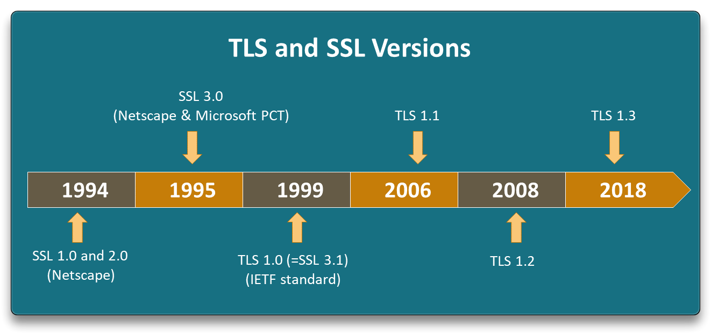
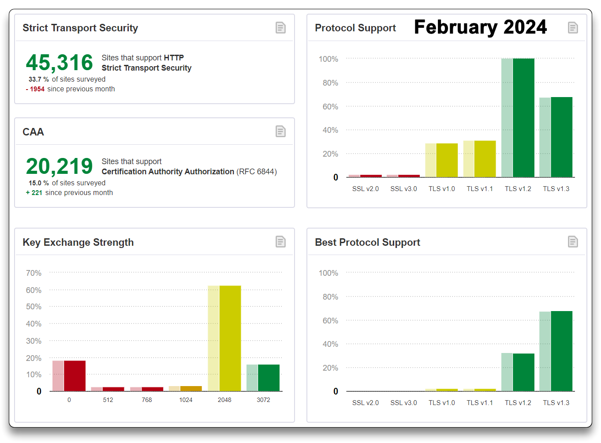
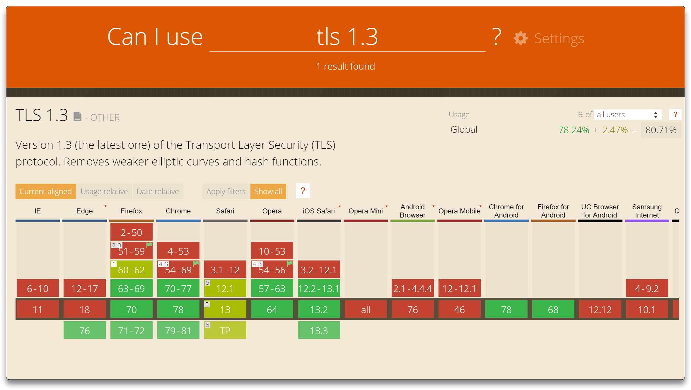
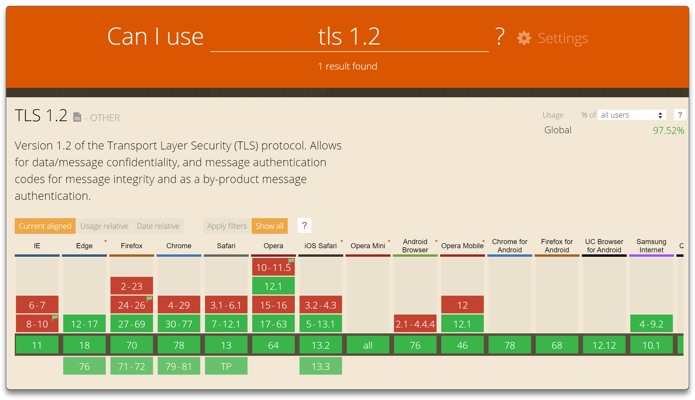

# TLS/SSL Overview

## Introduction

[**SSL**](https://www.cloudflare.com/learning/ssl/what-is-ssl/) (**S**ecure **S**ockets **L**ayer) and [**TLS**](https://www.cloudflare.com/learning/ssl/transport-layer-security-tls/) (**T**ransport **L**ayer **S**ecurity) are both protocols used to secure internet communication. SSL was the original, but it has largely been replaced by TLS due to security improvements.

By creating a **secure, protected "tunnel" across the Internet**, they encrypt data to keep it private and secure while it's being transmitted between a client (like a web browser) and a server (like a website). TLS is the newer (SSL renamed by IETF), more secure version that's widely used today. The 2 terms are often used interchangeably.

- **HTTPS** - HTTP secured by an SSL/TLS
- SSL VPN for private corporate network
- SSL VPN via public VPN provider

The purpose of SSL/TLS is to protect the data that can be captured.

- **Confidentiality** - data accessible only by client and server - Encryption
- **Integrity** - data is not modified between client and server - **Hashing**
- **Authentication** - client/server are who they say they are - **PKI**

The data put on the wire is still passing through someone else's network.

- **Anti-Replay** - prevents attackers from reusing intercepted data to gain unauthorized access. It provides sequence numbers built in to integrity and authentication mechanism.
- **Non-Repudiation** - ensures parties can't deny their involvement in a transaction or communication.

 The key players of the SSL/TLS ecosystem are:

- **Client** - entity initiating the TLS handshake, `e.g.` web browser, apps, IoT, etc
  - optionally authenticated at the SSL layer (rarely provides a certificate)
- **Server** - entity receiving the TLS handshake, `e.g.` web server, etc
  - always authenticated (the user has to know what server he is talking to)
- **Certificate Authority** (CA) - governing entity that issues digital certificates to servers
  - trusted by client and server
  - provides **Trust Anchor** - if the client trusts the CA, it can trust what the CA trusts
  - [CAs organizations](https://w3techs.com/technologies/overview/ssl_certificate): [Let's Encrypt](https://letsencrypt.org/), [IdenTrust](https://www.identrust.com/), [GlobalSign](https://www.globalsign.com/en), [Sectigo](https://www.sectigo.com/), [DigiCert](https://www.digicert.com/), [GoDaddy](https://www.godaddy.com/), ...

## TLS/SSL Versions

- [SSL Guide – The Complete Guide to SSL/TLS Certificates](https://aboutssl.org/ssl-guide/)

- [Qualys SSL Labs - SSL Pulse](https://www.ssllabs.com/ssl-pulse/)

Security must be balanced with Accessibility, based on the usage case.

- [TLS vs SSL: What's the Difference? Which One Should You Use? - Kinsta.com](https://kinsta.com/knowledgebase/tls-vs-ssl/)

**SSL v3.0** (declared insecure as of Oct 2014 due to POODLE attack), as a complete redesign of SSL v2.0 is the foundation of the following TLS versions (TLS 1.0, 1.1, 1.2).

**TLS v1.0**

- Protocol ownership transferred to [**I.E.T.F.**](https://www.ietf.org/)
- almost identical to SSL v3.0
- Vulnerability: BEAST attack on CBC ciphers
- **protocol deprecated** on March 2021

**TLS v1.1**

- deprecated EXPORT grade ciphers
- protection against CBC attacks
- **protocol deprecated** on March 2021

[**TLS v1.2**](https://datatracker.ietf.org/doc/html/rfc5246)

- improved security of key generation
- support for **AEAD** ciphers (**A**uthentication **E**ncryption with **A**ssociated **D**ata)
- secure, recommended

[**TLS v1.3**](https://datatracker.ietf.org/doc/html/rfc8446)

- major changes from prior TLS/SSL versions, favors security and simplicity
- shorted handshake
- **forward secrecy** required
- 0-RTT resumption
- AEAD ciphers required

---

