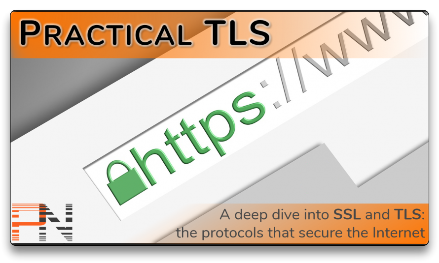

# Practical TLS

## [Practical TLS](https://classes.pracnet.net/courses/practical-tls) Course Topics

1. [TLS/SSL Overview](1-tls-ssl/)
2. [Cryptography](2-cryptography/)
3. [x509 Certificates and Keys](3-x509-certificates-keys/)
4. [Security through Certificates](4-security-certificates/)
5. [Cipher Suites](5-cipher-suites/)
6. [TLS/SSL Handshake](6-tls-ssl-handshake/)
7. [TLS Defenses](7-tls-defenses/)
8. [TLS Attacks & Vulnerabilities](8-tls-attacks-vulns/)
9. [What's new in TLS 1.3?](9-tls-1-3-intro/)
10. [TLS 1.3 Under the Hood](10-tls-1-3/)
11. [TLS 1.3 Extensions](11-tls-1-3-extensions/)

[🌐 Practical TLS References](practicaltls-references.md)

Instructor: [Ed Harmoush](https://twitter.com/ed_pracnet)

***
