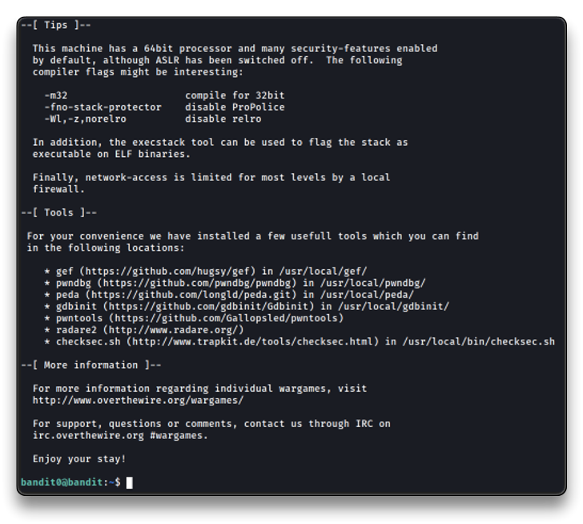

# Bandit Wargame


***

## 🌐 Resources 🔗

> * [Wargames - Bandit](https://overthewire.org/wargames/bandit/)
>   * [Wargames rules](https://overthewire.org/rules/)
> * [\[OTW\] Write-up for the Bandit Wargame - BreakInSecurity](https://axcheron.github.io/writeups/otw/bandit/)

***

## [Wargames](https://overthewire.org/wargames/)

The wargames offered by the OverTheWire community can help you to learn and practice security concepts in the form of fun-filled games. To find out more about a certain wargame, just visit its page linked from the menu on the left.

If you have a problem, a question or a suggestion, you can [join us via chat](https://overthewire.org/information/chat.html).

**Suggested order to play the games in**

1. Bandit
2. Leviathan or Natas or Krypton
3. Narnia
4. Behemoth
5. Utumno
6. Maze
7. …

**Each shell game has its own SSH port**

Information about how to connect to each game using SSH, is provided in the top left corner of the page. Keep in mind that every game uses a different SSH port.

***

## 📝 Bandit

The Bandit wargame is aimed at absolute beginners. It will teach the basics needed to be able to play other wargames. **If you notice something essential is missing or have ideas for new levels, please let us know!**

### Note for beginners

This game, like most other games, is organized in levels. You start at Level 0 and try to “beat” or “finish” it. Finishing a level results in information on how to start the next level. The pages on this website for “Level ” contain information on how to start level X from the previous level. E.g. The page for [Level 1](https://overthewire.org/wargames/bandit/bandit1.html) has information on how to gain access from [Level 0](https://overthewire.org/wargames/bandit/bandit0.html) to [Level 1](https://overthewire.org/wargames/bandit/bandit1.html). All levels in this game have a page on this website, and they are all linked to from the sidemenu on the left of this page.

You will encounter many situations in which you have no idea what you are supposed to do. **Don’t panic! Don’t give up!** The purpose of this game is for you to learn the basics. Part of learning the basics, is reading a lot of new information.

There are several things you can try when you are unsure how to continue:

* First, if you know a command, but don’t know how to use it, try the **manual** ([man page](https://en.wikipedia.org/wiki/Man_page)) by entering “**man** ” (without the quotes). e.g. if you know about the “ls” command, type: man ls. The “man” command also has a manual, try it. Press q to quit the man command.
* Second, if there is no man page, the command might be a **shell built-in**. In that case use the “**help** ” command. E.g. help cd
* Also, your favorite **search-engine** is your friend. Learn how to use it! I recommend [Google](https://www.google.com/).
* Lastly, if you are still stuck, you can [join us via chat](https://overthewire.org/information/chat.html)

You’re ready to start! Begin with [Level 0](https://overthewire.org/wargames/bandit/bandit0.html), linked at the left of this page. Good luck!

**Note for VMs:** You may fail to connect to [overthewire.org](http://overthewire.org/) via SSH with a “_broken pipe error_” when the network adapter for the VM is configured to use NAT mode. Adding the setting **IPQoS throughput** to /etc/ssh/ssh\_config should resolve the issue. If this does not solve your issue, the only option then is to change the adapter to Bridged mode.

* **SSH Information**
  * Host: [bandit.labs.overthewire.org](http://bandit.labs.overthewire.org/)
  * Port: 2220

***

## Bandit Level 0

**Level Goal**

The goal of this level is for you to log into the game using SSH. The host to which you need to connect is [**bandit.labs.overthewire.org**](http://bandit.labs.overthewire.org/), on port 2220. The username is **bandit0** and the password is **bandit0**. Once logged in, go to the [Level 1](https://overthewire.org/wargames/bandit/bandit1.html) page to find out how to beat Level 1.

**Helpful commands**

ssh

**Helpful Reading Material**

* [Secure Shell (SSH) on Wikipedia](https://en.wikipedia.org/wiki/Secure_Shell)
* [How to use SSH on wikiHow](https://www.wikihow.com/Use-SSH)

```bash
ssh bandit0@bandit.labs.overthewire.org -p 2220
```




***

## Bandit Level 0 → Level 1

**Level Goal**

The password for the next level is stored in a file called **readme** located in the home directory. Use this password to log into bandit1 using SSH. Whenever you find a password for a level, use SSH (on port 2220) to log into that level and continue the game.

**Helpful commands**

ls, cd, cat, file, du, find

```bash
cat readme

boJ9jbbUNNfktd78OOpsqOltutMc3MY1
```

***

## Bandit Level 1 → Level 2

**Level Goal**

The password for the next level is stored in a file called **-** located in the home directory

**Helpful commands**

ls, cd, cat, file, du, find

**Helpful Reading Material**

* [Google Search for “dashed filename”](https://www.google.com/search?q=dashed+filename)
* [Advanced Bash-scripting Guide - Chapter 3 - Special Characters](http://tldp.org/LDP/abs/html/special-chars.html)

```bash
cat ./-
or
cat < -

CV1DtqXWVFXTvM2F0k09SHz0YwRINYA9
```

Explanation:    [https://linux-tips.com/t/dashed-filename-in-linux/188](https://linux-tips.com/t/dashed-filename-in-linux/188)

***

## Bandit Level 2 → Level 3

**Level Goal**

The password for the next level is stored in a file called **spaces in this filename** located in the home directory

**Helpful commands**

ls, cd, cat, file, du, find

**Helpful Reading Material**

* [Google Search for “spaces in filename”](https://www.google.com/search?q=spaces+in+filename)

```bash
cat "spaces in this filename"
or (tab it)
cat spaces\ in\ this\ filename

UmHadQclWmgdLOKQ3YNgjWxGoRMb5luK
```

***

## Bandit Level 3 → Level 4

**Level Goal**

The password for the next level is stored in a hidden file in the **inhere** directory.

**Helpful commands**

ls, cd, cat, file, du, find

```bash
ls -la
cat .hidden

pIwrPrtPN36QITSp3EQaw936yaFoFgAB
```

***

## Bandit Level 4 → Level 5

**Level Goal**

The password for the next level is stored in the only human-readable file in the **inhere** directory. Tip: if your terminal is messed up, try the “reset” command.

**Helpful commands**

ls, cd, cat, file, du, find

```bash
bandit4@bandit:~/inhere$ file ./-file*
./-file00: data
./-file01: data
./-file02: data
./-file03: data
./-file04: data
./-file05: data
./-file06: data
./-file07: ASCII text
./-file08: data
./-file09: data
bandit4@bandit:~/inhere$ cat ./-file07

koReBOKuIDDepwhWk7jZC0RTdopnAYKh
```

***

## Bandit Level 5 → Level 6

**Level Goal**

The password for the next level is stored in a file somewhere under the **inhere** directory and has all of the following properties:

* human-readable
* 1033 bytes in size
* not executable

**Helpful commands**

ls, cd, cat, file, du, find

```bash
bandit5@bandit:~/inhere$ du -ab | grep 1033
1033	./maybehere07/.file2
bandit5@bandit:~/inhere$ cat ./maybehere07/.file2

DXjZPULLxYr17uwoI01bNLQbtFemEgo
```

***

## Bandit Level 6 → Level 7

**Level Goal**

The password for the next level is stored **somewhere on the server** and has all of the following properties:

* owned by user bandit7
* owned by group bandit6
* 33 bytes in size

**Helpful commands**

ls, cd, cat, file, du, find, grep

```bash
bandit6@bandit:/$ find / -ls | grep bandit7
    787922      4 -rw-r-----   1 bandit7      bandit6 33 May  7  2020 /var/lib/dpkg/info/bandit7.password
bandit6@bandit:/$ cat /var/lib/dpkg/info/bandit7.password

HKBPTKQnIay4Fw76bEy8PVxKEDQRKTzs
```

***

## Bandit Level 7 → Level 8

**Level Goal**

The password for the next level is stored in the file **data.txt** next to the word **millionth**

**Helpful commands**

grep, sort, uniq, strings, base64, tr, tar, gzip, bzip2, xxd

```bash
cat data.txt | grep millionth

cvX2JJa4CFALtqS87jk27qwqGhBM9plV
```

***

## Bandit Level 8 → Level 9

**Level Goal**

The password for the next level is stored in the file **data.txt** and is the only line of text that occurs only once

**Helpful commands**

grep, sort, uniq, strings, base64, tr, tar, gzip, bzip2, xxd

**Helpful Reading Material**

* [Piping and Redirection](https://ryanstutorials.net/linuxtutorial/piping.php)

```bash
sort data.txt | uniq -u

UsvVyFSfZZWbi6wgC7dAFyFuR6jQQUhR
```

***

## Bandit Level 9 → Level 10

**Level Goal**

The password for the next level is stored in the file **data.txt** in one of the few human-readable strings, preceded by several ‘=’ characters.

**Helpful commands**

grep, sort, uniq, strings, base64, tr, tar, gzip, bzip2, xxd

```bash
strings data.txt

truKLdjsbJ5g7yyJ2X2R0o3a5HQJFuLk
```

***

## Bandit Level 10 → Level 11

**Level Goal**

The password for the next level is stored in the file **data.txt**, which contains base64 encoded data

**Helpful commands**

grep, sort, uniq, strings, base64, tr, tar, gzip, bzip2, xxd

**Helpful Reading Material**

* [Base64 on Wikipedia](https://en.wikipedia.org/wiki/Base64)

```bash
bandit10@bandit:~$ cat data.txt | base64 -d
The password is IFukwKGsFW8MOq3IRFqrxE1hxTNEbUPR
```

***

## Bandit Level 11 → Level 12

**Level Goal**

The password for the next level is stored in the file **data.txt**, where all lowercase (a-z) and uppercase (A-Z) letters have been rotated by 13 positions

**Helpful commands**

grep, sort, uniq, strings, base64, tr, tar, gzip, bzip2, xxd

**Helpful Reading Material**

* [Rot13 on Wikipedia](https://en.wikipedia.org/wiki/Rot13)

```bash
bandit11@bandit:~$ cat data.txt | tr 'n-za-mN-ZA-M' 'a-zA-Z'
The password is 5Te8Y4drgCRfCx8ugdwuEX8KFC6k2EUu
```

***

## Bandit Level 12 → Level 13

**Level Goal**

The password for the next level is stored in the file **data.txt**, which is a hexdump of a file that has been repeatedly compressed. For this level it may be useful to create a directory under /tmp in which you can work using mkdir. For example: mkdir /tmp/myname123. Then copy the datafile using cp, and rename it using mv (read the manpages!)

**Helpful commands**

grep, sort, uniq, strings, base64, tr, **tar**, **gzip**, **bzip2**, **xxd**, mkdir, cp, **mv**, file

**Helpful Reading Material**

* [Hex dump on Wikipedia](https://en.wikipedia.org/wiki/Hex_dump)

```bash
mktemp -d
mv data.txt /tmp/tmp.SxmMF0PfSX/level12
xxd -r level12 > level12-reversed
file level12-reversed
level12-reversed: gzip compressed data, was "data2.bin", last modified: Thu May  7 18:14:30 2020, max compression, from Unix

mv level12-reversed data2.gz
gzip -d data2.gz
file data2
data2: bzip2 compressed data, block size = 900k

mv data2 data3.bz
bzip2 -d data3.bz
file data3
data3: gzip compressed data, was "data4.bin", last modified: Thu May  7 18:14:30 2020, max compression, from Unix

mv data3 data4.gz
gzip -d data4.gz
file data4
data4: POSIX tar archive (GNU)

mv data4 data5.tar
tar -xf data5.tar
file data5.bin
data5.bin: POSIX tar archive (GNU)

mv data5.bin data6.tar
tar -xf data6.tar
file data6.bin
data6.bin: bzip2 compressed data, block size = 900k

mv data6.bin data7.bz
bzip -d data7.bz
file data7
data7: POSIX tar archive (GNU)

mv data7 data8.tar
tar -xf data8.tar
file data8.bin
data8.bin: gzip compressed data, was "data9.bin", last modified: Thu May  7 18:14:30 2020, max compression, from Unix

mv data8.bin data9.gz
gzip -d data9.gz
file data9
data9: ASCII text
cat data9
The password is 8ZjyCRiBWFYkneahHwxCv3wb2a1ORpYL
```

***

## Bandit Level 13 → Level 14

**Level Goal**

The password for the next level is stored in **/etc/bandit\_pass/bandit14 and can only be read by user bandit14**. For this level, you don’t get the next password, but you get a private SSH key that can be used to log into the next level. **Note:** **localhost** is a hostname that refers to the machine you are working on

**Helpful commands**

ssh, telnet, nc, openssl, s\_client, nmap

**Helpful Reading Material**

* [SSH/OpenSSH/Keys](https://help.ubuntu.com/community/SSH/OpenSSH/Keys)

```bash
ls -la
ssh -i sshkey.private bandit14@localhost
cat /etc/bandit_pass/bandit14

4wcYUJFw0k0XLShlDzztnTBHiqxU3b3e

or

On my local machine:
$ scp -P 2220 bandit13@bandit.labs.overthewire.org:sshkey.private .
$ chmod 400 sshkey.private
$ ssh -i sshkey.private bandit14@bandit.labs.overthewire.org -p 2220

```

***

## Bandit Level 14 → Level 15

**Level Goal**

The password for the next level can be retrieved by submitting the password of the current level to **port 30000 on localhost**.

**Helpful commands**

ssh, telnet, nc, openssl, s\_client, nmap

**Helpful Reading Material**

*   [https://www.youtube.com/watch?v=7\_LPdttKXPc](https://www.youtube.com/watch?v=7_LPdttKXPc)

    (Not completely accurate, but good enough for beginners)
* [IP Addresses](http://computer.howstuffworks.com/web-server5.htm)
* [IP Address on Wikipedia](https://en.wikipedia.org/wiki/IP_address)
* [Localhost on Wikipedia](https://en.wikipedia.org/wiki/Localhost)
* [Ports](http://computer.howstuffworks.com/web-server8.htm)
* [Port (computer networking) on Wikipedia](https://en.wikipedia.org/wiki/Port_\(computer_networking\))

```bash
echo "4wcYUJFw0k0XLShlDzztnTBHiqxU3b3e" | nc localhost 30000
Correct!

BfMYroe26WYalil77FoDi9qh59eK5xNr
```

***

## Bandit Level 15 → Level 16

**Level Goal**

The password for the next level can be retrieved by submitting the password of the current level to **port 30001 on localhost** using SSL encryption.

**Helpful note: Getting “HEARTBEATING” and “Read R BLOCK”? Use -ign\_eof and read the “CONNECTED COMMANDS” section in the manpage. Next to ‘R’ and ‘Q’, the ‘B’ command also works in this version of that command…**

**Helpful commands**

ssh, telnet, nc, openssl, s\_client, nmap

**Helpful Reading Material**

* [Secure Socket Layer/Transport Layer Security on Wikipedia](https://en.wikipedia.org/wiki/Secure_Socket_Layer)
* [OpenSSL Cookbook - Testing with OpenSSL](https://www.feistyduck.com/library/openssl-cookbook/online/ch-testing-with-openssl.html)

```bash
openssl s_client -connect localhost:30001
BfMYroe26WYalil77FoDi9qh59eK5xNr
Correct!

cluFn7wTiGryunymYOu4RcffSxQluehd

or

cat /etc/bandit_pass/bandit15 | openssl s_client -connect localhost:30001 -quiet
```

***

## Bandit Level 16 → Level 17

**Level Goal**

The credentials for the next level can be retrieved by submitting the password of the current level to **a port on localhost in the range 31000 to 32000**. First find out which of these ports have a server listening on them. Then find out which of those speak SSL and which don’t. There is only 1 server that will give the next credentials, the others will simply send back to you whatever you send to it.

**Helpful commands**

ssh, telnet, nc, openssl, s\_client, nmap

**Helpful Reading Material**

* [Port scanner on Wikipedia](https://en.wikipedia.org/wiki/Port_scanner)

```bash
nmap -v -Pn localhost -p31000-32000
nmap -v -Pn -sV localhost -p31046,31518,31691,31790,31960

PORT      STATE SERVICE     VERSION
31046/tcp open  echo
31518/tcp open  ssl/echo
31691/tcp open  echo
31790/tcp open  ssl/unknown
31960/tcp open  echo

mktemp -d
cat /etc/bandit_pass/bandit16 | openssl s_client -connect localhost:31790 -quiet > /tmp/tmp.GQ6SkltH3m/b16.private
nano /tmp/tmp.GQ6SkltH3m/b16.private
chmod 400 /tmp/tmp.GQ6SkltH3m/b16.private
ssh -i /tmp/tmp.GQ6SkltH3m/b16.private bandit17@localhost
cat /etc/bandit_pass/bandit17

xLYVMN9WE5zQ5vHacb0sZEVqbrp7nBTn
```

***

## Bandit Level 17 → Level 18

**Level Goal**

There are 2 files in the homedirectory: **passwords.old and** [**passwords.ne**](http://passwords.ne/)**w**. The password for the next level is in [\*\*passwords.ne](http://passwords.ne/)w\*\* and is the only line that has been changed between **passwords.old and** [**passwords.ne**](http://passwords.ne/)**w**

**NOTE: if you have solved this level and see ‘Byebye!’ when trying to log into bandit18, this is related to the next level, bandit19**

**Helpful commands**

cat, grep, ls, diff

```bash
diff passwords.old passwords.new
42c42
< w0Yfolrc5bwjS4qw5mq1nnQi6mF03bii
---
> kfBf3eYk5BPBRzwjqutbbfE887SVc5Yd

kali@kali:~$ ssh bandit18@bandit.labs.overthewire.org -p 2220
kfBf3eYk5BPBRzwjqutbbfE887SVc5Yd
Byebye !
Connection to bandit.labs.overthewire.org closed.
```

***

## Bandit Level 18 → Level 19

**Level Goal**

The password for the next level is stored in a file **readme** in the homedirectory. Unfortunately, someone has modified **.bashrc** to log you out when you log in with SSH.

**Helpful commands**

ssh, ls, cat

```bash
ssh bandit18@bandit.labs.overthewire.org -p 2220 "cat readme"
bandit18@bandit.labs.overthewire.org's password:

IueksS7Ubh8G3DCwVzrTd8rAVOwq3M5x
```

***

## Bandit Level 19 → Level 20

**Level Goal**

To gain access to the next level, you should use the setuid binary in the homedirectory. Execute it without arguments to find out how to use it. The password for this level can be found in the usual place (/etc/bandit\_pass), after you have used the setuid binary.

**Helpful Reading Material**

* [setuid on Wikipedia](https://en.wikipedia.org/wiki/Setuid)

```bash
bandit19@bandit:~$ ./bandit20-do
Run a command as another user.
  Example: ./bandit20-do id

./bandit20-do cat /etc/bandit_pass/bandit20
GbKksEFF4yrVs6il55v6gwY5aVje5f0j
```

***

## Bandit Level 20 → Level 21

**Level Goal**

There is a setuid binary in the homedirectory that does the following:

* it makes a connection to localhost on the port you specify as a commandline argument.
* It then reads a line of text from the connection and compares it to the password in the previous level (bandit20).
* If the password is correct, it will transmit the password for the next level (bandit21).

**NOTE:** Try connecting to your own network daemon to see if it works as you think

**Helpful commands**

ssh, nc, cat, bash, screen, tmux, Unix ‘job control’ (bg, fg, jobs, &, CTRL-Z, …)

```bash
# Terminal 1
bandit20@bandit:~$ nc -lp 32000 < /etc/bandit_pass/bandit20
gE269g2h3mw3pwgrj0Ha9Uoqen1c9DGr

# Terminal 2
bandit20@bandit:~$ ./suconnect 32000
Read: GbKksEFF4yrVs6il55v6gwY5aVje5f0j
Password matches, sending next password

gE269g2h3mw3pwgrj0Ha9Uoqen1c9DGr
```

***

## Bandit Level 21 → Level 22

**Level Goal**

A program is running automatically at regular intervals from **cron**, the time-based job scheduler. Look in **/etc/cron.d/** for the configuration and see what command is being executed.

**Helpful commands**

cron, crontab, crontab(5) (use “man 5 crontab” to access this)

```bash
bandit21@bandit:~$ ls -la /etc/cron.d/
bandit21@bandit:~$ cat /etc/cron.d/cronjob_bandit22
@reboot bandit22 /usr/bin/cronjob_bandit22.sh &> /dev/null
* * * * * bandit22 /usr/bin/cronjob_bandit22.sh &> /dev/null

bandit21@bandit:~$cat /usr/bin/cronjob_bandit22.sh
#!/bin/bash
chmod 644 /tmp/t7O6lds9S0RqQh9aMcz6ShpAoZKF7fgv
cat /etc/bandit_pass/bandit22 > /tmp/t7O6lds9S0RqQh9aMcz6ShpAoZKF7fgv

bandit21@bandit:/etc/cron.d$ cat /tmp/t7O6lds9S0RqQh9aMcz6ShpAoZKF7fgv

Yk7owGAcWjwMVRwrTesJEwB7WVOiILLI
```

***

## Bandit Level 22 → Level 23

**Level Goal**

A program is running automatically at regular intervals from **cron**, the time-based job scheduler. Look in **/etc/cron.d/** for the configuration and see what command is being executed.

**NOTE:** Looking at shell scripts written by other people is a very useful skill. The script for this level is intentionally made easy to read. If you are having problems understanding what it does, try executing it to see the debug information it prints.

**Helpful commands**

cron, crontab, crontab(5) (use “man 5 crontab” to access this)

```bash
bandit22@bandit:~$ cat /etc/cron.d/cronjob_bandit23
@reboot bandit23 /usr/bin/cronjob_bandit23.sh  &> /dev/null
* * * * * bandit23 /usr/bin/cronjob_bandit23.sh  &> /dev/null

bandit22@bandit:~$ cat /usr/bin/cronjob_bandit23.sh
#!/bin/bash
myname=$(whoami)
mytarget=$(echo I am user $myname | md5sum | cut -d ' ' -f 1)
echo "Copying passwordfile /etc/bandit_pass/$myname to /tmp/$mytarget"
cat /etc/bandit_pass/$myname > /tmp/$mytarget

bandit22@bandit:~$ echo "I am user bandit23" | md5sum | cut -d ' ' -f 1
8ca319486bfbbc3663ea0fbe81326349
bandit22@bandit:~$ cat /tmp/8ca319486bfbbc3663ea0fbe81326349

jc1udXuA1tiHqjIsL8yaapX5XIAI6i0n
```

***

## Bandit Level 23 → Level 24

**Level Goal**

A program is running automatically at regular intervals from **cron**, the time-based job scheduler. Look in **/etc/cron.d/** for the configuration and see what command is being executed.

**NOTE:** This level requires you to create your own first shell-script. This is a very big step and you should be proud of yourself when you beat this level!

**NOTE 2:** Keep in mind that your shell script is removed once executed, so you may want to keep a copy around…

**Helpful commands**

cron, crontab, crontab(5) (use “man 5 crontab” to access this)

```bash
bandit23@bandit:~$ cat /etc/cron.d/cronjob_bandit24
@reboot bandit24 /usr/bin/cronjob_bandit24.sh &> /dev/null
* * * * * bandit24 /usr/bin/cronjob_bandit24.sh &> /dev/null

bandit23@bandit:~$ cat /usr/bin/cronjob_bandit24.sh
#!/bin/bash
myname=$(whoami)
cd /var/spool/$myname
echo "Executing and deleting all scripts in /var/spool/$myname:"
for i in * .*;
do
    if [ "$i" != "." -a "$i" != ".." ];
    then
        echo "Handling $i"
        owner="$(stat --format "%U" ./$i)"
        if [ "${owner}" = "bandit23" ]; then
            timeout -s 9 60 ./$i
        fi
        rm -f ./$i
    fi
done

ls -la /var/spool/
drwxrwx-wx 42 root bandit24 4096 Sep 28 23:40 bandit24

mktemp -d
cd /tmp/tmp.nBUM7DsmQ5
bandit23@bandit:/tmp/tmp.nBUM7DsmQ5$ nano firstscript.sh

#!/bin/bash
 cat /etc/bandit_pass/bandit24 >> /tmp/tmp.nBUM7DsmQ5/bandit24pw

chmod 777 firstscript.sh
cp firstscript.sh /var/spool/bandit24
chmod 777 /tmp/tmp.nBUM7DsmQ5

# Wait a minute
bandit23@bandit:/tmp/tmp.nBUM7DsmQ5$ cat bandit24pw

UoMYTrfrBFHyQXmg6gzctqAwOmw1IohZ

```

***

## Bandit Level 24 → Level 25

**Level Goal**

A daemon is listening on port 30002 and will give you the password for bandit25 if given the password for bandit24 and a secret numeric 4-digit pincode. There is no way to retrieve the pincode except by going through all of the 10000 combinations, called brute-forcing.

```bash
bandit24@bandit:~$ nc localhost 30002
I am the pincode checker for user bandit25. Please enter the password for user bandit24 and the secret pincode on a single line, separated by a space.

mktemp -d
/tmp/tmp.OTU1lR6vjK

nano brutepin.sh
#!/bin/bash
for i in {0000..9999}
do
        echo "UoMYTrfrBFHyQXmg6gzctqAwOmw1IohZ $i"
done

chmod 700 brutepin.sh
./brutepin.sh > pwpluspin.txt
nc localhost 30002 < pwpluspin.txt
Correct!
The password of user bandit25 is uNG9O58gUE7snukf3bvZ0rxhtnjzSGzG
```

***

## Bandit Level 25 → Level 26

**Level Goal**

Logging in to bandit26 from bandit25 should be fairly easy… The shell for user bandit26 is not **/bin/bash**, but something else. Find out what it is, how it works and how to break out of it.

**Helpful commands**

ssh, cat, more, vi, ls, id, pwd

```bash
cat /etc/passwd | grep bandit26
bandit26:x:11026:11026:bandit level 26:/home/bandit26:/usr/bin/showtext
cat /usr/bin/showtext
#!/bin/sh
export TERM=linux
more ~/text.txt
exit 0

ls
bandit25@bandit:~$ ssh -i bandit26.sshkey bandit26@localhost
# Reduce the size of the terminal to enable 'more' to paging through text one screenful at a time.
# Max height = 6

# Press 'v' to start vi
# Then, in vi type ':e /etc/bandit_pass/bandit26'

5czgV9L3Xx8JPOyRbXh6lQbmIOWvPT6Z
```

***

## Bandit Level 26 → Level 27

**Level Goal**

Good job getting a shell! Now hurry and grab the password for bandit27!

**Helpful commands**

ls

```bash
:set shell=/bin/bash
:!ls -la

total 36
drwxr-xr-x  3 root     root     4096 May  7  2020 .
drwxr-xr-x 41 root     root     4096 May  7  2020 ..
-rwsr-x---  1 bandit27 bandit26 7296 May  7  2020 bandit27-do

:! ./bandit27-do cat /etc/bandit_pass/bandit27
3ba3118a22e93127a4ed485be72ef5ea
```

_**Explanation:** In the first part we figure that the fake shell read a file with more and exit. As the content of the file is not long enough, we need to reduce the size of the terminal to enable more to paging through text one screenful at a time. Once more is running we can type **v** to open vi and execute command through that tool. Same thing for the second part except the bandit27-do command will give us the password._

***

## Bandit Level 27 → Level 28

**Level Goal**

There is a git repository at ssh://bandit27-git@localhost/home/bandit27-git/repo. The password for the user bandit27-git is the same as for the user bandit27.

Clone the repository and find the password for the next level.

**Helpful commands**

git

```bash
mktemp -d
cd /tmp/tmp.ax0vjU06Nd

bandit27@bandit:/tmp/tmp.ax0vjU06Nd$ git clone ssh://bandit27-git@localhost/home/bandit27-git/repo.git
Cloning into 'repo'...

Could not create directory '/home/bandit27/.ssh'.

The authenticity of host 'localhost (127.0.0.1)' can't be established.

ECDSA key fingerprint is SHA256:98UL0ZWr85496EtCRkKlo20X3OPnyPSB5tB5RPbhczc.

Are you sure you want to continue connecting (yes/no)? yes

Failed to add the host to the list of known hosts (/home/bandit27/.ssh/known_hosts).

This is a OverTheWire game server. More information on http://www.overthewire.org/wargames

bandit27-git@localhost's password:

remote: Counting objects: 3, done.

remote: Compressing objects: 100% (2/2), done.

Receiving objects: 100% (3/3), 288 bytes | 0 bytes/s, done.

remote: Total 3 (delta 0), reused 0 (delta 0)

cat repo/README
The password to the next level is: 0ef186ac70e04ea33b4c1853d2526fa2
```

***

## Bandit Level 28 → Level 29

**Level Goal**

There is a git repository at ssh://bandit28-git@localhost/home/bandit28-git/repo. The password for the user bandit28-git is the same as for the user bandit28.

Clone the repository and find the password for the next level.

**Helpful commands**

git

```bash
mktemp -d

cd /tmp/tmp.CT4ub7RauY

git clone ssh://bandit28-git@localhost/home/bandit28-git/repo.git
cat repo/README.md
# Bandit Notes

Some notes for level29 of bandit.

## credentials

- username: bandit29

- password: xxxxxxxxxx

git show

commit edd935d60906b33f0619605abd1689808ccdd5ee

Author: Morla Porla <morla@overthewire.org>

Date:   Thu May 7 20:14:49 2020 +0200

    fix info leak

diff --git a/README.md b/README.md

index 3f7cee8..5c6457b 100644

--- a/README.md

+++ b/README.md

@@ -4,5 +4,5 @@ Some notes for level29 of bandit.

 ## credentials

 - username: bandit29

-- password: bbc96594b4e001778eee9975372716b2

+- password: xxxxxxxxxx
```

***

## Bandit Level 29 → Level 30

**Level Goal**

There is a git repository at ssh://bandit29-git@localhost/home/bandit29-git/repo. The password for the user bandit29-git is the same as for the user bandit29.

Clone the repository and find the password for the next level.

**Helpful commands**

git

```bash
mktemp -d

cd /tmp/tmp.Gok6ouPLoj
git clone ssh://bandit29-git@localhost/home/bandit29-git/repo.git

cd repo
git show

commit 208f463b5b3992906eabf23c562eda3277fea912

Author: Ben Dover <noone@overthewire.org>

Date:   Thu May 7 20:14:51 2020 +0200

    fix username

diff --git a/README.md b/README.md

index 2da2f39..1af21d3 100644

--- a/README.md

+++ b/README.md

@@ -3,6 +3,6 @@ Some notes for bandit30 of bandit.

 ## credentials

-- username: bandit29

+- username: bandit30

 - password: <no passwords in production!>

git branch
* master
git checkout dev

Branch dev set up to track remote branch dev from origin.

Switched to a new branch 'dev'

git branch
* dev

  master

cat README.md

# Bandit Notes

Some notes for bandit30 of bandit.

## credentials

- username: bandit30

- password: 5b90576bedb2cc04c86a9e924ce42faf
```

***

## Bandit Level 30 → Level 31

**Level Goal**

There is a git repository at ssh://bandit30-git@localhost/home/bandit30-git/repo. The password for the user bandit30-git is the same as for the user bandit30.

Clone the repository and find the password for the next level.

**Helpful commands**

git

```bash
ssh bandit30@bandit.labs.overthewire.org -p 2220

mktemp -d
cd /tmp/tmp.qUNYNWL79M

git clone ssh://bandit30-git@localhost/home/bandit30-git/repo.git
cd repo
cat README.md

just an epmty file... muahaha

git show

commit 3aefa229469b7ba1cc08203e5d8fa299354c496b

Author: Ben Dover <noone@overthewire.org>

Date:   Thu May 7 20:14:54 2020 +0200

    initial commit of README.md

diff --git a/README.md b/README.md

new file mode 100644

index 0000000..029ba42

--- /dev/null

+++ b/README.md

@@ -0,0 +1 @@

+just an epmty file... muahaha

git log
commit 3aefa229469b7ba1cc08203e5d8fa299354c496b

Author: Ben Dover <noone@overthewire.org>

Date:   Thu May 7 20:14:54 2020 +0200

    initial commit of README.md

git branch -r
  origin/HEAD -> origin/master

  origin/master

git tag

    secret

git show secret
    47e603bb428404d265f59c42920d81e5

```

***

## Bandit Level 31 → Level 32

**Level Goal**

There is a git repository at ssh://bandit31-git@localhost/home/bandit31-git/repo. The password for the user bandit31-git is the same as for the user bandit31.

Clone the repository and find the password for the next level.

**Helpful commands**

git

```bash
mktemp -d

cd /tmp/tmp.pGwtTCEl34

cd repo/
cat README.md
This time your task is to push a file to the remote repository.

Details:

    File name: key.txt

    Content: 'May I come in?'

    Branch: master

cat > key.txt

May I come in?

^C

git add key.txt

The following paths are ignored by one of your .gitignore files:

key.txt

Use -f if you really want to add them.

ls -la

total 24

drwxr-sr-x 3 bandit31 root 4096 Oct  5 23:34 .

drwx--S--- 3 bandit31 root 4096 Oct  5 23:32 ..

drwxr-sr-x 8 bandit31 root 4096 Oct  5 23:35 .git

-rw-r--r-- 1 bandit31 root    6 Oct  5 23:32 .gitignore

-rw-r--r-- 1 bandit31 root   15 Oct  5 23:34 key.txt

-rw-r--r-- 1 bandit31 root  147 Oct  5 23:32 README.md

rm -rf .gitignore
git add key.txt

git commit -m "upload key"

[master 376b669] upload key

 1 file changed, 1 insertion(+)

 create mode 100644 key.txt

git push origin master

Could not create directory '/home/bandit31/.ssh'.

The authenticity of host 'localhost (127.0.0.1)' can't be established.

ECDSA key fingerprint is SHA256:98UL0ZWr85496EtCRkKlo20X3OPnyPSB5tB5RPbhczc.

Are you sure you want to continue connecting (yes/no)? yes

Failed to add the host to the list of known hosts (/home/bandit31/.ssh/known_hosts).

This is a OverTheWire game server. More information on http://www.overthewire.org/wargames

bandit31-git@localhost's password:

Counting objects: 3, done.

Delta compression using up to 2 threads.

Compressing objects: 100% (2/2), done.

Writing objects: 100% (3/3), 321 bytes | 0 bytes/s, done.

Total 3 (delta 0), reused 0 (delta 0)

remote: ### Attempting to validate files... ####

remote:

remote: .oOo.oOo.oOo.oOo.oOo.oOo.oOo.oOo.oOo.oOo.

remote:

remote: Well done! Here is the password for the next level:

remote: 56a9bf19c63d650ce78e6ec0354ee45e

remote:

remote: .oOo.oOo.oOo.oOo.oOo.oOo.oOo.oOo.oOo.oOo.

remote:

To ssh://localhost/home/bandit31-git/repo.git

 ! [remote rejected] master -> master (pre-receive hook declined)

error: failed to push some refs to 'ssh://bandit31-git@localhost/home/bandit31-git/repo.git'

    56a9bf19c63d650ce78e6ec0354ee45e

```

***

## Bandit Level 32 → Level 33

After all this git stuff its time for another escape. Good luck!

**Helpful commands**

sh, man

```bash
ssh bandit32@bandit.labs.overthewire.org -p 2220
WELCOME TO THE UPPERCASE SHELL

>>

>>$0
($0 expands to the name of the shell or shell script. This is set at shell initialization. If bash is invoked with a file of commands, $0 is set to the name of that file.

$0 helps us to come out of the interactive mode.)

$ ls -la

total 28

drwxr-xr-x  2 root     root     4096 May  7  2020 .

drwxr-xr-x 41 root     root     4096 May  7  2020 ..

-rw-r--r--  1 root     root      220 May 15  2017 .bash_logout

-rw-r--r--  1 root     root     3526 May 15  2017 .bashrc

-rw-r--r--  1 root     root      675 May 15  2017 .profile

-rwsr-x---  1 bandit33 bandit32 7556 May  7  2020 uppershell

"uppershell" ha escalated privilege as user bandit33

$ echo $SHELL

/home/bandit32/uppershell

$ cat /etc/bandit_pass/bandit33

c9c3199ddf4121b10cf581a98d51caee

```

***
