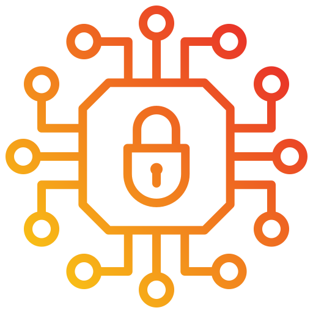

# Cryptography



---

## 🌐 Resources 🔗

> - [Cryptography Basics - TryHackMe](https://tryhackme.com/r/room/cryptographybasics)
>   - [Public Key Cryptography Basics - TryHackMe](https://tryhackme.com/r/room/publickeycrypto)
>   - [Hashing Basics - TryHackMe](https://tryhackme.com/r/room/hashingbasics)
>   - [Introduction to Cryptography](https://tryhackme.com/r/room/cryptographyintro)
> - [What is encryption? - Cloudflare](https://www.cloudflare.com/learning/ssl/what-is-encryption/)
> - [Wolfram|Alpha](https://www.wolframalpha.com/)
> - [Modular arithmetic - Britannica](https://www.britannica.com/science/modular-arithmetic)
> - [RSA Encryption - Brilliant](https://brilliant.org/wiki/rsa-encryption/)
> - [Diffie-Hellman - Brilliant](https://brilliant.org/wiki/diffie-hellman-protocol/)
> - [What is SSH? - Cloudflare](https://www.cloudflare.com/learning/access-management/what-is-ssh/)
> - [Digital signature](https://www.docusign.com/how-it-works/electronic-signature/digital-signature/digital-signature-faq)
> - [CA/Included Certificates - MozillaWiki](https://wiki.mozilla.org/CA/Included_Certificates)
> - [net/data/ssl/chrome_root_store/root_store.md](https://chromium.googlesource.com/chromium/src/+/main/net/data/ssl/chrome_root_store/root_store.md)
> - [The GNU Privacy Guard](https://gnupg.org/)
>   - [Email Self-Defense](https://emailselfdefense.fsf.org/en/)
> - [SHA - Brilliant](https://brilliant.org/wiki/secure-hashing-algorithms/)
> - [Peter Selinger: MD5 Collision Demo](https://www.mscs.dal.ca/~selinger/md5collision/)
> - [SHAttered - Collision attack](https://shattered.io/)
> - [Common Password List - rockyou.txt - Kaggle](https://www.kaggle.com/datasets/wjburns/common-password-list-rockyoutxt)
>   - [Understanding RockYou.txt: A Tool for Security and a Weapon for Hackers - Keeper](https://www.keepersecurity.com/blog/2023/08/04/understanding-rockyou-txt-a-tool-for-security-and-a-weapon-for-hackers/)
> - [What is a rainbow table attack and how to prevent it? - Proton](https://proton.me/blog/what-is-rainbow-table-attack)
> - [HMAC (Hash-Based Message Authentication Codes) Definition - Okta](https://www.okta.com/identity-101/hmac/)
>   - [HMAC](https://cryptography.io/en/latest/hazmat/primitives/mac/hmac/)
> - [pyca/cryptography](https://cryptography.io/en/stable/)

### Tools

> - [dCode - Online Ciphers, Solvers, Decoders, Calculators](https://www.dcode.fr/cipher-identifier)
> - [RsaCtfTool](https://github.com/RsaCtfTool/RsaCtfTool)
> - [rsatool](https://github.com/ius/rsatool)
> - [CyberChef](https://gchq.github.io/CyberChef/)
> - [gpg](https://www.gnupg.org/gph/de/manual/r1023.html)
> - [CrackStation - Online Password Hash Cracking](https://crackstation.net/)
> - [Hashes.com Decrypt](https://hashes.com/en/decrypt/hash)
> - [Free Online Encoding Tools For Developers - FreeFormatter.com](https://www.freeformatter.com/encoders-cryptography.html)
> - [hashID](https://pypi.org/project/hashID/)
> - [hashcat](https://hashcat.net/wiki/doku.php?id=example_hashes)
> - [John the Ripper](https://www.openwall.com/john/)

---

## Commands

```bash
ssh-keygen

gpg --import <yourkey>.key
gpg --decrypt <message>.gpg

hexdump -C <file.txt>
md5sum <file.txt>
sha1sum <file.txt>
sha256sum <file.txt>
sha512sum <file.txt>

cat /etc/shadow
# Encrypted password:
# $prefix$options$salt$hash
man 5 crypt

echo "Text" | base64
echo "EncodedText" | base64 -d
```

---

## Theory

- **Hashing** is a process that **transforms input data into a unique hash value**, a fixed-length string of characters, also known as a digest. This hash value serves as a unique representation of the original data, and even a minor modification in the data will result in a different hash value. Unlike encryption or encoding, **hashing is a one-way process**, meaning the original data cannot be recovered from the hash.
- **Encoding** is used to **convert data into a different format** to ensure compatibility with a particular system. Common encoding methods for the English language include ASCII, UTF-8, UTF-16, UTF-32, ISO-8859-1, and Windows-1252. UTF-8, UTF-16, and UTF-32 are Unicode encodings capable of representing characters from various languages, such as Arabic and Japanese.
- **Encryption** is the only method that safeguards data confidentiality by using a cryptographic cipher and a key. This process is reversible, as long as the cipher is known and the key is accessible.

---

