# CVSS 3.1

***

## 🌐 Resources 🔗

> * [Learn FIRST](https://learn.first.org/dashboard)
> * [CVSS v3.1: Specification Document](https://www.first.org/cvss/v3.1/specification-document)
> * [CVSS v4.0: Specification Document](https://www.first.org/cvss/v4.0/specification-document)
> * [NIST NVD CVSS](https://nvd.nist.gov/vuln-metrics/cvss)
> * [CVSS v3.1 Calculator](https://nvd.nist.gov/vuln-metrics/cvss/v3-calculator)
> * Scenarios:
>   * [Vulnerability Chaining Scenario](https://cdn2.talentlms.com/sc/gAAAAABkw4bmzIfjr4_p5au3h0NssDBNcftq-j2gOuOaFj3BVr8RHM476l0xY5Qib3gOlsv2WPXfjso2BtLKlML1HIN-WPTmoWYY3zoLW5dagV2AD36BLYHs53yenUEcx4dZSzke8Yg8mtgDNF-zHDvjI5FMhl10_Q==/firstdotorg/1684781132_course-v1-FIRST-CVSSv3.1-2020-20201216/assets/CVSS_3.1_Vulnerability-Chaining-Scenario.pdf)
>   * [Vulnerability Scenario: Software Libraries](https://cdn2.talentlms.com/sc/gAAAAABkw4bmzIfjr4_p5au3h0NssDBNcftq-j2gOuOaFj3BVr8RHM476l0xY5Qib3gOlsv2WPXfjso2BtLKlML1HIN-WPTmoWYY3zoLW5dagV2AD36BLYHs53yenUEcx4dZSzke8Yg8mtgDNF-zHDvjI5FMhl10_Q==/firstdotorg/1684781132_course-v1-FIRST-CVSSv3.1-2020-20201216/assets/CVSS_3.1_Vulnerability-Scenario-Software-Libraries.pdf)

***

**`CVSS`** (**Common Vulnerability Scoring System**) - vendor-agnostic, industry-open standard designed to convey vulnerability severity and help determine urgency and priority of response.

* Maintained by `FIRST` (Forum of Incident Response and Security Teams)

## Objectives

* Describe CVSS v.3.1 metrics and importance in CVSS scoring
* Identify vulnerable/impacted components and establish importance
* CVSS calculator usage for vuln evaluation

## Base Metrics Part 1

> Base Metric group represents the intrinsic characteristics of a vulnerability that are constant over time and across user environments.

📌 **Security Scope** - the collection of privileges defined by a security authority when granting access to computing resources

📌 **Vulnerable component** - vulnerable software application, module, driver or hardware device

* [CVSS v3.1 Calculator](https://nvd.nist.gov/vuln-metrics/cvss/v3-calculator)

**`e.g. 1`** Vulnerable Web App - requires log in, denies access to users in blacklist banned users. Blacklist changes require a administrative password

* Authentication Bypass Vulnerability: non-default configuration - a privileged user can change the blacklist without admin password.
  * GET request to blacklist users file
  * if requestor is a privileged user > authentication prompt > authorized = make the request
  * if requestor is not a privileged user > request discarded
  * an attacker with unprivileged access can send a malicious HTTP GET request to the server to perform actions on the blacklist users file and modify it, without explicit authorisation
* Vulnerable web app fails to properly handle user input

### Attack Vector (AV)

* _Reflects the context by which vulnerability exploitation is possible._
  * External/Internet attackers > Local/Physical attackers
  * **e.g.** SSH RCE, usage of remote access protocols: AV Network or Adjacent Network
* The _Base Score increases the farther_ (logically+physically) the attacker can be from the target

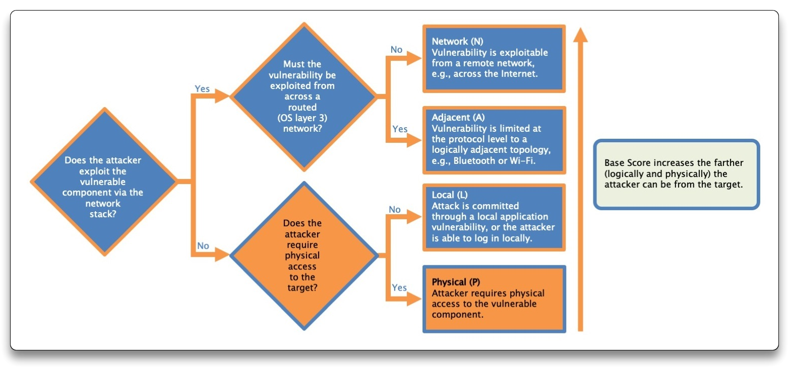

In the **`e.g. 1`** , the Attack Vector is `Network (AV:N)`

### Attack Complexity (AC)

* _Describes the conditions beyond the attacker's control, that must exist in order to exploit the vuln_
* Excludes user interaction in order to exploit the vuln
* The _Base Score increases the most for the least complex attacks (= attack performed at will)_

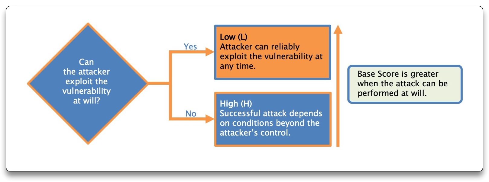

In the **`e.g. 1`** , the Attack Complexity is `Low (AC:L)` - non default setting allowing HTTP GET request to modify a config file, vulnerable component is in that configuration

### Privileges Required (PR)

* _Describes the level of privileges an attacker must possess before successfully exploiting the vuln_
* The _Base Score increases as fewer privileges are required_

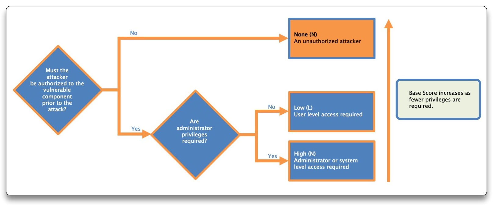

In the **`e.g. 1`** , the Privileges Required is `Low (PR:L)` - the attacker needs to login to the web app with a basic unprivileged user

### User Interaction (UI)

* _Captures the requirement for a user, other than the attacker, to participate in the successful compromise of the vulnerable component_
* The _Base Score is greater when no user interaction is required_

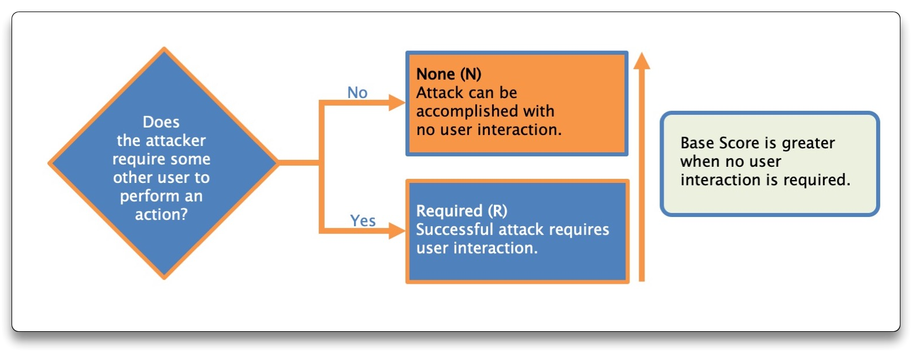

In the **`e.g. 1`** , the User Interaction is `Required (UI:R)` - requires a privileged user to open a malicious URL

## Base Metrics Part 2

### Scope (S)

📌 **Vulnerable component** - _the thing that is vulnerable_ = Security Scope that contains the vuln

📌 **Impacted component** - _the thing that suffers the impact_ = Security Scope that is affected by the vuln

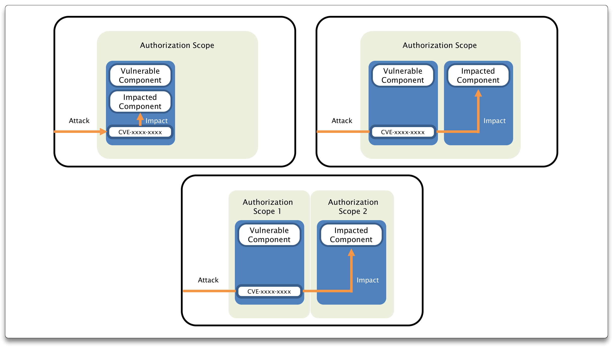

* _Consider the security scope of both components (vulnerable & impacted) and see whether there is a change_
* The _Base Score is greater when systems beyond the vulnerable component are impacted_

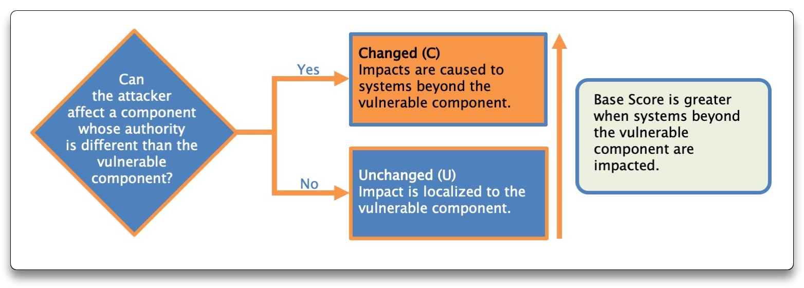

In the **`e.g. 1`** , the Scope is `Unchanged (S:U)` - the web app is both the vulnerable & impacted component

### Base Metrics Overview

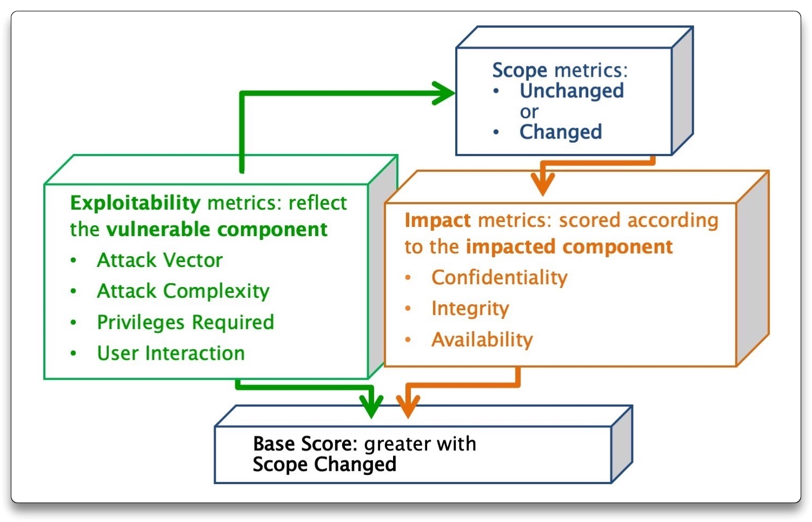

### Confidentiality Impact (C)

* _Measures the impact to the **confidentiality** of the information resources managed by a software component due to a successfully exploited vulnerability_
* The _Base Score increases with the degree of information **disclosed**_

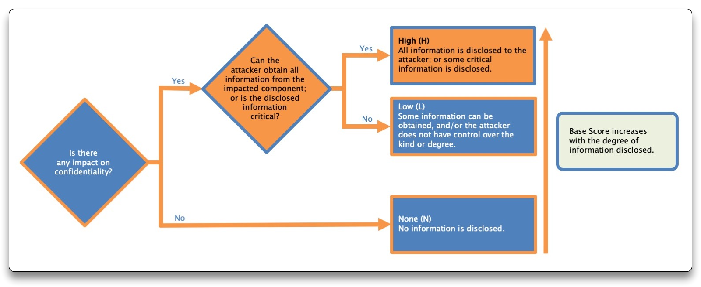

In the **`e.g. 1`** , the Confidentiality Impact is `None (C:N)` - the attacker cannot access any information he has already access to

### Integrity Impact (I)

* _Measures the impact to **data trustworthiness and veracity** resulting from a successfully exploited vulnerability_
* The _Base Score increases with the degree of information that can be **modified**_

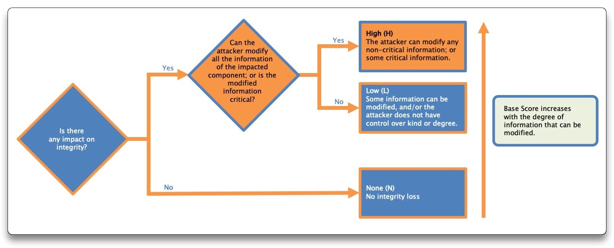

In the **`e.g. 1`** , the Integrity Impact is `Low (I:l)` - the attacker can only modify a configuration file that he did not already have the ability to change

### Availability Impact (A)

* _Measures the impact to the **availability** of the impacted component resulting from a successfully exploited vuln_
* The \*Base Score increases with the degree of disruption of availability

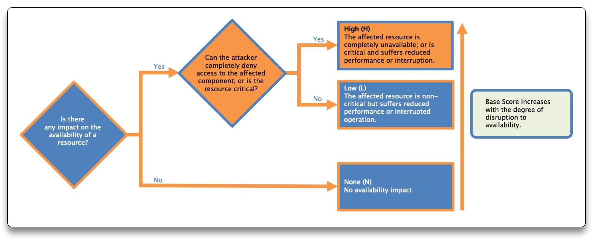

In the **`e.g. 1`** , the Availability Impact is `High (A:H)` - the attacker can make the service unreachable, by modifying the blacklist configuration file

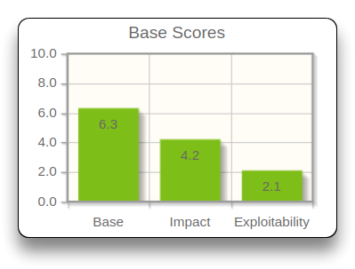

## Temporal Metrics

> Temporal Metric group reflects the characteristics of a vulnerability that may change over time but not across user environments
>
> * Measure the current state of exploit techniques or code availability, the existence of patches/workarounds, or confidence in the description of a vuln
> * Are expected to change over time and need to be adjusted

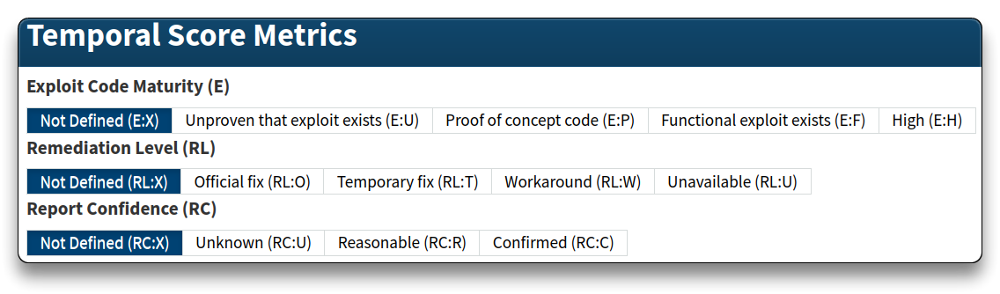

### Exploit Code Maturity (E)

* _Measures the likelihood of the vulnerable component being attacked. Typically is based on the current state of exploit techniques, code availability or active exploitation_

In the **`e.g. 1`** , the Exploit Code Maturity is `Proof oc concept code (E:P)` - POC code is available for the Authentication Bypass Vulnerability

### Remediation Level (RL)

* Remediation level is important for prioritisation, based on vuln patch, workarounds and hotfixes
* The less official and permanent a fix, the higher the vulnerability score

In the **`e.g. 1`** , the Remediation Level is `Temporary fix (RL:T)` - the vendor of the web app has released a temporary fix

### Report Confidence (RC)

* Measures the degree of confidence in the existence of the vuln and the credibility of the known technical details
* A vulnerability rated as **confirmed** has the higher score

In the **`e.g. 1`** , the Report Confidence Level is `Reasonable (RC:R)` - researchers do not have full confidence in the root cause of the vuln

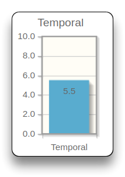

## Environmental Metrics

> Environmental Metric group represents the characteristics of a vulnerability that are relevant and unique to a particular user's environment.
>
> * Customize the CVSS score depending on the importance of the affected IT asset to a user's organization
> * The metrics are the modified equivalent of base metrics and their assigned values based on the component placement in the organizational infrastructure

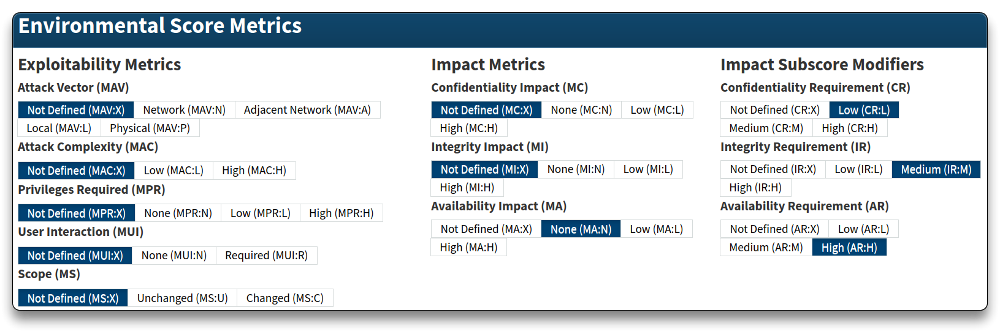

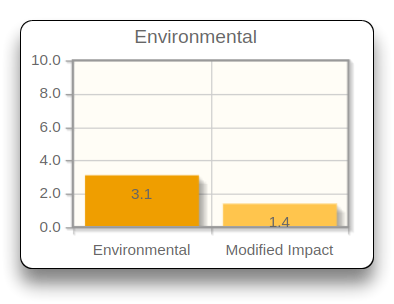

## Vector String

* Qualitative **Severity Rating** Scale
  * All scores con be mapped to the qualitative ratings defined
  * Optional
  * Intended to help properly assess and prioritize the vulnerability management process

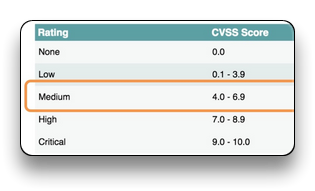

* **Vector String** - text representation of a set of CVSS metrics

> CVSS v3.1 Vector [AV:N/AC:L/PR:L/UI:R/S:U/C:N/I:L/A:H/E:P/RL:T/RC:R/CR:L/IR:M/AR:H/MAV:X/MAC:X/MPR:X/MUI:X/MS:X/MC:X/MI:X/MA:N](https://nvd.nist.gov/vuln-metrics/cvss/v3-calculator?vector=AV:N/AC:L/PR:L/UI:R/S:U/C:N/I:L/A:H/E:P/RL:T/RC:R/CR:L/IR:M/AR:H/MAV:X/MAC:X/MPR:X/MUI:X/MS:X/MC:X/MI:X/MA:N\&version=3.1)

## Scoring Scenarios

### Scenario 1

**`e.g. 2`** - Airplane entertainment system vulnerable to a WiFi attacks, allowing the attacker break out of the sandbox and access any data stored in the entertainment system

* **Vulnerable component** - the sandbox
  * Attack occurs over the in-plane WiFi network
  * **AV:A**
* Attack does not depend on conditions beyond the attacker's control & the Attacker can expect repeatable success
  * **AC:L**
* Mobile devices connect to the WiFi without a password
  * **PR:N**
* Attack is possible without the involvement of other people
  * **UI:N**
* **Vulnerable component** - the sandbox. **Impacted component** - the entire entertainment system
  * **S:C**
* Successful attack can read **all** the data stored on the entertainment system (Confidentiality)
  * **C:H**
* The attacker can modify some of the data, but without causing a direct serious impact (Integrity)
  * **I:L**
* Reduce the performance of the in-flight system. The attacker cannot shutdown the system (Availability)
  * **A:L**
* No information on Exploit Code, Workaround can be applied by sysadmins, No full understanding of root causes of the vuln
  * **E:X**
  * **RL:W**
  * **RC:R**
* Environmental: large air company with the vuln in their in-flight entertainment system
  * No sensitive information stored - **CR:L**
  * Reputation impact - **IR:H**
  * Vuln do not affect flight safety - **AR:L**

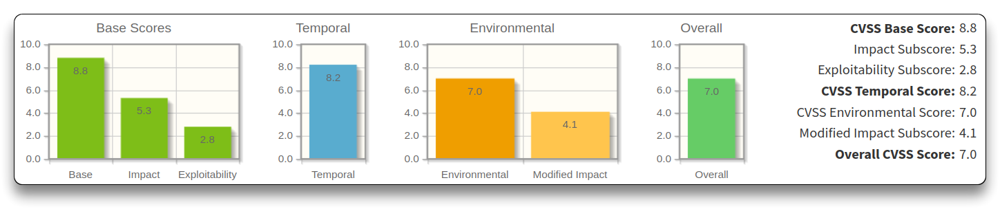

> **CVSS v3.1 Vector**
>
> [AV:A/AC:L/PR:N/UI:N/S:C/C:H/I:L/A:L/E:X/RL:W/RC:R/CR:L/IR:H/AR:L/MAV:X/MAC:X/MPR:X/MUI:X/MS:X/MC:X/MI:X/MA:X](https://nvd.nist.gov/vuln-metrics/cvss/v3-calculator?vector=AV:A/AC:L/PR:N/UI:N/S:C/C:H/I:L/A:L/E:X/RL:W/RC:R/CR:L/IR:H/AR:L/MAV:X/MAC:X/MPR:X/MUI:X/MS:X/MC:X/MI:X/MA:X\&version=3.1)

### Scenario 2

**`e.g. 3`** - machine-tooling organization's website, embedded SQL database for data storage. Website is on internal LAN, not public. Site creates SQL statements with data by users and passes it to the database. Insufficient validation of this data allows SQL-injection attack.

* **Vulnerable component** - the website, insufficient data validation
* Attacker have to connect to website over the internal network (OSI L3)
  * **AV:N**
* Attacks can aspect repeatable access for SQL injection (simple attack), with no specific conditions for exploitation
  * **AC:L**
* Low privileges required
  * **PR:L**
* None user interaction
  * **UI:N**
* Both database and website software are in the same **Security Scope**
  * **S:U**
* Attacker can modify all users' data
  * **C:H**
  * **I:H**
* Attack does not impact of the website accessibility
  * **A:N**
* Exploit code - POC
  * **E:P**
* Hotfix available
  * **RL:T**
* Detailed reports available online
  * **RC:C**
* Environmental
  * Limited loss of confidentiality - **CR:L**
  * Concerned with data change - **IR:M**
  * No problem to the intranet - **AR:L**
  * Smaller attack surface (no internet) - **MAV:A**
  * Prevent attacks from impact integrity data - **MI:N**

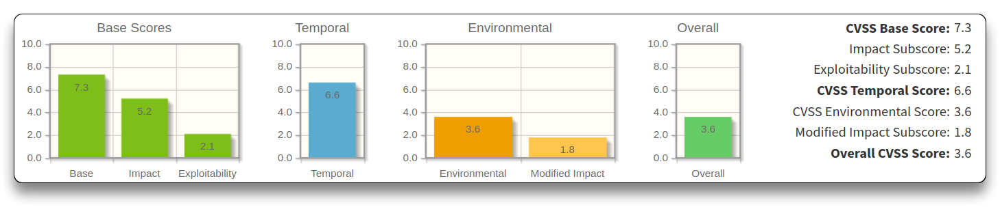

> **CVSS v3.1 Vector**
>
> [AV:A/AC:L/PR:L/UI:N/S:U/C:H/I:H/A:N/E:P/RL:T/RC:C/CR:L/IR:M/AR:L/MAV:A/MAC:X/MPR:X/MUI:X/MS:X/MC:X/MI:N/MA:X](https://nvd.nist.gov/vuln-metrics/cvss/v3-calculator?vector=AV:A/AC:L/PR:L/UI:N/S:U/C:H/I:H/A:N/E:P/RL:T/RC:C/CR:L/IR:M/AR:L/MAV:A/MAC:X/MPR:X/MUI:X/MS:X/MC:X/MI:N/MA:X\&version=3.1)

### Scenario 3

**`e.g. 4`** - Buffer overflow on vulnerable document viewer. A careful malformed image, opened by a user, can contain malicious code and takes over the program. Attacker emails the malformed document and the victim opens it.

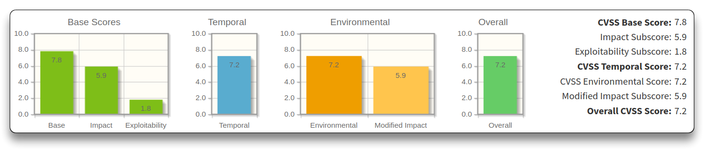

> **CVSS v3.1 Vector**
>
> [AV:L/AC:L/PR:N/UI:R/S:U/C:H/I:H/A:H/E:F/RL:O/RC:C/CR:X/IR:X/AR:X/MAV:X/MAC:X/MPR:X/MUI:X/MS:X/MC:H/MI:H/MA:H](https://nvd.nist.gov/vuln-metrics/cvss/v3-calculator?vector=AV:L/AC:L/PR:N/UI:R/S:U/C:H/I:H/A:H/E:F/RL:O/RC:C/CR:X/IR:X/AR:X/MAV:X/MAC:X/MPR:X/MUI:X/MS:X/MC:H/MI:H/MA:H\&version=3.1)

## Course Project

* Product Security Incident Response Team of a firewall vendor.
  * Works is prioritized based on CVSS scores
  * There is a vulnerability in one of the firewall product.
* Firewall v.5.1 allows receiving of fragmented packets from the Internet. Reboot also occur with certain types of invalid packets
  * Reach internal system
  * POC, configuration and logs provided

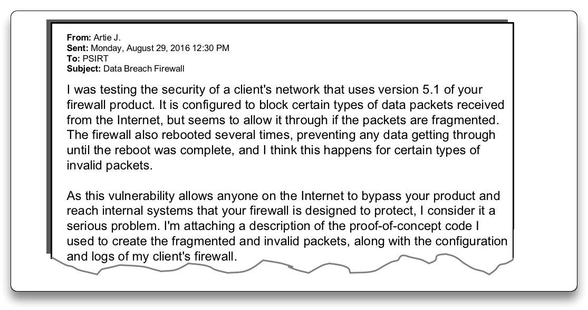

### Base Score

* Attack Vector - `Network`
* Attack Complexity - `Low`
* Privileges Required - `None`
* User Interaction - `None`
* Scope - `Changed`
* Confidentiality - `None`
* Integrity - `High`
* Availability - `High`

### Temporal Score

* Exploit Code Maturity - `Proof-of-Concept`
* Remediation Level - `Workaround`
* Report Confidence - `Unknown`

#### Temporal Score - Patched release

* Exploit Code Maturity - `Unproven`
* Remediation Level - `Official Fix`
* Report Confidence - `Confirmed`

### Environmental Metrics

Firewall protect a set of systems providing investor relation information. Site holds unreleased financial details. Serious impact if this data is disclosed or modified. Workaround has been implemented for bypassing vuln, but not for the firewall reboot problem. Current firewall severity is:

* Confidentiality Requirement - `Medium`
* Integrity Requirement - `Not Defined`
* Availability Requirement - `Not Defined`

After workaround, the new Modified Attack Vector is:

* Modified integrity - `None`

***
