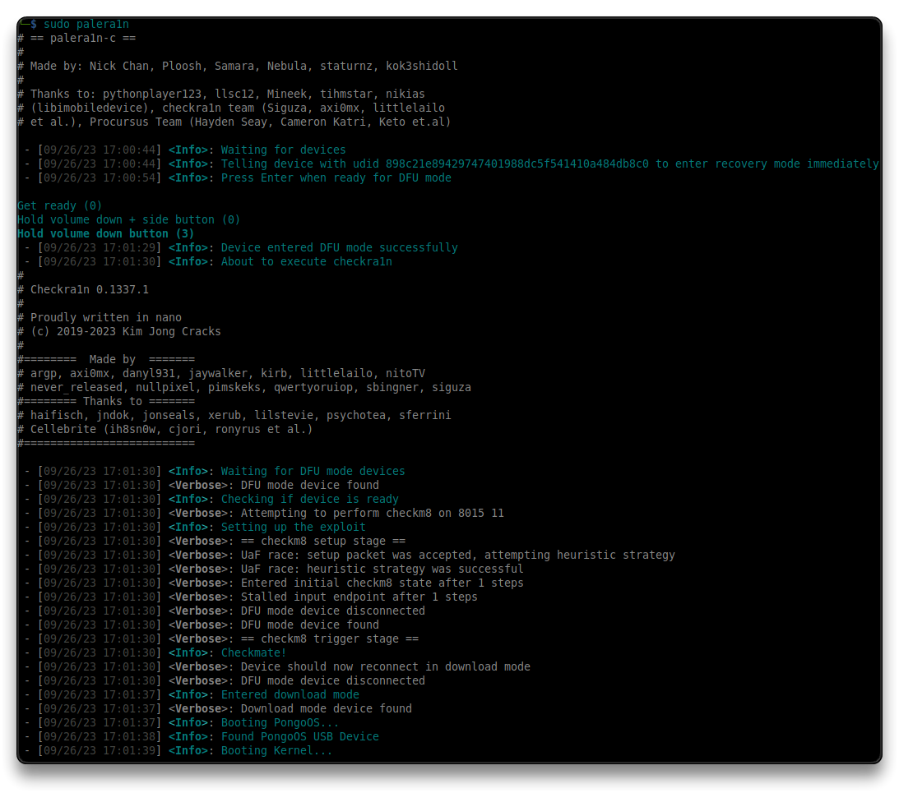
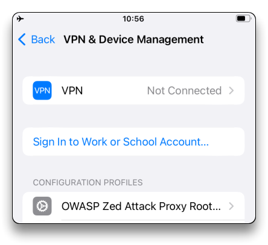
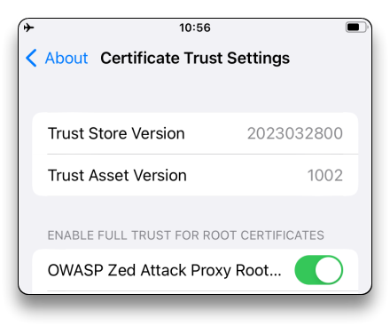

# iOS Jailbreak Guide

## 🔗 Useful Links

> - [CFW iOS Guide](https://ios.cfw.guide/get-started/select-iphone/) (always refer to this for iOS Versions and Jailbreak software)
> - [Installing palera1n](https://ios.cfw.guide/installing-palera1n/)
> - [Config Frida for rootless Jailbreak](https://www.linkedin.com/pulse/using-frida-server-rootless-jailbreak-ios-15-c%C3%A9sar-calder%C3%B3n/)
> - [Sileo](https://ios.cfw.guide/using-sileo/)
>


## [Checkra1n Jailbreak](https://checkra.in/)

```bash
wget -O - https://assets.checkra.in/debian/archive.key | gpg --dearmor | sudo tee /usr/share/keyrings/checkra1n.gpg >/dev/null
echo 'deb [signed-by=/usr/share/keyrings/checkra1n.gpg] https://assets.checkra.in/debian /' | sudo tee /etc/apt/sources.list.d/checkra1n.list
sudo apt-get update
sudo apt-get install checkra1n
```

- Run `checkra1n` and Jailbreak the iOS device

## palera1n > meowbrek2

- [Installing the jailbreak - palera1n](https://ios.cfw.guide/installing-palera1n/?tab=linux#running-palera1n)

> You must disable your passcode on A11 devices in order to use  it. Until palera1n is gone, you won’t be able to use your passcode or  any other SEP functionality. SEP features like a passcode, Face ID/Touch ID, and Apple Pay are among them.

1. Open up a terminal window
2. Run

```bash
sudo systemctl stop usbmuxd
sudo usbmuxd -f -p
```

3. Plug in the device and Trust the connection
4. Open up another terminal window and Run

```bash
sudo /bin/sh -c "$(curl -fsSL https://static.palera.in/scripts/install.sh)"
```


###  Running palera1n

1. Make sure your device is plugged in when entering this command. Run

   ```bash
   sudo palera1n
   ```

2. When ready, press `Enter` and follow the on screen instructions to enter [DFU mode](https://ios.cfw.guide/faq/#what-is-dfu-mode).

- Once the device boots up
  - Connect to Wi-Fi
  - Open the `palera1n` loader app and tap `Sileo` to install it. After a bit of time, you'll be prompted to set a passcode for using command line stuff, and then afterwards, `Sileo` should be on your home screen.
  - Set `alpine` as password
  - Run `Sileo` from home screen - packages `Upgrade all` - do NOT `Reboot the device`
  
- To rejailbreak your device, simply rerun the command you just ran and then repeat the other applicable steps.



3. Restart the `usbmux` service

```bash
sudo systemctl start usbmuxd.service
```

### SSH Setup

1. `openssh-server` already installed by Sileo.
2. Connect to Wi-Fi
   - EXTRA: Disable Private WiFi MAC Address and set a static IP in the DHCP Lease (router side) for the device
3. SSH in the device with `mobile` user

```bash
sshpass -p "alpine" ssh -o StrictHostKeyChecking=no -o UserKnownHostsFile=/dev/null mobile@<iDevice_ip>
# Choose 0
```

2. Change root password and set it as `alpine`

```bash
sudo passwd root
# enter "alpine" password
```

- SSH with `root` should work now

```bash
ssh root@<iDevice_ip>

# or

sshpass -p "alpine" ssh -o StrictHostKeyChecking=no -o UserKnownHostsFile=/dev/null root@<iDevice_ip>
```


### Frida

1. Open `Sileo` and add `https://build.frida.re` as source repo
2. Search for `Frida` (re.frida.server) and install it
3. Check [Frida-Server](#frida-server) for advanced configuration


> 📌 To rejailbreak your device, simply rerun the command you just ran and then repeat any other applicable steps.
>
> Alternatively, if you are on 15.0 to 15.8, you can use [meowbrek2](https://ios.cfw.guide/installing-meowbrek2) to rejailbreak as well. (`objection` is not working with this jailbreak)

> ### [meowbrek2](https://ios.cfw.guide/installing-meowbrek2/) - rejailbreak
>
> 1. If it's not already added, you'll also need to add the `https://havoc.app` repository to Sileo
> 2. in `Sileo`, search for **TrollStore Helper** and install it
> 3. Open the `TrollHelper` app on home screen and press `Install TrollStore`
> 4. Open Apple Store and install `Tips` app if not already installed
> 5. Open the `TrollStore` app on  home screen and `Install Persistence Helper`. Select `Tips` from the apps list
> 6. Reboot device
> 7. Once rebooted, open the `Tips` app (previously set as the persistence helper) and press `Refresh App Registrations`
>
> **Install `meowbrek2`**
>
> 1. Download [meowbrek2](https://kok3shidoll.github.io/download/secret/DCFB91F7-FFFD-4F2B-9931-DB6D0B365593//meowbrek2_1.1.5_TS.tipa) file onto the iOS device (search `meowbrek2 ios cfw` on Google and click the Downloads link in the article).
> 2. Open `TrollStore`, press the `+` button and open the `.tipa` meowbrek2 file
> 3. Reboot device
> 4. Once rebooted, open the `meowbrek2` app from the home screen
> 5. Tap `Jailbreak`
>
> > If the app or your device crashes/restarts unexpectedly and you don't re-enter a jailbroken state, simply try rebooting and running the  exploit again until it does work.
>
> > 📌 To rejailbreak your device, simply re-open the `meow` app and tap `Jailbreak`
>

### [palen1x - live USB jailbreak](https://ios.cfw.guide/using-palen1x/)

> **palen1x** - live bootable Linux environment that allows you to quickly run palera1n on a compatible device

---

## unc0ver / Odyssey

- [Installing Odyssey](https://ios.cfw.guide/installing-odyssey/)

Use the same above guide for [unc0ver](https://unc0ver.dev/) too.

### Installing the application

1. Open iTunes and login to your account
2. Open Sideloadly
3. Plug your iOS device into your computer
   - Make sure your computer is trusted and allowed to view the contents of your device
4. Drag and drop the [unc0ver](https://unc0ver.dev/) `.ipa` file into Sideloadly
5. Enter in your Apple ID
6. Enter in your password
   - Sideloadly must make a request to it's servers in order to work with free developer accounts. If you are not OK with this, you may use an alternate Apple ID (iTunes must be logged on).

The app will now install to your iOS device.

### Trusting the application

    Go to Settings -> General -> Device Management -> <Your Apple ID>
        Depending on your usage, Device Management may be labeled Profiles and Device Management
    Tap Trust "<Your Apple ID>"

The unc0ver application can now be opened from home screen.

### Running unc0ver

1. Open the unc0ver application from your home screen immediately afterwards
2. Tap "Jailbreak"

---

## Certificates

When importing a Profile with a Certificate, the Certificate must be trusted for Root Certificates.

1. Import the certificate as Profile and configure it in **Settings - General - VPN & Device management**



2. In **General - About - Certificate Trust Settings**, proceed with **Enabling full trust for root certificates** to make it work



---

## Frida-Server

### Install Frida with Cydia/Sileo

- Open Cydia/Sileo. Add this repo to the repo/sources list 
  - `https://build.frida.re`
  - Search for `frida` and install it

Notes:

- `frida-server` will be listening on port `27042` by default on the iDevice
- *`frida-server` does not listen on all interfaces `0.0.0.0`* - Check the [manual configuration for Listen on all interfaces](#listen-on-all-interfaces) to make it work


#### [EXTRA] Manual Frida Install

> 🔗 Thanks to my friend Zahid for the instructions - [Manually Installing and Configuring Frida on Jailbroken iOS Devices: A Step-by-Step Guide](https://medium.com/@zahidaz/manually-installing-and-configuring-frida-on-jailbroken-ios-devices-a-step-by-step-guide-e9e2673fdfc9)

> Download `frida_*_iphoneos-arm64.deb ` or `frida_*_iphoneos-arm.deb ` from https://github.com/frida/frida/releases
>
> - Copy it to the device `/private/var/mobile` directory
>
> ```bash
> scp frida_*_iphoneos-arm64.deb root@<iDevice_ip>:/private/var/mobile
> ```
>
> - SSH into the iDevice and install it
>
> ```bash
> sshpass -p "alpine" ssh -o StrictHostKeyChecking=no -o UserKnownHostsFile=/dev/null root@<iDevice_ip>
> 
> # Usually th
> ```
>
> ```bash
> cd /private/var/mobile
> dpkg -i frida_*_iphoneos-arm.deb
> ```
>


### Listen on all interfaces

Use Cydia/Sileo with `htps://build.frida.re` (as above) and install Frida.

Find the  `/Library/LaunchDaemons/re.frida.server.plist` file and modify it.

SSH into the iDevice.

```bash
sshpass -p "alpine" ssh -o StrictHostKeyChecking=no -o UserKnownHostsFile=/dev/null root@<iDevice_ip>

apt-get install nano -y
cd /private/preboot/.../jb-.../procursus/Library/LaunchDaemons/
# or
cd /Library/LaunchDaemons

# e.g.
# /private/preboot/49AEB187534EBCF67D94F20A9A0C51FAE7683C2B57992616CC5E2C20884A8B3D42FBC080D4CE71F7BB2777AFD6D3D14C/jb-Tzx1Ga1D/procursus/Library/LaunchDaemons/re.frida.server.plist

nano re.frida.server.plist
```

- Set the `<key>ProgramArguments</key>` section like this

```bash
<key>ProgramArguments</key>
<array>
        <string>/usr/sbin/frida-server</string>
        <string>-l</string>
        <string>0.0.0.0</string>
</array>
```

- Save and exit the file
- Run

```bash
launchctl unload re.frida.server.plist
launchctl load re.frida.server.plist
```

- Check for `frida` listening on all interfaces

```bash
ps aux | grep frida
	root 3028 0.0 0.2 407930768 4896 ?? Ss 11:14AM 0:00.02 /usr/sbin/frida-server -l 0.0.0.0
```

- Test the `frida` remote connection

```bash
frida-ps -H <iDevice_ip>
frida-ps -H <iDevice_ip> -ai

objection --network --host <iDevice_ip> --gadget com.apple.calculator explore -s "ios info binary"
```

---

