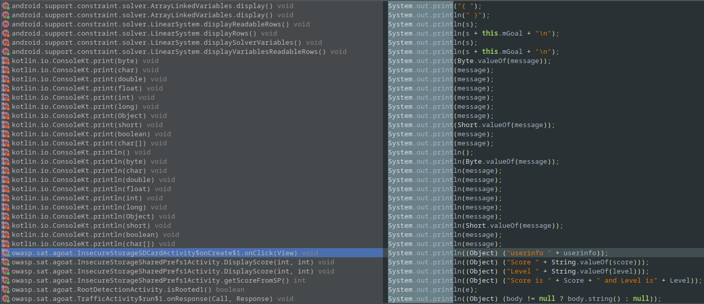
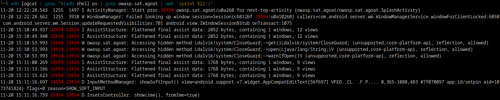
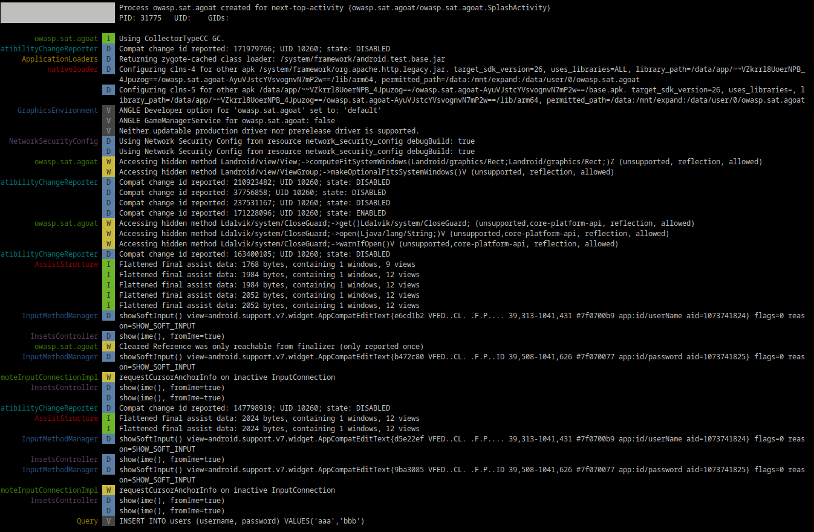
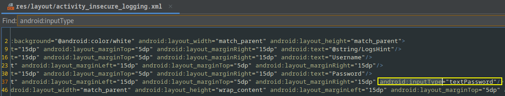
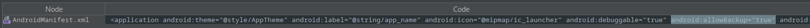
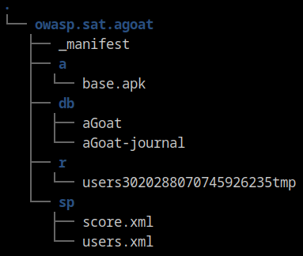
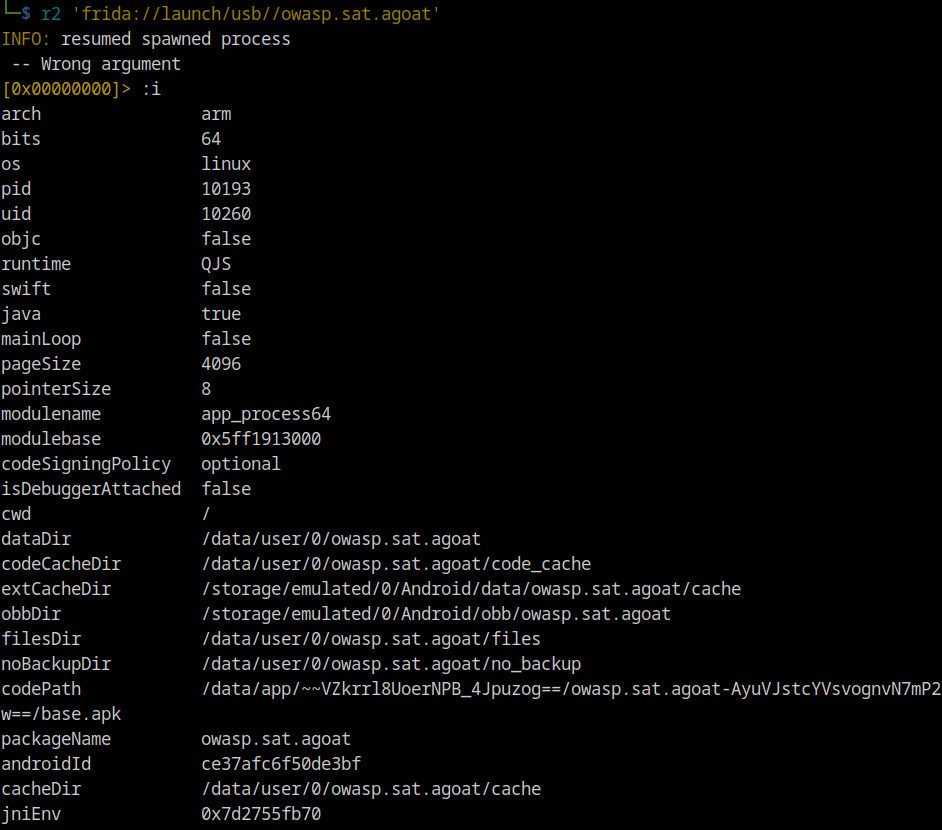

# MASTG Tests

> 📌 _These study notes serve as a concise reference, capturing the essential insights, guidelines, and best practices for securing mobile applications, based on the OWASP MASTG (**M**obile **A**pplication **S**ecurity **T**esting) Standard - Tests._

***

## 🌐 Resources 🔗

> * [OWASP MASTG](https://mas.owasp.org/MASTG/)
> * [OWASP MASVS](https://mas.owasp.org/MASVS/)
> * [MASTG - Tests](https://mas.owasp.org/MASTG/tests/)
> * [MASTG - Techniques](https://mas.owasp.org/MASTG/techniques/)
> * [MASTG - Tools](https://mas.owasp.org/MASTG/tools/)
> * [MASTG - Apps](https://mas.owasp.org/MASTG/apps/) (tests examples are made with those vulnerable apps)

***

## Android

### [MASVS-STORAGE](https://mas.owasp.org/MASTG/tests/#masvs-storage)

***

#### [MASTG-TEST-0001](https://mas.owasp.org/MASTG/tests/android/MASVS-STORAGE/MASTG-TEST-0001) Testing Local Storage for Sensitive Data

1. Open the app and click everywhere possible to trigger all possible functionalities and ensure data generation
2. Check all app generated files (SharedPreferences, SQL, Realm dbs, Internal/External Storage, etc)

> Data stored locally should be at least encrypted and stored within the app sandbox. If possible, sensitive data should not be stored at all.

**Static**

> Input the `apk` into `jadx-gui`

* Check `AndroidManifest.xml` for `uses-permission android:name="android.permission`
* Check the source code for file permissions, classes and functions, and bad practices.


**Dynamic**

To manage all those tests, a full pull data from an Android device's local storage may be useful.

* Check internal and external local storage, dev files, backup files, old files
* Check permissions in the app folder `/data/data/<package-name>`
* Check SQLite databases stored in `/data/data/<package-name>/databases` (on device) for sensitive data and db encryption
* Check Shared Preferences in `/data/data/<package-name>/shared_prefs`
* Check for Firebase Real-time dbs in `/data/data/<package-name>/files/`
  * call `https://_firebaseProjectName_.firebaseio.com/.json`
  * if found any `.realm` files, explore them with [Realm Studio](https://www.mongodb.com/docs/realm/studio/#realm-studio)

***

#### [MASTG-TEST-0003](https://mas.owasp.org/MASTG/tests/android/MASVS-STORAGE/MASTG-TEST-0003) Testing Logs for Sensitive Data

* Check for log related source code and files, and analyze them for any sensitive data

> Logging should be removed from production releases.

**Static**

* Check the source code for logging classes.



**Dynamic**

Use all the app functions at least once. Look for logs inside the app's data directory `/data/data/<package-name`

* Check system and application logs with `Logcat` or [`pidcat`](https://github.com/JakeWharton/pidcat) for unintended data leakage

```bash
# Logcat
adb logcat | grep "$(adb shell ps | grep <package-name> | awk '{print $2}')"

adb logcat -d -b all -v long -e <package-name>

# Pidcat
pidcat.py <package-name>
```





***

#### [MASTG-TEST-0004](https://mas.owasp.org/MASTG/tests/android/MASVS-STORAGE/MASTG-TEST-0004) Determining Whether Sensitive Data Is Shared with Third Parties via Embedded Services

**Static**

* Review third-party libraries source code, requested permissions and vulnerabilities
* Prevent PII exposure

**Dynamic**

Launch a man-in-the-middle (MITM) attack by routing the traffic through `BurpSuite` or `ZAP` proxy and sniffing the traffic between the app and the server.

* Check for sensitive information (PII), specially in ads or tracking services

***

#### [MASTG-TEST-0005](https://mas.owasp.org/MASTG/tests/android/MASVS-STORAGE/MASTG-TEST-0005) Determining Whether Sensitive Data Is Shared with Third Parties via Notifications

**Static**

* Understand if notification management classes (e.g. `NotificationManager`) are used, how the application works and which data is shown in the generated notifications.


**Dynamic**

Trace calls to functions related to notifications creation and check if it contains any sensitive information.

* use `Frida` scripts

***

#### [MASTG-TEST-0006](https://mas.owasp.org/MASTG/tests/android/MASVS-STORAGE/MASTG-TEST-0006) Determining Whether the Keyboard Cache Is Disabled for Text Input Fields

**Static**

* Check for the `android:inputType` XML attribute and its constants like
  * `textPassword`, `textVisiblePassword`, `numberPassword`, `textWebPassword`
  * Check the `android:minSdkVersion` in the `AndroidManifest.xml` file for the above constants support




**Dynamic**

Check for input fields that take sensitive data.

* Keyboard cache is enabled if strings are suggested

***

#### [MASTG-TEST-0009](https://mas.owasp.org/MASTG/tests/android/MASVS-STORAGE/MASTG-TEST-0009) Testing Backups for Sensitive Data

**Static**

* Check the `AndroidManifest.xml` for `android:allowBackup`
  * if `true`, check for sensitive data in the saved backup



* Pay attention to cloud (auto) backup, it may contain unencrypted sensitive data files
* Check the source code for `BackupAgent`, `BackupAgentHelper` classes

**Dynamic**

Use `adb` to backup the app and check the backup archive for sensitive data.

```bash
adb backup -apk -nosystem <package-name>

# backup.ab saved in current dir
```

* Approve the backup in the device
* Convert the `.ab` backup file (with [ABE](https://github.com/nelenkov/android-backup-extractor)) to `.tar` and extract the data from it

```bash
wget https://github.com/nelenkov/android-backup-extractor/releases/download/master-20221109063121-8fdfc5e/abe.jar

java -jar abe.jar unpack backup.ab backup.tar

tar xvf backup.tar

cat sp/*

# Use ugrep to check for sensitive data
ugrep --pretty --hidden -Qria
```




***

#### [MASTG-TEST-0011](https://mas.owasp.org/MASTG/tests/android/MASVS-STORAGE/MASTG-TEST-0011) Testing Memory for Sensitive Data

* Check for data disclosure via process memory, by creating a **memory dump** or real-time memory analysis (debugger).

**Static**

* Identify and map data usage across application components.
* Minimize the number of components handling sensitive data.
* Ensure prompt removal of object references when sensitive data is no longer needed.
* Request garbage collection after removing references.
* Overwrite sensitive data immediately when it becomes unnecessary.

Follow best practices and coding recommendations (`SecureSecretKey` class, etc) to make sure that sensitive data in memory is cleared out at logout and during `onPause` events for example, managing user's authentication experience.

**Dynamic**

Retrieve and analyze a memory dump using [`objection`](https://github.com/sensepost/objection) or [`fridump`](https://github.com/Nightbringer21/fridump).

* Check the memory dump for sensitive data, using `strings` command to extract strings from the `dmp` files
  * Indicative field names like "password", "pass", "pin", "secret", "private", etc.
  * Indicative patterns in strings, char arrays, byte arrays, etc.
  * Known secrets (credit card number, etc)

```bash
# Fridump
python3 fridump.py -U -r -s "App's Name"
# it outputs a strings.txt file
ugrep --pretty --hidden -Qria dump/strings.txt


# Objection (not working sometimes)
memory dump all <local destination>
```

> [Objection Tutorial - HackTricks](https://book.hacktricks.xyz/mobile-pentesting/android-app-pentesting/frida-tutorial/objection-tutorial)

[r2frida](https://github.com/nowsecure/r2frida) can be used for **Runtime Memory Analysis**, searching the memory for a strings, values, etc.

```bash
# Install r2frida
r2pm -ci r2frida

# Usage
r2 'frida://?'

r2 frida://[action]/[link]/[device]/[target]
* action = list | apps | attach | spawn | launch
* link   = local | usb | remote host:port
* device = '' | host:port | device-id
* target = pid | appname | process-name | program-in-path | abspath
Local:
* frida://?                        # show this help
* frida://                         # list local processes
* frida://0                        # attach to frida-helper (no spawn needed)
* frida:///usr/local/bin/rax2      # abspath to spawn
* frida://rax2                     # same as above, considering local/bin is in PATH
* frida://spawn/$(program)         # spawn a new process in the current system
* frida://attach/(target)          # attach to target PID in current host
USB:
* frida://list/usb//               # list processes in the first usb device
* frida://apps/usb//               # list apps in the first usb device
* frida://attach/usb//12345        # attach to given pid in the first usb device
* frida://spawn/usb//appname       # spawn an app in the first resolved usb device
* frida://launch/usb//appname      # spawn+resume an app in the first usb device
Remote:
* frida://attach/remote/10.0.0.3:9999/558 # attach to pid 558 on tcp remote frida-server
Environment: (Use the `%` command to change the environment at runtime)
  R2FRIDA_SCRIPTS_DIR=/usr/local/share/r2frida/scripts
  R2FRIDA_SCRIPTS_DIR=~/.local/share/radare2/r2frida/scripts
  R2FRIDA_SAFE_IO=0|1              # Workaround a Frida bug on Android/thumb
  R2FRIDA_DEBUG=0|1                # Used to trace internal r2frida C and JS calls
  R2FRIDA_RUNTIME=qjs|v8           # Select the javascript engine to use in the agent side (v8 is default)
  R2FRIDA_DEBUG_URI=0|1            # Trace uri parsing code and exit before doing any action
  R2FRIDA_COMPILER_DISABLE=0|1     # Disable the new frida typescript compiler (`:. foo.ts`)
  R2FRIDA_AGENT_SCRIPT=[file]      # path to file of the r2frida agent
```

```bash
r2 'frida://launch/usb//owasp.sat.agoat'
```



***

#### [MASTG-TEST-0012](https://mas.owasp.org/MASTG/tests/android/MASVS-STORAGE/MASTG-TEST-0012) Testing the Device-Access-Security Policy

Applications dealing with sensitive data should run in a secure and trusted environment. To establish this environment, the app can verify the device for:

* Device lock with PIN or password protection
* Up-to-date Android OS version
* Activated USB Debugging
* Device encryption
* Device rooting

**Static**

Check the source code for functions implementing a device-access-security policy (`e.g.` App runs only on Android 9.0+) and determine if it can be bypassed.

* system preferences `Settings.Secure`

**Dynamic**

Validate the bypassed security enforcing checks if present.

***

### [MASVS-NETWORK](https://mas.owasp.org/MASTG/tests/#masvs-network)

***

#### [MASTG-TEST-0019](https://mas.owasp.org/MASTG/tests/android/MASVS-NETWORK/MASTG-TEST-0019) Testing Data Encryption on the Network

***

#### [MASTG-TEST-0020](https://mas.owasp.org/MASTG/tests/android/MASVS-NETWORK/MASTG-TEST-0020) Testing the TLS Settings

***

#### [MASTG-TEST-0021](https://mas.owasp.org/MASTG/tests/android/MASVS-NETWORK/MASTG-TEST-0021) Testing Endpoint Identify Verification

***

#### [MASTG-TEST-0022](https://mas.owasp.org/MASTG/tests/android/MASVS-NETWORK/MASTG-TEST-0022) Testing Custom Certificate Stores and Certificate Pinning

***

#### [MASTG-TEST-0023](https://mas.owasp.org/MASTG/tests/android/MASVS-NETWORK/MASTG-TEST-0023) Testing the Security Provider

***
