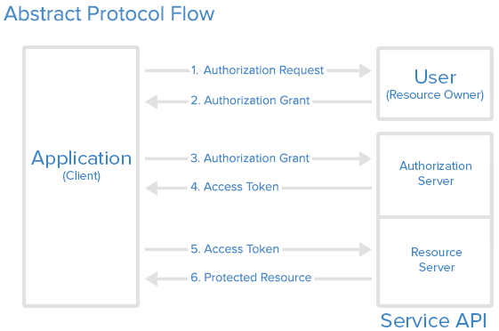
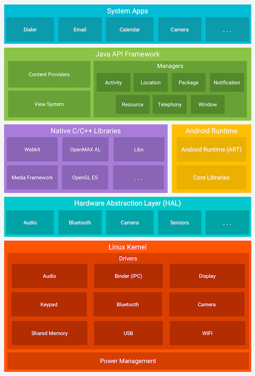
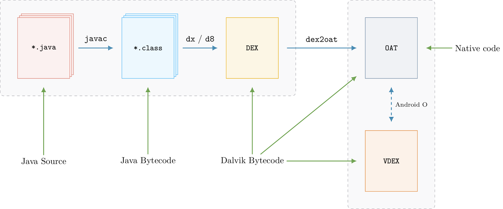

# MASTG Theory

> 📌 _These study notes serve as a concise reference, capturing the essential insights, guidelines, and best practices for securing mobile applications, based on the OWASP MASTG (**M**obile **A**pplication **S**ecurity **T**esting) Standard - Theory._

***

## 🌐 Resources 🔗

> * [OWASP MASTG](https://mas.owasp.org/MASTG/)
> * [OWASP MASVS](https://mas.owasp.org/MASVS/)
> * [MASTG - Tests](https://mas.owasp.org/MASTG/tests/)
> * [MASTG - Techniques](https://mas.owasp.org/MASTG/techniques/)
> * [MASTG - Tools](https://mas.owasp.org/MASTG/tools/)
> * [MASTG - Apps](https://mas.owasp.org/MASTG/apps/)

* **MASTG** (**M**obile **A**pplication **S**ecurity **T**esting **G**uide)

The MASTG provides insight into the technical processes, strategies, and tools used to validate the controls outlined within the **MASVS** (**M**obile **A**pplication **S**ecurity **V**erification **S**tandard).

***

## General Concepts

### [Taxonomy](https://mas.owasp.org/MASTG/General/0x04a-Mobile-App-Taxonomy/)

* **Mobile application** = self-contained program designed to execute on a mobile device.
* Operating systems: Android, iOS, Hauwey
* SDK - Software Development Kit
* NDK - Native Development Kit

#### Native App

* A **native app** is an app developed for a specific OS (using specific OS's SDK)
  * General standard programming languages:
    * iOS - Objective-C / Swift
    * Android - Java / Kotlin, native code with NDK (C/C++ lower level)
  * Fast performance
  * High reliability
  * Access to almost every component of the device
  * Consistent UI (user interface)
  * Platform-specific design principles
* Target only one specific platform
* Port single code base to both platforms (Android & iOS) with frameworks like:
  * Xamarin
  * Google Flutter
  * React Native

#### Web App

* Mobile **web apps** are websites designed to look and fell like a native app.
  * Run on top of a browser ("sandboxed")
  * HTML5
  * Limited integration with components
* Reduced development and maintenance costs

#### Hybrid App

* A **hybrid** app executes like a native app, but major processes rely on web tech
  * A portion of the app run in **WebView** (embedded web browser)
  * Pros & Cons of native + web apps
  * Web-to-native abstraction layer
  * Access to device capabilities
* Frameworks:
  * Apache Cordova
  * Framework7
  * Ionic
  * Native Script
  * Onsen UI
  * Sencha Ext JS (ex Touch)

#### Progessive Web App

* A **PWA** (Progressive Web App) loads like regular web pages, but differ from web apps
  * Offline work
  * Access to mobile device hardware
  * Web App Manifest - configure the behavior

***

### [Security Testing](https://mas.owasp.org/MASTG/General/0x04b-Mobile-App-Security-Testing/)

* **Mobile app security testing** = evaluation of mobile app security via static and dynamic analysis.
  * Usually part of larger Security Assessment & Penetration test
  * Test production-ready version of the app / or implement security requirements from the beginning of development life cycle.

#### White Box vs Black Box

* **Black Box** - zero-knowledge testing of the app
* **White Box** - full-knowledge testing of the app (e.g. source code)
* **Gray Box** - some information is provided to the tester

#### Vulnerability Analysis

* Look for app vulnerabilities, manually and automated
* Static Analysis & dynamic analysis

#### Static Analysis

* **SAST** (Static Application Security Testing)
  * Examine app's components without executing them, analyzing source code for techniques, strenghts, weaknesses, limitations
  * Manual app's source code review (IDE)
    * Identify key security vulnerability indicators (APIs, keywords, method calls ...)
    * Vulns in business logic, standards violations, design flaws
  * Automated source code analysis - code compliance, best practices

#### Dynamic Analysis

* **DAST** (Dynamic Application Security Testing)
  * Examine app during runtime/real-time execution (assets, features, entry points)
  * Mobile platform layer and backend services/APIs level
* Check for security mechanisms - attack protection (data disclosure, authentication/authorization issues, server configuration errors)
* Try to avoid false positives with automatic scanning

#### Pentesting

* Use MASVS as baseline for testing

1. **Preparation**
   * Scope, Applicable security controls
   * Testing goals, Sensitive data
   * MASVS Levels: L1 (std), L2
   * App specific controls
   * Tasks coordination
2. **Intelligence/Information Gathering**
   * **Environmental** (industry, organization, internal workflows)
   * **Architectural** context (mobile app, o.s., network, remote services)
3. **Mapping the Application**
   * Auto-scan map & Manual/human analysis
   * Potential Vulns, Entry points, Data
4. **Exploitation**
   * Pentest the app
   * Vulns relevance:
     * Damage potential
     * Reproducibility
     * Exploitability
     * Affected users
     * Discoverability
5. **Reporting**
   * Vulns reporting
   * Detail Exploitation process
   * Vulns classification
   * Risk in case of target compromise
   * Executive summary
   * Scope & context description
   * Methods, Info source
   * Prioritized/detailed findings
   * Fix recommendation

#### Software Development Life Cycle

An SDLC is meant to reduce risks associated with software development, and it is a framework that helps you set up controls to that end.

* Risk assessment
* Security requirements
* Secure Design
* Secure Implementation
* Secure Testing
* Acceptance
* Secure Operations
* Decommissioning

***

### [Tampering & Reverse Eng](https://mas.owasp.org/MASTG/General/0x04c-Tampering-and-Reverse-Engineering/)

_MASVS-RESILIENCE_

* Binary Patching
* Code Injection / Hooking
  * Substrate, Xposed
  * Frida (dynamic instrumentation framework for code injection, language bindings, injectable JavaScript VM/console)
* Static & Dynamic Binary Analysis
  * Disassemblers/Decompilers
  * Obfuscation
  * Debugging & Tracing
* Advanced Reverse Engineering Frameworks (radare2, Angr)

***

### [Authentication Architectures](https://mas.owasp.org/MASTG/General/0x04e-Testing-Authentication-and-Session-Management/)

_MASVS-AUTH_

First Steps Appropriate Authentication:

1. Identify additional authetication factors the app uses
2. Locate all endpoints that provide critical functionality
3. Verify additional factors are enforced on all server-side endpoints

**Authentication bypass** - when auth state is not enforced server-side and client can tamper with the state

**Password strength** - passwords policy

#### Auth Test Guidelines

* Auth can be based on:
  * something the user KNOWS (pw, pin, pattern, etc)
  * something the user HAS (SIM, OTP, HW token)
  * biometric property of the user (fingerprint, retina, voice)
* Implemented authentication procedures depends on the sensitivity of the functions / accessed resources by the app.

#### Stateful Auth

**Stateful Auth** (session based) = a unique session ID is generated when the user logs in.

* Auth recorded on both Client & Server
* e.g client-side cookie
* ID is a reference to the user's details on the server
* ID does NOT contain any user data

Flow:

1. Apps sends req with user creds to backend server
2. Server verifies creds, if valid creates new session with random session ID
3. Server sends response with session ID to client
4. Client sends session ID with all subsequent requests
5. Server validates session ID & retrieves associated session record
6. User logs out, server session record destroyed, client discards session ID

Secure:

* Random session IDs generation
* Length, entropy
* Exchanged over secure connection (HTTPS)
* Mobile app NO Permanent storage saving session IDs
* Session ID must be valid and correspond to proper auth level
* Terminate & delete session information

#### Stateless Auth

**Stateless Auth** = all user-identifying information is stored in a client-side token.

* Token can be passed to any server/service with each HTTP request
* Factored out to an auth server (sign, encrypts the token)
* No session state on the server
* Improve scalability & performance
* Decouple auth from the app
* Change auth scheme on auth server
* **e.g.** JSON Web Token (**JWT**)
  * 3 Base64Url-encoded parts
  * [JWT.io](https://jwt.io/introduction)

```
base64UrlEncode(header).base64UrlEncode(payload).base64UrlEncode(signature)
```

* header: Token type + hashing algorithm
* payload: claims (entity statements & metadata)
* signature

```
# HMAC SHA256 Signature
HMACSHA256(base64UrlEncode(header) + "." + base64UrlEncode(payload), secret)
```

* [OWASP JWT Cheat Sheet](https://cheatsheetseries.owasp.org/cheatsheets/JSON_Web_Token_for_Java_Cheat_Sheet.html)

#### OAuth 2.0

**OAuth 2.0** defines 4 roles:

* **Resource Owner** (API) = account owner
* **Client** = application that access user's account with access tokens
* **Resource Server** = hosts the user accounts
* **Auth Server** (API) = verifies user identity and issues access tokens to the app 
* User Agent
  * External user agent
  * Embedded user agent
* Best practices
  * Verify Trust: TLS confirmation, ...
  * Prevent man-in-the-middle attacks
    * Validate server's FQDN with pub key
  * Code grant (PKCE implementation)
  * Short-lived auth codes, on transient memory
  * Client secrets stored in secure local storage
  * Secured transmission of end-user creds (TLS)
  * Tokens in transient memory, TLS transmission, reduced scope & duration, stored in secure local storage

#### User Logout

* Implement Logout function client & server side - best practices (destroy locally stored tokens/session identifiers)

***

### [Network Communication](https://mas.owasp.org/MASTG/General/0x04f-Testing-Network-Communication/)

_MASVS-NETWORK_

* Usage of HTTP & HTTPS (HTTP over TLS) for secure data transmission to remote endpoints
  * **Confidentiality**: TLS encrypt data before sending it
  * **Integrity**: data can't be altered
  * **Authentication**: client can validate the identity of the server

#### Server Trust Evaluation

* **Certificate Authorities** (CAs) - predefined in each o.s. **trust store**
  * CAs can be added to the trust store
  * An app can trust a custom set of CAs (self.signed CA, company internal CA, limit to a specific list of trusted CAs, trust additional CAs)

**Extended trust** - include additional CAs so that the app trusts the system's built-in ones and the custom ones.

**Restricting Trust** - **Identity Pinning**

* Restrict the trusted CAs, e.g. CAs used by the developer, while disregarding all other = Identity Pinning, implemented as **Certificate/PublicKey Pinning**
  * Pinning = associate a remote endpoint with a particular identity (X.509 cert or Public Key). _After pinning the server identity, the app will connect to those remote endpoints only if the identity matches._

https://cheapsslweb.com/blog/what-is-ssl-pinning

[OWASP Certificate Pinning Cheat Sheet](https://cheatsheetseries.owasp.org/cheatsheets/Pinning_Cheat_Sheet.html)

* Necessary for MASVS-L2
* Prevent connection with a malicious server

#### TLS

**TLS** allows authentication of the backend service, ensuring confidentiality & integrity of network data (transmitted via HTTPS).

* Recommended: TLS v.1.2 - v1.3

**Cipher Suites**

```bash
Protocol_KeyExchangeAlgorithm_WITH_BlockCipher_IntegrityCheckAlgorithm

e.g.
TLS_RSA_WITH_3DES_EDE_CBC_SHA
```

* Protocol
* Key Exchange **Algorithm** - **auth** during TLS handshake
* Block Cipher - encrypt message stream
* Integrity Check Algorithm - auth messages

_The efficiency of a cipher suite depends on the efficiency of its algorithms._

* Check IANA & OWASP recommended cipher suites, and Android + iOS supported cipher suites
* Verify server supports

#### HTTP(S) Traffic

* Monitor app requests to the backend, map available server-side APIs, gaining insight into the communication protocol.
* Replay/manipulate request, testing server-side vulns
* Tools (**interception proxy**): Owasp ZAP, Burp Suite

Configuration

* Run proxy on host pc
* Configure mobile app to route HTTP(S) requests to host pc proxy
* Proxy's CA certificate must be installed on the device, to make TLS connections work

[Universal interception. How to bypass SSL Pinning and monitor traffic of any application](https://hackmag.com/security/ssl-sniffing/)

#### App Process Traffic

* Monitor the traffic before it reaches network layer, by hooking the right functions (e.g. `SSL_write`, `SSL_read`)
* Time consuming process

#### Network Layer Traffic

* e.g. Xamarin - ignore system proxy settings
* App refuses sending req through a proxy
* Intercept push notifications
* XMPP or non-HTTP protocols are used

In these cases, network traffic monitoring is necessary, by redirecting and intercepting network communication.

* Route through a host as net gateway. (e.g. sniff traffic with Wireshark, tcpdump)
* Execute MITM attack (e.g. bettercap, mitmproxy)

***

### [Criptography](https://mas.owasp.org/MASTG/General/0x04g-Testing-Cryptography/)

_MASVS-CRYPTO_

* Provide constant **confidentiality** (encryption), data **integrity** (consistency, tampering detection) and **authenticity** (trusted source).
* Encryption algorithms - convert plaintext data into cipher text. Can be restored through decryption
  * Symmetric - encryption/decryption with same secret-key
    * Fast + suitable for bulk data processing
    * Key access = everybody can decrypt the content, careful key management
  * Asymmetric - encryption/decryption with public and private key pair
    * Public key free distribution
    * Private key must not be shared
    * Slower than Symmetric, for small amounts of data (e.g. symmetric keys for bulk encryption)
* **Hashing** - uses cryptography (but is not encryption)
  * Easy to compute from the input
  * very difficult to determine the original input from the hash
  * Hash functions - used for **integrity** verification
* **Message Auth Codes (MACs)** - combine cryptographic mechanisms with secret keys
  * integrity + authenticity
  * HMACs - hashing is the underlying cryptographic primitive (e.g. HMAC-SHA256)
  * Entities have to share the same secret key
* **Signatures** - combine asymmetric cryptography (public/private key pair) with hashing
  * integrity + authenticity
  * encrypts the hash of the message with the private key
  * private key should remain unique to the data signer
* **Key Derivation Functions (KDFs)** - derive secret keys from a secret value (pw) and used to turn keys into other formats or increase their length.
  * Difficult to reverse (like hashing functions)
  * Required a level of randomness

#### Configuration Issues

* Weak cryptographic algorithms and protocols (check up to date with industry std)
* Vulnerable algorithms: block ciphers (DES, 3DES), stream ciphers (RC2, RC4), hash functions (MD4, MD5, SHA1), broken random number generators (SHA1PRNG, Dual\_EC\_DRBG) - Should be replaced with more secure alternatives
* Check [Key lengths](https://www.keylength.com/) with standards
* Rely on secure hardware

Recommended algorithms:

* **Confidentiality** algorithms: AES-GCM-256 or ChaCha20-Poly1305
* **Integrity** algorithms: SHA-256, SHA-384, SHA-512, BLAKE3, the SHA-3 family
* **Digital signature** algorithms: RSA (3072 bits and higher), ECDSA with NIST P-384
* **Key establishment** algorithms: RSA (3072 bits and higher), DH (3072 bits or higher), ECDH with NIST P-384

Issues:

* Insufficient key size/length
* Symmetric encryption with Hard-coded crypto keys
  * avoid key disclosure, never store secret keys with encrypted data or within the source code
  * hard-coded = a key is part of app resources, value which can be derived from known values, hardcoded in code
  * check encrypted container if stored in app data
  * secret keys must be stored in secure device storage
* Weak Key generation functions
  * user-supplied password should be passed into a KDF to create a crypto key, with appropriate iteration count when using pw derivation functions (Argon2).

[Password Hashing Competition](https://www.password-hashing.net/)

* Weak Random Number Generators - use pseudo-random number generators (RNG)
* Custom/proprietary Implementations of cryptography
  * All cryptographic operations should use standard cryptographic APIs for Android and iOS
* Inadequate AES Configuration
  * Advanced Encryption Standard (AES) - accepted std for symmetric encryption
  * no AES attacks discovered
* Weak Block Cipher Mode
* Predictable Initialization Vector

#### Protecting Keys in Storage and in Memory

* Keys in Remote Server
* Keys inside Secure Hardware-backed Storage (Trusted Execution Environment)
* Keys protected by Envelope Encryption
* Keys in Memory - for the sortest time possible, zero-out keys after crypto operations

#### Protecting Keys in Transport

**Cryptographic APIs, Policy, Regulations**

* Android & iOS own implementation and APIs
* Policy base on frameworks like "NIST Recommendation for key management"
* AppStore, Google Play - US server > export regulations

### [Code Quality](https://mas.owasp.org/MASTG/General/0x04h-Testing-Code-Quality/)

### [User Privacy Protection](https://mas.owasp.org/MASTG/General/0x04i-Testing-User-Privacy-Protection/)

***

## Android Security Testing

### [Android Platform Overview](https://mas.owasp.org/MASTG/Android/0x05a-Platform-Overview/)

#### Android Architecture

* https://developer.android.com/index.html

Android software **stack** is composed of different layers, and each layer defines interfaces and offers specific services



**KERNEL**

* Focus on the user-mode part of the OS
* managed runtime used by apps (ART/Dalvik) & Bionic (Android glibc)

**HAL (Hardware Abstraction Level)**

* Interact with built-in hw components
* shared library modules

**RUNTIME ENVIRONMENT**

* Apps written in Java and Kotlin, compiled to Dalvik bytecode, which is executed using a runtime that interprets the bytecode instructions and executes them.
* Android Runtime (ART)
* **Dalvik bytecode** - optimized version of Java bytecode
  * First compile Java/Kotlin code to Java bytecode > Java bytecode converted to Dalvik bytecode (d8 tool)
  * `.dex` files
* [ART](https://source.android.com/docs/core/runtime/configure#how_art_works) executes Dalvik bytecode:
  * **AOT** (Ahead of time) - compilation of entire app Dalvik bytecode into native code > `.oat` extension (ELF bin), during app install.
  * **JIT** (just in time) - at runtime
  * **Profile-guided compilation** - JIT compilation (track all application frequently used parts = app profile) - `dex2oat` (compilation daemon) AOT compiles the identified frequent code from the profile 
  * **Sandboxing** - each app runs in its own virtual machine / sandbox - Precise control over resources & memory access

#### Defense-in-Depth Approach

4 distinct defence layers/domains

**System-wide security**

* Device encryption
  * **FDE** (Full-Disk Encryption) - single key to decrypt user data partition (deprecated)
  * **FBE** (File-Base Encryption) - Android 7.0, different keys to decrypt files - Direct Boot (accessibility services without unlock)
* **TEE** (Trusted Execution Environment) - dedicated hardware to securely generate, import, store and protect cryptographic keys
  * [Hardware-backed KeyStore](https://source.android.com/docs/security/features/keystore) - module that offers cryptographic services to OS and apps to perform sensitive operations
  * StrongBox - separate hardware chip with own CPU, secure storage & true random number generator (Android 9)
  * GateKeeper - enabled device pattern and password authentication. Sensitive operation inside available TEE. Gatekeeper Components = service + HAL (hw interface) + TEE software implementation
* [Verified Boot](https://source.android.com/docs/security/features/verifiedboot) - establish a trust relationship between hardware and executed code on this hw, during the verified boot sequence, ensuring all executed code comes from a trusted source (device OEMs).

**Software isolation**

* Android Users & Groups
  * each app runs under a separate Linux user
* SELinux (Security-Enhanced Linux)
  * MAC (Mandatory Access Control) - lock processes access to resources, to specific users
  * least-privilege principle to avoid exploit via privilege escalation or lateral movement
* Permissions
  * controlled access to sensitive user data & device resources
  * permission requests during runtime

**Network security**

* [TLS by Default](https://developer.android.com/training/articles/security-config.html) (Android 9)
* DNS over TLS
  * avoid sensitive data exposure during DNS lookup

**Anti-exploitation**

* ASLR, KASLR, PIE & DEP
  * Address Space Layout Randomization - against buffer-overflow
  * Data Execution Prevention (DEP) - prevents code execution on the stack and heap
* SECCOMP Filter
  * Avoid system calls by normal applications
  * Secure Computing filters for Zygote based processes

#### Android Application Structure

**Communication with O.S.**

**Android Framework** offers high level Java APIs and is used by apps to interact with system services.

* e.g. Services: Connectivity, Files, Cameras, Geolocation, Microphone
* API Versions: Android 5 (API level 21) ... Android 13 (API level 33)

**App Sandbox**

Apps are executed in the **Android Application Sandbox** - separates app data and code execution from other apps. First layer of defense.

* every Android process has its own sandboxed address space
* path: `/data/data/[package-name]`
* directory RWX permissions only by app's unique UID
* Unique UID (user ID) for each app - app run in separate process > access to its own resources.
* **Zygote** - system service for launching apps, opens a socket and listens for connection from local clients, forks a new process, loads and executes app-specific code
* **App Lifecycle** - app processes states:
  * foreground
  * visible - user aware / activity
  * service - not visible to user, but important background processes
  * cached - not needed, free to kill (callback methods)

**App Bundles**

* **APK** (Android Package Kit)
* `.aab` (Android App Bundle) - code in several modules

**Android Manifest**

* `AndroidManifest.xml.` in app's apk root dir
* Describes app structure, components, requested permissions, general app metadata, compatible APIs, install location

**App Components**

* Activities - user interface elements - have a lifecycle (event managers)
  * Fragments
* Content providers
  * SQLite for permanent data storage (in files)
* Services - OS components, perform tasks in background

**Inter-Process Communication**

Allow apps to exchange signals & data securely, based on Binder.

* Intent messaging - asynchronous communication framework
  * Intent - messaging object, can request an action from another app component
* Broadcast receivers - allow apps to receive notifications from other apps or system

#### Android Application Publishing

* Signing Process - app must be signed with the certificate included in the corresponding APK
* APK Signing Schemes
  * APK Signature Scheme v4, v3, v2, JAR signing
  * KeyStores = pw protected bin file
* Publishing - Google Play, trusted store. Amazon Appstore (kindle)

***

### [Android Security Testing](https://mas.owasp.org/MASTG/Android/0x05b-Android-Security-Testing/)

> _Many paragraphs from this section were moved to the_ [_MASTG - Techniques_](https://mas.owasp.org/MASTG/techniques/)

#### Host Setup

* Android STUDIO
* [Testing Tools (MASTG)](https://mas.owasp.org/MASTG/tools/)

#### Device Setup

* **Real device** is smoother and more realistic than Emulator
  * rooted device, unlocked bootloader
  * developer mode & USB debugging activated
* [MobSF](https://github.com/MobSF/Mobile-Security-Framework-MobSF) test
* Privileged Access
  * **Rooting** - modifying the OS to run commands as the root user. Recommended for testing on real device.
    * Bypass restrictions (app sandboxing)
    * Easily usage of code injection, function hooking, adv techniques
    * Negative effects: warrant void, device brick, security risks
  * Unlock Boot Loader -> Root
  * [XDA Forums - Root](https://www.xda-developers.com/root/)
  * [Magisk](https://topjohnwu.github.io/Magisk/)
  * Tipically, a mobile app security is tested with **root detection** disabled.

***

### [Android Data Storage](https://mas.owasp.org/MASTG/Android/0x05d-Testing-Data-Storage/)

📌 [MASVS-STORAGE](https://mas.owasp.org/MASVS/05-MASVS-STORAGE/)

> * 🔗 [Android Storing Data Security Tips](https://developer.android.com/training/articles/security-tips.html#StoringData)
> * 🔗 [Android Data Storage](https://developer.android.com/training/data-storage)

`e.g.` Apps cache authentication tokens locally or need to store PII (personally identifiable information) and other sensitive data.

This kind of sensitive data is vulnerable if improperly protected and stored.

* Risks: information decryption, social engineering attacks, PII disclosure, account hijacking, session/auth token disclosure, app exploitation.
* Data integrity, cryptographic controls, data validation and sanitization from any storage source

Common persistent storage:

* Shared preferences
* SQLite, Firebase, Realm Databases
* Internal Storage
* External Storage
* Keystore

Other Android data storage functions:

* Logging
* Backups
* Processes Memory
* Keyboard Caches
* Screenshots

#### [Shared Preferences](https://developer.android.com/training/data-storage/shared-preferences)

Used to permanently save small collections of key-value pairs, written to a plain-text `xml` private or world-readable file (before Android 4.2 - API level 17).

`e.g.` The username and password may be store in clear text in `/data/data/<package-name>/shared_prefs/key.xml`

#### Databases

**SQLite**

* Android SDK has built-in support for SQLite databases (`android.database.sqlite`)

SQLite `.db` can be stored unencrypted or encrypted.

* Both unencrypted and encrypted databases may contain sensitive information
* `e.g.` encryption library - [SQLCipher](https://www.zetetic.net/sqlcipher/sqlcipher-for-android/)
  * An encrypted database key can be securely retrieved by user's PIN or Password at app start, or by storing the key on an online server.

**Firebase Real-time**

Firebase Real-time Database stores and syncs NoSQL data in real-time. Data is stored as `JSON`.

* Misconfigurations can be detected via network calls, which can be obtained from the app or detected using a Firebase Scanner.

[Realm](https://www.zetetic.net/sqlcipher/sqlcipher-for-android/)

The Realm database can be encrypted with a key from a configuration file.

* Check for key storage methods, like server retrieval or password-derived, and assess if it's hard-coded or stored insecurely if encryption is used.

#### [Internal Storage](https://developer.android.com/training/data-storage#filesInternal)

By default, files stored in internal storage are isolated/containerized and inaccessible to other applications on the device.

* Look for class `FileInputStream` to find out which files are opened and read within the app.

#### [Shared/External Storage](https://developer.android.com/training/data-storage#filesExternal)

Files saved to external storage (removable or non-removable) are **world-readable** and will **not be deleted when the uses uninstalls the app**.

* 🔗 [Man-in-the-Disk attack - Checkpoint.com](https://blog.checkpoint.com/security/man-in-the-disk-a-new-attack-surface-for-android-apps/)

#### Keystore

An application has the capability to generate a new private/public key pair using a public key for securing application secrets, allowing decryption with the private key. User authentication involving lock screen credentials (patterns, PIN, password, or fingerprint) helps protect keys within the Android KeyStore.

Keystore Security

* Many modern devices use a **hardware-backed KeyStore**, generating and using keys in a secure environment (**Trusted Execution Environment** **`TEE`** or **Secure Element** **`SE`**), making it difficult to retrieve them by the o.s., even on rooted devices. Verification can be done using Key Attestation.
* In a **software-only** implementation keys are encrypted with a per-user **encryption master key**. On rooted devices, an attacker can access these keys in the `/data/misc/keystore/` folder. When the device is locked, the Android KeyStore remains inaccessible because the user's lock screen pin/password generates the master key.

Android 9 (API level 28) enables [**secure key import**](https://security.googleblog.com/2018/12/new-keystore-features-keep-your-slice.html) into AndroidKeystore. This process generates a key pair for protecting imported keys, while the keys themselves are encrypted and never appear in plaintext within the device's host memory.

#### Hardware-backed KeyStore

Introduced in Android 6 (API level 23), **Keymaster Hardware Abstraction Layer** (**HAL**) enables apps to verify if keys are stored in the security hardware. For devices with Android 9 (API level 28) or higher, a **StrongBox Keymaster** module can be present, residing in a hardware security module with enhanced security features.

Keymaster **HAL** is an interface to hardware-backed components - Trusted Execution Environment (TEE) or a Secure Element (SE), which is used by Android Keystore.

#### [Key Attestation](https://developer.android.com/privacy-and-security/security-key-attestation)

Android Key Attestation, mandated for new devices from Android 8.0 onwards, is a vital feature to assess the security of cryptographic data in Android Keystore. This process utilizes attestation keys signed by the Google hardware Attestation Root certificate, ensuring the security of devices seeking certification for Google apps.

* In key attestation, specify the key pair alias to receive a certificate chain.
* Verify properties of the key pair using the certificate chain.
* If the root certificate is the Google Hardware Attestation Root, it assures hardware-level key attestation and secure key storage.
* For any other root certificate, Google doesn't vouch for hardware security.
* Better to implement server-side key attestation.

#### Techniques for Storing a Cryptographic Key

From most secure way to least secure:

* Hardware-backed Android KeyStore (Android 7.0+)
* Server-stored keys accessible with strong authentication (online)
* Master key on the server, encrypting keys in Android SharedPreferences
* User-derived key, using passphrase with ample length and salt
* Software implementation of Android KeyStore
* Master key in the software implementation, encrypting keys in SharedPreferences (symmetric encryption)
* _\[Not recommended]_ Keys stored in SharedPreferences
* _\[Not recommended]_ Hardcoded encryption keys in the source code
* _\[Not recommended]_ Predictable obfuscation or key derivation based on stable attributes
* _\[Not recommended]_ Keys stored in public locations (`/sdcard/`).

Key material must be promptly **removed from memory when it's no longer required**. However, securely cleaning up secret data in languages with garbage collectors (like Java) and immutable strings (such as Swift, Objective-C, Kotlin) poses limitations. A recommended approach, as per the Java Cryptography Architecture Reference Guide, is to use `char[]` instead of `String` for storing sensitive data and nullify the array after use.

**Insecure key storage options**

* Storing keys in Android [SharedPreferences](https://developer.android.com/reference/android/content/SharedPreferences.html) is insecure, as rooted devices with root access can access these files from other apps.
* Hardcoded encryption keys in the source code create a vulnerability where every instance of the app uses the same key, allowing attackers to reverse-engineer the app and decrypt data.
* Predictable key derivation functions based on accessible identifiers make it easier for attackers to find and use the key.
* Storing encryption keys in public locations like `/sdcard/` is strongly discouraged because other apps may have permission to read these keys and compromise security.

**Third Party Libraries for Data Encryption**

* [**Java AES Crypto**](https://github.com/tozny/java-aes-crypto)
* [**SQL Cipher**](https://www.zetetic.net/sqlcipher/sqlcipher-for-android/)
* [**Themis**](https://github.com/cossacklabs/themis)

> 📌 **As long as the key is not stored in the KeyStore, it is always possible to easily retrieve the key on a rooted device and then decrypt the values you are trying to protect.**

#### [KeyChain](https://mas.owasp.org/MASTG/Android/0x05d-Testing-Data-Storage/#keychain)

The KeyChain class manages **system-wide** private keys and associated certificate chains, protected by a user's lock screen PIN/password.

* Every application can access the KeyChain material
* Inspect the source code for sensitive information and ensure it's encrypted, not stored as plaintext
* Implement secure storage using Android KeyStore and Cipher mechanisms, with user-provided passwords for KeyStore encryption

#### Logs

Log files containing crashes, errors, usage statistics, can be stored locally. Log data should be handled carefully to avoid sensitive data exposure or violation of user's confidentiality/privacy.

#### [Backups](https://mas.owasp.org/MASTG/Android/0x05d-Testing-Data-Storage/#backups)

Android offers diverse backup options, including built-in USB backups through `adb` commands, Google's "Back Up My Data" feature, and two backup APIs for app developers.

However, apps need to be cautious to **prevent sensitive user data from being included in backups**, as this could be extracted by attackers.

* `android:allowBackup` should be set to `false` to prevent the app data backup with **ADB** (Android Debug Bridge)

#### Process Memory Handling

* Android apps use memory for regular operations
* Dispose of sensitive data promptly from process memory
* Investigate memory through dumps or real-time analysis

Best practices:

* Examine documentation for potential data exposure sources. Remove sensitive data from components like HTTP clients immediately.
* Understand the app's architecture to identify data exposure points.
* Encrypt data in transit to prevent memory exposure.
* Minimize data copies and exposure time for sensitive data.
* Centralize handling with few components and primitive data structures.

#### User Interface

* UI Components with sensitive information input should be masked to mitigate risks like shoulder surfing.
* The screenshot-saving feature introduced by manufacturers to enhance the visual experience during app startup and exit poses a security risk, potentially exposing sensitive data if users deliberately take **screenshots** or if a malicious app continuously captures the screen, leading to potential data exposure in local storage.
* [**Notifications**](https://developer.android.com/develop/ui/views/notifications) should never be assumed private, as they are broadcasted system-wide, allowing any app with a `NotificationListenerService` to receive and handle them; this vulnerability has been exploited by malware like [Joker](https://research.checkpoint.com/2020/new-joker-variant-hits-google-play-with-an-old-trick/) and [Alien](https://www.threatfabric.com/blogs/alien_the_story_of_cerberus_demise) to extract sensitive information, emphasizing the need for caution and scrutiny regarding notification content.
* The **keyboard cache**, while aiding user convenience, poses a risk of exposing sensitive information when users select input fields that trigger auto-suggestions.

***

### [Android Cryptographic APIs](https://mas.owasp.org/MASTG/Android/0x05e-Testing-Cryptography/)

📌 [MASVS-CRYPTO](https://mas.owasp.org/MASVS/06-MASVS-CRYPTO/)

> * 🔗 [Key Management - OWASP Cheat Sheet Series](https://cheatsheetseries.owasp.org/cheatsheets/Key_Management_Cheat_Sheet.html)

**Key components** of cryptography system are the Android

* Security Provider (AndroidOpenSSL, Conscrypt)
* KeyStore
* KeyChain

Android cryptography APIs, based on the Java Cryptography Architecture (JCA), facilitate the inclusion of multiple **security providers** offering various cryptographic algorithms.

**KeyStore** and **KeyChain**, with APIs for key storage and utilization, manage the complete lifecycle of the cryptographic keys (generating, using, storing, archiving, deleting).

* Focus on functions used by the application developer, like key generation, random number generation, key rotation.

Check the [OWASP MASTG Testing Cryptography](https://mas.owasp.org/MASTG/Android/0x05e-Testing-Cryptography/#key-generation) detailed contents.

***

### [Android Local Authentication](https://mas.owasp.org/MASTG/Android/0x05f-Testing-Local-Authentication/)

\[...]

***
