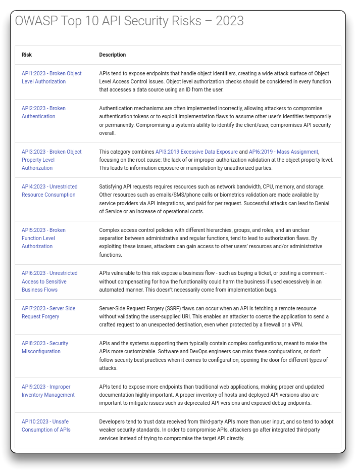

# API Security Fundamentals

🔗 [API Sec Fundamentals - APIsec University](https://university.apisec.ai/products/api-security-fundamentals)

- Instructor - **Dan Barahona**

- Course Duration - `2h`

## Resources & Links

> - 🔗 [OWASP API Security Top 10](https://owasp.org/API-Security/editions/2023/en/0x00-header/)
> - 🔗 [OWASP API Security Top 10 Vulnerabilities - APIsecurity.io](https://apisecurity.io/owasp-api-security-top-10/)
> - 🔗 [awesome-api-security-essentials](https://github.com/JBAhire/awesome-api-security-essentials)
> - [OpenAPI.Tools](https://openapi.tools/)

------

## Intro

An **API** (**A**pplication **P**rogramming **I**nterface) is a set of definitions and protocols for building and integrating application software, that allows one software application to interact with and use the functionality or data of another software system.

APIs:

- facilitate actions like booking rides, transferring money and fetching information.
- support both external and internal communication.
- power various applications and allow integration with partners.

**Impact and Risks**

- High-profile breaches exposed data due to API vulnerabilities.
- Addressing API-related risks is vital for security and compliance.
- Auditors focus on API security, necessitating risk assessment and mitigation.

**Attacks**

The API **back-end** application, containing the data and functionality, gets exposed to web apps, mobile apps, microservices and external parties.

- APIs often have excessive permissions, logic flaws, creating exploiting opportunities for attackers.
- API attack kill chain differs from a typical cyber attack. Once an attacker identifies a vulnerability within an API, exploiting it can result in a major breach, potentially exposing sensitive data.

APIs have regulatory considerations across industries such as banking, healthcare, and data protection. These considerations involve addressing challenges like **security** (vulnerability testing and remediation), **privacy**, and **accessibility**, while carefully managing the balance between **data accessibility** and **sensitive information protection**.

------

## Real-World API Breaches

Common breach patterns involve weak authentication, object-level authorization issues, data harvesting, exposure of sensitive data, and potential third-party risks.

Business logic flaws are often considered the most challenging API vulnerabilities to uncover. Business logic flaws are less about technical vulnerabilities and more about understanding the intended logic of the application, making them harder to detect through automated testing tools and requiring a deeper understanding of the application's functionality.

- OWASP API 01:2023 | **Broken object level authorization (BOLA)**
  - [Retrospective: Recent Coinbase Bug Bounty Award](https://www.coinbase.com/blog/retrospective-recent-coinbase-bug-bounty-award)
    - [The $250K Coinbase API Hack](https://www.youtube.com/watch?v=KX1n4B4YqCc)
  - [USPS Site Exposed Data on 60 Million Users](https://krebsonsecurity.com/2018/11/usps-site-exposed-data-on-60-million-users/)
- OWASP API 01 + 02 | **BOLA + Broken authentication**
  - [The Peloton API Security Incident](https://salt.security/blog/the-peloton-api-security-incident-what-happened-and-how-you-can-protect-yourself)
  - [Instagram Account Takeover](https://bugreader.com/laxman@instagram-account-takeover-98)
- OWASP API 02 | **Broken authentication**
  - [T-Mobile hacked to steal data of 37 million accounts in API data breach](https://www.bleepingcomputer.com/news/security/t-mobile-hacked-to-steal-data-of-37-million-accounts-in-api-data-breach/)
- OWASP API 02 + 03 + 04 | **Broken authentication + Broken Object Property Level Authorization + Unrestricted resources consumption**
  - [I Scraped Millions of Venmo Payments. Your Data Is at Risk](https://www.wired.com/story/i-scraped-millions-of-venmo-payments-your-data-is-at-risk/)
- OWASP API 01 + 02 + 05 | **BOLA + Broken authentication + Broken function level authorization**
  - [Vulnerability in Bumble dating app risked data of 100 million users](https://www.hackread.com/dating-app-bumble-vulerability-risked-user-data/)
- OWASP API 01 + 03 + 04 | **BOLA + Broken Object Property Level Authorization + Unrestricted resources consumption**
  - [Optus confirms 2.1 million ID numbers exposed in data breach](https://www.bleepingcomputer.com/news/security/optus-confirms-21-million-id-numbers-exposed-in-data-breach/)
- OWASP API 01 + 03 + 09 | **BOLA + Broken Object Property Level Authorization + Improper Inventory Management**
  - [Experian API Exposed Credit Scores of Most Americans](https://krebsonsecurity.com/2021/04/experian-api-exposed-credit-scores-of-most-americans/)

------

## [OWASP API Security Top 10](https://owasp.org/API-Security/)

### [API1:2023 Broken Object Level Authorization (BOLA)](https://owasp.org/API-Security/editions/2023/en/0xa1-broken-object-level-authorization/)

- Most common and damaging API vulnerability (authorization flaw).
- Involves manipulating the ID of an object to gain unauthorized access to records.

**Impact**

- Can result in data loss, manipulation, and disclosure, sometimes to full account takeover.

**Example**

- Attacker authenticates as user A and attempts to access information belonging to another user.
- Successful exploitation can lead to harvesting vast amounts of data.

**Prevention**

- Define access control policies and proper authorization mechanism.
- Enforce policies at the application logic layer, not in the UI or API.
- Use random and unpredictable values as GUIDs for records' IDs.
- Implement automated testing for continuous and comprehensive vulnerability checks.

### [API2:2023 Broken Authentication](https://owasp.org/API-Security/editions/2023/en/0xa2-broken-authentication/)

- Involves weak or poor authentication mechanism.

**Impact**

- Common vulnerability with potential consequences such as data theft and unauthorized transactions on APIs.

**Examples of Weak Authentication**

- Weak password requirements, vulnerability to credential stuffing.
- Brute forcing of IDs and passwords from the dark web.
- Lack of CAPTCHAs, rate limiting, or account lockouts.
- Insecure practices like putting authentication info into URLs.
- Changing passwords without proper authentication or verification.
- Not validating tokens expiration or storing passwords securely.

**Prevention**

- Clearly define authentication requirements tailored to each use case.
- Enforce strict authentication, especially for endpoints accessing sensitive data.
- Implement application logic to ensure users only access what they're entitled to see.
- Continuous testing to identify and address any new authentication vulnerabilities.

### [API3:2023 Broken Object Property Level Authorization](https://owasp.org/API-Security/editions/2023/en/0xa3-broken-object-property-level-authorization/)

- Merger of Mass Assignment and Excessive Data Exposure (2019 categories)

- Involves manipulating object values, such as changing a free account to a premium one by overriding object IDs.

**Example**

- Modifying object values through manipulating object IDs.

**Prevention**

- Ensure API endpoints return only necessary data for each application, preventing overexposure.
- Avoid relying on UI filtering; ensure the API itself only returns required data for the specific use case.
- Implement access controls to prevent unauthorized modification of data by users.

### [API4:2023 Unrestricted Resource Consumption](https://owasp.org/API-Security/editions/2023/en/0xa4-unrestricted-resource-consumption/)

- Formerly known as Lack of Resources and Rate Limiting, focuses on high-volume attacks like mass data harvesting.

**Impact**

- Can result in significant data loss, denial of service, and operational impact.

**Examples**

- Missing or inadequate rate controls allowing excessive data harvesting.
- Lack of timeouts, memory limits, and constraints on files or upload sizes.
- Enabling excessive operations in a single request, overloading the server and exposing excessive data.
- Returning massive volumes of records in a single request.

**Prevention**

- Implement traffic controls, either through a web application firewall or an API gateway.
- Incorporate logic within the application to detect and prevent excessive operations, such as limiting the number of attempts for account reset capabilities.
- Consider implementing measures like disabling reset codes after a certain number of unsuccessful attempts.

### [API5:2023 Broken Function Level Authorization (BFLA)](https://owasp.org/API-Security/editions/2023/en/0xa5-broken-function-level-authorization/)

- Focuses on providing functional access not required by a user.
- Involves attackers testing benign GET requests to discover unauthorized functionality, potentially allowing manipulation of information and unauthorized transactions.

**Examples**

- Replacing GET methods with PUT to modify records, such as changing a user's role to an admin.
- Using DELETE commands to delete invoices or manipulate balances.
- Highlights the need to consider potential abuses of application functionality.

**Prevention**

- Identify sensitive business flows and functions prone to data manipulation or unauthorized transactions.
- Implement controls and continuous testing to thoroughly vet endpoints across all possible request types with each release and production push.

### [API6:2023 Unrestricted Access to Sensitive Business Flows](https://owasp.org/API-Security/editions/2023/en/0xa6-unrestricted-access-to-sensitive-business-flows/)

- Focuses on exposing business risk associated with vulnerable APIs.
- Involves abusing legitimate business workflow through manipulation, excessive use, or automation.

**Exposure**

- Often results from application logic flaws or the failure to detect and prevent abuse.
- Risks include fraudulent transactions, loss of critical business activities, and revenue loss.

**Examples**

- Mass automated purchasing, where APIs are exploited to buy out entire inventories, limiting legitimate market access.
- Abusing high volume referral bonuses by creating numerous transactions, putting the business at risk.

**Prevention**

- Identify critical business flows and implement logic and controls to detect and prevent fraudulent traffic.
- Test and verify controls to ensure they effectively prevent scenarios like mass inventory purchases or high volume transactions.

### [API7:2023 Server Side Request Forgery](https://owasp.org/API-Security/editions/2023/en/0xa7-server-side-request-forgery/)

- Involves exploiting API endpoints that accept URLs as input parameters, creating a potential avenue for malicious behavior.

**Example**

- An endpoint requiring a user to provide a URL, which, when manipulated (`http:///localhost/api/user-data`), instructs the server to access a file on the host with user data or points to a malicious site.

**Prevention**

- Validate and sanitize all user inputs, especially for URLs, to ensure they meet the application's expectations.
- Do not trust URLs that do not match specified requirements.
- Filter out any input that doesn't align with expected formats.

**Testing**

- Implement testing and fuzzing to assess different parameters, ensuring the application doesn't process unintended data and behaves securely.

### [API8:2023 Security Misconfiguration](https://owasp.org/API-Security/editions/2023/en/0xa8-security-misconfiguration/)

- Encompasses vulnerabilities resulting from misconfigurations in servers, infrastructure, networks, and applications.

**Exposure**

- Vulnerabilities often sought by bots and scanners, ranging from unpatched systems to services that shouldn't be running.
- Potential consequences include data loss or full server compromise.

**Examples**:

- Lack of proper OS and application hardening.
- Incorrect permissions for applications and cloud services.
- Missing security patches on libraries and applications.
- Enabling unnecessary features like SFTP when not required.
- Absence of encryption and transport layer security.
- Missing CORS policies, allowing unauthorized access to APIs.

**Prevention**

- Implement comprehensive hardening procedures across the entire stack.
- Regularly review and test security procedures to ensure the entire infrastructure is properly secured and up to date.

### [API9:2023 Improper Inventory Management](https://owasp.org/API-Security/editions/2023/en/0xa9-improper-inventory-management/)

- An update of the previous "Improper Asset Management," emphasizing the need for a comprehensive view of the API environment.

**Focus**

- Requires a precise understanding of all running APIs, endpoints, versions, and access patterns.

**Attacker Strategy**

- Attackers exploit old API versions with potential vulnerabilities or weaker security.
- They search for unpatched endpoints or outdated documentation in retired versions.

**Best Practices**

- Manage APIs through a controlled environment, typically using an API Gateway.
- Ensure every API undergoes thorough approvals, tests, and validations before going live.

**Versioning and Retirement**

- Define clear rules for versioning and retiring older API versions.
- Communicate updates to users and establish conditions for retiring old versions.

**Auditing**

- Regularly audit API access, ensuring users have legitimate needs and are on the correct API versions.

### [API10:2023 Unsafe Consumption of APIs](https://owasp.org/API-Security/editions/2023/en/0xaa-unsafe-consumption-of-apis/)

- Highlights risks associated with third-party API usage.

**Exposure**

- Potential consequences include data theft, breaches, and takeovers.

**Example**

- Attacker manipulates data in a third-party API, injecting malicious commands into your application.
- Exploiting URL redirects in third-party APIs to redirect your site to malicious or unauthorized locations.

**Prevention**

- Do not blindly trust input or data delivered from third-party APIs; validate and ensure adherence to expected formats.
- Evaluate the security practices of third-party APIs, including controls, testing, validation, and encryption.
- Maintain an inventory of all third-party APIs used and conduct regular assessments to mitigate risks.

------

## 3 Pillars of API Security

### Governance

Developing secure APIs

Governance in API Security:

- Emphasizes the importance of consistency in API development, deployment, testing, and more.

Benefits

- Establishes expectations and requirements for the engineering team, including documentation, authentication policies, and versioning.
- Standardizes processes for moving APIs from development to production.
- Enforces security assessments to prevent the deployment of insecure APIs.

Components

- **Awareness:** Gaining visibility into existing **APIs**, their infrastructure, **data** access, and associated **risks**.
- **Policy and Process:** Defining development, deployment, and design guides/requirements for APIs to ensure a consistent and secure approach.

#### Awareness

- Involves understanding and managing your APIs, including their ownership, documentation, functionality, and locations (infrastructure, application architecture, containers, virtual machines, databases, and network interconnections).

Deployment Standardization

- Standardize the deployment process to ensure APIs are only deployed through approved channels with proper validation.
- Eliminate "shadow" or "rogue" APIs by enforcing strict governance.
- Use an API gateway or marketplace as a central control point for proper API management and validation.

Mandatory Documentation

- Make API documentation a requirement to facilitate API use within the engineering organization, with third-party clients, and partners.

Design Guides

- Define documentation requirements and create design guides for API development to ensure consistency, versioning, PII tracking.

Risk and Threat Modeling

- Involves understanding the nature of your APIs, their business flows, data access, user roles, and access controls.
- Assess risks, vulnerabilities, logic flaws, and third-party access to gain insight into API security.

Probability & Impact

- Consider the sensitivity and value of data to prioritize API security measures.
- Evaluate the impact of potential exploits, damage, loss, and consequences.

Mitigation

- Establish a plan for responding to attacks and addressing security risks in APIs.

#### Documentation

- Properly documenting APIs is crucial for security, development, and API utilization.
- The [Open API Specification (OAS)](https://swagger.io/specification/), formerly **Swagger**, is an industry standard for documenting REST APIs, offering machine-readable content (YAML or JSON).
- Well-documented APIs facilitate integration, enable usage, enhance security, support testing, and aid in runtime monitoring.

**Documentation Control**

- Control what API documentation is publicly available to ensure only necessary information is accessible.
- Regularly review and retire old documentation to mitigate security threats.

**Documentation Contents**

- API documentation defines various aspects of the API, including functionality, description, base URL, endpoints, payloads, authentication requirements, input parameters, data types, and supported methods.

**Automation for Documentation**

- Automate the generation of API specifications by instrumenting code repositories to include necessary comments and details for comprehensive documentation.

#### Design Guide Standards

- **Authentication** types and methods and their usage.
- **Authorization** mechanisms and where they are enforced (who, what, where).
- **Naming conventions** for URLs, methods, and endpoints, pluralization, hierarchy, and language choices, avoidance of jargon to enhance clarity.
- **Error code** composition, including status codes, reference IDs, and human-readable messages. Ensuring error messages do not provide useful information to potential attackers.
- **Versioning** policies, including when and when not to increment versions, units, formats, and overall design standards.

### Testing

Ensuring APIs are free of logic flaws and vulnerabilities

- Security testing should be incorporated into your overall testing program.
- It's best to test for security vulnerabilities both pre-production and in production.
- Security testing should be a part of your CI/CD pipeline to evaluate every release.
- In addition to standard security tests, such as cross-site scripting and injections, you should focus on the unique functionality of your application, as real-world breaches often result from application logic flaws (lack of authentication, authorization, and similar vulnerabilities that expose large volumes of data).
- Tailor your testing program to address the specific risks associated with your APIs.
- Attackers often bypass the UI layer and target the API directly. API-First testing is recommended.

> Check the [API Penetration Testing course](https://university.apisec.ai/products/api-penetration-testing) covering most of the attacks.

#### Testing Categories

API Endpoint security

- Authentication exploits
- Enumeration and ID incrementing
- Rate Limit issues and Lack of encryption
- Fuzzing and Server-Side Request Forgery
- Properties leaks

Data Security

- Access controls
- Excessive data exposure and Sensitivity
- File structure and directory exposures
- Data encryption and exfiltration prevention

Business Logic

- API function abuse
- Role-based access control implementation
- Regular Pentesting

### Monitoring

Detecting threats in production with runtime active protection, threat detection, control validation.

- **Runtime Protection** includes policy enforcement, authentication, and traffic filtering
- **Threat Detection** to identify fraudulent traffic and distributed attacks
- **Incident Response** for capturing, logging, and analyzing traffic
- **Validating Controls** to ensure the functionality of gateway, firewall, and application controls

#### Approaches

Proactive Approach / Blocking

- Enforce policy with defined API Gateway, Web App Firewall

Reactive / Alerting

- Capturing, logging, and using SIEM or threat management tools
- Alerting and retracing steps for legitimate traffic when there's insufficient context

#### Discovering

- Monitoring can aid in API discovery on the network and provide insights into API usage
  - Identify active APIs, discover undocumented or unknown APIs
- However, network-based discovery has limitations and may not provide a complete view
- A comprehensive approach includes scanning code repositories, crawling, app testing, and central API management for full API visibility

#### Limitations

- Inline tools (live traffic) may not have the necessary context to detect legitimate transactions or attacks
  - Implementing authorization at the application logic level is crucial for understanding context
- Simulating attacks can help identify vulnerabilities before they go live
- Some API monitoring technologies (SaaS-based) may require sharing traffic data with third parties, potentially raising privacy, bandwidth, and latency concerns

------

## Application Security Technology Landscape

The Application Security Technology Landscape pertains to cybersecurity within the scope of Application Security.

API-related attacks have exposed gaps in existing security technologies.

- A development pipeline involves security tools in the development (***pre-production***) phase, scanning for **coding weaknesses**, **weak authentication** configurations, and **outdated third-party libraries**.
- In the ***production*** phase, technologies like gateways, firewalls, and API threat management tools handle authentication, authorization, traffic management, logging, and anomaly detection.

The main security gap is in API Security Testing.

- APIs differ significantly from web and mobile interfaces, making traditional web application scanners not suited for API security testing.
  - Automation and comprehensive API security testing that covers **OWASP** categories, **business logic**, authentication weaknesses, authorization gaps, and logic flaws are essential
- **Shift Left** integration of security testing into the CI/CD pipeline ensures rigorous evaluation of every release *before reaching production*.
- Automation is crucial for scalability, given the impracticality of manual penetration tests for frequent releases.

------

## Best Practices

- Enforce API governance to establish policies, standards, and processes for a structured API deployment.
  - Utilize an API gateway to enforce consistent management and operation of APIs.
- Develop a comprehensive testing program to assess every endpoint across various attack vectors.
  - Implement automation for continuous testing, creating thousands of attack scenarios to ensure thorough coverage.
- Integrate continuous testing into the CI/CD pipeline to evaluate each release regularly.
  - Stay vigilant even if APIs remain relatively static, as vulnerabilities may emerge due to alterations in code and infrastructure configurations.
- Establish and track API metrics to monitor vulnerability identification and mitigation, adding a metrics-driven process (new, existing, retired APIs).

### API Do's and Don'ts

- **Don't trust anything:** Verify and validate all inputs and network connections
- **Don't confuse obfuscation with security:** Avoid storing sensitive data like keys and tokens hard-coded in the code
- **Don't reveal useful info in error messages:** Error messages should provide minimal information
- **Don't have hidden or unadvertised features:** Ensure that your APIs are well-documented and avoid relying on users to discover hidden functionalities
- **Don't filter data in the UI:** Data filtering should be controlled by the application, not the user interface
- **Don't confuse authentication with authorization:** Authentication confirms identity, while Authorization controls access to specific functions
- **Do use API gateways:** Centralize API management and traffic control
- **Do require API documentation:** Thorough documentation is crucial for both internal and security purposes
- **Do expect hackers to find and use undocumented endpoints:** Assume that attackers will attempt to discover and exploit any undocumented API endpoints
- **Do continuous testing:** Regularly test and simulate various attack scenarios, including injections, authentication, and authorization, with automation and continuous testing procedures.

------

> 📌 Link to this course [API Sec Fundamentals - APIsec University](https://university.apisec.ai/products/api-security-fundamentals)
>
> 🔬 Link to the hands-on course [API Penetration Testing - APIsec University](https://university.apisec.ai/products/api-penetration-testing)