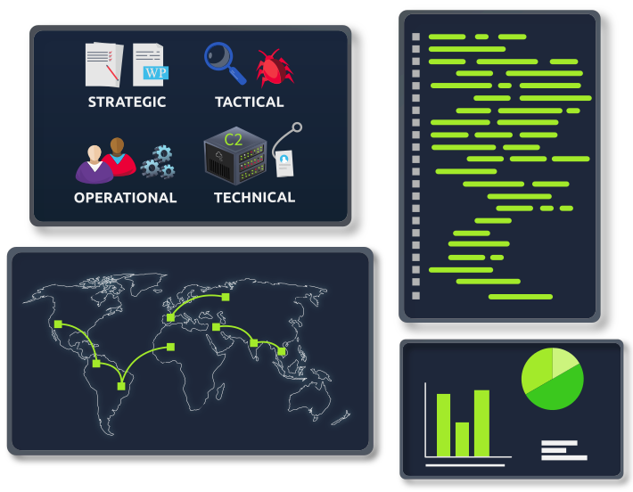

# Cyber Threat Intelligence

***

> **Name**
>
> 🌐 [Cyber Threat Intelligence](https://tryhackme.com/module/cyber-threat-intelligence) - Tryhackme Module
>
> 
>
> **Description**
>
> 📝 _Learn about identifying and using available security knowledge to mitigate and manage potential adversary actions._

***

## [Intro to Cyber Threat Intel](https://tryhackme.com/jr/cyberthreatintel)

> 📝 _Introducing cyber threat intelligence and related topics, such as relevant standards and frameworks_

***

## [Threat Intelligence Tools](https://tryhackme.com/jr/threatinteltools)

> 📝 _Explore different OSINT tools used to conduct security threat assessments and investigations_

***

## [Yara](https://tryhackme.com/jr/yara)

> 📝 _Learn the applications and language that is Yara for everything threat intelligence, forensics, and threat hunting!_

***

## [OpenCTI](https://tryhackme.com/jr/opencti)

> 📝 _Provide an understanding of the OpenCTI Project_

***

## [MISP](https://tryhackme.com/jr/misp)

> 📝 _Walkthrough on the use of MISP as a Threat Sharing Platform_

***
