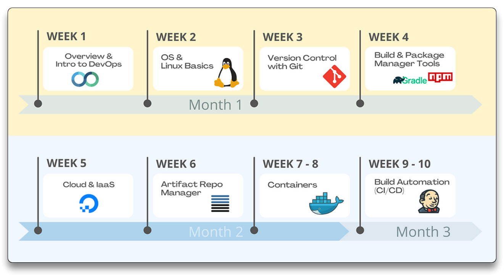
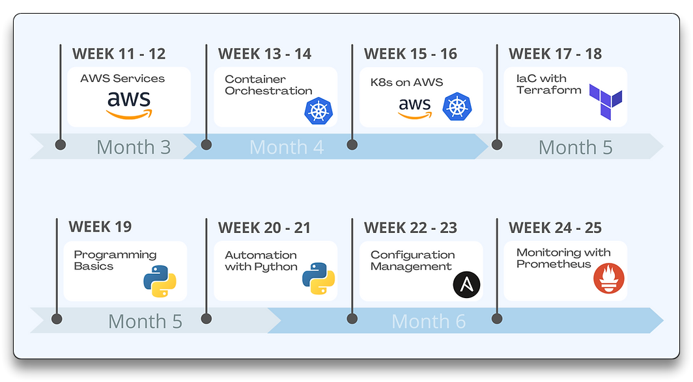

# 🌐 DevOps Resources 🔗

## 🔗 Generic Links

- [CNCF - Cloud Native Computing Foundation](https://www.cncf.io/)

- [DevOps - Telegram](https://t.me/thedevs_devops)

> Overview:
>
>  - DevOps Landscape: [https://roadmap.sh/devops](https://roadmap.sh/devops)
>
> Cloud:
>  - Docker: [https://www.docker.com](https://www.docker.com)
>  - Kubernetes: [https://kubernetes.io](https://kubernetes.io)
>  - Terraform: [https://www.terraform.io](https://www.terraform.io)
>
> CI/CD:
> - GitHub Actions: [https://github.com/features/actions](https://github.com/features/actions)
> - Travis: [https://travis-ci.org](https://travis-ci.org)
> - GitLab CI: [https://docs.gitlab.com/ee/ci/](https://docs.gitlab.com/ee/ci/)
> - Jenkins: [https://jenkins.io](https://jenkins.io)
> - CircleCI: [https://circleci.com](https://circleci.com)
> - AppVeyor: [https://www.appveyor.com](https://www.appveyor.com)
> - Bamboo (Altassian): [https://www.atlassian.com/software/bamboo](https://www.atlassian.com/software/bamboo)
> - Argo CD: [https://argoproj.github.io/cd/](https://argoproj.github.io/cd/)
> - Flux: [https://fluxcd.io/](https://fluxcd.io/)
> - Agola: [https://github.com/agola-io/agola](https://github.com/agola-io/agola)
> - Buildkite: [https://buildkite.com/](https://buildkite.com/)
> - GoCD: [https://github.com/gocd/gocd](https://github.com/gocd/gocd)
> - Octopus Deploy: [https://octopus.com/](https://octopus.com/)
> - TeamCity: [https://www.jetbrains.com/teamcity/](https://www.jetbrains.com/teamcity/)
>
> Repos:
>   - Artifactory (jFrog): [https://jfrog.com/artifactory/](https://jfrog.com/artifactory/)
>
> Service Mesh:
>  - Consul (Hashicorp): [https://www.consul.io/](https://www.consul.io/)
> - Istio: [https://istio.io/](https://istio.io/)
>
> Kubernetes:
>  - Backups:
>     - Velero: [https://github.com/vmware-tanzu/velero](https://github.com/vmware-tanzu/velero)
>   - Serverless:
>     - Knative: [https://github.com/knative](https://github.com/knative)
>
> Standards:
>  - Open Containers Initiative (OCI): [https://www.opencontainers.org](https://www.opencontainers.org)
> - Cloud Native Computing Foundation (CNCF): [https://www.cncf.io/](https://www.cncf.io/)
>
> Documentation:
> - Principles of Chaos: [http://principlesofchaos.org/](http://principlesofchaos.org/)
> - Visualize your architecture: [http://c4model.com](http://c4model.com)
>
> Audit:
>  - Elastic: [https://www.elastic.co/blog/introducing-elastic-siem](https://www.elastic.co/blog/introducing-elastic-siem)

---

## 📚 Courses

- [TechWorld - DevOps Bootcamp By Nana](https://www.techworld-with-nana.com/devops-bootcamp) - 68h

- [TechWorld - Certified Kubernetes Administrator (CKA Course)](https://www.techworld-with-nana.com/kubernetes-administrator-cka)
- [KodeKloud Training Courses](https://kodekloud.com/)

  - [KodeKloud Engineer Practice](https://engineer.kodekloud.com/signup?referral=6607378b4014655f23f038ae)

---

## 📽️ Youtube

### Docker

- [Docker Tutorial for Beginners [FULL COURSE in 3 Hours]](https://www.youtube.com/watch?v=3c-iBn73dDE)
- [Ultimate Docker Compose Tutorial [1h]](https://www.youtube.com/watch?v=SXwC9fSwct8&list=PLy7NrYWoggjxtN4YbSMYFFdpaxb-fR4zC&index=20)

### Kubernetes

- [Kubernetes Roadmap - Complete Step-by-Step Learning Path](https://www.youtube.com/watch?v=S8eX0MxfnB4)
- [Kubernetes Tutorial for Beginners [FULL COURSE in 4 Hours]](https://www.youtube.com/watch?v=X48VuDVv0do&list=PLy7NrYWoggjxtN4YbSMYFFdpaxb-fR4zC&index=2)
- [Kubernetes Crash Course for Absolute Beginners [NEW] [1h]](https://www.youtube.com/watch?v=s_o8dwzRlu4)

### DevSecOps

- [DevSecOps Tutorial for Beginners | CI Pipeline with GitHub Actions and Docker Scout [1h]](https://www.youtube.com/watch?v=gLJdrXPn0ns)

---

