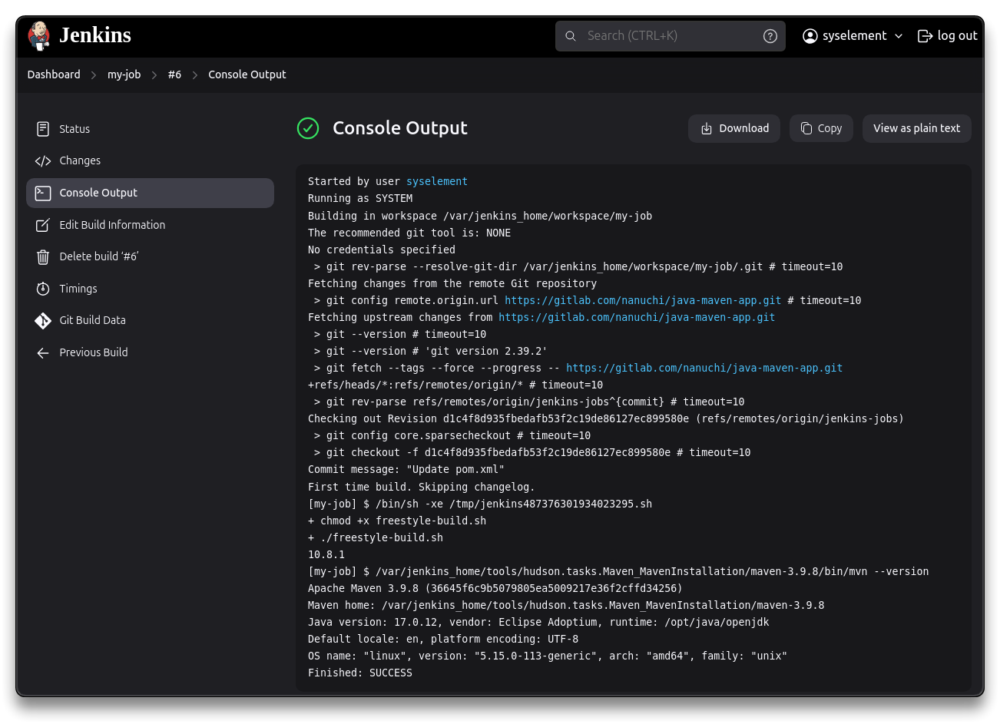
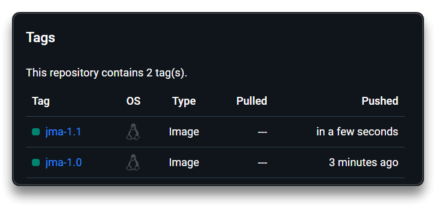

# Jenkins


---

## 🌐 Resources 🔗

> - [Jenkins](https://www.jenkins.io/)
> - [Jenkins User Documentation](https://www.jenkins.io/doc/)
>   - [Jenkins - Pipeline Syntax](https://www.jenkins.io/doc/book/pipeline/syntax/)
>   - [Groovy - Syntax](https://groovy-lang.org/syntax.html)
> - [Jenkins Best Practices](https://www.lambdatest.com/blog/jenkins-best-practices/)
> - [Semantic Versioning](https://semver.org/)

---

## Build Automation

- Developer ➡️ Git repo ➡️ Test and Build
  - The test and build part is automated via dedicated server, triggering the following **build automation**
- Test code ➡️ Build application ➡️ Push to repository ➡️ Deploy to server

[Jenkins](https://www.jenkins.io/) is a self-contained, open source automation server which can be used to automate all sorts of tasks related to **building**, **testing**, and **delivering** or **deploying** software.

- Needs to integrate with Docker, Build tools, Repositories, Deployment servers, other technologies
- Plugins

---

## [Install Jenkins via Docker](https://www.jenkins.io/doc/book/installing/docker/)

> - ❗ Ubuntu Server is being used for this installation. Fix FQDN/IP accordingly to your home lab

```bash
docker run -p 8080:8080 -p 50000:50000 -d -v jenkins-data:/var/jenkins_home jenkins/jenkins:lts-jdk17
```

- Run Jenkins via browser at [http://ubuntu-srv:8080/](http://ubuntu-srv:8080/)

```bash
# Check data from the container bash
docker ps
docker exec -it <CONTAINER_ID> cat /var/jenkins_home/secrets/initialAdminPassword

# Check data from the server
docker volume inspect jenkins-data
	"Mountpoint": "/var/lib/docker/volumes/jenkins-data/_data",

sudo cat /var/lib/docker/volumes/jenkins-data/_data/secrets/initialAdminPassword
```

- Create an Administrator user and proceed with the first configuration
  - used for Operations and DevOps teams

---

## Basics and Lab

> **Demo Projects by TechWorld with Nana**
>
> - [Nana Janashia / java-maven-app · GitLab](https://gitlab.com/nanuchi/java-maven-app)
> - [Nana Janashia / jenkins-shared-library · GitLab](https://gitlab.com/nanuchi/jenkins-shared-library)

- Go to [http://ubuntu-srv:8080/manage/pluginManager/](http://ubuntu-srv:8080/manage/pluginManager/) to install Maven and NodeJS plugins, and configure them at [http://ubuntu-srv:8080/manage/configureTools/](http://ubuntu-srv:8080/manage/configureTools/)

### npm and Nodejs in Jenkins container

- Installing directly into the Docker container, rather than using a plugin, can provide greater flexibility during job configuration.

```bash
docker ps
# Open container bash as root user
docker exec -u 0 -it <CONTAINER_ID> bash

cat /etc/issue
apt update
apt install -y curl

curl -fsSL https://deb.nodesource.com/setup_20.x | bash -
apt install -y nodejs

nodejs -v
npm -v
```

---

### New Freestyle job

- Create a **New Item** - Freestyle project
- Add a Build Step - **Execute shell**

```bash
# Command
npm --version
```

- Add build step - **Invoke top-level Maven targets**

```bash
# Maven Goals
--version
```

- Run **Build now** on the created job and check the results - [http://ubuntu-srv:8080/job/my-job/1/console](http://ubuntu-srv:8080/job/my-job/1/console)

```bash
# Console Output
Started by user syselement
Running as SYSTEM
Building in workspace /var/jenkins_home/workspace/my-job
[my-job] $ /bin/sh -xe /tmp/jenkins158048317029812819.sh
+ npm --version
10.8.1
Unpacking https://repo.maven.apache.org/maven2/org/apache/maven/apache-maven/3.9.8/apache-maven-3.9.8-bin.zip to /var/jenkins_home/tools/hudson.tasks.Maven_MavenInstallation/maven-3.9.8 on Jenkins
[my-job] $ /var/jenkins_home/tools/hudson.tasks.Maven_MavenInstallation/maven-3.9.8/bin/mvn --version
Apache Maven 3.9.8 (36645f6c9b5079805ea5009217e36f2cffd34256)
Maven home: /var/jenkins_home/tools/hudson.tasks.Maven_MavenInstallation/maven-3.9.8
Java version: 17.0.12, vendor: Eclipse Adoptium, runtime: /opt/java/openjdk
Default locale: en, platform encoding: UTF-8
OS name: "linux", version: "5.15.0-113-generic", arch: "amd64", family: "unix"
Finished: SUCCESS
```

- Configure **Source Code Management** with Git and repository `https://gitlab.com/nanuchi/java-maven-app.git`
  - Add credentials if necessary for personal private repo
  - This will check out the Gitlab code locally in order to be able to run commands against that repository
  - by running this job, checkout repository's files can be found inside the container at `/var/jenkins_home/workspace/my-job`
- Setup the Repo **Branch Specifier** as `*/jenkins-jobs`
- In the **Execute shell** set

```bash
chmod +x freestyle-build.sh
./freestyle-build.sh
```



---

### Java Maven build

- Create a new Freestyle project item `java-maven-build` with Git `https://gitlab.com/nanuchi/java-maven-app.git` and branch `*/jenkins-jobs` and add 2 Maven build steps, each with:
  - goals `test`
  - goals `package`
- Save it, Build Now, and check the `Console Output`
- Check the result `jar` file inside the container

```bash
docker exec -it <CONTAINER_ID> bash

ls /var/jenkins_home/workspace/java-maven-build/target
    classes
    generated-sources
    generated-test-sources
    java-maven-app-1.1.7.jar
    java-maven-app-1.1.7.jar.original
    maven-archiver
    maven-status
    surefire-reports
    test-classes
```

---

### Docker in Jenkins - Build & Push

- Mount Docker runtime directory into the container as a volume to make Docker available in the container

```bash
docker stop <CONTAINER_ID>
docker volume ls
	local     jenkins-data
```

```bash
docker run -p 8080:8080 -p 50000:50000 -d \
	-v jenkins-data:/var/jenkins_home \
	-v /var/run/docker.sock:/var/run/docker.sock \
	-v $(which docker):/usr/bin/docker \
	jenkins/jenkins:lts-jdk17

# Fix permissions to allow jenkins user to run Docker commands
docker exec -u 0 -it <CONTAINER_ID> bash
chmod 666 /var/run/docker.sock
```

- Configure job to build and push Docker image via the [Dockerfile](https://gitlab.com/nanuchi/java-maven-app/-/blob/jenkins-jobs/Dockerfile)
- Configure `java-maven-build` by removing the Maven test step and adding an **Execute shell** step with commands

```bash
docker build -t java-maven-app:1.0 .
```

- Save it and build the project
- Check the Docker image in the Jenkins container

```bash
docker images

java-maven-app 1.0 192f20f7a5ea 22 seconds ago 102MB
```

- Create a [https://hub.docker.com/](https://hub.docker.com/) account and a private Repository
- Create credentials for DockerHub in Jenkins
- Configure the job to Push the Docker image to private Docker repository
  - First set Build Environment to `Use secret text` with Binding to **Username and password (separated)** setting the username and password variables
  - Set the **Execute shell** command as following

```bash
docker build -t syselement/demo-app:jma-1.0 .

echo $PASSWORD | docker login -u $USERNAME --password-stdin
docker push syselement/demo-app:jma-1.0
```

- Save it and build
- Create another build with

```bash
docker build -t syselement/demo-app:jma-1.1 .

echo $PASSWORD | docker login -u $USERNAME --password-stdin
docker push syselement/demo-app:jma-1.1
```

- Check the pushed images in the DockerHub



> 📌 In case of not TLS secured local registry follow this guide [Test an insecure registry | CNCF Distribution](https://distribution.github.io/distribution/about/insecure/) to configure an HTTP registry via the `/etc/docker/daemon.json` file.

---

### [Pipeline](https://www.jenkins.io/doc/book/pipeline/)

**Pipeline jobs** are used for more complex workflows, more suitable for CI/CD pipleines

- Divide tasks into different stages
- Configure via UI and scripting ("Pipeline as Code") - `Jenkinsfile`
- Parallel tasks execution
- User input, conditional statements, variables

Create a new item with Pipeline type - `my-pipeline`.

- Set a `Pipeline script from SCM`, written in Groovy
- The script should be in the Git repository, setup accordingly
  - set the repository URL, the branch and the script path to `Jenkinsfile-simple-pipeline\Jenkinsfile`
  - Check Nana's [java-maven-app/jenkins-jobs repository](https://gitlab.com/nanuchi/java-maven-app/-/tree/jenkins-jobs?ref_type=heads) for more examples

Example of build jar, build and push image, with `Jenkinsfile` and `script.groovy` files :

```groovy
// Jenkinsfile

#!/usr/bin/env groovy

def gv

pipeline {
    agent any
    tools {
        maven 'Maven'
    }
    stages {
        stage("init") {
            steps {
                script {
                    gv = load "script.groovy"
                }
            }
        }
        stage("build jar") {
            steps {
                script {
                    gv.buildJar()
                }
            }
        }
        stage("build image") {
            steps {
                script {
                    gv.buildImage()
                }
            }
        }
        stage("deploy") {
            steps {
                script {
                    gv.deployApp()
                }
            }
        }
    }
}
```

```groovy
// script.groovy

def buildJar() {
    echo "building the application..."
    sh 'mvn package'
} 

def buildImage() {
    echo "building the docker image..."
    withCredentials([usernamePassword(credentialsId: 'dockerhub-repo', passwordVariable: 'PASS', usernameVariable: 'USER')]) {
        sh 'docker build -t syselement/demo-app:jma-2.0 .'
        sh "echo $PASS | docker login -u $USER --password-stdin"
        sh 'docker push syselement/demo-app:jma-2.0'
    }
} 

def deployApp() {
    echo 'deploying the application...'
} 

return this
```

---

### [Credentials](https://www.jenkins.io/doc/book/security/credentials/)

Jenkins needs credentials for all the tasks in the pipelines to

- fetch git repository code
- login to Docker registry
- SSH to remote server for deployment

Scopes:

- **System** - only available on Jenkins server (not for jobs)
- **Global** - everywhere accessible

---

### [Shared libraries](https://www.jenkins.io/doc/book/pipeline/shared-libraries/)

- Used to share parts of Pipelines between various projects to reduce duplication
- **Shared libraries** can be defined in external Git repositories and loaded into existing Pipelines

**Definition of a shared library**:

- A name
- A source code retrieval method (e.g., by SCM)
- Optionally, a default version
- Path: `Manage Jenkins » System » Global Trusted Pipeline Libraries`.

**Naming**:

- The name should be a short identifier as it will be used in scripts

**Version**:

- Could be anything understood by that SCM (e.g., branches, tags, commit hashes for Git)
- You may declare whether scripts need to explicitly request that library or if it is present by default
- If a version is specified in Jenkins configuration, you can block scripts from selecting a different version

---

