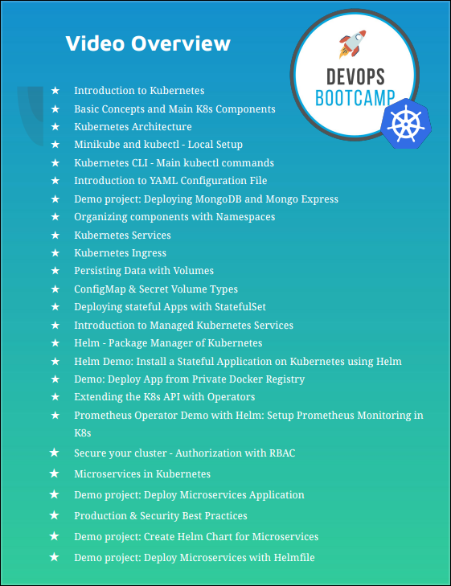

# DevOps Notes

## Content table

> [TechWorld - DevOps Bootcamp By Nana](https://www.techworld-with-nana.com/devops-bootcamp) - 68h
>
> - [x] 1 - Bootcamp Overview + Tools Installation Checklist
> - [x] 2 - Introduction to DevOps
>
> 
>
>
> - [x] 0 - Module Intro + Checklist
> - [x] 1 - Introduction to Operating Systems
> - [x] 2 - Introduction to Virtualization & Virtual Machines
> - [x] 3 - Setup a Linux Virtual Machine
> - [x] 4 - Linux File System
> - [x] 5 - Introduction to Command Line Interface (CLI - Part 1)
> - [x] 6 - Basic Linux Commands (CLI - Part 2)
> - [x] 7 - Package Manager - Installing Software on Linux
> - [x] 8 - Working with Vim Editor
> - [x] 9 - Linux Accounts & Groups (Users & Permissions Part 1)
> - [x] 10 - File Ownership & Permissions (Users & Permissions - Part 2)
> - [x] 11 - Basic Linux Commands - Pipes & Redirects (CLI - Part 3)
> - [x] 12 - Introduction to Shell Scripting Part 1
> - [x] 13 - Shell Scripting Part 2 - Concepts & Syntax
> - [x] 14 - Shell Scripting Part 3 - Concepts & Syntax
> - [x] 15 - Environment Variables
> - [x] 16 - Networking
> - [x] 17 - SSH - Secure Shell
>
> 
>
>
> - [x] 0 - Module Intro + Checklist
> - [x] 1 - Introduction to Version Control and Git
> - [x] 2 - Basic Concepts of Git
> - [x] 3 - Setup Git Repository Remote and Local
> - [x] 4 - Working with Git
> - [x] 5 - Initialize a Git project locally
> - [x] 6 - Concept of Branches
> - [x] 7 - Merge Requests
> - [x] 8 - Deleting Branches
> - [x] 9 - Rebase
> - [x] 10 - Resolving Merge Conflicts
> - [x] 11 - Gitignore
> - [x] 12 - Git stash
> - [x] 13 - Going back in history
> - [x] 14 - Undoing commits
> - [x] 15 - Merging branches
> - [x] 16 - Git for Devops
>
>
> - [x] 1 - Databases in development process
> - [x] 2 - Database Types
>
> 
>
>
> - [x] 0 - Module Intro + Checklist
> - [x] 1 - Introduction to Build Tools
> - [x] 2 - Install Build Tools
> - [x] 3 - Installation Help for Windows User - Part 1
> - [x] 4 - Installation Help for Windows User - Part 2
> - [x] 5 - Installation Help for MacOS-Unix User
> - [x] 6 - Build an Artifact
> - [x] 7 - Build Tools for Development
> - [x] 8 - Run the Application
> - [x] 9 - Build JS Applications
> - [x] 10 - Common Concepts and Differences of Build Tools
> - [x] 11 - Publish an Artifact
> - [x] 12 - Build Tools & Docker - NOTES
> - [x] 13 - Build Tools for DevOps
>
> 
>
>
> - [x] 0 - Module Intro + Checklist
> - [x] 1 - Intro to Cloud & IaaS
> - [x] 2 - Setup Server on DigitalOcean
> - [x] 3 - Deploy and run application artifact on Droplet
> - [x] 4 - Create and configure a Linux user on a cloud server
>
> 
>
>
> - [x] 0 - Module Intro + Checklist
> - [x] 1 - Intro to Artifact Repository Manager
> - [x] 2 - Install and Run Nexus on a cloud server
> - [x] 3 - Introduction to Nexus
> - [x] 4 - Repository Types
> - [x] 5 - Publish Artifact to Repository
> - [x] 6 - Nexus REST API
> - [x] 7 - Blob Store
> - [x] 8 - Component vs Asset
> - [x] 9 - Cleanup Policies and Scheduled Tasks
>
> 
>
>
> - [x] 0 - Module Intro + Checklist
> - [x] 1 - What is a Container
> - [x] 2 - Container vs Image
> - [x] 3 - Docker vs. Virtual Machine
> - [x] 4 - Docker Architecture and components
> - [x] 5 - Main Docker Commands
> - [x] 6 - Debug Commands
> - [x] 7 - Docker Demo - Project Overview
> - [x] 8 - Developing with Docker
> - [x] 9 - Docker Compose - Run multiple Docker containers
> - [x] 10 - Dockerfile - Build your own Docker Image
> - [x] 11 - Private Docker Repository
> - [x] 12 - Deploy docker application on a server
> - [x] 13 - Docker Volumes - Persisting Data
> - [x] 14 - Docker Volumes Demo
> - [x] 15 - Create Docker Hosted Repository on Nexus
> - [x] 16 - Deploy Nexus as Docker Container
>
> 
>
>
> - [x] 0 - Module Intro + Checklist
> - [x] 1 - Intro to Build Automation
> - [x] 2 - Install Jenkins
> - [x] 3 - Introduction to Jenkins UI
> - [x] 4 - Install Build Tools in Jenkins
> - [x] 5 - Jenkins Basics Demo - Freestyle Job
> - [x] 6 - Docker in Jenkins
> - [x] 7 - Freestyle to Pipeline Job
> - [x] 8 - Intro to Pipeline Job
> - [x] 9 - Jenkinsfile Syntax
> - [x] 10 - Create complete Pipeline
> - [x] 11 - Intro to Multibranch Pipeline
> - [x] 12 - Jenkins Jobs Overview
> - [x] 13 - Credentials in Jenkins
> - [x] 14 - Jenkins Shared Library
> - [x] 15 - Webhooks - Trigger Pipeline Jobs automatically
> - [x] 16 - Dynamically Increment Application version in Jenkins Pipeline - Part 1
> - [x] 17 - Dynamically Increment Application version in Jenkins Pipeline - Part 2
>
> 
>
>
> - [x] 0 - Module Intro + Checklist
> - [x] 1 - Introduction to AWS
> - [x] 2 - Create an AWS account
> - [x] 3 - IAM - Manage Users, Roles and Permissions
> - [x] 4 - Regions & Availability Zones
> - [x] 5 - VPC - Manage Private Network on AWS
> - [x] 6 - CIDR Blocks explained
> - [x] 7 - Introduction to EC2 Virtual Cloud Server
> - [x] 8 - Deploy to EC2 server from Jenkins Pipeline - CI/CD Part 1
> - [x] 9 - Deploy to EC2 server from Jenkins Pipeline - CI/CD Part 2
> - [x] 10 - Deploy to EC2 server from Jenkins Pipeline - CI/CD Part 3
> - [x] 11 - Introduction to AWS CLI
> - [x] 12 - AWS & Terraform Preview
> - [x] 13 - Container Services on AWS Preview
>

K8s

> 
>- [ ] 0 - Module Intro + Checklist
> - [ ] 1 - Intro to Kubernetes
> - [ ] 2 - Main Kubernetes Components
>- [ ] 3 - Kubernetes Architecture
> - [ ] 4 - Minikube and kubectl - Local Kubernetes Cluster
>- [ ] 5 - Main kubectl commands
>- [ ] 6 - YAML Configuration File
> - [ ] 7 - Complete Demo Project - Deploying Application in Kubernetes Cluster
> - [ ] 8 - Namespaces - Organizing Components
> - [ ] 9 - Services - Connecting to Applications inside cluster
> - [ ] 10 - Ingress - Connecting to Applications outside cluster
> - [ ] 11 - Volumes - Persisting Application Data
> - [ ] 12 - ConfigMap & Secret Volume Types
> - [ ] 13 - StatefulSet - Deploying Stateful Applications
> - [ ] 14 - Managed Kubernetes Services Explained
> - [ ] 15 - Helm - Package Manager for Kubernetes
> - [ ] 16 - Helm Demo - Managed K8s cluster
> - [ ] 17 - Deploying Images in Kubernetes from private Docker repository
> - [ ] 18 - Kubernetes Operators for Managing Complex Applications
> - [ ] 19 - Helm and Operator Demo
> - [ ] 20 - Secure your cluster - Authorization with RBAC
> - [ ] 21 - Microservices in Kubernetes
> - [ ] 22 - Demo project: Deploy Microservices Application
> - [ ] 23 - Production & Security Best Practices
> - [ ] 24 - Demo project: Create Helm Chart for Microservices
>- [ ] 25 - Demo project: Deploy Microservices with Helmfile
> 
>
>
> 
> - [x] 0 - Module Intro + Checklist
> - [x] 1 - Container Services on AWS
> - [x] 2 - Create EKS cluster with AWS Management Console
> - [x] 3 - Configure Autoscaling in EKS cluster
> - [x] 4 - Create Fargate Profile for EKS Cluster
> - [x] 5 - Create EKS cluster with eksctl command line tool
> - [x] 6 - Deploy to EKS Cluster from Jenkins Pipeline
> - [x] 7 - BONUS: Deploy to LKE Cluster from Jenkins Pipeline
> - [x] 8 - Jenkins Credentials Note on Best Practices
> - [x] 9 - Complete CI/CD Pipeline with EKS and DockerHub
> - [x] 10 - Complete CI/CD Pipeline with EKS and ECR
> 
> 
> 
> 
> - [ ] 0 - Module Intro + Checklist
>- [ ] 1 - Introduction to Terraform
>- [ ] 2 - Install Terraform & Setup Terraform Project
> - [ ] 3 - Providers in Terraform
> - [ ] 4 - Resources & Data Sources
>- [ ] 5 - Change & Destroy Terraform Resources
> - [ ] 6 - Terraform commands
>- [ ] 7 - Terraform State
>- [ ] 8 - Output Values
> - [ ] 9 - Variables in Terraform
> - [ ] 10 - Environment Variables in Terraform
> - [ ] 11 - Create Git Repository for local Terraform Project
> - [ ] 12 - Automate Provisioning EC2 with Terraform - Part 1
> - [ ] 13 - Automate Provisioning EC2 with Terraform - Part 2
> - [ ] 14 - Automate Provisioning EC2 with Terraform - Part 3
> - [ ] 15 - Provisioners in Terraform
> - [ ] 16 - Modules in Terraform - Part 1
> - [ ] 17 - Modules in Terraform - Part 2
> - [ ] 18 - Modules in Terraform - Part 3
> - [ ] 19 - Automate Provisioning EKS cluster with Terraform - Part 1
> - [ ] 20 - Automate Provisioning EKS cluster with Terraform - Part 2
> - [ ] 21 - Automate Provisioning EKS cluster with Terraform - Part 3
> - [ ] 22 - Complete CI/CD with Terraform - Part 1
>- [ ] 23 - Complete CI/CD with Terraform - Part 2
> - [ ] 24 - Complete CI/CD with Terraform - Part 3
>- [ ] 25 - Remote State in Terraform
>
> 
> 
> 
> - [ ] 0 - Module Intro + Checklist
> - [ ] 1 - Introduction to Python
>- [ ] 2 - Installation and Local Setup
> - [ ] 3 - Our first Python Program
>- [ ] 4 - Python IDE vs Simple File Editor
>- [ ] 5 - Strings and Number Data Types
> - [ ] 6 - Variables
> - [ ] 7 - Functions
> - [ ] 8 - Accepting User Input
> - [ ] 9 - Conditionals (if / else) and Boolean Data Type
> - [ ] 10 - Error Handling with Try-Except
> - [ ] 11 - While Loops
> - [ ] 12 - Lists and For Loops
> - [ ] 13 - Comments
> - [ ] 14 - Sets
> - [ ] 15 - Built-In Functions
>- [ ] 16 - Dictionary Data Type
> - [ ] 17 - Modules
>- [ ] 18 - Project: Countdown App
>- [ ] 19 - Packages, PyPI and pip
> - [ ] 20 - Project: Automation with Python (Spreadsheet)
> - [ ] 21 - OOP: Classes and Objects
> - [ ] 22 - Project: API Request to GitLab
> 
> 
> 
> 
> - [ ] 0 - Module Intro + Checklist
> - [ ] 1 - Introduction to Boto Library (AWS SDK for Python)
> - [ ] 2 - Install Boto3 and connect to AWS
> - [ ] 3 - Getting familiar with Boto
> - [ ] 4 - Terraform vs Python - understand when to use which tool
> - [ ] 5 - Health Check: EC2 Status Checks
> - [ ] 6 - Write a Scheduled Task in Python
> - [ ] 7 - Configure Server: Add Environment Tags to EC2 Instances
> - [ ] 8 - EKS cluster information
> - [ ] 9 - Backup EC2 Volumes: Automate creating Snapshots
>- [ ] 10 - Automate cleanup of old Snapshots
> - [ ] 11 - Automate restoring EC2 Volume from the Backup
>- [ ] 12 - Handling Errors
>- [ ] 13 - Website Monitoring 1: Scheduled Task to Monitor Application Health
> - [ ] 14 - Website Monitoring 2: Automated Email Notification
> - [ ] 15 - Website Monitoring 3: Restart Application and Reboot Server
> 
> 
> 
> 
> - [ ] 0 - Module Intro + Checklist
> - [ ] 1 - Introduction to Ansible
> - [ ] 2 - Install Ansible
> - [ ] 3 - Setup Managed Server to Configure with Ansible
> - [ ] 4 - Ansible Inventory and Ansible ad-hoc commands
> - [ ] 5 - Configure AWS EC2 server with Ansible
> - [ ] 6 - Managing Host Key Checking and SSH keys
> - [ ] 7 - Introduction to Playbooks
> - [ ] 8 - Ansible Modules
> - [ ] 9 - Collections in Ansible
> - [ ] 10 - Project: Deploy Nodejs application - Part 1
> - [ ] 11 - Project: Deploy Nodejs application - Part 2
>- [ ] 12 - Project: Deploy Nodejs application - Part 3
> - [ ] 13 - Ansible Variables - make your Playbook customizable
>- [ ] 14 - Project Deploy Nexus - Part 1
>- [ ] 15 - Project Deploy Nexus - Part 2
> - [ ] 16 - Ansible Configuration - Default Inventory File
> - [ ] 17 - Project: Run Docker applications - Part 1
> - [ ] 18 - Project: Run Docker applications - Part 2
> - [ ] 19 - Project: Terraform & Ansible
> - [ ] 20 - Dynamic Inventory for EC2 Servers
> - [ ] 21 - Project: Deploying Application in K8s
> - [ ] 22 - Project: Run Ansible from Jenkins Pipeline - Part 1
> - [ ] 23 - Project: Run Ansible from Jenkins Pipeline - Part 2
> - [ ] 24 - Project: Run Ansible from Jenkins Pipeline - Part 3
> - [ ] 25 - Ansible Roles - Make your Ansible content more reusable and modular
> 
> 
> 
> 
>- [ ] 0 - Module Intro + Checklist
> - [ ] 1 - Introduction to Monitoring with Prometheus
>- [ ] 2 - Install Prometheus Stack in Kubernetes
>- [ ] 3 - Data Visualization with Prometheus UI
> - [ ] 4 - Introduction to Grafana
> - [ ] 5 - Alert Rules in Prometheus
> - [ ] 6 - Create own Alert Rules - Part 1
> - [ ] 7 - Create own Alert Rules - Part 2
> - [ ] 8 - Create own Alert Rules - Part 3
> - [ ] 9 - Introduction to Alertmanager
> - [ ] 10 - Configure Alertmanager with Email Receiver
> - [ ] 11 - Trigger Alerts for Email Receiver
> - [ ] 12 - Monitor Third-Party Applications
> - [ ] 13 - Deploy Redis Exporter
> - [ ] 14 - Alert Rules & Grafana Dashboard for Redis
> - [ ] 15 - Collect & Expose Metrics with Prometheus Client Library (Monitor own App- Part 1)
> - [ ] 16 - Scrape Own Application Metrics & Configure Own Grafana Dashboard (Monitor own App - Part 2)