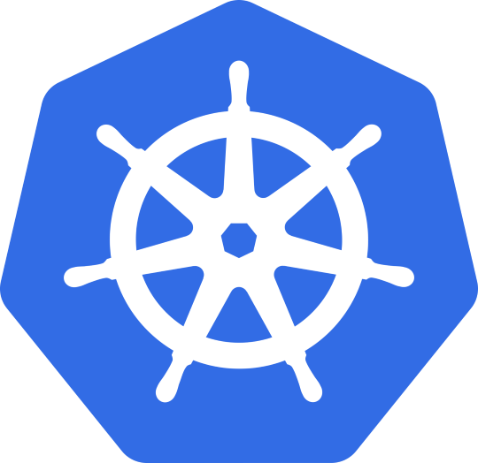

# Kubernetes



***

## 🌐 Resources 🔗

> * [Kubernetes Docs](https://kubernetes.io/docs/home/)
>   * [Kubernetes Components](https://kubernetes.io/docs/concepts/overview/components/)
> * [Kubernetes Learning Path - NotHarshhaa](https://github.com/NotHarshhaa/kubernetes-learning-path)
>
> Backups
>
> * Velero: [https://github.com/vmware-tanzu/velero](https://github.com/vmware-tanzu/velero)
>
> Serverless
>
> * Knative: [https://github.com/knative](https://github.com/knative)
>
> Labs
>
> * [Kubernetes Goat](https://madhuakula.com/kubernetes-goat/)

***

## [Kubernetes Intro](https://kubernetes.io/docs/concepts/overview/)

***

## [Kubernetes Components](https://kubernetes.io/docs/concepts/overview/components/)


***

## Kubernetes Cluster Architecture


***

## [minikube](https://minikube.sigs.k8s.io/docs/) and kubectl

* [minikube](https://minikube.sigs.k8s.io/docs/start/?arch=%2Flinux%2Fx86-64%2Fstable%2Fdebian+package)

```bash
# Install minikube
curl -LO https://storage.googleapis.com/minikube/releases/latest/minikube_latest_amd64.deb
sudo dpkg -i minikube_latest_amd64.deb
```

* [kubectl](https://kubernetes.io/docs/tasks/tools/install-kubectl-linux/#install-using-native-package-management)

```bash
# Install kubectl
sudo sh -c '
	sudo apt install -y apt-transport-https ca-certificates curl gnupg
	sudo mkdir -p -m 755 /etc/apt/keyrings
	curl -fsSL https://pkgs.k8s.io/core:/stable:/v1.33/deb/Release.key | gpg --dearmor -o /etc/apt/keyrings/kubernetes-apt-keyring.gpg
	chmod 644 /etc/apt/keyrings/kubernetes-apt-keyring.gpg
	echo "deb [signed-by=/etc/apt/keyrings/kubernetes-apt-keyring.gpg] https://pkgs.k8s.io/core:/stable:/v1.33/deb/ /" | sudo tee /etc/apt/sources.list.d/kubernetes.list
	chmod 644 /etc/apt/sources.list.d/kubernetes.list
	sudo apt update && sudo apt install -y kubectl
'
mkdir -p $HOME/.kube
sudo touch -f $HOME/.kube/config
sudo chown $(id -u):$(id -g) $HOME/.kube && chmod 700 $HOME/.kube
sudo chown $(id -u):$(id -g) $HOME/.kube/config && chmod 600 $HOME/.kube/config
```

Commands for the **minikube cluster**

```bash
minikube start
# Start specific version or to Upgrade
minikube start --kubernetes-version=v1.31.0

minikube stop

# Deletes local cluster
minikube delete
```

***

## Labs

### TechWorld with Nana

* [bootcamp-kubernetes - TechWorld with Nana](https://gitlab.com/nanuchi/bootcamp-kubernetes)
* [online-shop-microservices-deployment - TechWorld with Nana](https://gitlab.com/nanuchi/online-shop-microservices-deployment)
* [GoogleCloudPlatform - microservices-demo: Sample cloud-first application with 10 microservices showcasing Kubernetes, Istio, and gRPC.](https://github.com/GoogleCloudPlatform/microservices-demo)

```bash
mkdir -p $HOME/repo/techworld
cd $HOME/repo/techworld

git clone https://gitlab.com/nanuchi/bootcamp-kubernetes.git
git clone https://gitlab.com/nanuchi/online-shop-microservices-deployment.git
git clone --depth 1 --branch v0 https://github.com/GoogleCloudPlatform/microservices-demo.git
```

### [Kubernetes Goat](https://madhuakula.com/kubernetes-goat/)

```bash
# Pre-requisites:
# 1. Ensure you have admin access to the Kubernetes cluster
# 2. Install kubectl, helm
```

```bash
# Setup Kubernetes Goat
mkdir -p $HOME/repo
cd $HOME/repo

git clone https://github.com/madhuakula/kubernetes-goat.git
cd kubernetes-goat
chmod +x setup-kubernetes-goat.sh
bash setup-kubernetes-goat.sh
```
