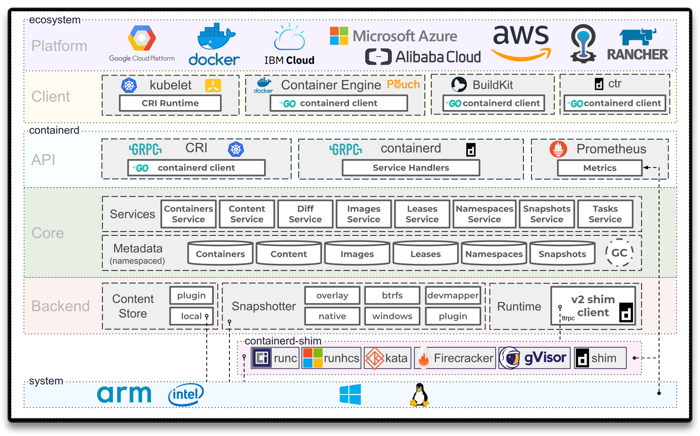
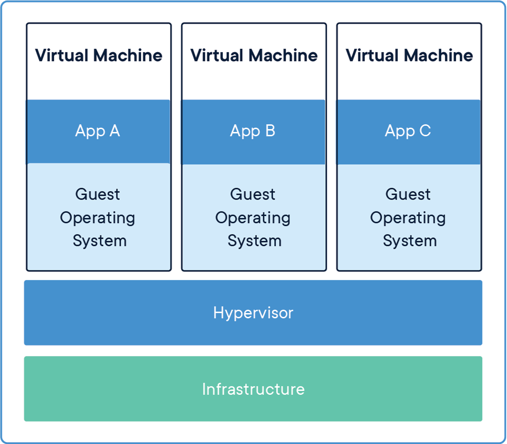
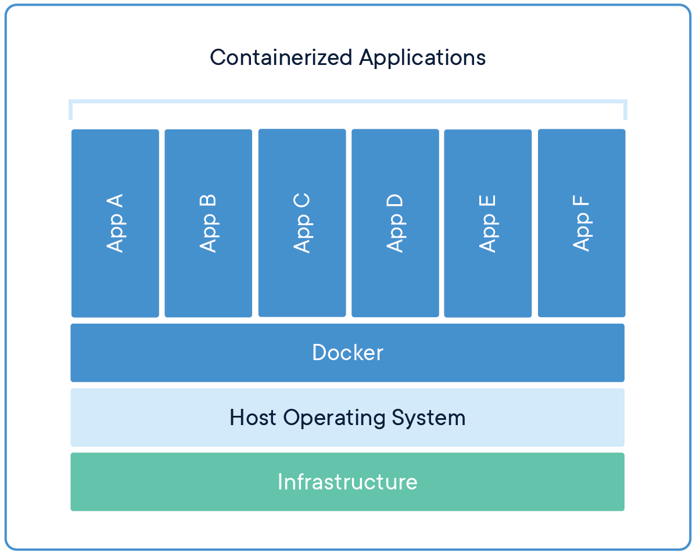
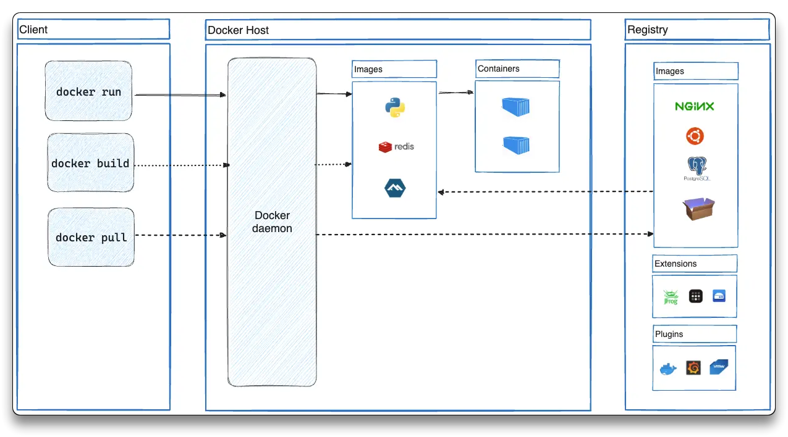
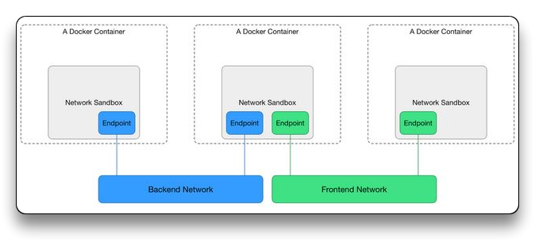
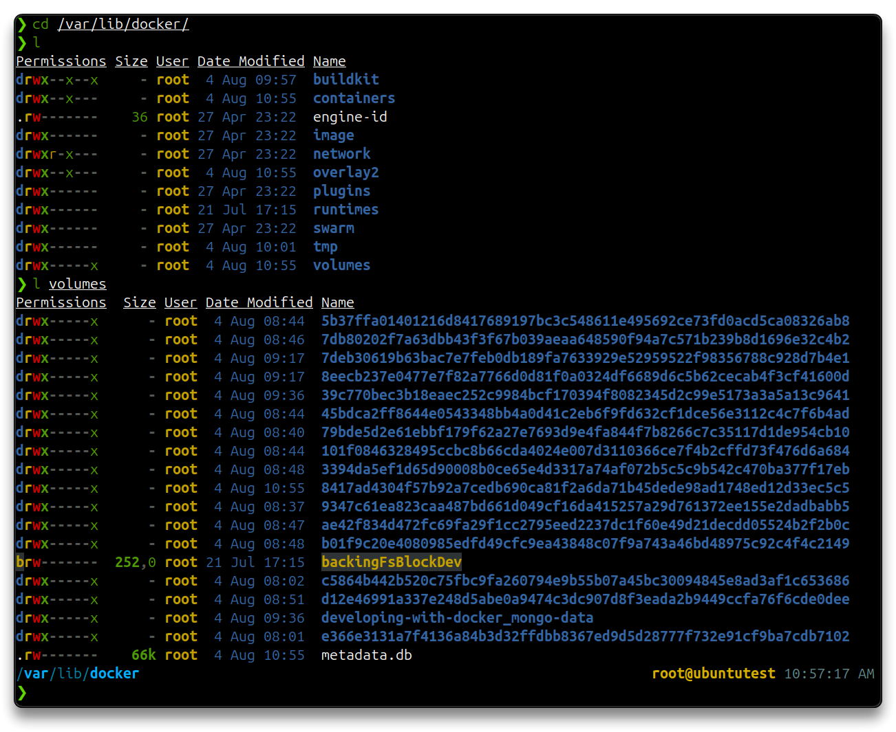
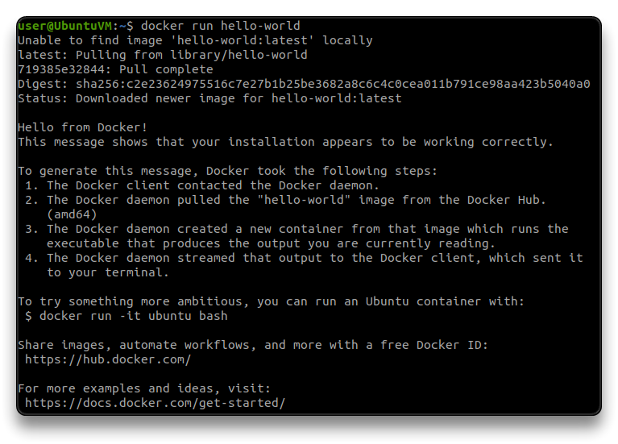
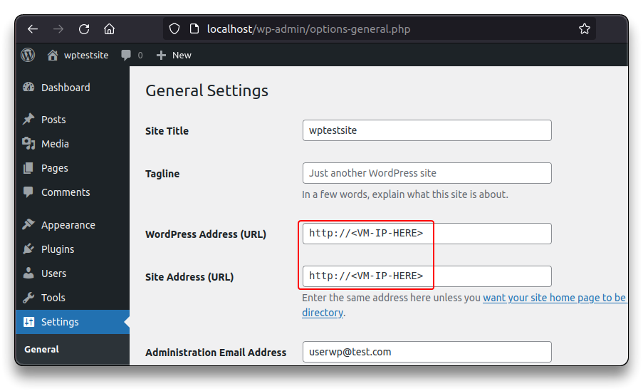

# [Docker](https://www.docker.com/)


---

## 🌐 Resources 🔗

> - [Docker Docs](https://docs.docker.com/get-started/overview/)
>   - [Building best practices - Docker Docs](https://docs.docker.com/build/building/best-practices/)
>   - [Intro Guide to Dockerfile Best Practices | Docker](https://www.docker.com/blog/intro-guide-to-dockerfile-best-practices/)
>   - [Docker Hub - Container Image Library](https://hub.docker.com/)
>
>  - [Docker Engine](https://docs.docker.com/engine/)
> - [Docker Network](https://docs.docker.com/network/)
>  - [Beginner's Guide to Docker Networking](https://k21academy.com/docker-kubernetes/docker-networking-different-types-of-networking-overview-for-beginners/)
>   - [The Container Network Model](https://github.com/moby/libnetwork/blob/master/docs/design.md)
> - [Docker Compose](https://docs.docker.com/compose/)
> - [Dockerfile](https://docs.docker.com/reference/dockerfile/)
>   - [Top 8 container registries - Octopus Deploy](https://octopus.com/blog/top-8-container-registries)
> - [Docker Volumes](https://docs.docker.com/storage/volumes/)
> - [Docker security - Penetration Testing Tools, ML and Linux Tutorials](https://reconshell.com/docker-security/)
> - [Docker Kubernetes Lab Handbook](https://docker-k8s-lab.readthedocs.io/en/latest/index.html)
> - [Intro The DevOps - Containers - NotHarshhaa Github](https://github.com/NotHarshhaa/into-the-devops/blob/master/topics/containers/README.md)
> - [container.training - Github](https://github.com/jpetazzo/container.training)
> - [TryHackMe - Intro to Docker](https://tryhackme.com/r/room/introtodockerk8pdqk)
> - [containerd](https://containerd.io/)
> - [cri-o](https://cri-o.io/)
> - [Docker The Hands-On Way - iximiuz labs](https://labs.iximiuz.com/roadmaps/docker)



---

## Docker Architecture

**Container** - a way to package application will all the necessary **dependencies** and **configuration**

- portable standardized artifact for efficient development and deployment
  - Devs & Ops work together to package the app in a container
  - No environment config needed on server (only Container Runtime)
- layers of images
  - Linux **base image**
  - other layers
  - **Application image**

**Container repositories**

- private
- public - [DockerHub](https://hub.docker.com/search?image_filter=official)

**Docker** - open source **containerization platform**

- package applications into containers
- there are other alternatives (but it made containers popular)
  - [The differences between Docker, containerd, CRI-O and runc - Tutorial Works](https://www.tutorialworks.com/difference-docker-containerd-runc-crio-oci/)

**Docker image** - the actual package file, **artifact**, consisting of layers

**Docker container** - started application, a running environment, virtual file system, port binding

- [What is a Container? | Docker](https://www.docker.com/resources/what-container/)

**Virtual machines** - virtualize the OS Kernel and the Application layer - full copy of the OS, abstraction of physical hardware



**Containers** - multiple containers share the OS Kernel - abstraction of the app layer



### [Docker Engine](https://docs.docker.com/engine/)

Docker Engine acts as a client-server application with:

- Server - `dockerd`, managing images & containers
  - Container Runtime
  - Volumes
  - Network
  - build images
- API - interact with Docker Server
- CLI - `docker` client



### [Docker Network](https://docs.docker.com/network/)

-	[Docker Networking Drivers - Details and Use Cases | Docker Blog](https://www.docker.com/blog/understanding-docker-networking-drivers-use-cases/)
-	[The Container Network Model](https://github.com/moby/libnetwork/blob/master/docs/design.md)

**Libnetwork** implements **Container Network Model** (CNM) which formalizes the steps required to provide networking for containers while providing an abstraction that can be used to support multiple network drivers.



```bash
docker network ls
    NETWORK ID     NAME      DRIVER    SCOPE
    964fd24a27a1   bridge    bridge    local
    446ad1bfc60e   host      host      local
    d1be7e105231   none      null      local
```

### [Docker Compose](https://docs.docker.com/compose/)

**Docker Compose** - define and run multiple docker containers applications

- `yaml` file to configure application's services
- easy maintenance and config

### [Dockerfile](https://docs.docker.com/reference/dockerfile/)

**Dockerfile** - text file with instructions to build Docker images

- each instruction results in an image layer
- used in CI/CD to build the docker image artifact, pushed to Docker (remote or local) repositories
- each image is based on another base image (`FROM <image>`)

`Dockerfile`

```bash
FROM <image>

# Comment
INSTRUCTION arguments

# e.g.
ENV SOME_ENV=value

# run commands inside the container
RUN mkdir -p /home/app

RUN ...

# copy files from host to container
COPY . /home/app

# entrypoint command
CMD ["command","arguments"]
```

### [Docker Repositories](https://docs.docker.com/docker-hub/repos/)

Public repositories

- [DockerHub](https://hub.docker.com/)

Public repositories (container registries)

- [Amazon ECR](https://aws.amazon.com/ecr/)
- [Harbor](https://goharbor.io/) (Open-source)
- [Microsoft ACR](https://azure.microsoft.com/en-au/products/container-registry/)
- [GitHub Container Registry](https://docs.github.com/en/packages/working-with-a-github-packages-registry/working-with-the-container-registry)
- [Google GCR](https://cloud.google.com/artifact-registry)
- [Red Hat Quay](https://www.redhat.com/en/technologies/cloud-computing/quay)
- [JFrog](https://jfrog.com/container-registry/)

Image naming in Docker - `registryDomain/imageName:tag`

```bash
# e.g. DockerHub
docker pull docker.io/library/ubuntu # default
# same as
docker pull ubuntu

# e.g. Push image to private my-repo
# Login to private my-repo
docker tag <my-repo/my-app:version>
docker push <my-repo/my-app:version>
```

### [Docker Volumes](https://docs.docker.com/storage/volumes/)

**Volumes** - persist container generated and used data, by mounting a folder from the physical host file system into the Docker virtual file system  

- databases
- stateful applications
- data automatically replicated
- Host, Anonymous, Named volumes

Host Path - `/var/lib/docker/volumes`



---

## [Docker Engine Install - Ubuntu Linux](https://docs.docker.com/engine/install/ubuntu/)

```bash
# Install Docker Engine via APT repository

for pkg in docker.io docker-doc docker-compose docker-compose-v2 podman-docker containerd runc; do sudo apt-get remove $pkg; done

sudo apt update -y && sudo apt install -y ca-certificates curl gnupg

sudo sh -c '
    curl -fsSL https://download.docker.com/linux/ubuntu/gpg | sudo gpg --dearmor -o /usr/share/keyrings/docker.gpg
    sudo chmod a+r /usr/share/keyrings/docker.gpg

    echo "deb [arch="$(dpkg --print-architecture)" signed-by=/usr/share/keyrings/docker.gpg] https://download.docker.com/linux/ubuntu "$(. /etc/os-release && echo "$VERSION_CODENAME")" stable" | sudo tee /etc/apt/sources.list.d/docker.list

    sudo apt update && sudo apt install -y docker-ce docker-ce-cli containerd.io docker-buildx-plugin docker-compose-plugin
'

sudo systemctl enable docker --now
sudo gpasswd -a "${USER}" docker

# On Debian and Ubuntu, the Docker service starts on boot by default, if not run
sudo systemctl enable docker.service
sudo systemctl enable containerd.service

# Reboot and Test
reboot
docker run hello-world
```



---

## Commands

```bash
docker pull <image>

# e.g.
docker pull postgres
docker pull ubuntu
docker pull alpine
docker pull redis
# without tag, the latest version is downloaded

docker run <image>
# detached mode
docker run -d <image> 

# use containers
docker start <container_id>
docker stop <container_id>

docker images
docker ps
# list running and exited containers
docker ps -a

# e.g. with image:tag
docker run redis:4.0

# Map a free port on HOST machine
docker run -p6000:6379 -d redis
docker run -p6001:6379 -d redis:4.0

# fetch logs
docker logs <container_id>
docker logs <container_id> -f
docker logs <container_name>

# name a container
docker run -p6000:6379 -d --name redis-latest redis

# new bash session in the container
docker exec -it <container_id> /bin/bash
docker exec -it <container_id> /bin/sh
```

```bash
docker network ls

# e.g.
docker network create test-network
```

```bash
docker compose -f docker-compose.yaml up
docker compose -f docker-compose.yaml down
```

```bash
# Build Dockerfile
docker build -t my-app:1.0 .

# Remove containers and images
docker rm <container_id>
docker rmi <image_id>
```

```bash
# Push to container registry

docker login
- reponame
- username
- password

docker tag <repo-name>:<image-version>
docker push <tagged-image>

docker pull <repo-name>:<image-version>
# registryDomain/imageName:tag
```

```bash
# Named Volumes
docker run -v name:/var/lib/mysql/data

# Host Volumes
docker run -v /home/mount/data:/var/lib/mysql/data

# Anonymous Volumes
docker run -v /var/lib/mysql/data
```

---

## Labs

- [Developing with Docker - TechWorld with Nana](https://gitlab.com/nanuchi/developing-with-docker)

```bash
git clone https://gitlab.com/nanuchi/developing-with-docker.git
```

### Ubuntu Docker instance

```bash
docker run -it ubuntu bash
```

### Wordpress Docker instance

> 🔗 Thanks to [AppSecExplained](https://gist.github.com/AppSecExplained/8bbf5366c6279ffc44beec16e6c39855) for the `yml` file.

```bash
sudo mkdir /opt/wordpress
sudo nano /opt/wordpress/docker-compose.yml
```

```bash
version: "3"
services:
  database:
    image: mysql
    restart: always
    environment:
      MYSQL_ROOT_PASSWORD: wppassword
      MYSQL_DATABASE: wpdb
      MYSQL_USER: wpuser
      MYSQL_PASSWORD: wppassword
    volumes:
      - mysql:/var/lib/mysql

  wordpress:
    depends_on:
      - database
    image: wordpress:latest
    restart: always
    ports:
      - "80:80"
    environment:
      WORDPRESS_DB_HOST: database:3306
      WORDPRESS_DB_USER: wpuser
      WORDPRESS_DB_PASSWORD: wppassword
      WORDPRESS_DB_NAME: wpdb
    volumes:
      ["./:/var/www/html"]
volumes:
  mysql: {}
```

```bash
cd /opt/wordpress
docker compose up
```

- Open the Wordpress site

`http://localhost/wp-admin/`

- Fix `localhost` with the VM's `IP` address in the Wordpress General Settings.



---

