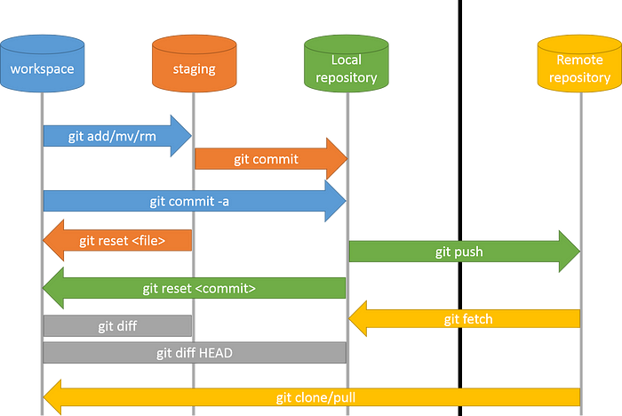

# [Git](https://git-scm.com/)


---

## 🌐 Resources 🔗

> - [GIT Docs](https://git-scm.com/doc)
> - [Visual Git Cheat Sheet](https://ndpsoftware.com/git-cheatsheet.html)
> - [GitHub Training](https://githubtraining.github.io/training-manual/#/01_getting_ready_for_class)
> - [Conventional Commits](https://www.conventionalcommits.org/)
> - [GIT Archive - DEVGuide](https://www.devguide.at/en/kategorie/git/)

---

## GitHub Git Cheat Sheet

> - Notes taken from ➡️ [GitHub Git Cheat Sheet](https://training.github.com/downloads/github-git-cheat-sheet/)

### Install

GitHub Desktop

[desktop.github.com](https://desktop.github.com/)

Git for All Platforms

[git-scm.com](https://git-scm.com/)

### Configure tooling

Configure user information for all local repositories

```
git config --global user.name "[name]"
```

Sets the name you want attached to your commit transactions

```
git config --global user.email "[email address]"
```

Sets the email you want attached to your commit transactions

```
git config --global color.ui auto
```

Enables helpful colorization of command line output

### Branches

Branches are an important part of working with Git. Any commits you make will be made on the branch you’re currently “checked out” to. Use `git status` to see which branch that is.

```
git branch [branch-name]
```

Creates a new branch

```
git switch -c [branch-name]
```

Switches to the specified branch and updates the working directory

```
git merge [branch]
```

Combines the specified branch’s history into the current branch. This is usually done in pull requests, but is an important Git operation.

```
git branch -d [branch-name]
```

Deletes the specified branch

### Create repositories

A new repository can either be created locally, or an existing repository can be cloned. When a repository was initialized locally, you have to push it to GitHub afterwards.

```
git init
```

The git init command turns an existing directory into a new Git repository inside the folder you are running this command. After using the `git init` command, link the local repository to an empty GitHub repository using the following command:

```
git remote add origin [url]
```

Specifies the remote repository for your local repository. The url points to a repository on GitHub.

```
git clone [url]
```

Clone (download) a repository that already exists on GitHub, including all of the files, branches, and commits

### The .gitignore file

Sometimes it may be a good idea to exclude files from being tracked with Git. This is typically done in a special file named `.gitignore`. You can find helpful templates for `.gitignore` files at [github.com/github/gitignore](https://github.com/github/gitignore).

### Synchronize changes

Synchronize your local repository with the remote repository on GitHub.com

```
git fetch
```

Downloads all history from the remote tracking branches

```
git merge
```

Combines remote tracking branches into current local branch

```
git push
```

Uploads all local branch commits to GitHub

```
git pull
```

Updates your current local working branch with all new commits from the corresponding remote branch on GitHub. `git pull` is a combination of `git fetch` and `git merge`

### Make changes

Browse and inspect the evolution of project files

```
git log
```

Lists version history for the current branch

```
git log --follow [file]
```

Lists version history for a file, beyond renames (works only for a single file)

```
git diff [first-branch]...[second-branch]
```

Shows content differences between two branches

```
git show [commit]
```

Outputs metadata and content changes of the specified commit

```
git add [file]
```

Snapshots the file in preparation for versioning

```
git commit -m "[descriptive message]"
```

Records file snapshots permanently in version history

### Redo commits

Erase mistakes and craft replacement history

```
git reset [commit]
```

Undoes all commits after `[commit]`, preserving changes locally

```
git reset --hard [commit]
```

Discards all history and changes back to the specified commit

> CAUTION! Changing history can have nasty side effects. If you need to change commits that exist on GitHub (the remote), proceed with caution. If you need help, reach out at [github.community](https://github.community/) or contact support.

### Glossary

- **git**: an open source, distributed version-control system
- **GitHub**: a platform for hosting and collaborating on Git repositories
- **commit**: a Git object, a snapshot of your entire repository compressed into a SHA
- **branch**: a lightweight movable pointer to a commit
- **clone**: a local version of a repository, including all commits and branches
- **remote**: a common repository on GitHub that all team members use to exchange their changes
- **fork**: a copy of a repository on GitHub owned by a different user
- **pull request**: a place to compare and discuss the differences introduced on a branch with reviews, comments, integrated tests, and more
- **HEAD**: representing your current working directory, the HEAD pointer can be moved to different branches, tags, or commits when using `git switch`

---

## Version Control

> [GIT](https://git-scm.com/)

**Version control** - practice of tracking and managing changes to software code, allowing multiple people to simultaneously work on a single project

- keeps a history of changes, everything is tracked
- commits, labeled with a message, can be reverted

**Remote Git repository** - code is hosted centrally on the internet (Gitlab, Github, etc)

**Local Git repository** - the user has an entire copy of the code locally

- Code is **pulled** (fetched) from remote repo and **pushed** to it.

**Git client** - command line or GUI tool to execute `git` commands

**History** - of code changes `git log`

**Staging** - where working changes are saved (to commit or not)




---

## Remote Git repository

> **Online**
>
> - [GitHub](https://github.com/)
> - [GitLab](https://gitlab.com/)
>
> **Self hosted**
>
> - Gitlab
> - Gitea
> - [Gogs](https://gogs.io/)

There are **private** and **public** repositories.

- Create a GitLab/GitHub user and a private project
- Install [git](https://git-scm.com/downloads) client.

```bash
# Debian/Ubuntu Linux
sudo apt update && sudo apt install git-all
```

```bash
mkdir -p ~/repo/gitlab
mkdir -p ~/repo/github
```

- Connect the `git` client with GitHub (I'm using it for the training)

[Create an SSH key pair](https://docs.github.com/en/authentication/connecting-to-github-with-ssh/generating-a-new-ssh-key-and-adding-it-to-the-ssh-agent?platform=linux) and add the public SSH key to GitHub

```bash
git config --global user.email "YOUR_EMAIL@gmail.com"
git config --global user.name"YOUR_USERNAME"

ssh-keygen -t ed25519 -C "alexideac@gmail.com"
eval "$(ssh-agent -s)"
ssh-add ~/.ssh/id_ed25519
xclip -selection clipboard < ~/.ssh/id_ed25519.pub
ssh-ed25519 AAAAC3NzaC1lZDI1NTE5AAAAIFrsf8B4WiUx/7WkcLURqiuEec5g4Kkw72acsLzpU5sJ alexideac@gmail.com
# Add a new key on github.com and paste the one copied with xclip.
# Test it:
ssh -T git@github.com
```

Clone the remote repository via SSH to the local machine

```bash
git clone git@github.com:syselement/devops-training.git
```

- The same can be done for GitLab too

### Branches

A `main` branch (also called `master`) is created by default with a new initialized repository.

Other temporary branches can be created and worked on, e.g. for a feature or a bugfix, without touching the main branch.

A branch is based on the `main` branch and can be merged back to the main branch.

- Try to create a branch in the UI

`main` - state ready and stable for production, tested code

`develop` - for features and bugfixes during sprint - at the end of the sprint and testing `develop` is merged into `main`

- The branches can be left or deleted (better to clean them)
- Create a new branch when needed

`HEAD` =  latest commit in the branch

---

## Git commands

```bash
cd ~/repo/github/devops-training
```

```bash
git status
```

- Move the changes of a file from "working directory" to the "**staging** area"

```bash
# Stage all files
git add .
```

- Proceed with the **commit** by saving the changes in the local repository

```bash
# Commit the staged files
git commit -m "Edit readme file"
```

- Show local **history**
  - history of commits

```bash
git log

# Go back to a specific project version, in a "detached HEAD state", for testing and bug reproducing
git checkout <commit-HASH>
```

- Publish the local commits to the remote Git repo

```bash
git push
```

- Create an empty Git repository or reinitialize a local existing one (it creates a `.git` directory inside the project directory). Push it online, after creating a remote empty repository - e.g. `test-repo`

```bash
git init
git remote add origin git@github.com:syselement/test-repo.git
git add .
git commit -m "Initial commit"
git push --set-upstream origin master
```

- Check branches

```bash
git branch

# After a new branch is created via GUI
git pull

# Switch branches
git checkout bugfix/md-typos
```

```bash
# Create a new branch via CLI
git checkout main
git checkout -b feature/test-branch
git add .
git commit
git status
git push
git push --set-upstream origin feat/test-branch
```

- Create a **Pull request** (merge request) from the GUI - a request to merge one branch into another. A reviewer see the changes and approve or decline the PR (Github **Rulesets**, **Actions** (for CI) can be set).

```bash
# Delete a local branch
git pull
git branch -d <branch-to-delete>
```

- Avoid a merge of the local and modified remote branch, by first pulling the changes from remote branch and stack the local changes on top of them

```bash
git pull -r
```

- When having conflict, resolve them using a UI editor, like VSCode.
- `.gitignore` - exclude folders or files from git to be tracked by specifying them in the `.gitignore` file in the repo root directory.
  - exclude build directories, only local necessary files/directories/dependencies

```bash
# Remove ignored files from remote repository
git rm -r --cached <directory>

# The files will stay in the local repo
```

- **Stash** - save work-in-progress or hide local changes. Happens when changing branches for example.

```bash
git stash
# Saves the changes "for later"

# When done, get the changes back
git stash pop
```

- Undoing and changing commits

```bash
# Remove the entire commit (when locally) and discard the changes
git log
git reset --hard HEAD~1 # last commit
git status

# Revert the commit but keep the local changes
git reset --soft HEAD~1

# Update the last commit
git commin --ammend

# When already pushed online, revert/undo/remove the commit in the remote repository
git reset --hard HEAD~1
# or
git reset <commit-HASH>
git push --force # DO NOT DO THIS IN A TEAM WORKING BRANCH
```

- Revert a commit in the `main` / `dev` team working branches

```bash
# Create a new commit to revert the old commit's changes 
git log
git revert <commit-HASH>
```

- **Merging** from other branches when the working local branch is diverting too much from the main/dev branch

```bash
# Merge main branch into bugfix/md-typos
git checkout main
git pull
git checkout bugfix/md-typos
git merge main
git push
```

---

## GIT for DevOps

Configuration file should be tracked, versioned and securely stored.

Use cases:

- **Infrastructure as Code**

  - Kubernetes, Terraform, Ansible configuration files

- **Automation scripts**

  - Bash/Python scripts files, written to create and provision infrastructure

- **CI/CD pipelines**

  - checkout code, test and build application
  - setup integration with build automation tools and app git repository
  - check git changes, commits hash, etc


---

## Best practices

- Push and pull often from remote repo (**Continuous Integration**)
- Don’t `git push` straight to master/main branch
- Use `--force` push carefully
- Create a separate branch for each feature or bugfix and name the branch with prefix “feature/xx” and “bugfix/xxx” respectively
- Doing code reviews via Merge Requests
- Use `.gitignore` file to ignore e.g. editor specific files, build folders

**Commits**

- use descriptive and meaningful commit messages - check [Conventional Commits](https://www.conventionalcommits.org/)
- commit in relatively small chunks and only related work
- adequately configure the commit authorship (name and email address) with `git config`

**Avoiding very large deviations** between local and remote repository

- keep your feature-bugfix branch up-to-date with remote `master`/`main` and/or `develop` branch
- branches shouldn’t be open for too long
- `master`/`main` branch should be merged into your feature/bugfix branch often

---

