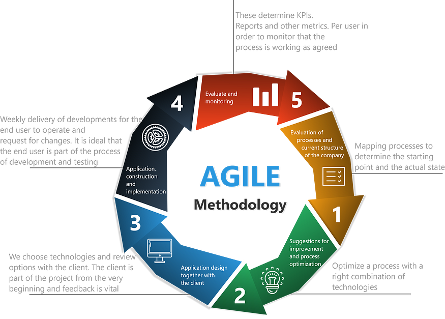

# Introduction to DevOps

> 🔗 Jump to other notes here
>
> - [DevOps Resources](README.md)
> - [Ansible](ansible.md)
> - [Docker](docker.md)
> - [Git](git.md)
> - [Kubernetes](kubernetes.md)
> - [Terraform](terraform.md)
> - [Vim](vim.md)

---

**DevOps Pipeline**

Test ➡️ Build ➡️ Deploy ➡️ Configure ➡️ Monitor

DevOps engineers have some know-how from both *DEV* and *OPERATIONs* teams, plus additional DevOps specific technical skills, the core one being building **CI/CD** (Continuous Integration / Continuous Delivery-Deployment) **pipelines**.

## Software Development

Methodologies of software development:

- Waterfall
- [Agile](https://asana.com/resources/agile-methodology) (newer)
  - several project phases
  - each feature is tested, deployed
  - fast development, testing and deployment cycles
  - Continuous Integration, Continuous Delivery
  - it supports the need for DevOps tasks (best practices, automation tools ...)

The DevOps engineer needs to assist developers in building the application. This involves configuring automation tools (**CI/CD Pipelines**) to handle tests, build processes, and packaging the applications into Docker images. Finally, the DevOps engineer ensures the app runs smoothly on deployment servers.

**Artifacts** are apps built into a single file (`jar`, `war`, `zip`, `tar`, etc). An **artifact repository** can store many different artifact formats by using a manager for managing them all.

- [Nexus](https://help.sonatype.com/en/sonatype-nexus-repository.html) - private/internal usage
  - multi-format support
  - LDAP integration, user token support
  - REST API integration
  - Backup, restore
  - Tagging
  - Cleanup policies
  - Search functionality
- [Maven Repository](https://mvnrepository.com/) - public (Java)
- [npm](https://www.npmjs.com/) - public (Javascript)

### Software Versioning

> - [Semantic Versioning](https://semver.org/)
> - [jubianchi.github.io/semver-check/#/](https://jubianchi.github.io/semver-check/#/)
> - [Semver cheatsheet - devhints.io](https://devhints.io/semver)

**Major Version**

- Indicates big changes
- Usually involves breaking changes
- NOT backward-compatible.
- Incompatible API changes are made

**Minor Version**

- Introduces new but backward-compatible changes
- May include new API features
- Does not break existing functionality

**Patch Version**

- Contains minor changes and bug fixes
- Does not alter the API

---

## IaaS

**Infrastructure as a Service** (IaaS) offers compute, storage and networking on-demand from the cloud providers.

**Cloud computing** refers to the **delivery of computing services** (servers, storage, databases, networking, software, and more) over the internet, allowing users to access and utilize these resources on-demand.

---

## 🪛 Linux Tools

> I'm using [Ubuntu Desktop LTS](https://ubuntu.com/download/desktop) as Linux distro and `zsh` as default SHELL
>
> The install commands of the following tools can be found on my notes here - [Ubuntu VM - DevOps Tools](../operating-systems/linux/distros/ubuntu-vm.md#devops-tools)

- [Linux Basics](https://gitlab.com/devops-bootcamp3/linux) from the DevOps Bootcamp by Nana
- Package Manager - `apt` for Debian/Ubuntu-based Linux distros
- [git](https://git-scm.com/book/en/v2/Getting-Started-Installing-Git) (for Github, GitLab, etc)
- [java - OpenJDK](https://itsfoss.com/install-java-ubuntu/)
- [Node.js - npm](https://www.digitalocean.com/community/tutorials/how-to-install-node-js-on-ubuntu-20-04#option-1-installing-node-js-with-apt-from-the-default-repositories) 
- [VScode](https://code.visualstudio.com/docs/setup/linux#_debian-and-ubuntu-based-distributions)
- [PyCharm](https://www.jetbrains.com/help/pycharm/installation-guide.html#standalone)
- [Maven](https://maven.apache.org/install.html) (if necessary)
- [Gradle](https://gradle.org/install/) (if necessary)
- [Docker](https://docs.docker.com/engine/install/ubuntu/)
- [k9s](https://k9scli.io/topics/install/) / [kubectl](https://kubernetes.io/docs/tasks/tools/install-kubectl-linux/#install-using-native-package-management)
- [minikube](https://minikube.sigs.k8s.io/docs/start/)
- [Helm](https://helm.sh/docs/intro/install/)
- [Terraform](https://developer.hashicorp.com/terraform/tutorials/aws-get-started/install-cli)
- [Ansible](https://docs.ansible.com/ansible/latest/installation_guide/intro_installation.html#installing-ansible-on-specific-operating-systems)
- [Azure Cli](https://learn.microsoft.com/en-us/cli/azure/install-azure-cli)
- [gcloud CLI](https://cloud.google.com/sdk/docs/install#deb) + [GCP gke-gcloud-auth-plugin](https://cloud.google.com/blog/products/containers-kubernetes/kubectl-auth-changes-in-gke)

---

## CI/CD Tools

> [CI/CD](https://about.gitlab.com/topics/ci-cd/) - **Continuous Integration** / **Continuous Delivery**, pipeline
>
> [20 Best CI/CD Tools for 2024 - The CTO Club](https://thectoclub.com/tools/best-ci-cd-tools/)
>
> 📌 [List of Continuous Integration services | awesome-ci](https://ligurio.github.io/awesome-ci/)

- [Github Actions](https://github.com/features/actions)
- [Gitlab CI/CD](https://docs.gitlab.com/ee/ci/)
- [Jenkins](https://www.jenkins.io/)
- [Travis CI](https://www.travis-ci.com/)
- [CircleCI](https://circleci.com/)
- [SemaphoreCI](https://semaphoreci.com/)
- [AppVeyor](https://www.appveyor.com/)
- [Bamboo (Altassian)](https://www.atlassian.com/software/bamboo)
- [Argo CD](https://argoproj.github.io/cd/)
- [Harness](https://www.harness.io/)
- [Flux](https://fluxcd.io/)
- [Agola](https://github.com/agola-io/agola)
- [Buildkite](https://buildkite.com/)
- [GoCD](https://github.com/gocd/gocd)
- [Octopus Deploy](https://octopus.com/)
- [TeamCity](https://www.jetbrains.com/teamcity/)

---

## Containerization

Containers ➡️ Image for every server, separate instances

- [Docker](https://www.docker.com/) - `Dockerfile`

---

## Orchestration

- [Kubernetes](https://kubernetes.io/) (**K8s**) - *automatic deployment, scaling, and management of containerized applications*

---

## Infrastructure Provisioning

- [Terraform](https://www.terraform.io/) - *infrastructure automation to provision and manage resources in any cloud or data center*
  - Infrastructure as Code (**IaC**)

- [Ansible](https://www.ansible.com/) - *automates provisioning, configuration management, application deployment, orchestration, and many other IT processes* - more for automation post configuration

---

## Monitoring

- [Prometheus](https://prometheus.io/) - *systems and service monitoring system*
- [Grafana](https://grafana.com/) - visualize data

---

