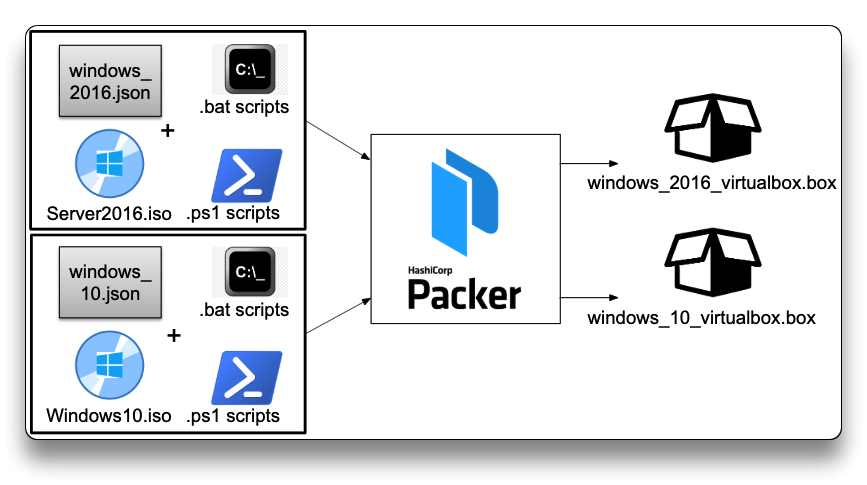
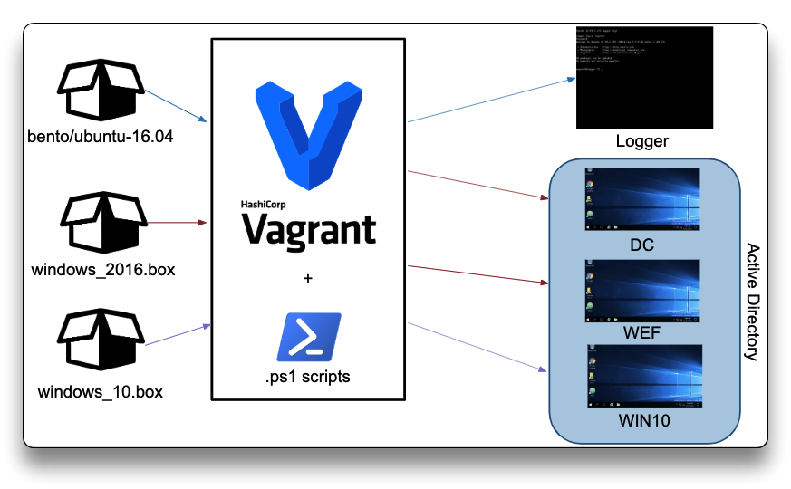
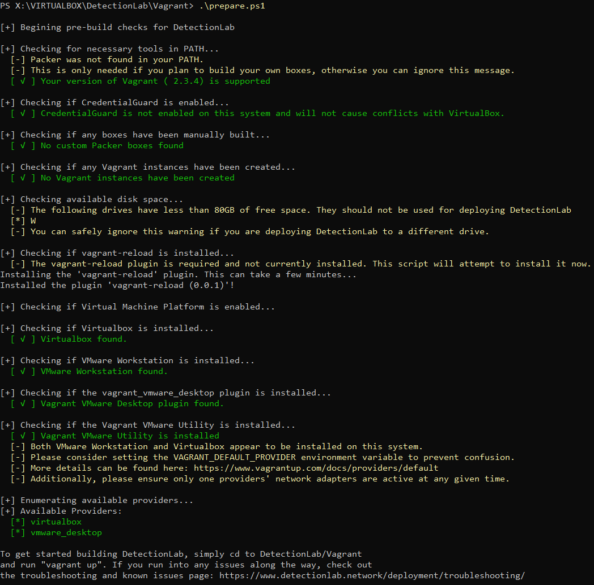
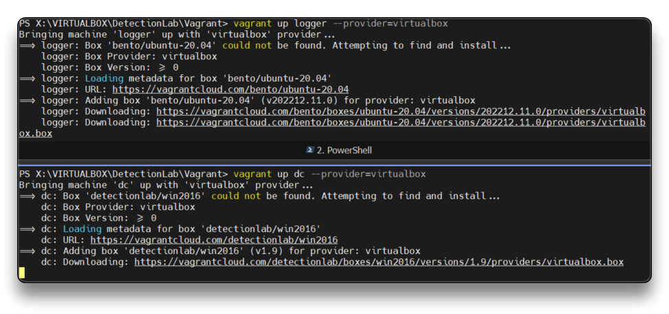
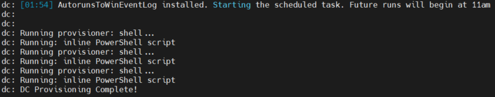
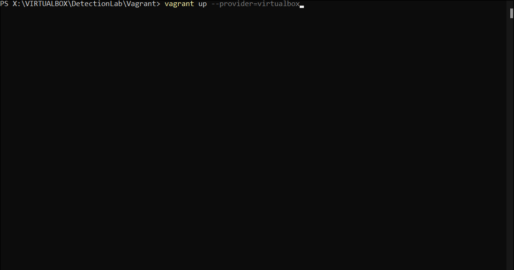
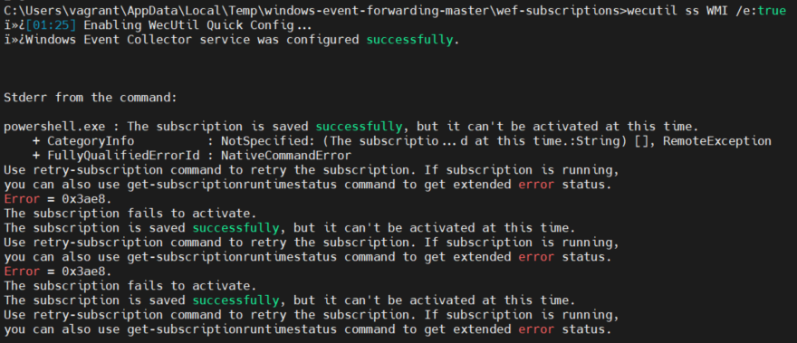
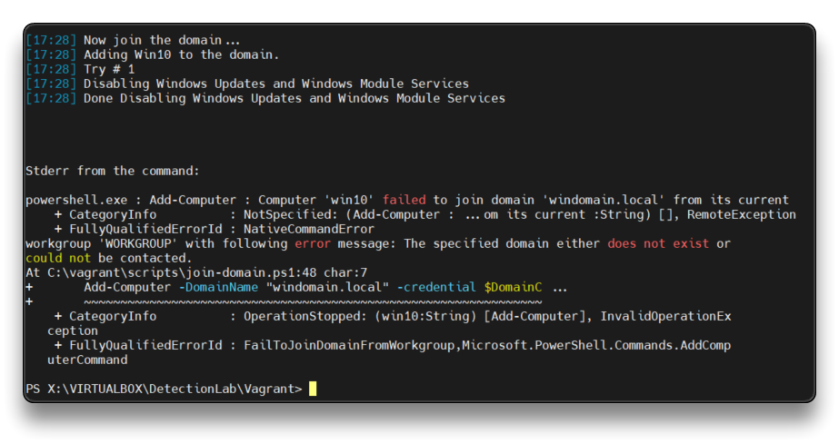
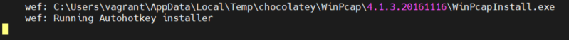
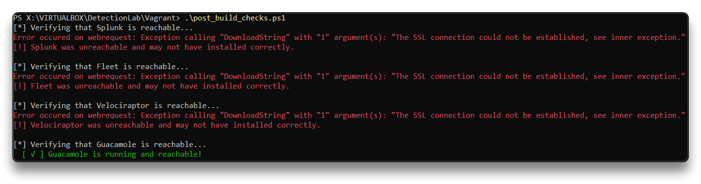

# Detection Lab

## DetectionLab Intro

_DetectionLab is a repository containing a variety of `Packer`, `Vagrant`, `Powershell`, `Ansible`, and `Terraform` scripts that allow you to automate the process of bringing an ActiveDirectory environment online complete with logging and security tooling using a variety of different platforms. **DetectionLab was built with defenders in mind**._

Read more about DetectionLab on Medium [here](https://medium.com/@clong/introducing-detection-lab-61db34bed6ae).

> ❗`As of 2023-01-01, DetectionLab is no longer being actively maintained` - [Sunsetting DetectionLab](https://clo.ng/blog/sunsetting-detectionlab/)
>
> 📌 Credit goes to [Chris Long](https://github.com/clong). (Some of the quoted data inside this document is taken from the official [DetectionLab.network](https://detectionlab.network) website.)
>
> * [Official site - DetectionLab.network](https://detectionlab.network/introduction/)
> * [Github - detectionlab](https://github.com/clong/detectionlab)
> * DetectionLab can currently be deployed to the following platforms:
>   * Virtualbox (Windows, MacOS, Linux)
>   * VMware Workstation/Fusion (Windows, MacOS, Linux)
>   * HyperV
>   * ESXi
>   * AWS
>   * Azure
>   * LibVirt (Not officially supported)
>   * Proxmox (Not officially supported)






### Primary Lab Features

> * **Microsoft Advanced Threat Analytics** is installed on the `WEF` machine, with the lightweight ATA gateway installed on the `DC`
> * A **Splunk** forwarder is pre-installed and all indexes are pre-created. Technology add-ons are also preconfigured.
> * A custom Windows auditing configuration is set via GPO to include command line process auditing and additional OS-level logging
> * [Palantir's Windows Event Forwarding](http://github.com/palantir/windows-event-forwarding) subscriptions and custom channels are implemented
> * Powershell transcript logging is enabled. All logs are saved to `\\wef\pslogs`
> * osquery comes installed on each host and is pre-configured to connect to a [Fleet](https://fleetdm.com/) server via TLS. Fleet is preconfigured with the configuration from [Palantir's osquery Configuration](https://github.com/palantir/osquery-configuration)
> * Sysmon is installed and configured using [Olaf Hartong's open-sourced Sysmon configuration](https://github.com/olafhartong/sysmon-modular)
> * All autostart items are logged to Windows Event Logs via [AutorunsToWinEventLog](https://github.com/palantir/windows-event-forwarding/tree/master/AutorunsToWinEventLog)
> * Zeek and Suricata are pre-configured to monitor and alert on network traffic
> * Apache Guacamole is installed to easily access all hosts from your local browser

### Acknowledgements

> * [Microsoft Advanced Threat Analytics](https://www.microsoft.com/en-us/cloud-platform/advanced-threat-analytics)
> * [Splunk](https://www.splunk.com/)
> * [osquery](https://osquery.io/)
> * [Fleet](https://github.com/fleetdm/fleet)
> * [Windows Event Forwarding for Network Defense](https://medium.com/@palantir/windows-event-forwarding-for-network-defense-cb208d5ff86f)
> * [palantir/windows-event-forwarding](http://github.com/palantir/windows-event-forwarding)
> * [osquery Across the Enterprise](https://medium.com/@palantir/osquery-across-the-enterprise-3c3c9d13ec55)
> * [palantir/osquery-configuration](https://github.com/palantir/osquery-configuration)
> * [Configure Event Log Forwarding in Windows Server 2012 R2](https://www.petri.com/configure-event-log-forwarding-windows-server-2012-r2)
> * [Monitoring what matters — Windows Event Forwarding for everyone](https://blogs.technet.microsoft.com/jepayne/2015/11/23/monitoring-what-matters-windows-event-forwarding-for-everyone-even-if-you-already-have-a-siem/)
> * [Use Windows Event Forwarding to help with intrusion detection](https://technet.microsoft.com/en-us/itpro/windows/keep-secure/use-windows-event-forwarding-to-assist-in-instrusion-detection)
> * [The Windows Event Forwarding Survival Guide](https://hackernoon.com/the-windows-event-forwarding-survival-guide-2010db7a68c4)
> * [PowerShell ♥ the Blue Team](https://blogs.msdn.microsoft.com/powershell/2015/06/09/powershell-the-blue-team/)
> * [Autoruns](https://www.microsoftpressstore.com/articles/article.aspx?p=2762082)
> * [TA-microsoft-sysmon](https://github.com/splunk/TA-microsoft-sysmon)
> * [SwiftOnSecurity - Sysmon Config](https://github.com/SwiftOnSecurity/sysmon-config)
> * [ThreatHunting](https://github.com/olafhartong/ThreatHunting)
> * [sysmon-modular](https://github.com/olafhartong/sysmon-modular)
> * [Atomic Red Team](https://github.com/redcanaryco/atomic-red-team)
> * [Hunting for Beacons](http://findingbad.blogspot.com/2020/05/hunting-for-beacons-part-2.html)
> * [Velociraptor](https://github.com/Velocidex/velociraptor)
> * [BadBlood](https://github.com/davidprowe/BadBlood)
> * [PurpleSharp](https://github.com/mvelazc0/PurpleSharp)
> * [EVTX-ATTACK-SAMPLES](https://github.com/sbousseaden/EVTX-ATTACK-SAMPLES)

### Lab Information and Credentials

> * **Domain Name:** windomain.local
> * **Admininstrator login:** 
>   * `vagrant`:`vagrant`
>
> * **Fleet login:** [https://192.168.56.105:8412](https://192.168.56.105:8412)
>   * `admin@detectionlab.network`:`Fl33tpassword!`
>
> * **Splunk login:** [https://192.168.56.105:8000](https://192.168.56.105:8000)
>   * `admin`:`changeme`
>   * *MS ATA login: [https://192.168.56.103](https://192.168.56.103) - `wef\vagrant`:`vagrant` \[**DEPRECATED**]*
>
> * **Guacamole login:** [http://192.168.56.105:8080/guacamole](http://192.168.56.105:8080/guacamole)
>   * `vagrant`:`vagrant`
>
> * **Velociraptor login:** [https://192.168.56.105:9999](https://192.168.56.105:9999)
>   * `admin`:`changeme`
>
>
> ### Lab Hosts
>
> * DC - Windows 2016 Domain Controller
>   * WEF Server Configuration GPO
>   * Powershell logging GPO
>   * Enhanced Windows Auditing policy GPO
>   * Sysmon
>   * Velociraptor
>   * osquery
>   * Splunk Universal Forwarder (Forwards Sysmon & osquery)
>   * Sysinternals Tools
>   * Microsft Advanced Threat Analytics Lightweight Gateway
> * WEF - Windows 2016 Server
>   * Microsoft Advanced Threat Analytics
>   * Windows Event Collector
>   * Windows Event Subscription Creation
>   * Powershell transcription logging share
>   * Sysmon
>   * Velociraptor
>   * osquery
>   * Splunk Universal Forwarder (Forwards WinEventLog & Powershell & Sysmon & osquery)
>   * Sysinternals tools
> * Win10 - Windows 10 Workstation
>   * Simulates employee workstation
>   * Sysmon
>   * Velociraptor
>   * osquery
>   * Splunk Universal Forwarder (Forwards Sysmon & osquery)
>   * Sysinternals Tools
> * Logger - Ubuntu 16.04
>   * Splunk Enterprise
>   * Fleet osquery Manager
>   * Zeek
>   * Suricata
>   * Guacamole
>   * Velociraptor server
>
> ### Splunk Indexes

| Index Name            | Description                                                                                                           |
| --------------------- | --------------------------------------------------------------------------------------------------------------------- |
| evtx\_attack\_samples | Samples from [https://github.com/sbousseaden/EVTX-ATTACK-SAMPLES](https://github.com/sbousseaden/EVTX-ATTACK-SAMPLES) |
| osquery               | osquery/Fleet result logs                                                                                             |
| osquery-status        | osquery/fleet INFO/WARN/ERROR logs                                                                                    |
| powershell            | Powershell transcription logs                                                                                         |
| suricata              | Suricata IDS logs                                                                                                     |
| sysmon                | Logs from the Sysmon service                                                                                          |
| threathunting         | Used for the ThreatHunting app                                                                                        |
| wineventlog           | Windows Event Logs                                                                                                    |
| zeek                  | Zeek network traffic logs                                                                                             |

> ### Installed Tools on Windows
>
> * Sysmon
> * Velociraptor Agent
> * osquery
> * AutorunsToWinEventLog
> * Process Monitor
> * Process Explorer
> * PsExec
> * TCPView
> * Notepad++
> * Google Chrome
> * WinRar
> * Mimikatz
> * Wireshark
> * Powersploit
> * Atomic Red Team
> * BadBlood
>
> ### Applied GPOs
>
> * [Custom Event Channel Permissions](https://rawgit.com/clong/DetectionLab/master/Vagrant/resources/GPO/reports/Custom%20Event%20Channel%20Permissions.htm)
> * [Default Domain Controllers Policy](https://rawgit.com/clong/DetectionLab/master/Vagrant/resources/GPO/reports/Default%20Domain%20Controllers%20Policy.htm)
> * [Default Domain Policy](https://rawgit.com/clong/DetectionLab/master/Vagrant/resources/GPO/reports/Default%20Domain%20Policy.htm)
> * [Domain Controllers Enhanced Auditing Policy](https://rawgit.com/clong/DetectionLab/master/Vagrant/resources/GPO/reports/Domain%20Controllers%20Enhanced%20Auditing%20Policy.htm)
> * [Powershell Logging](https://rawgit.com/clong/DetectionLab/master/Vagrant/resources/GPO/reports/Powershell%20Logging.htm)
> * [Servers Enhanced Auditing Policy](https://rawgit.com/clong/DetectionLab/master/Vagrant/resources/GPO/reports/Servers%20Enhanced%20Auditing%20Policy.htm)
> * [Windows Event Forwarding Server](https://rawgit.com/clong/DetectionLab/master/Vagrant/resources/GPO/reports/Windows%20Event%20Forwarding%20Server.htm)
> * [Workstations Enhanced Auditing Policy](https://rawgit.com/clong/DetectionLab/master/Vagrant/resources/GPO/reports/Workstations%20Enhanced%20Auditing%20Policy.htm)

### Prerequisites

> #### Virtualbox
>
> Deploy DetectionLab to your local machine as individual Virtualbox VMs.
>
> * Windows, Linux, and MacOS are all supported
> * 55GB+ of free disk space
> * 16GB+ of RAM highly recommended
> * Vagrant 2.2.9+
> * Packer 1.6.0+ (only required if building your own boxes)
> * Virtualbox 6.0+ (older versions may work but are not tested)
>
> #### VMware Fusion/Workstation
>
> Deploy DetectionLab to your local machine as individual VMware VMs.
>
> * Windows, Linux, and MacOS are all supported
> * VMware Fusion or Workstation (It must be registered, trials will not work)
> * The [VMware Desktop Vagrant Plugin](https://www.vagrantup.com/docs/providers/vmware/installation)
> * The [Vagrant VMware Utility](https://www.vagrantup.com/docs/vmware/vagrant-vmware-utility.html) must be installed
> * 55GB+ of free disk space
> * 16GB+ of RAM highly recommended
> * Vagrant 2.2.9+
> * Packer 1.6.0+ (only required if building your own boxes)
> * VMware Fusion 11+ or Workstation 15+ (older versions may work but are not tested)

### Basic Vagrant Usage

> It’s easiest to think of Vagrant as a command-line wrapper for interacting with Virtualbox and VMware.
>
> #### Setting a default provider
>
> If you happen to have both Virtualbox and VMware Workstation/Fusion installed, it may be helpful to set the [VAGRANT\_DEFAULT\_PROVIDER](https://www.vagrantup.com/docs/providers/default.html) environment variable to either **vmware\_desktop** or **virtualbox**.
>
> #### Basic Vagrant Usage
>
> **All commands must be run from the “DetectionLab/Vagrant” folder**
>
> * Bring up all Detection Lab hosts using Virtualbox: **`vagrant up --provider=virtualbox`**
> * Bring up all Detection Lab hosts using VMware: **`vagrant up ---provider=vmware_desktop`**
> * Bring up a specific host: **`vagrant up <hostname>`**
> * Restart a specific host: **`vagrant reload <hostname>`**
> * Restart a specific host and re-run the provision process: **`vagrant reload <hostname> --provision`**
> * Destroy a specific host: **`vagrant destroy <hostname>`**
> * Destroy the entire Detection Lab environment: **`vagrant destroy`** (Adding -f forces it without a prompt)
> * SSH into a host (only works with Logger): **`vagrant ssh logger`**
> * Run a WinRM command on a host (only works with DC, WEF, and WIN10): **`vagrant winrm --command hostname --shell powershell <hostname>`**
> * Check the status of each host: **`vagrant status`**
> * Suspend the lab environment: **`vagrant suspend`**
> * Resume the lab environment: **`vagrant resume`**
> * Shutdown each host: **`vagrant halt`**

### Troubleshooting & Known Issues

> Be sure to check the GitHub issues page for solved issues related to your problem: [https://github.com/clong/DetectionLab/issues](https://github.com/clong/DetectionLab/issues)
>
> Here are some strategies for resolving common problems:
>
> ***
>
> **Issue:** You run into an error while provisioning a host
>
> **Solution:** Each problem is different. Take a look at the error text and see if you can determine what the exact problem is based on the error message. Often times, running `vagrant reload <hostname> --provision` is enough to get things back on track. That command will simply restart the VM and start provisioning over again. If that doesn’t work, try destroying the host via `vagrant destroy <hostname>` and then re-creating it using `vagrant up <hostname>`. If you continue to run into the same error, search [DetectionLab issues](https://github.com/issues). Finally, if you can’t find a solution to your problem, please open a new issue!
>
> ***
>
> **Issue:** You get stuck and want to start fresh
>
> **Solution:** Navigate to **DetectionLab/Vagrant** and run `vagrant destroy -f` to force destroy all VMs. Afterwards, delete the `.vagrant` hidden folder inside of **DetectionLab/Vagrant** to ensure the VMs and their metadata have been properly removed. Optionally, delete and re-clone the entire DetectionLab git repo after those steps have been completed.
>
> ***
>
> **Issue:** I get an “ERR\_TOO\_MANY\_REDIRECTS” when trying to connect to the Exchange server over HTTPS
>
> **Workarounds:** This often happens when you try to connect to Exchange while the server is still initializing. Wait 5-10 minutes, then try again. If the issue persists, please file an issue on GitHub.
>
> ***
>
> **Issue:** Splunk says “Your Splunk license has expired or you have exceeded your license too many times”
>
> **Workarounds:**
>
> 1. Make some modifications to ingest less data
> 2. Sign up for a free Splunk dev license which gives you 10GB/day ingest: [https://dev.splunk.com/enterprise/dev\_license/](https://dev.splunk.com/enterprise/dev\_license/) and apply that license
> 3. Simply re-provision the logger host (no need to re-provision the windows hosts - they’ll automatically reconnect):
>    1. `vagrant destroy -f logger; vagrant up logger`
>
> ***
>
> **Issue:** Vagrant reports: `Message: HTTPClient::KeepAliveDisconnected:` while provisioning. **Workaround:** Run `$ vagrant reload <hostname> --provision`
>
> ***
>
> **Issue:** `Vagrant timed out while attempting to connect via WinRM` after Win10 host joins the domain. **Workaround** Documented in [#21](https://github.com/clong/detectionlab/issues/21). Just run `$ vagrant reload win10 --provision`
>
> ***
>
> **Issue:** Vagrant is unable to forward a port for you.
>
> **Workaround:** Documented in [#11](https://github.com/clong/detectionlab/issues/11). There are a few possibilities:
>
> 1. Try a `vagrant reload <hostname> --provision`. For whatever reason `vagrant up` doesn’t fix conflicts but reload does.
> 2. Check if something is legitimately occupying the port via `sudo lsof -n -iTCP:<port_number>`
> 3. Follow the instructions from this comment: [https://github.com/hashicorp/vagrant/issues/8130#issuecomment-272963103](https://github.com/hashicorp/vagrant/issues/8130#issuecomment-272963103)
>
> ***
>
> **Issue:** Your primary hard drive doesn’t have enough space for DetectionLab.
>
> **Workaround:** Documented in [#48](https://github.com/clong/detectionlab/issues/48). You can change the default location for Vagrant by using the [VAGRANT\_HOME](https://www.vagrantup.com/docs/other/environmental-variables.html#vagrant\_home) environment variable.
>
> ***
>
> **Issue:** You’re having problems running Virtualbox while Hyper-V or CredentialGuard are enabled
>
> **Workaround:** This is not a supported configuration. See [https://stackoverflow.com/questions/37955942/vagrant-up-vboxmanage-exe-error-vt-x-is-not-available-verr-vmx-no-vmx-code](https://stackoverflow.com/questions/37955942/vagrant-up-vboxmanage-exe-error-vt-x-is-not-available-verr-vmx-no-vmx-code) and [https://github.com/clong/DetectionLab/issues/433](https://github.com/clong/DetectionLab/issues/433)
>
> ***
>
> **Issue:** You see an error message like `VBoxManage: error: Unknown option: --clipboard`
>
> **Workaround:** This should be fixed in Virtualbox 6.1.4, but please see [this issue](https://github.com/clong/DetectionLab/issues/374#issuecomment-577920555) for details on how to fix this.

***

## DetectionLab Deployment

* Install [Virtualbox](https://www.virtualbox.org/wiki/Downloads) & VirtualBox Extension Pack (default Vagrant provider)
* Install [Vagrant](https://developer.hashicorp.com/vagrant/docs/installation) for Windows
* Create a dedicated folder for the lab and move into it
* Clone the DetectionLab repo into the dedicated folder

```powershell
git clone https://github.com/clong/DetectionLab.git
```

```powershell
Cloning into 'DetectionLab'...
remote: Enumerating objects: 6531, done.
remote: Counting objects: 100% (406/406), done.
remote: Compressing objects: 100% (169/169), done.
remote: Total 6531 (delta 226), reused 334 (delta 195), pack-reused 6125
Receiving objects: 100% (6531/6531), 194.62 MiB | 4.08 MiB/s, done.
Resolving deltas: 100% (3882/3882), done.
Updating files: 100% (412/412), done.
```

* Open `PowerShell` as Administrator and navigate to the **`DetectionLab\Vagrant`** folder
* Run **`.\prepare.ps1`** script to verify the system prerequisites



* Host can be brought up one at a time using this command (or proceed with the [Parallel Provisioning](lab\_DetectionLab.md#parallel-provisioning-hosts)):

```powershell
vagrant up --provider=virtualbox
```

> 1. Vagrant will bring up one host at a time, starting with `logger` and followed by `dc`, `wef` and `win10`.
> 2. Three boxes will be downloaded from Vagrant cloud:
>    * [bento/ubuntu20.04](https://app.vagrantup.com/bento/boxes/ubuntu-20.04)
>    * [detectionlab/win2016](https://app.vagrantup.com/detectionlab/boxes/win2016)
>    * [detectionlab/win10](https://app.vagrantup.com/detectionlab/boxes/win10)
> 3. Each box will go through provisioning, which configures the host and installs software.
> 4. If all goes well, this process should continue for 1-2 hours depending on your computer and network speed. The boxes are very large, but only need to be downloaded once.

### Parallel Provisioning Hosts

> To speed up the provisioning process, we can bring up some hosts in parallel. To do this, I recommend opening 4 separate terminal windows open to the `DetectionLab/Vagrant` directory.
>
> In terminal windows 1 and 2, you can run `vagrant up logger` and `vagrant up dc` at the same time. Before we can bring up `wef` and `win10`, we have to wait for the `dc` host to finish creating the domain.
>
> Once it has passed that step of the provisioning process, you can run `vagrant up wef` and `vagrant up win10` in terminal windows 3 and 4 at the same time.

* First bring up **`logger`** and **`dc`** inside two differents `PowerShell` terminals

```powershell
vagrant up logger --provider=virtualbox
```

```powershell
vagrant up dc --provider=virtualbox
```



* 🚩 Wait for the `dc` to finish provisiong



* Bring up **`wef`** and **`win10`**

```powershell
vagrant up wef --provider=virtualbox
```

```powershell
vagrant up win10 --provider=virtualbox
```


> * Once provisioning is finished, you can access the VMs through the GUI or SSH/RDP to them directly.
> * If you encounter an error or any issues, checkout the [troubleshooting section](lab\_DetectionLab.md#troubleshooting-and-known-issues).

* You can also **verify services** are accessible by running

```powershell
 .\post_build_checks.ps1
```

### Bring Down lab

```powershell
vagrant halt
```

```powershell
# Shutdown each host
==> win10: Attempting graceful shutdown of VM...
==> wef: Attempting graceful shutdown of VM...
==> dc: Attempting graceful shutdown of VM...
==> logger: Attempting graceful shutdown of VM...
```

### Bring Up lab

```powershell
vagrant up --provider=virtualbox
```



### Errors

* WEF + WIN10 failed to join domain





* I think this is because DC provisioning freezed on `Running Autohotkey installer`.



> * **Solution**:
>
> ```powershell
> vagrant reload dc --provision
> # Wait for the message:
> 	dc: DC Provisioning Complete!
> ```
>
> ```powershell
> vagrant halt wef
> vagrant destroy wef
> vagrant up wef --provider=virtualbox
> ```
>
> ```powershell
> vagrant halt win10
> vagrant destroy win10
> vagrant up win10 --provider=virtualbox
> ```
>
> * _`win10` & `wef` both freezed on `Running Autohotkey installer` too. (like `dc`)_
>   * Forced VMs turn off from VirtualBox.
>
> ```powershell
> vagrant reload wef --provision
> vagrant reload win10 --provision
> ```

* **`post_build_checks.ps1`** Error:
  * `Error occured on webrequest: Exception calling "DownloadString" with "1" argument(s): "The SSL connection could not be established, see inner exception."`



> [Issue](https://github.com/clong/DetectionLab/issues/770). I've checked all the services and they are up (`post_build_checks.ps1` script must be checked).

***

## DetectionLab Usage

* Check the [Usage official repo](https://detectionlab.network/usage/)

## DetectionLab Customization

* Check the [Customization official repo](https://detectionlab.network/customization/)

***
