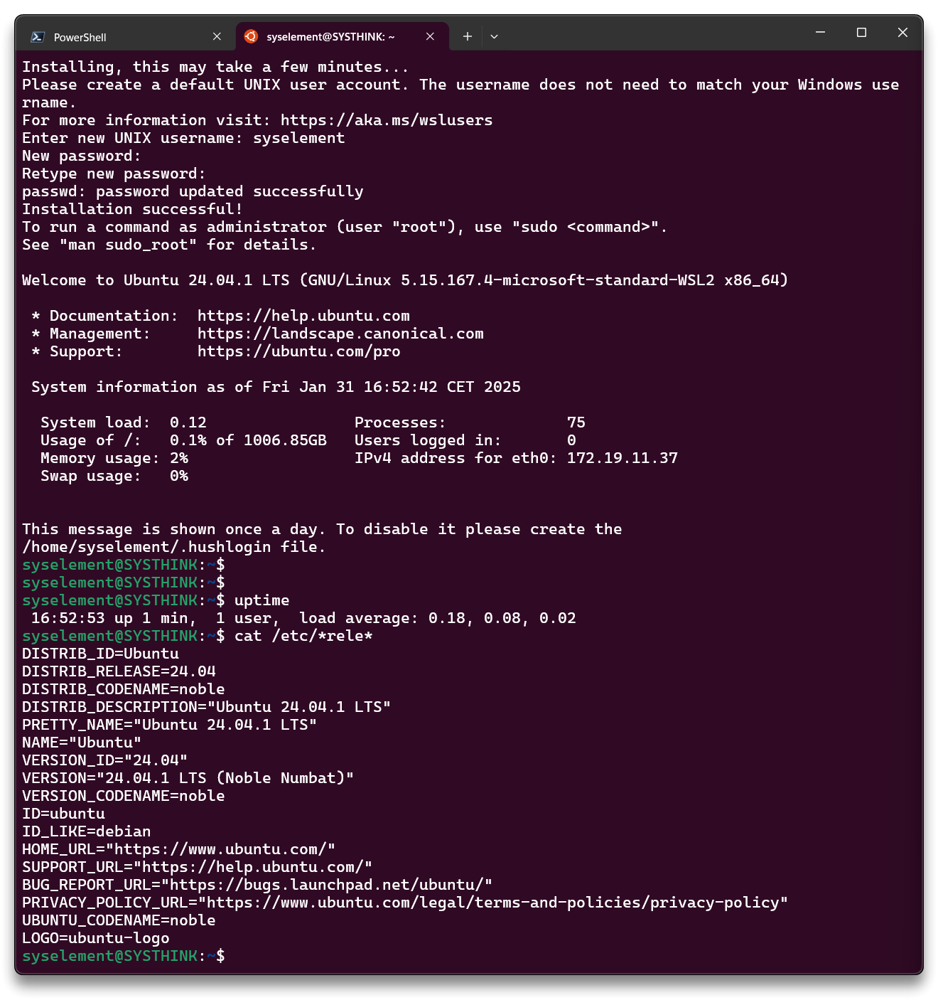

# Windows WSL


> **WSL** (Windows Subsystem for Linux) is a compatibility layer that lets you run Linux distributions directly on Windows, providing a seamless command-line experience without the need for a separate virtual machine. WSL 2 takes this further by employing a lightweight virtual machine managed by the Hyper-V hypervisor, offering a full Linux kernel with improved performance and system call compatibility.

***

## 🌐 Resources 🔗

> * [What is Windows Subsystem for Linux | Microsoft Learn](https://learn.microsoft.com/en-us/windows/wsl/about)
> * [Develop with Ubuntu on WSL - Ubuntu on WSL documentation](https://documentation.ubuntu.com/wsl/en/latest/tutorials/develop-with-ubuntu-wsl/)
> * [Work in Windows Subsystem for Linux with Visual Studio Code](https://code.visualstudio.com/docs/remote/wsl-tutorial)

***

## Install WSL

Open **Powershell as admin** and run the following command that will enable the features necessary to run WSL (`VirtualMachinePlatform`) and install the Ubuntu distribution of Linux.

```bash
# if necessary
# Enable-WindowsOptionalFeature -Online -FeatureName Microsoft-Windows-Subsystem-Linux
# Enable-WindowsOptionalFeature -Online -FeatureName VirtualMachinePlatform -NoRestart
```

```powershell
wsl -install
# Installs wsl and Ubuntu distro by default
wsl --set-default-version 2
```

```powershell
# WSL commands
wsl --list --verbose
wsl --list --online
wsl --update
```

* Restart the Windows host
* After the restart, open `Terminal` app and select **Ubuntu**
  * WSL will automatically download and install the latest stable LTS release of Ubuntu by default. When new LTS versions are released, Ubuntu can be upgraded once the first point release is available ([docs](https://documentation.ubuntu.com/wsl/en/latest/reference/distributions/))
  * Configure username and password when prompted



***

## Ubuntu WSL - Ansible control node

Update OS, install [Ansible](https://docs.ansible.com/ansible/latest/installation_guide/installation_distros.html#installing-ansible-on-ubuntu), pip (Python package manager) and ansible-lint in the Ubuntu WSL distro.

* Open the Ubuntu WSL terminal and proceed with the necessary packages installation

```bash
sudo sed -i.bak 's/%sudo\s\+ALL=(ALL:ALL) ALL/%sudo ALL=(ALL:ALL) NOPASSWD: ALL/' /etc/sudoers

sudo apt update -y && sudo apt full-upgrade -y && sudo apt autoremove -y

sudo apt install -y software-properties-common

sudo add-apt-repository --yes --update ppa:ansible/ansible
sudo apt install -y ansible python3-pip 

pip install ansible-dev-tools --break-system-packages

# Close and reopen the Ubuntu WSL terminal
ansible --version
ansible-lint --version
```

Install [VS Code](https://code.visualstudio.com/) with Ansible and [WSL extensions](https://code.visualstudio.com/docs/remote/wsl-tutorial).

***
