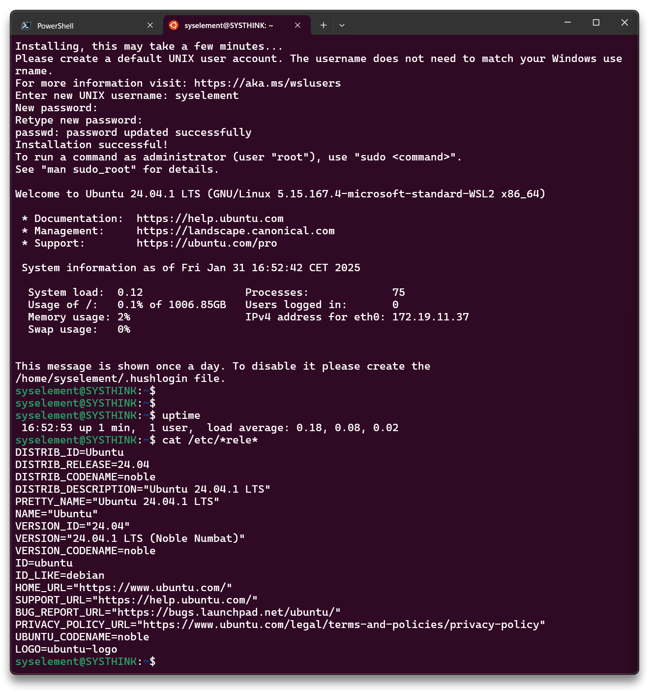

# Windows WSL


> **WSL** (Windows Subsystem for Linux) is a compatibility layer that lets you run Linux distributions directly on Windows, providing a seamless command-line experience without the need for a separate virtual machine. WSL 2 takes this further by employing a lightweight virtual machine managed by the Hyper-V hypervisor, offering a full Linux kernel with improved performance and system call compatibility.

***

## 🌐 Resources 🔗

> * [What is Windows Subsystem for Linux | Microsoft Learn](https://learn.microsoft.com/en-us/windows/wsl/about)
> * [Develop with Ubuntu on WSL - Ubuntu on WSL documentation](https://documentation.ubuntu.com/wsl/en/latest/tutorials/develop-with-ubuntu-wsl/)
> * [Work in Windows Subsystem for Linux with Visual Studio Code](https://code.visualstudio.com/docs/remote/wsl-tutorial)

***

## Install WSL

Open **Powershell as admin** and run the following command that will enable the features necessary to run WSL (`VirtualMachinePlatform`) and install the Ubuntu distribution of Linux.

```bash
# if necessary
# Enable-WindowsOptionalFeature -Online -FeatureName Microsoft-Windows-Subsystem-Linux
# Enable-WindowsOptionalFeature -Online -FeatureName VirtualMachinePlatform -NoRestart
```

```powershell
wsl -install
# Installs wsl and Ubuntu distro by default
wsl --set-default-version 2
```

```powershell
# WSL commands
wsl --list --verbose
wsl --list --online
wsl --update
```

* Restart the Windows host
* After the restart, open `Terminal` app and select **Ubuntu** (or search Ubuntu and install from Microsoft Store.)
  * WSL will automatically download and install the latest stable LTS release of Ubuntu by default. When new LTS versions are released, Ubuntu can be upgraded once the first point release is available ([docs](https://documentation.ubuntu.com/wsl/en/latest/reference/distributions/))

Open **Windows Terminal → Settings → Ubuntu/WSL profile → Appearance** and set **Tango Dark** theme

Open Windows Terminal app and open a tab with the "Ubuntu" instance.

* Configure the Ubuntu instance
* Configure username and password when prompted



***

## Ubuntu WSL - Ansible control node

Update OS, install [Ansible](https://docs.ansible.com/ansible/latest/installation_guide/installation_distros.html#installing-ansible-on-ubuntu), pip (Python package manager) and ansible-lint in the Ubuntu WSL distro.

* Open the Ubuntu WSL terminal and proceed with the necessary packages installation

```bash
sudo sed -i.bak 's/%sudo\s\+ALL=(ALL:ALL) ALL/%sudo ALL=(ALL:ALL) NOPASSWD: ALL/' /etc/sudoers
sudo apt -y update && sudo apt -y dist-upgrade && sudo apt -y autoremove
sudo apt install -y git pip pipx software-properties-common
pipx install ansible-lint ansible-dev-tools
pipx inject --include-apps ansible argcomplete
pipx install --include-deps ansible
pipx ensurepath

# Close and reopen the Ubuntu WSL terminal
ansible --version
ansible-lint --version
```

***

## VSCode Configuration

Install [VS Code](https://code.visualstudio.com/) (Microsoft Store if user not admin)

Open VScode

* install extentions:
  * Linter
  * [WSL](https://code.visualstudio.com/docs/remote/wsl-tutorial)
  * YAML
* Configure nerd font
  * Ctrl+Shift+P → **Preferences: Open User Settings (JSON)**
  * add this line `"editor.fontFamily": "'JetBrainsMonoNL Nerd Font',Consolas, 'Courier New', monospace"`
* "Open a Remote Window" (left corner icon) and **Conect to WSL**
* On the new page connected to the `WSL: Ubuntu`, install the following extentions:
  * Gitlab Workflow
  * Linter
  * YAML

Configure Gitlab:

[https://docs.gitlab.com/editor\_extensions/visual\_studio\_code/setup/](https://docs.gitlab.com/editor_extensions/visual_studio_code/setup/)

* Connect to [https://gitlab.com/-/user\_settings/personal\_access\_tokens](https://gitlab.com/-/user_settings/personal_access_tokens), create a new Personal Access Token with "api" scope. Copy and safelly save the token.
* With "GitLab Workflow" installed on VSCode, proceed with:
* Authenticate with GitLab
  * Open the Command Palette (Control+Shift+P), search and select "GitLab: Authenticate"
  * (not default URL) select "Manually enter instance URL" and set your instance URL
  * select "Enter an existing token" and set your Personal Access Token previously created
* Go to VScode Settings/Extentions/GitLab Workflow and disable the "Gitlab Duo" chat and agent

Now, open the VSCode integrated Terminal that will automatically connect to the Ubuntu WSL shell, or open the Windows Terminal and select the Ubuntu WSL instance.

❗ A dedicated `.gitconfig` file must be present to use **git** commands.

Create a dedicated directory on the Ubuntu WSL instance and download the necessary projects.

A personal example bellow:

```bash
mkdir -p ${HOME}/projects/
cd ${HOME}/projects/
git clone https://gitlab.com/syselement/blog.git
```

To open VScode in the WSL projects dir, open Ubuntu in Win Terminal and run:

```bash
code ${HOME}/projects/
```

***

### Repo sync script

* Create a script that git stash, pull and stash pop all the inventories in all subfolders where present

```bash
mkdir -p ${HOME}/scripts
cat > "${HOME}/scripts/git-update-projects" <<'EOF'
#!/usr/bin/env bash

set -euo pipefail

BASE_DIR="${HOME}/projects"

find "${BASE_DIR}" -type d -name ".git" | while read -r gitdir; do
  repo_dir="$(dirname "$gitdir")"

  echo "Updating repo: ${repo_dir}"

  cd "${repo_dir}"

  # stash only if there are local changes
  if ! git diff --quiet || ! git diff --cached --quiet; then
    git stash push -m "auto-stash-before-pull"
    STASHED=true
  else
    STASHED=false
  fi

  # remove stale remote-tracking branches deleted on GitLab
  git fetch --prune

  # update current branch safely
  git pull --ff-only

  # restore stash only if we created one
  if [[ "${STASHED}" == "true" ]]; then
    git stash pop || {
      echo "WARNING: stash pop failed in ${repo_dir}"
    }
  fi
done
EOF

chmod +x ${HOME}/scripts/git-update-projects
echo 'export PATH="$HOME/scripts:$PATH"' >> $HOME/.bashrc
source $HOME/.bashrc

# Run with
git-update-projects
```

* Open a Terminal into VSCODE and run the script with:

```bash
git-update-projects
```

***

## Ubuntu WSL - Custom config

### Tools

```bash
sudo apt update && sudo apt upgrade -y && sudo apt autoremove -y

# Tools
sudo add-apt-repository ppa:zhangsongcui3371/fastfetch

packages=(
  bash-completion
  bat
  btop
  build-essential
  ca-certificates
  coreutils
  curl
  dnsutils
  duf
  eza
  fastfetch
  gdu
  git
  gnupg
  gping
  htop
  iftop
  ipcalc
  iperf3
  jq
  lm-sensors
  lsb-release
  nano
  net-tools
  nload
  nmap
  openjdk-21-jre-headless
  pipx
  plocate
  s-tui
  software-properties-common
  speedtest-cli
  sshpass
  stress
  sysstat
  tldr
  tmux
  tree
  ugrep
  unzip
  vim
  wget
  zsh
)
sudo apt update
sudo apt install -y -o Debug::pkgProblemResolver=yes "${packages[@]}"

mkdir -p $HOME/.local/bin
ln -s /usr/bin/batcat $HOME/.local/bin/bat

# docker-ctop
sudo sh -c '
    curl -fsSL https://azlux.fr/repo.gpg.key | gpg --dearmor -o /usr/share/keyrings/azlux-archive-keyring.gpg &&
    echo "deb [arch="$(dpkg --print-architecture)" signed-by=/usr/share/keyrings/azlux-archive-keyring.gpg] http://packages.azlux.fr/debian stable main" | tee /etc/apt/sources.list.d/azlux.list >/dev/null &&
    apt update &&
    apt install -y docker-ctop
'

# fzf
git clone --depth 1 https://github.com/junegunn/fzf.git "$HOME/.fzf"
"$HOME/.fzf/install" --all
# upgrade fzf
cd ~/.fzf && git pull && ./install --bin
```

***

### Bash config

Configure `.bashrc` and `.bash_aliases`

```bash
cp -a $HOME/.bashrc $HOME/.bashrc.bak.$(date +%F-%H%M%S)
cp -a $HOME/.bash_aliases $HOME/.bash_aliases.bak.$(date +%F-%H%M%S) 2>/dev/null || true
```

Patch `.bashrc` and `.bash_aliases` using the following Python script:

* Configure `$HOME/.bash_aliases` with the specified aliases list
* Reads your existing `$HOME/.bashrc`.
* Comments out any active `alias ...` lines, leaving already-commented aliases untouched.
* Updates history settings:
  * `HISTCONTROL=ignoreboth:erasedups`
  * `HISTSIZE=50000`
  * `HISTFILESIZE=100000`
  * `HISTTIMEFORMAT=%F %T`
* Enables persistent history sync after each command via `PROMPT_COMMAND='history -a; history -n'`.
* Enables:
  * `checkwinsize`
  * `globstar`
  * `vi` shell editing mode
* Removes old managed `fastfetch` / `fzf` / `starship` blocks if they already exist, so reruns do not duplicate them.
* Appends a clean managed `fzf` config block.
* Appends a clean managed `fastfetch` config block.
* Appends a clean managed `starship` init block with fallback `PS1`.
* Writes the modified content back to `$HOME/.bashrc`.
* It does **not** touch `$HOME/.profile`, or your PATH lines.

```python
python3 <<'PY'
from datetime import datetime
from pathlib import Path
import os
import re
import shutil
import subprocess
import sys
import tempfile

bashrc = Path.home() / ".bashrc"
aliases_path = Path.home() / ".bash_aliases"

aliases = r'''# $HOME/.bash_aliases — centralized interactive aliases

# System update
alias updateos='sudo sh -c "apt update && apt -y upgrade && apt -y autoremove"'

# Core utils
alias cat='batcat --paging=never'
alias df='df -h'
alias diff='diff --color=auto'
alias dir='dir --color=auto'
alias grep='grep --color=auto'
alias fgrep='fgrep --color=auto'
alias egrep='egrep --color=auto'
alias vdir='vdir --color=auto'

# Listing
alias ls='ls -lh --color=auto'
alias la='ls -A'
alias l='eza -lah --group-directories-first'
alias ll='l -T'

# History
alias h='history'
alias hl='history | less'
alias hs='history | grep'
alias hsi='history | grep -i'

# Network / ports
alias ipa='ip -br -c a'
alias ports='ss -tunlp'

# Python
alias p3='python3'
alias python='python3'

# Search
alias ugq='ugrep --pretty --hidden -Qria'

# Mask stdin after first 5 chars
alias mask='awk '\''{ printf substr($0, 1, 5); for (i=6; i<=length($0); i++) printf "*"; print "" }'\'''

# Keep sudo credentials warm before sudo commands
alias sudo='sudo -v; sudo '

# Ubuntu default long-running command notification
alias alert='notify-send --urgency=low -i "$([ $? = 0 ] && echo terminal || echo error)" "$(history|tail -n1|sed -e '\''s/^\s*[0-9]\+\s*//;s/[;&|]\s*alert$//'\'')"'
'''

fzf_block = r'''# >>> fzf (managed) >>>
export FZF_DEFAULT_OPTS='-m --height 50% --border'
export FZF_CTRL_R_OPTS="$FZF_DEFAULT_OPTS"
export FZF_CTRL_T_OPTS="$FZF_DEFAULT_OPTS"
export FZF_ALT_C_OPTS="$FZF_DEFAULT_OPTS"

[ -f "$HOME/.fzf.bash" ] && source "$HOME/.fzf.bash"
# <<< fzf (managed) <<<'''

fastfetch_block = r'''# >>> fastfetch (managed) >>>
# Fastfetch - login shells only
if shopt -q login_shell && command -v fastfetch >/dev/null 2>&1; then
    clear
    fastfetch
fi
# <<< fastfetch (managed) <<<'''

starship_block = r'''# >>> starship (managed) >>>
if command -v starship >/dev/null 2>&1; then
  eval "$(starship init bash)"
else
  PS1='\[\e[1;32m\]\u@\h\[\e[0m\]:\[\e[1;34m\]\w\[\e[0m\]\$ '
fi
# <<< starship (managed) <<<'''

dotfiles_hook = r'''# >>> future dotfiles hook (disabled) >>>
# DOTFILES_REPO_URL="https://github.com/<owner>/<dotfiles-repository>.git"
# DOTFILES_DIR="$HOME/.local/share/dotfiles"
# if [ -d "$DOTFILES_DIR/.git" ]; then
#   git -C "$DOTFILES_DIR" pull --ff-only
# else
#   git clone "$DOTFILES_REPO_URL" "$DOTFILES_DIR"
# fi
# "$DOTFILES_DIR/install.sh"
# <<< future dotfiles hook (disabled) <<<'''

def backup(path: Path) -> None:
    stamp = datetime.now().strftime("%Y-%m-%d-%H%M%S")
    destination = path.with_name(f"{path.name}.bak.{stamp}")
    counter = 1
    while destination.exists():
        destination = path.with_name(f"{path.name}.bak.{stamp}.{counter}")
        counter += 1
    shutil.copy2(path, destination)

def install_if_changed(path: Path, content: str) -> bool:
    content = content.rstrip() + "\n"
    old = path.read_text(encoding="utf-8") if path.exists() else None
    if old == content:
        return False

    path.parent.mkdir(parents=True, exist_ok=True)
    fd, candidate_name = tempfile.mkstemp(prefix=f".{path.name}.", dir=path.parent)
    candidate = Path(candidate_name)
    try:
        with os.fdopen(fd, "w", encoding="utf-8") as stream:
            stream.write(content)
        subprocess.run(["bash", "-n", str(candidate)], check=True)
        if path.exists():
            backup(path)
            candidate.chmod(path.stat().st_mode & 0o777)
        else:
            candidate.chmod(0o644)
        os.replace(candidate, path)
    finally:
        candidate.unlink(missing_ok=True)
    return True

def set_line(content: str, pattern: str, replacement: str) -> str:
    if re.search(pattern, content, flags=re.M):
        replaced = False

        def replace_once(match: re.Match[str]) -> str:
            nonlocal replaced
            if not replaced:
                replaced = True
                return replacement
            return ""

        return re.sub(pattern, replace_once, content, flags=re.M)
    return content.rstrip() + "\n" + replacement + "\n"

source = bashrc.read_text(encoding="utf-8") if bashrc.exists() else ""

# Comment active aliases while preserving indentation and commented aliases.
source = re.sub(
    r'^(?![ \t]*#)([ \t]*)(alias[ \t].*)$',
    r'\1# \2',
    source,
    flags=re.M,
)

source = set_line(source, r'^[ \t]*HISTCONTROL=.*$', 'HISTCONTROL=ignoreboth:erasedups')
source = set_line(source, r'^[ \t]*HISTSIZE=.*$', 'HISTSIZE=50000')
source = set_line(source, r'^[ \t]*HISTFILESIZE=.*$', 'HISTFILESIZE=100000')
source = re.sub(r'^[ \t]*HISTTIMEFORMAT=.*\n?', '', source, flags=re.M)
source = re.sub(
    r'(^HISTFILESIZE=.*$)',
    lambda match: match.group(1) + "\nHISTTIMEFORMAT='%F %T '",
    source,
    count=1,
    flags=re.M,
)
source = set_line(source, r'^[ \t]*PROMPT_COMMAND=.*$', "PROMPT_COMMAND='history -a; history -n'")
source = set_line(source, r'^[ \t]*#?[ \t]*shopt -s checkwinsize.*$', 'shopt -s checkwinsize')
source = set_line(source, r'^[ \t]*#?[ \t]*shopt -s globstar.*$', 'shopt -s globstar 2>/dev/null')
source = re.sub(r'^[ \t]*#?[ \t]*set -o vi[ \t]*\n?', '', source, flags=re.M)

for name in ("fzf", "fastfetch", "starship", "future dotfiles hook"):
    source = re.sub(
        rf'\n?# >>> {re.escape(name)} \((?:managed|disabled)\) >>>.*?# <<< {re.escape(name)} \((?:managed|disabled)\) <<<\n?',
        '\n',
        source,
        flags=re.S,
    )

source = re.sub(
    r'^[ \t]*\[ -[fr] (?:~|"\$HOME)/\.fzf\.bash"? \] && source (?:~|"\$HOME)/\.fzf\.bash"?[ \t]*\n?',
    '',
    source,
    flags=re.M,
)

if not re.search(r'^[^#\n]*\.bash_aliases', source, flags=re.M):
    source = source.rstrip() + r'''

# Load centralized aliases.
if [ -f "$HOME/.bash_aliases" ]; then
  . "$HOME/.bash_aliases"
fi
'''

source = source.rstrip() + "\n\n" + fzf_block + "\n\n" + fastfetch_block + "\n\n" + starship_block + "\n\n" + dotfiles_hook + "\n"

install_if_changed(aliases_path, aliases)
install_if_changed(bashrc, source)
PY

bash -n $HOME/.bashrc && echo "OK: syntax valid"
bash -n $HOME/.bash_aliases && echo "OK: syntax valid"

grep -nE '^[[:space:]]*#?[[:space:]]*alias[[:space:]]' $HOME/.bashrc
grep -nE 'HISTCONTROL|HISTSIZE|HISTFILESIZE|HISTTIMEFORMAT|histappend|PROMPT_COMMAND|checkwinsize|globstar|set -o vi|fzf|fastfetch|starship' $HOME/.bashrc

exec bash
```

***

### Nerd font config

Install a nerd font on the WSL

```bash
cd
mkdir -p $HOME/.local/share/fonts
cd $HOME/.local/share/fonts
curl -fLO https://github.com/ryanoasis/nerd-fonts/releases/latest/download/JetBrainsMono.zip
unzip JetBrainsMono.zip
rm JetBrainsMono.zip

fc-cache -fv
```

On the Windows PC, download **JetBrainsMono Nerd Font**, unzip and install `JetBrainsMonoNLNerdFont-Regular.ttf` from

* https://www.nerdfonts.com/font-downloads

Open **Windows Terminal → Settings → Ubuntu/WSL profile → Appearance** and set **JetBrains Mono NL** as Font face.

Close and reopen Windows Terminal app and open a tab with the "Ubuntu" instance.

Test the Nerd Font:

```bash
printf '\n\033[1;36mNerd Font test\033[0m\n\n\033[1;34mFolders/files:\033[0m  \uf07b  \uf07c  \uf15b  \uf489  \uf4d3\n\033[1;35mDev/icons:\033[0m      \ue702  \ue725  \ue795  \ue73c  \ue606  \ue627  \ue70c  \ue7a8\n\033[1;32mOS/icons:\033[0m       \uf17c  \uf17a  \uf179  \uf303  \uf31b  \uf30a\n\033[1;33mStatus:\033[0m         \033[32m\uf00c\033[0m  \033[31m\uf00d\033[0m  \033[33m\uf071\033[0m  \033[36m\uf05a\033[0m  \033[35m\uf12a\033[0m  \033[34m\uf128\033[0m\n\033[1;31mPowerline:\033[0m      \033[31m\ue0b0\033[0m  \033[32m\ue0b1\033[0m  \033[33m\ue0b2\033[0m  \033[34m\ue0b3\033[0m  \033[35m\ue0b4\033[0m  \033[36m\ue0b5\033[0m  \033[37m\ue0b6\033[0m  \033[90m\ue0b7\033[0m\n\033[1;36mArrows:\033[0m         \033[32m\uf061\033[0m  \033[32m\uf060\033[0m  \033[32m\uf062\033[0m  \033[32m\uf063\033[0m  \033[33m\uf0a9\033[0m  \033[33m\uf0a8\033[0m\n\n'

printf '%s\n' '🧙‍♂️ Nerd Font Installation Test 🧙‍♂️' '==================================' '' '📋 Basic Unicode Symbols:' '✅ ❌ 🔥 🚀 💻 🌟 ⚡ 🎯' '' '🔧 Powerline Symbols:' '       ' '' '💻 Development Icons:' '     ' '' '📁 File System Icons:' '     ' '' '🔀 Version Control:' ' ✓ ✗ ±' '' '🎨 Status Indicators:' '● ○ ◆ ◇ ▶ ◀' '' 'If you see boxes or question marks, your Nerd Font installation needs attention.'

# curl https://raw.githubusercontent.com/ryanoasis/nerd-fonts/master/bin/scripts/test-fonts.sh | bash
```

***

### [fzf](https://junegunn.github.io/fzf/shell-integration/) config

* Already setup in `.bashrc`

```bash
export FZF_DEFAULT_OPTS='-m --height 50% --border'
export FZF_CTRL_R_OPTS="$FZF_DEFAULT_OPTS"
export FZF_CTRL_T_OPTS="$FZF_DEFAULT_OPTS"
export FZF_ALT_C_OPTS="$FZF_DEFAULT_OPTS"

[ -f ~/.fzf.bash ] && source ~/.fzf.bash
```

* Usage in bash

```bash
# CTRL-T - Paste the selected files and directories onto the command-line
# CTRL-R - Paste the selected command from history onto the command-line.
# ALT-C - cd into the selected directory
```

***

### [Starship](https://starship.rs/) config

**Prerequisites**

* A [Nerd Font](https://www.nerdfonts.com/) installed and enabled in your terminal.

Install Sharship

```bash
curl -sS https://starship.rs/install.sh | sh
```

`eval "$(starship init bash)"` is already added to the end of `$HOME/.bashrc` during the bash config - if not, add it

```bash
# Try with
source $HOME/.bashrc

starship explain
```

Starship configuration file:

* **Basic minimal**

```bash
mkdir -p $HOME/.config && cat > $HOME/.config/starship.toml <<'EOF'
format = """
$directory\
$git_branch\
$git_status\
$fill\
$hostname\
$jobs\
$cmd_duration\
$time\
$line_break\
$character"""

add_newline = true

[directory]
format = "[$path]($style) "
style = "bold blue"
truncation_length = 3
truncation_symbol = "…/"
truncate_to_repo = false
read_only = " "

[git_branch]
symbol = " "
format = "[$symbol$branch]($style) "
style = "dimmed green"

[git_status]
format = "([$all_status$ahead_behind]($style) )"
style = "yellow"

[hostname]
ssh_only = true
format = "[$ssh_symbol$hostname]($style) "
style = "dimmed cyan"
ssh_symbol = "󰣀 "

[jobs]
symbol = " "
format = "[$symbol$number]($style) "
style = "bold red"
number_threshold = 1

[cmd_duration]
min_time = 2000
format = "[$duration]($style) "
style = "dimmed yellow"

[time]
disabled = false
format = "[$time]($style)"
time_format = "%H:%M"
style = "dimmed white"

[character]
success_symbol = "[❯](bold green)"
error_symbol = "[❯](bold red)"
vimcmd_symbol = "[❮](bold green)"

[fill]
symbol = " "
EOF
```

* or **Advanced**

```bash
mkdir -p "$HOME/.config" && cat > "$HOME/.config/starship.toml" <<'EOF'
format = """
${custom.root_marker}\
$username\
${custom.directory_icon}\
$directory\
$git_branch\
$git_status\
$fill\
$hostname\
$jobs\
$cmd_duration\
$status\
$time\
$line_break\
$character"""

add_newline = false

[custom.root_marker]
command = "printf ''"
when = 'test "$(id -u)" -eq 0'
format = "[$output]($style) "
style = "bold red"

[username]
show_always = true
format = "[$user]($style) "
style_user = "bold yellow"
style_root = "bold red"

[custom.directory_icon]
command = '''
if [ "$PWD" = "$HOME" ]; then
    printf ''
else
    printf ''
fi
'''
when = true
format = "[$output]($style) "
style = "bold cyan"

[directory]
format = "[$path]($style) "
style = "bold cyan"
home_symbol = "~"
truncation_length = 3
truncation_symbol = "…/"
truncate_to_repo = false
read_only = " "
read_only_style = "bold red"

[git_branch]
symbol = " "
format = "[$symbol$branch]($style) "
style = "bold green"

[git_status]
format = "([$all_status$ahead_behind]($style) )"
style = "bold yellow"

[hostname]
ssh_only = true
format = "[$ssh_symbol$hostname]($style) "
style = "dimmed cyan"
ssh_symbol = "󰣀 "

[jobs]
symbol = " "
format = "[$symbol$number]($style) "
style = "bold red"
number_threshold = 1

[cmd_duration]
min_time = 2000
format = "[$duration]($style) "
style = "dimmed yellow"

[status]
disabled = false
format = "[$symbol$signal_name$maybe_int]($style) "
symbol = "✘ "
sigint_symbol = "✘ "
signal_symbol = "✘ "
not_executable_symbol = "✘ "
not_found_symbol = "✘ "
recognize_signal_code = true
map_symbol = false
style = "bold red"

[time]
disabled = false
format = "[ $time]($style)"
time_format = "%H:%M:%S"
style = "bold cyan"

[character]
format = "$symbol "
success_symbol = "[❯](bold green)"
error_symbol = "[❯](bold red)"

[fill]
symbol = " "
EOF

exec bash
```

Reopen the shell or `exec bash`.

The config does the following:

* **`format`**
  * Defines the full prompt layout.
  * Left side: directory + Git info.
  * Right side: SSH host + background jobs + slow command duration + time.
  * The second line contains only the prompt character.
* **`$fill`**
  * Pushes everything after it to the right side of the terminal.
  * This keeps operational context visible without cluttering the main working area.
* **`add_newline = true`**
  * Adds spacing between command outputs and the next prompt.
  * Improves readability during long terminal sessions.
* **`[directory]`**
  * Shows the current working directory.
  * `truncation_length = 3` keeps paths short.
  * `truncate_to_repo = false` means it does not hide parent directories just because you are inside a Git repo.
  * `read_only = " "` shows a lock icon when the directory is read-only.
* **`[git_branch]`**
  * Shows the current Git branch only when inside a Git repository.
  * Uses the `` branch symbol.
  * Kept minimal: branch name only, no language/runtime noise.
* **`[git_status]`**
  * Shows repository state when there are changes.
  * Displays modified, staged, untracked, ahead/behind, etc.
  * Useful for sysadmin config tracking, dotfiles, `/etc` repos, and deployment directories.
* **`[hostname]`**
  * Shows hostname only over SSH because of `ssh_only = true`.
  * Prevents local WSL prompts from being noisy.
  * Helps avoid running commands on the wrong remote host.
* **`[jobs]`**
  * Shows when background jobs are running.
  * Useful after commands like `long-task &`, `rsync &`, or backgrounded scripts.
  * Hidden when there are no jobs.
* **`[cmd_duration]`**
  * Shows command duration only when a command takes longer than 2 seconds.
  * Good for noticing slow SSH commands, package installs, scans, backups, or scripts.
  * Fast commands stay clean.
* **`[time]`**
  * Shows current time on the right side in 24-hour format.
  * Useful for logs, incident work, and command timing context.
* **`[character]`**
  * Shows the actual prompt symbol.
  * Green `❯` means the last command succeeded.
  * Red `❯` means the last command failed.
  * `❮` is used in Vim command mode.
* **What it intentionally excludes**
  * No Python, Node, Go, Rust, Docker, Kubernetes, AWS, package, or runtime modules.
  * That keeps it sysadmin/operator-oriented instead of developer-oriented.

Check Starship documentation for [config](https://starship.rs/config/) and [presets](https://starship.rs/presets/).

Test and final validation:

```bash
command -v fzf starship
fzf --version
starship --version
bash -n "$HOME/.bashrc"
time bash -i -c exit
```

***

### Docker

* Install [Docker](https://docs.docker.com/engine/install/ubuntu/)

```bash
sudo apt remove $(dpkg --get-selections docker.io docker-compose docker-compose-v2 docker-doc podman-docker containerd runc | cut -f1)

sudo apt update
sudo apt install -y ca-certificates curl
sudo install -m 0755 -d /etc/apt/keyrings
sudo curl -fsSL https://download.docker.com/linux/ubuntu/gpg -o /etc/apt/keyrings/docker.asc
sudo chmod a+r /etc/apt/keyrings/docker.asc

sudo tee /etc/apt/sources.list.d/docker.sources <<EOF
Types: deb
URIs: https://download.docker.com/linux/ubuntu
Suites: $(. /etc/os-release && echo "${UBUNTU_CODENAME:-$VERSION_CODENAME}")
Components: stable
Signed-By: /etc/apt/keyrings/docker.asc
EOF

sudo apt update
sudo apt install -y docker-ce docker-ce-cli containerd.io docker-buildx-plugin docker-compose-plugin

sudo groupadd docker
sudo gpasswd -a "${USER}" docker

sudo systemctl enable --now docker.service containerd.service
sudo systemctl status docker
```

***

#### it-tools container

* Install [it-tools](https://github.com/CorentinTh/it-tools)

```bash
sudo docker run -d --name it-tools --restart unless-stopped -p 8080:80 corentinth/it-tools:latest
```

Use it from http://localhost:8080/

***

### WSL Ubuntu Path

```bash
# e.g. it may differ
\\wsl$\Ubuntu-24.04
\\wsl$\Ubuntu-24.04\home\syselement
```

***
