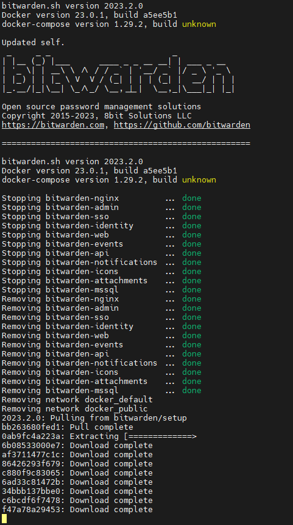

# Bitwarden On-Premise

## BITWARDEN - Deploy to Ubuntu Server

> 🔗 [Official Docs - Install and Deploy - Linux](https://bitwarden.com/help/install-on-premise-linux/) (always check for updated process)

### Network and Domain

- Point your DNS records domain to your Linux host machine, if you want to reach it from the public network.
- Open these ports so Bitwarden can be accessed from inside the network (in this case).
  - `80` (http) , `11443` (https)
- On the Linux machine:

```bash
sudo ufw allow 80
sudo ufw allow 11443
sudo ufw status
```

### Install Docker and Docker Compose

🔗 [Docs - Install Docker Engine on Ubuntu](https://docs.docker.com/engine/install/ubuntu/#install-using-the-repository)

- Install dependencies and setup repository

```bash
# uninstall older Docker versions:
sudo apt-get remove docker docker-engine docker.io containerd runc

sudo apt update
sudo apt install -y apt-transport-https ca-certificates curl gnupg-agent software-properties-common lsb-release
```

```bash
sudo mkdir -p /etc/apt/keyrings
curl -fsSL https://download.docker.com/linux/ubuntu/gpg | sudo gpg --dearmor -o /etc/apt/keyrings/docker.gpg

echo \
"deb [arch=$(dpkg --print-architecture) signed-by=/etc/apt/keyrings/docker.gpg] https://download.docker.com/linux/ubuntu \
$(lsb_release -cs) stable" | sudo tee /etc/apt/sources.list.d/docker.list > /dev/null
```

- Install Docker Engine and Compose

```bash
sudo apt update
sudo apt install docker-ce docker-ce-cli containerd.io docker-compose-plugin

# Try docker:
sudo docker compose version
sudo docker version
sudo docker run hello-world

# Configure Docker to start on boot
sudo systemctl enable docker.service
sudo systemctl enable containerd.service
```

### Create Bitwarden Local User and directory

```bash
sudo adduser bitwarden
sudo passwd bitwarden
sudo groupadd docker
sudo usermod -aG docker bitwarden
sudo mkdir /opt/bitwarden
sudo chmod -R 700 /opt/bitwarden
sudo chown -R bitwarden:bitwarden /opt/bitwarden
```

### Install Bitwarden

- Use the shell script for installation with the `bitwarden` user in the `/opt/bitwarden` directory

```bash
su - bitwarden
cd /opt/bitwarden
curl -Lso /opt/bitwarden/bitwarden.sh "https://func.bitwarden.com/api/dl/?app=self-host&platform=linux" && chmod 700 /opt/bitwarden/bitwarden.sh
./bitwarden.sh install
# Enter the domain name for your Bitwarden instance (ex. bitwarden.example.com):
	bitwarden.yourdomain.com

# Do you want to use Let's Encrypt to generate a free SSL certificate? (y/n):
	n
### Choose Y to generate trusted Let's Encrypt SSL certificate (ports 80 and 443 have to be open for certbot)

# Enter the database name for your Bitwarden instance (ex. vault):
	vault

# Enter your installation id (get at https://bitwarden.com/host):
# Enter your installation key:

# Do you have a SSL certificate to use? (y/n):
	n
# Do you want to generate a self-signed SSL certificate? (y/n):
	y
# ^^^ This option is only recommended for testing.

```

- Retrieve an **installation id** using a valid email at [https://bitwarden.com/host](https://bitwarden.com/host/).

> 🔗 [Hosting FAQs](https://bitwarden.com/help/hosting-faqs/#general)
>
> Installation ids keys are used when installing Bitwarden on-premises in order to:
>
> - Register your installation and contain email so that we can contact you for important security updates.
> - Authenticate to push relay servers for push notifications to Bitwarden client applications.
> - Validate licensing of paid features.
>
> Retrieve an installation id and key from [https://bitwarden.com/host](https://bitwarden.com/host/).
>
> **You should not share your installation id or installation key across multiple Bitwarden installations.** They should be treated as secrets.

```bash
# If you need to make additional configuration changes, you can modify the settings in `./bwdata/config.yml` and then run:
`./bitwarden.sh rebuild` or `./bitwarden.sh update`

nano ./bwdata/env/global.override.env
# adminSettings__admins=yourmail@gmail.com

# nano ./bwdata/config.yml

# Next steps, run:
./bitwarden.sh start

# Bitwarden is up and running!
# ===================================================
# visit https://bitwarden.yourdomain.com
# to update, run
./bitwarden.sh updateself
./bitwarden.sh update
```

### Automatic Update

- Create a cronjob to run the updates automatically

```bash
su - bitwarden
nano /opt/bitwarden/bwdata/scripts/updatebw.sh
```

- Add the 3 lines to the script:

```bash
#!/bin/bash
/opt/bitwarden/bitwarden.sh updateself
/opt/bitwarden/bitwarden.sh update
```

- Make the script executable:

```bash
chmod +x updatebw.sh
crontab -e
# Add lines to update and start Bitwarden at boot:
@reboot /opt/bitwarden/bwdata/scripts/updatebw.sh >/dev/null 2>&1
@reboot /opt/bitwarden/bitwarden.sh start

# or for Example: on every Sunday at 2:00 
0 2 * * 0 /opt/bitwarden/bwdata/scripts/updatebw.sh >/dev/null 2>&1
```

- Change https port

```bash
nano /opt/bitwarden/bwdata/config.yml
# Set https_port variable to 11443
	https_port: 11443
# Save and exit.
# Update
./bitwarden.sh update
```

### Manual Bitwarden Update

```bash
su - bitwarden
cd /opt/bitwarden
curl -Lso /opt/bitwarden/bitwarden.sh "https://func.bitwarden.com/api/dl/?app=self-host&platform=linux" && chmod 700 /opt/bitwarden/bitwarden.sh
/opt/bitwarden/bitwarden.sh updateself
/opt/bitwarden/bitwarden.sh update

# or run the script created before
/opt/bitwarden/bwdata/scripts/updatebw.sh
```



## Start and Stop Bitwarden

```bash
su - bitwarden
/opt/bitwarden/bitwarden.sh stop
/opt/bitwarden/bitwarden.sh start
```

### Offline Starting

- Since `bitwarden.sh` requires internet connection to work, Bitwarden can be started offline using the docker container already present on the host.

```bash
su - bitwarden

# Start
docker-compose -f /opt/bitwarden/bwdata/docker/docker-compose.yml up -d

# Stop
docker-compose -f /opt/bitwarden/bwdata/docker/docker-compose.yml down
```

------

