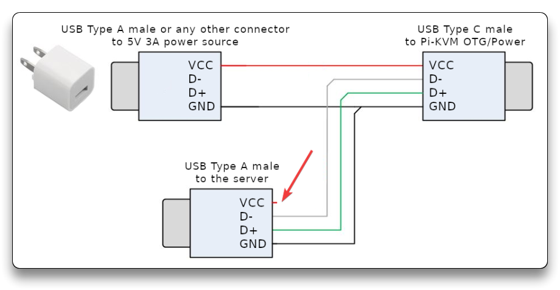
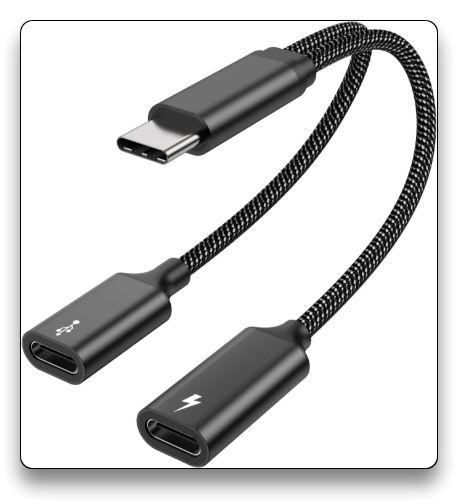

# PiKVM


---

## 🌐 Resources 🔗

> - [DIY PiKVM V2 quickstart guide](https://docs.pikvm.org/v2/)
> - [pikvm/pikvm: Open and inexpensive DIY IP-KVM based on Raspberry Pi - Github](https://github.com/pikvm/pikvm)
> - [How to Build a KVM Over IP with Raspberry Pi | Tom's Hardware](https://www.tomshardware.com/how-to/kvm-over-ip-raspberry-pi)
> - [Making a Wake-on-LAN server using Tailscale, UpSnap, and Raspberry Pi](https://tailscale.com/blog/wake-on-lan-tailscale-upsnap)
> - [PiKVM Build • Chris Dzombak](https://www.dzombak.com/blog/2021/11/pikvm-build/)
> - [My Pi-KVM Build by Eric Lathrop](https://ericlathrop.com/2020/12/my-pi-kvm-build/)

---

## RPi 4 PiKVM V2 DIY

### 🔬 Hardware

**Raspberry Pi 4** board with 16GB MicroSD card.

- PiKVM SD card image used is the one **For HDMI-USB dongle** - [download here](https://docs.pikvm.org/flashing_os/)
- RPi4 Power consumption ranging from 2.7W to 6.4W depending on the workload

For **power supply** and **USB** connectivity, I have chosen the "**Variant #2: Power supply + Y-splitter based on power blocker**" from the [PiKVM v2](https://docs.pikvm.org/v2/) guide with:

- x1 Raspberry Pi Official USB-C Power Supply
- x1 USB C splitter (male->double females)
- x1 USB-A to USB-C cable (male-male)
  - 📌 as power blocker for the VCC of the USB-A male connector that goes into the PC/NAS, I've used a small piece of tape over the right-most pin on the connector **to block the 5V pin**

Similar diagram as my setup:



The "USB C to Double **USB C Splitter**" used:

- [MOGOOD USB C Male to Dual USB C Female Splitter Adapter Female Y Cable](https://amzn.eu/d/913qeyL)



For the **video capture device** I've used an HDMI-USB dongle for my testing lab.

Anyway, a **HDMI-CSI bridge board** is better for video encoding, resolution and latency.

- [Waveshare HDMI to CSI Adapter for Raspberry Pi](https://amzn.eu/d/6btYaiB)
- [Geekworm X1301 HDMI to CSI-2 Adapter](https://amzn.eu/d/aMywFI7)


### On-boot configuration

- [On-boot configuration & production deployment - PiKVM Handbook](https://docs.pikvm.org/on_boot_config/)

Setup WiFi SSID & Password if necessary in the `pikvm.txt` file from the SD Card (on another PC), by adding the following variables:

```bash
WIFI_ESSID='mynet'
WIFI_PASSWD='p@s$$w0rd'
```

---

## PiKVM Shell commands

### Authentication

- Check [Authentication - PiKVM Handbook](https://docs.pikvm.org/auth/) for SSH root access, default credentials and changing them

```bash
[root@pikvm ~]# cat /etc/os-release
NAME="Arch Linux ARM"
```

```bash
su - 
# use "root" as password

# Commands [root@pikvm ~]#

# Update system
pikvm-update
# or
rw
pacman -Syy
pacman -S pikvm-os-updater
pikvm-update
```


### Wake-on-LAN

- [Wake-on-LAN - PiKVM Handbook](https://docs.pikvm.org/wol/)

```bash
rw
vim /etc/kvmd/override.yaml
```

- (Extra) Disable "ATX" menu

```bash
kvmd:
    atx:
        type: disabled
```

- Configuration for **single device WoL**

```bash
###############
# Wake-ON-LAN #
###############

kvmd:
    wol:
        mac: FF:FF:FF:FF:FF:FF # change this to desired MAC Address
```

```bash
kvmd -m # syntax check
systemctl restart kvmd
```

- Configuration for [**multiple hosts WoL**](https://docs.pikvm.org/gpio/#wake-on-lan)

```bash
###############
# Wake-ON-LAN #
###############
kvmd:
	[...]
    wol:
        mac: FF:FF:FF:FF:FF:FF
    gpio:
        drivers:
            proxmox-asus:
                type: wol
                mac: FF:FF:FF:FF:FF:FF
            proxmox-k8:
                type: wol
                mac: FF:FF:FF:FF:FF:FF
            truenas:
                type: wol
                mac: FF:FF:FF:FF:FF:FF
        scheme:
            proxmox-asus:
                driver: proxmox-asus
                pin: 0
                mode: output
                switch: false
            proxmox-k8:
                driver: proxmox-k8
                pin: 0
                mode: output
                switch: false
            truenas:
                driver: truenas
                pin: 0
                mode: output
                switch: false
        view:
            table:
                - ["#1. Proxmox-K8", "proxmox-k8|Wake-on-LAN"]
                - ["#2. Proxmox-Asus", "proxmox-asus|Wake-on-LAN"]
                - ["#3. TrueNAS", "truenas|Wake-on-LAN"]
```

```bash
kvmd -m # syntax check
systemctl restart kvmd
reboot
```


---

## Mass Storage Drive

- [Mass Storage Drive - exFAT USB thumb drive](https://docs.pikvm.org/msd/#exfat-filesystem-warning)

Insert the USB into an RPi USB3 port.

Open the PiKVM Terminal/Shell. Use the following procedure.

- Identify the USB drive and its filesystem type using, ensuring it's recognized (e.g., `exfat` for Ventoy)
- Add a mount entry in `/etc/fstab` to automatically mount the USB drive at boot, with read/write access and permissive permissions
- Ensure the mount point exists and is writable, using `mkdir`, `kvmd-helper-otgmsd-remount`, or `mount -o remount,rw` as needed
- Manually mount or reboot the system to apply changes, allowing access to the USB contents under `/var/lib/kvmd/msd/usb`

```bash
su -
rw

# Check USB drive presence and FS type
lsblk -f
# e.g. Ventoy thumb drive
    sda
    |-sda1      exfat  1.0   Ventoy  4E21-0000
    `-sda2      vfat   FAT16 VTOYEFI 626B-4255

# Add mount entry
nano /etc/fstab

# Add the following line at the end of the file
# This says to mount it automatically, do not fail if it's missing, mount it read/write by default, and allow all users and groups access to it
/dev/sda1   /var/lib/kvmd/msd/usb   exfat  auto,nofail,rw,umask=0000  0 0

# Make the filesystem Read/Write
kvmd-helper-otgmsd-remount
# If this is not working, mount the /var/lib/kvmd/msd manually as following
mount -o remount,rw /var/lib/kvmd/msd

# Create dedicated mounting directory
mkdir -p /var/lib/kvmd/msd/usb
kvmd-helper-otgmsd-remount ro

# Reboot PiKVM or mount manually for testing
mount /var/lib/kvmd/msd/usb

ll /var/lib/kvmd/msd/usb
df -hT
	/dev/sda1      exfat      58G   52G  5.5G  91% /var/lib/kvmd/msd/usb
```

---

## Tailscale on PiKVM

- [Tailscale VPN - PiKVM Handbook](https://docs.pikvm.org/tailscale/)
  - read above docs for Tailscale Certificates

- [Making a Wake-on-LAN server using Tailscale, UpSnap, and Raspberry Pi](https://tailscale.com/blog/wake-on-lan-tailscale-upsnap)

```bash
# Tailscale
pikvm-update
rw

pacman -S tailscale-pikvm
systemctl enable --now tailscaled
tailscale up

reboot

ip addr show tailscale0
```

---

