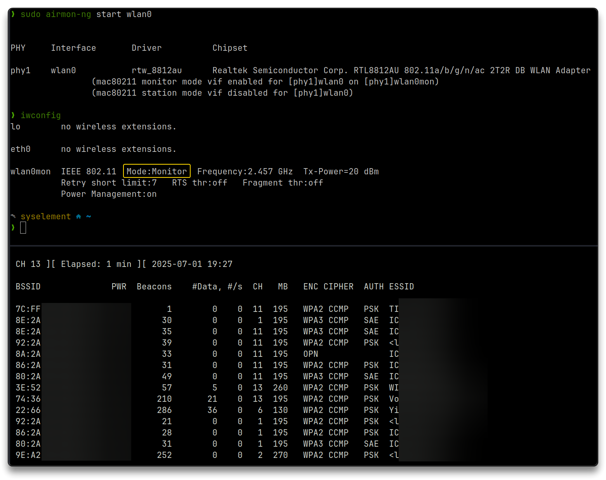

# Alfa AWUS036ACH Wi-Fi Adapter

## 🌐 Resources 🔗

> - [Configuring the Alpha AWUS036ACH Wi-Fi Adapter on Kali Linux | HackerNoon](https://hackernoon.com/configuring-the-alpha-awus036ach-wi-fi-adapter-on-kali-linux)
> - [lwfinger/rtw88: A backport of the Realtek Wifi 5 drivers from the wireless-next repo.](https://github.com/lwfinger/rtw88)
> - [WiFi adapter (driver) tests · ZerBea/hcxdumptool · Discussion #361](https://github.com/ZerBea/hcxdumptool/discussions/361#discussioncomment-7550759)

---

## 🔬 Hardware

> - `Alfa AWUS036ACH v.2` Wi-Fi USB C Adapter
>
>   - [Alfa AWUS036ACH v.2 - USB-C 802.11ac AC1200 Dual Band WiFi USB Adapter](https://alfa-network.eu/awus036ach-c)
>
>   - [AWUS036ACH Drivers](https://docs.alfa.com.tw/Product/AWUS036ACH/)

| Manufacturer      | Alfa Network                                 |
| :---------------- | -------------------------------------------- |
| SKU               | AWUS036ACH-C                                 |
| EAN               | 4718050307302                                |
| Chipset           | RTL8812AU                                    |
| Wi-Fi Standards   | 802.11b, 802.11g, 802.11n, 802.11a, 802.11ac |
| Wi-Fi Frequency   | 2.4 Ghz, 5 Ghz                               |
| 2.4GHz Radio Rate | 300Mbps                                      |
| 5Ghz Radio Rate   | 867Mbps                                      |
| Wireless Security | WEP, WPA, WPA2                               |
| Antenna Type      | Omni-Directional                             |
| Antenna Connector | RP-SMA Female                                |
| Antenna Gain      | 5dbi x 2                                     |
| USB Ports         | USB C 3.0                                    |

---

## Install procedure

Connect the adapter to a USB port with the included cable.

If running Windows, download the driver at this link, unzip it and install it via the `Setup.exe`

- [https://files.alfa.com.tw/?dir=%5B1%5D%20WiFi%20USB%20adapter/AWUS036ACH/Windows/Windows%2010%20WPA3%20driver](https://files.alfa.com.tw/?dir=%5B1%5D%20WiFi%20USB%20adapter/AWUS036ACH/Windows/Windows%2010%20WPA3%20driver)

Open Kali Linux (virtual-machine) and check if it recognizes the plugged in device.

- In case of VirtualBox or VMWare Workstation, the USB needs to be connected via the Removable Devices menu

```bash
lsusb

Bus 003 Device 005: ID 0bda:8812 Realtek Semiconductor Corp. RTL8812AU 802.11a/b/g/n/ac 2T2R DB WLAN Adapter
```

```bash
iwconfig
# no wireless extensions
```

Kali Linux needs the drivers to see the device as an available network device.

- Dynamic Kernel Module Support (**DKMS**) automatically rebuilds and re-signs kernel modules like `rtw88` after kernel updates

```bash
sudo apt update && sudo apt upgrade
sudo apt install -y linux-headers-generic build-essential git

sudo apt install -y dkms
cd $HOME/tools
git clone https://github.com/lwfinger/rtw88
cd rtw88
sudo dkms install $PWD
sudo make install_fw

reboot
```

After the reboot, check again the installed drivers

```bash
iwconfig

wlan0     IEEE 802.11  ESSID:off/any  
          Mode:Managed  Access Point: Not-Associated   Tx-Power=20 dBm   
          Retry short limit:7   RTS thr:off   Fragment thr:off
          Power Management:on
```

## Test Monitor mode

```bash
sudo airmon-ng check kill
sudo airmon-ng start wlan0
iwconfig
```

```bash
# Output
PHY	Interface	Driver		Chipset

phy1	wlan0		rtw_8812au	Realtek Semiconductor Corp. RTL8812AU 802.11a/b/g/n/ac 2T2R DB WLAN Adapter
		(mac80211 monitor mode vif enabled for [phy1]wlan0 on [phy1]wlan0mon)
		(mac80211 station mode vif disabled for [phy1]wlan0)

# Output iwconfig
wlan0mon  IEEE 802.11  Mode:Monitor  Frequency:2.457 GHz  Tx-Power=20 dBm   
          Retry short limit:7   RTS thr:off   Fragment thr:off
          Power Management:on
```

```bash
# Search and discover SSIDs
sudo airodump-ng wlan0mon
```



```bash
# Stop Monitor mode
sudo airmon-ng stop wlan0mon
```

---

