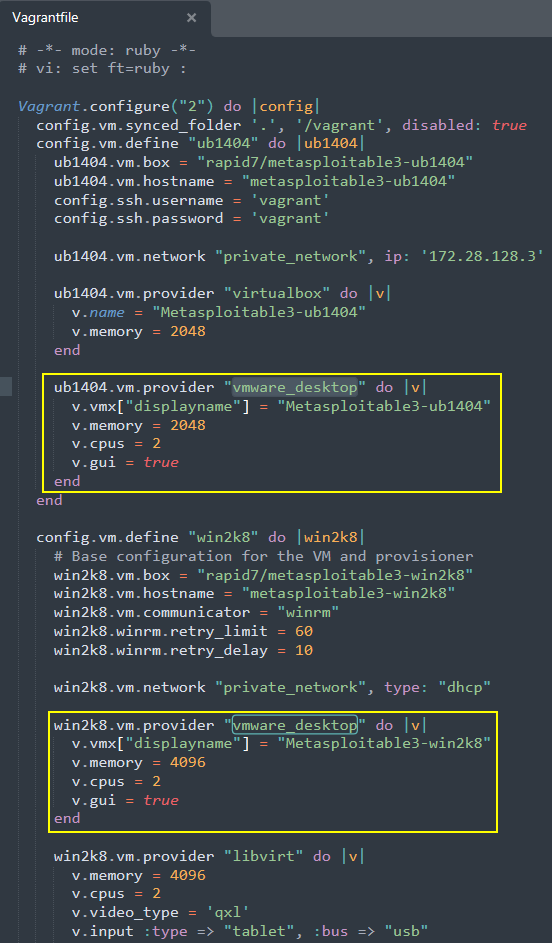
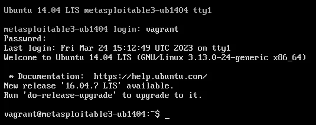
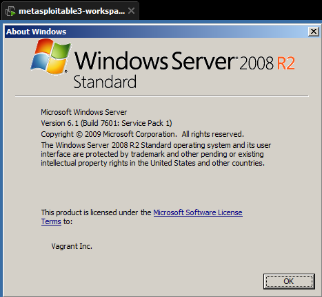

# Metasploitable3


## Description

> [Metasploitable3 - rapid7 Github](https://github.com/rapid7/metasploitable3)
>
> Metasploitable3 is a VM that is built from the ground up with a large amount of security vulnerabilities. It is intended to be used as a target for testing exploits with [Metasploit](https://github.com/rapid7/metasploit-framework).
>
> * [Vulnerabilities](https://github.com/rapid7/metasploitable3/wiki/Vulnerabilities)

## Credentials

> * U: `vagrant` P: `vagrant`
> * U: `leah_organa` P: `help_me_obiw@n`
> * U: `luke_skywalker` P: `use_the_f0rce`
> * U: `han_solo` P: `sh00t-first`
> * U: `artoo_detoo` P: `beep_b00p`
> * U: `c_three_pio` P: `pr0t0c0l`
> * U: `ben_kenobi` P: `thats_no_moon`
> * U: `darth_vader` P: `d@rk_sid3`
> * U: `anakin_skywalker` P: `yipp33!!`
> * U: `jarjar_binks` P: `mesah_p@ssw0rd`
> * U: `lando_calrissian` P: `b@ckstab`
> * U: `boba_fett` P: `mandalorian1`
> * U: `jabba_hutt` P: `not-a-slug12`
> * U: `greedo` P: `hanShotFirst!`
> * U: `chewbacca` P: `rwaaaaawr5`
> * U: `kylo_ren` P: `daddy_issues1`
>
> All of the above users are in various user groups of varying levels of privileges.

## Installation - Vagrant

* Install [Vagrant](../../windows-notes/tools/vagrant\_win.md)
* Open folder with Powershell.

```bash
vagrant plugin install vagrant-reload

mkdir metasploitable3-workspace
cd metasploitable3-workspace
Invoke-WebRequest -Uri "https://raw.githubusercontent.com/rapid7/metasploitable3/master/Vagrantfile" -OutFile "Vagrantfile"
```

* Whitelist `metasploitable3-workspace` folder in the Antivirus

### Configure Vagrantfile (only for VMware)

📌 With VMware Workstation, Vagrant file needs some additional lines to make it work and show the VMs in the VMware Library

* Open `Vagrantfile` with a text editor
* Add those lines for both VMs

```bash
ub1404.vm.provider "vmware_desktop" do |v|
  v.vmx["displayname"] = "Metasploitable3-ub1404"
  v.memory = 2048
  v.cpus = 2
  v.gui = true
end
```

```bash
win2k8.vm.provider "vmware_desktop" do |v|
  v.vmx["displayname"] = "Metasploitable3-win2k8"
  v.memory = 4096
  v.cpus = 2
  v.gui = true
end
```



## Run the VMs

### VMware

* Run vagrant with this commands to download and start the VMs with **VMware**

```bash
vagrant cap provider scrub_forwarded_ports
vagrant up --provider=vmware_desktop
```

### VirtualBox

* Or run vagrant with this command to download and start the VMs with **VirtualBox**

```bash
vagrant up --provider=virtualbox
```

### Win2k8

* To fully disable firewall on the Win2k8 VM, run with `CMD` ad admin

```bash
netsh advfirewall set allprofiles state off
```

## Connection

When both the VMs are ready, they can be opened.

Login default credentials are `vagrant`:`vagrant`





## Stop the VMs

* To stop the VMs run this command that will attempt graceful shutdown of the VMs

```bash
vagrant halt
```

* If this doesn't work, proceed with manual shutdown of the Virtual Machines inside VMware/VirtualBox.

## [Vulnerabilities List](https://github.com/rapid7/metasploitable3/wiki/Vulnerabilities)

> ## GlassFish
>
> #### Ports
>
> * 4848 - HTTP
> * 8080 - HTTP
> * 8181 - HTTPS
>
> #### Credentials
>
> * Username: admin
> * Password: sploit
>
> #### Access
>
> * On Metasploitable3, point your browser to [http://localhost:4848](http://localhost:4848/).
> * Login with the above credentials.
>
> #### Start/Stop
>
> * Stop: Open task manager and kill the java.exe process running glassfish
> * Start: Go to Task Scheduler and find the corresponding task. Right-click and select Run.
>
> #### Vulnerability IDs
>
> * CVE-2011-0807
>
> #### Modules
>
> * exploits/multi/http/glassfish\_deployer
> * auxiliary/scanner/http/glassfish\_login
>
> ## Apache Struts
>
> #### Ports
>
> * 8282 - HTTP
>
> #### Credentials
>
> * Apache Tomcat Web Application Manager
>   * U: sploit
>   * P: sploit
>
> #### Access
>
> * To access the vulnerable application, point your browser on Metasploitable3 to http://localhost:8282/struts2-rest-showcase
> * To access the Apache Tomcat Manager, point your browser on Metasploitable3 to [http://localhost:8282](http://localhost:8282/). Login with the above credentials.
>
> #### Start/Stop
>
> * Stop: Open services.msc. Stop the Apache Tomcat 8.0 Tomcat8 service.
> * Start: Open services.msc. Start the Apache Tomcat 8.0 Tomcat8 service.
>
> #### Vulnerability IDs
>
> * CVE-2016-3087
>
> #### Modules
>
> * exploit/multi/http/struts\_dmi\_rest\_exec
>
> ## Tomcat
>
> #### Ports
>
> * 8282 - HTTP
>
> #### Credentials
>
> * U: sploit
> * P: sploit
>
> #### Access
>
> * To access the Apache Tomcat Manager, point your browser on Metasploitable3 to [http://localhost:8282](http://localhost:8282/). Login with the above credentials.
>
> #### Start/Stop
>
> * Stop: Open services.msc. Stop the Apache Tomcat 8.0 Tomcat8 service.
> * Start: Open services.msc. Start the Apache Tomcat 8.0 Tomcat8 service.
>
> #### Vulnerability IDs
>
> * CVE-2009-3843
> * CVE-2009-4189
>
> #### Modules
>
> * auxiliary/scanner/http/tomcat\_enum
> * auxiliary/scanner/http/tomcat\_mgr\_login
> * exploits/multi/http/tomcat\_mgr\_deploy
> * exploits/multi/http/tomcat\_mgr\_upload
> * post/windows/gather/enum\_tomcat
>
> ## Jenkins
>
> #### Ports
>
> * 8484 - HTTP
>
> #### Credentials
>
> * None enabled by default
>
> #### Access
>
> * Point your browser on Metasploitable3 to [http://localhost:8484](http://localhost:8484/).
>
> #### Start/Stop
>
> * Stop: Open services.msc. Stop the jenkins service.
> * Start: Open services.msc. Start the jenkins service.
>
> #### Modules
>
> * exploits/multi/http/jenkins\_script\_console
> * auxiliary/scanner/http/jenkins\_enum
>
> ## IIS - FTP
>
> #### Ports
>
> * 21 - FTP
>
> #### Credentials
>
> Windows credentials
>
> #### Access
>
> Any FTP client should work
>
> #### Start/Stop
>
> * Stop: `net stop msftpsvc`
> * Start: `net start msftpsvc`
>
> #### Modules
>
> * auxiliary/scanner/ftp/ftp\_login
>
> ## IIS - HTTP
>
> #### Ports
>
> * 80 - HTTP
>
> #### Credentials
>
> * U: vagrant
> * P: vagrant
>
> #### Access
>
> * Point your browser on Metasploitable3 to [http://localhost](http://localhost/).
>
> #### Start/Stop
>
> * Stop: Open services.msc. Stop the World Wide Web Publishing service.
> * Start: Open services.msc. Start the World Wide Web Publishing service.
>
> #### Vulnerability IDs
>
> * CVE-2015-1635
>
> #### Modules
>
> * auxiliary/dos/http/ms15\_034\_ulonglongadd
>
> ## psexec
>
> #### Ports
>
> * 445 - SMB
> * 139 - NetBIOS
>
> #### Credentials
>
> * Any credentials valid for Metasploitable3 should work. See the list [here](https://github.com/rapid7/metasploitable3/wiki/Configuration#credentials)
>
> #### Access
>
> * Use the [psexec tool](https://technet.microsoft.com/en-us/sysinternals/pxexec.aspx) to run commands remotely on the target.
>
> #### Start/Stop
>
> * Enabled by default
>
> #### Vulnerabilities
>
> * Multiple users with weak passwords exist on the target. Those passwords can be easily cracked and used to run remote code using psexec.
>
> #### Modules
>
> * exploits/windows/smb/psexec
> * exploits/windows/smb/psexec\_psh
>
> ## SSH
>
> #### Ports
>
> * 22 - SSH
>
> #### Credentials
>
> * Any credentials valid for Metasploitable3 should work. See the list [here](https://github.com/rapid7/metasploitable3/wiki/Configuration#credentials)
>
> #### Access
>
> * Use an SSH client to connect and run commands remotely on the target.
>
> #### Start/Stop
>
> * Enabled by default
>
> #### Vulnerabilities
>
> * Multiple users with weak passwords exist on the target. Those passwords can be easily cracked. Once a session is opened, remote code can be executed using SSH.
>
> #### Modules
>
> ## WinRM
>
> #### Ports
>
> * 5985 - HTTPS
>
> #### Credentials
>
> * Any credentials valid for Metasploitable3 should work. See the list [here](https://github.com/rapid7/metasploitable3/wiki/Configuration#credentials)
>
> #### Access
>
> #### Start/Stop
>
> * Stop: Open services.msc. Stop the Windows Remote Management service.
> * Start: Open services.msc. Start the Windows Remote Management service.
>
> #### Vulnerabilities
>
> * Multiple users with weak passwords exist on the target. Those passwords can be easily cracked and WinRM can be used to run remote code on the target.
>
> #### Modules
>
> * auxiliary/scanner/winrm/winrm\_cmd
> * auxiliary/scanner/winrm/winrm\_wql
> * auxiliary/scanner/winrm/winrm\_login
> * auxiliary/scanner/winrm/winrm\_auth\_methods
> * exploits/windows/winrm/winrm\_script\_exec
>
> ## chinese caidao
>
> #### Ports
>
> * 80 - HTTP
>
> #### Credentials
>
> * Any credentials valid for Metasploitable3 should work. See the list [here](https://github.com/rapid7/metasploitable3/wiki/Configuration#credentials)
>
> #### Access
>
> * Point your browser on metasploitable3 to http://localhost/caidao.asp
>
> #### Start/Stop
>
> * Stop: Open services.msc. Stop the World Wide Web Publishing service.
> * Start: Open services.msc. Start the World Wide Web Publishing service.
>
> #### Modules
>
> * auxiliary/scanner/http/caidao\_bruteforce\_login
>
> ## ManageEngine
>
> #### Ports
>
> 8020 - HTTP
>
> #### Credentials
>
> Username: admin Password: admin
>
> #### Access
>
> On Metasploitable3, point your browser to [http://localhost:8020](http://localhost:8020/). Login with the above credentials.
>
> #### Start/Stop
>
> * Stop: In command prompt, do `net stop ManageEngine Desktop Central Server`
> * Start: In command prompt, do `net start ManageEngine Desktop Central Server`
>
> #### Vulnerability IDs
>
> * CVE-2015-8249
>
> #### Modules
>
> * exploit/windows/http/manageengine\_connectionid\_write
>
> ## ElasticSearch
>
> #### Ports
>
> 9200 - HTTP
>
> #### Credentials
>
> No credentials needed
>
> #### Access
>
> On Metasploitable3, point your browser to [http://localhost:9200](http://localhost:9200/).
>
> #### Start/Stop
>
> * Stop: In command prompt, do `net stop elasticsearch-service-x64`
> * Start: In command prompt, do `net start elasticsearch-service-x64`
>
> #### Vulnerability IDs
>
> * CVE-2014-3120
>
> #### Modules
>
> * exploit/multi/elasticsearch/script\_mvel\_rce
>
> ## Apache Axis2
>
> #### Ports
>
> 8282 - HTTP
>
> #### Credentials
>
> No credentials needed
>
> #### Access
>
> On Metasploitable3, point your browser to http://localhost:8282/axis2.
>
> #### Start/Stop
>
> Log into Apache Tomcat, and start or stop from the application manager.
>
> #### Vulnerability IDs
>
> * CVE-2010-0219
>
> #### Modules
>
> * exploit/multi/http/axis2\_deployer
>
> ## WebDAV
>
> #### Ports
>
> 8585 - HTTP
>
> #### Credentials
>
> No credentials needed
>
> #### Access
>
> See the PR here: https://github.com/rapid7/metasploitable3/pull/16
>
> #### Start/Stop
>
> * Stop: In command prompt, do `net stop wampapache`
> * Start: In command prompt, do `net start wampapache`
>
> #### Modules
>
> * auxiliary/scanner/http/http\_put (see https://github.com/rapid7/metasploitable3/pull/16)
>
> ## SNMP
>
> #### Ports
>
> 161 - UDP
>
> #### Credentials
>
> Community String: public
>
> #### Access
>
> Load the auxiliary/scanner/snmp/snmp\_enum module in Metasploit and to parse the SNMP data.
>
> #### Start/Stop
>
> * Stop: In command prompt, do `net stop snmp`
> * Start: In command prompt, do `net start snmp`
>
> #### Modules
>
> * auxiliary/scanner/snmp/snmp\_enum
>
> ## MySQL
>
> #### Ports
>
> 3306 - TCP
>
> #### Credentials
>
> U: root P:
>
> #### Access
>
> Use the mysql client to connect to port 3306 on Metasploitable3.
>
> #### Start/Stop
>
> * Stop: In command prompt, do `net stop wampmysql`
> * Start: In command prompt, do `net start wampmysql`
>
> #### Modules
>
> * windows/mysql/mysql\_payload
>
> ## JMX
>
> #### Ports
>
> 1617 - TCP
>
> #### Credentials
>
> No credentials needed
>
> #### Access
>
> Download the connector client and use the instructions found here: http://docs.oracle.com/javase/tutorial/jmx/remote/index.html
>
> #### Start/Stop
>
> * Stop: In command prompt, do `net stop jmx`
> * Start: In command prompt, do `net start jmx`
>
> #### Vulnerability IDs
>
> * CVE-2015-2342
>
> #### Modules
>
> * multi/misc/java\_jmx\_server
>
> ## Wordpress
>
> #### Ports
>
> 8585 - HTTP
>
> #### Credentials
>
> No credentials needed
>
> #### Access
>
> On Metasploitable3, point your browser to http://localhost:8585/wordpress.
>
> #### Start/Stop
>
> * Stop: In command prompt, do `net stop wampapache`
> * Start: In command prompt, do `net start wampapache`
>
> #### Vulnerable Plugins
>
> * NinjaForms 2.9.42 - CVE-2016-1209
>
> #### Modules
>
> * unix/webapp/wp\_ninja\_forms\_unauthenticated\_file\_upload
>
> ## Remote Desktop
>
> #### Ports
>
> 3389 - RDP
>
> #### Credentials
>
> Any Windows credentials
>
> #### Access
>
> Use a remote desktop client. Either your OS already has one, or download a 3rd party.
>
> #### Start/Stop
>
> * Stop: `net stop rdesktop`
> * Start: `net start rdesktop`
>
> #### Modules
>
> N/A
>
> ## PHPMyAdmin
>
> #### Ports
>
> 8585 - HTTP
>
> #### Credentials
>
> U: root P:
>
> #### Access
>
> On Metasploitable3, point your browser to http://localhost:8585/phpmyadmin.
>
> #### Start/Stop
>
> * Stop: In command prompt, do `net stop wampapache`
> * Start: In command prompt, do `net start wampapache`
>
> #### Vulnerability IDs
>
> * CVE-2013-3238
>
> #### Modules
>
> * multi/http/phpmyadmin\_preg\_replace
>
> ## Ruby on Rails
>
> #### Ports
>
> * 3000- HTTP
>
> #### Credentials
>
> N/A
>
> #### Access
>
> * On Metasploitable3, point your browser to [http://localhost:3000](http://localhost:3000/).
>
> #### Start/Stop
>
> * Stop: Open task manager and kill the ruby.exe process
> * Start: Go to Task Scheduler and find the corresponding task. Right-click and select Run.
>
> #### Vulnerability IDs
>
> * CVE-2015-3224
>
> #### Modules
>
> * exploit/multi/http/rails\_web\_console\_v2\_code\_exec
