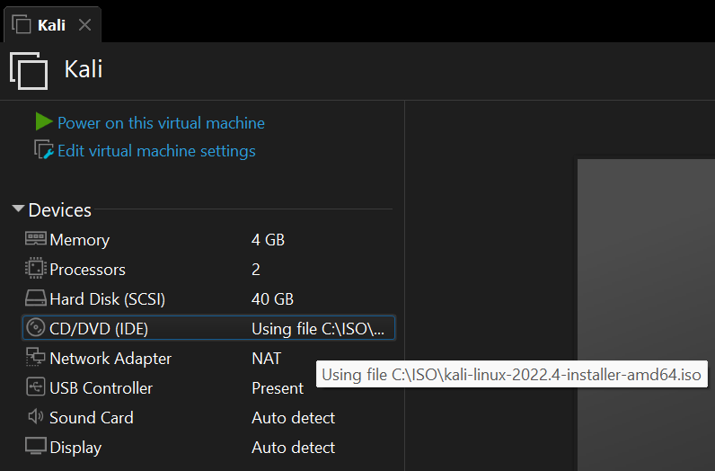
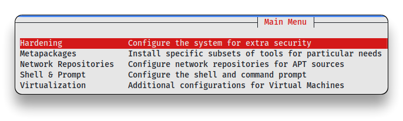
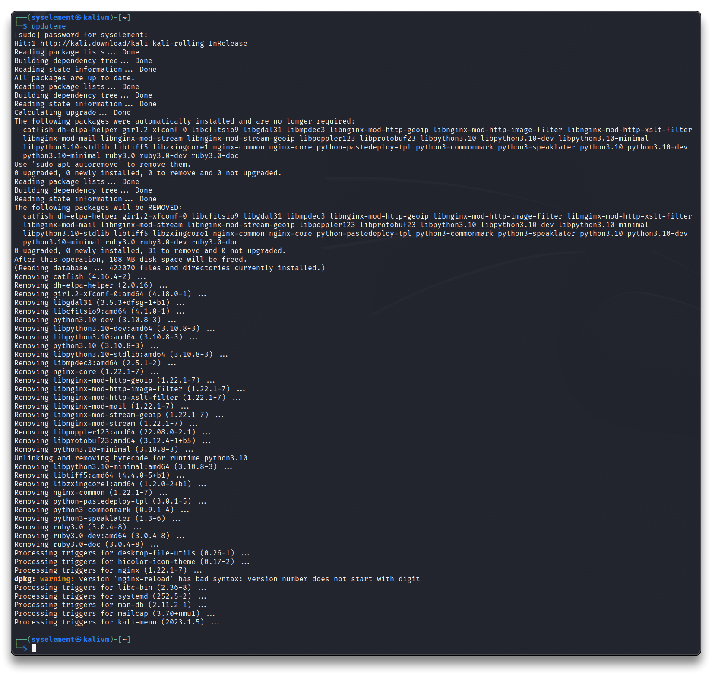
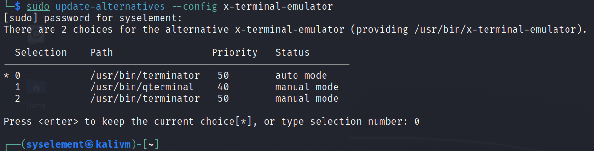
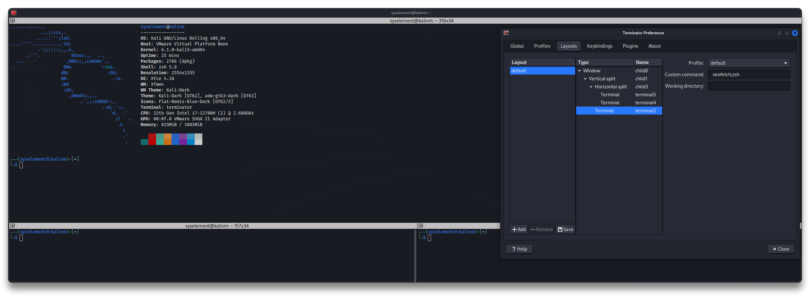

# Kali Linux - VM

 [Kali Linux](https://www.kali.org/)

## First Install - Virtual Machine

- Create a new Virtual Machine in VMWare with preferred specs:
  - Processors: `1 CPU - 2 Cores`
  - RAM Memory: `4 GB`
  - Hard Disk: `40 GB`
  - CD: use the Kali Installer .iso image file - [Download here](https://www.kali.org/get-kali/) - and check *Connect at power on*
  - Network: set it as *NAT*
- Boot the virtual machine and proceed with the [Kali Installation](https://www.kali.org/docs/installation/hard-disk-install/)




## First Boot & Update

- Boot Kali Linux
- Open the Terminal and run the command

```bash
sudo apt update && sudo apt full-upgrade -y
```

> - **`full-upgrade`** performs the function of upgrade but will remove currently installed packages if this is needed to upgrade the system as a whole.
> - This command will upgrade the system to the latest Kali version.
> - Tips from the [Updating Kali](https://www.kali.org/docs/general-use/updating-kali/) post:
>   - ❗ *You should be checking for updates every few weeks*
>   - 📌 *A good practice is that you ensure **all tools work before an engagement** and during that engagement you should not update*

- Reboot the system

```bash
reboot
```


- Customize Kali and finish off the setup using `kali-tweaks`

```bash
kali-tweaks
```



### zshell alias - Update packages

```bash
nano ~/.zshrc
```

- Append the following text with the necessary commands to update all packages:

```bash
# Upgrade all packages and remove unused packages

alias updateme='sudo -- sh -c "sudo apt update && sudo apt -y upgrade && sudo apt -y autoremove"'
```

- Save and exit.
- Reload the zshell configuration:

```bash
source ~/.zshrc
```

- Test the command

```bash
updateme
```



## Configurations

### GRUB Timeout

```bash
sudo nano /etc/default/grub
```

- Set the seconds in the GRUB_TIMEOUT value, save and exit the file

```bash
GRUB_TIMEOUT=1
sudo update-grub
reboot
```

### New SSH Keys

```bash
sudo rm /etc/ssh/ssh_host_*
ssh-keygen -t rsa
```


## Tools

### Basic Tools

- Install basic tools

```bash
sudo apt install -y apt-transport-https curl duf flameshot htop kali-wallpapers-all neofetch net-tools speedtest-cli telegram-desktop terminator tor tree vlc wget
```

### Terminator

```bash
sudo apt install -y terminator
```

- From the `Default Applications / Utilities` menu, set `terminator` as the default terminal to use


```bash
sudo update-alternatives --config x-terminal-emulator
```



- Set up your layout. `CTRL+SHIFT+O` and `CTRL+SHIFT+E` in my case.
  - [Terminator Shortcuts here](../tools/Terminator-Shortcuts.md)

- Go to `Preferences - Global` and set **Window state** to `Maximized`
- Go to `Preferences - Profiles - Background` and set the **Background** transparency as you like.
- Go to `Preferences - Profiles - Scrolling` and set the checkmark on **Infinite Scrollback**.
- Go to `Preferences - Layouts` and click on `Add` button to create a new layout and give it a name.
- This should create the `~/.config/terminator/config` file.
- Now you can start `terminator` using the saved layout using: 

```bash
terminator -l <yourLayout>
```

- Edit the `~/.config/terminator/config` file, rename *yourLayout* to `default` and remove/rename the previous default layout. Now, when Terminator starts without any parameters, it will load your custom [[default]] layout!
  - Edit the [[[terminalx]]]/ `command = neofetch;zsh` for the desired terminal, so that it will run your custom command during startup!!

```bash
nano ~/.config/terminator/config
```

```bash
[global_config]
  window_state = maximise
  suppress_multiple_term_dialog = True
[keybindings]
[profiles]
  [[default]]
    background_darkness = 0.99
    background_type = transparent
    scrollback_infinite = True
    palette = "#1f2229:#d41919:#5ebdab:#fea44c:#367bf0:#9755b3:#49aee6:#e6e6e6:#198388:#ec0101:#47d4b9:#ff8a18:#277fff:#962ac3:#05a1f7:#ffffff"
    use_theme_colors = True
    title_transmit_bg_color = "#1c71d8"
    title_receive_bg_color = "#3584e4"
[layouts]
#  [[default]]
#    [[[window0]]]
#      type = Window
#      parent = ""
#    [[[child1]]]
#      type = Terminal
#      parent = window0
#      profile = default
  [[default]]
    [[[child0]]]
      type = Window
      parent = ""
      order = 0
      position = 0:35
      maximised = True
      fullscreen = False
      size = 2550, 1529
      title = syselement@syskali: ~
      last_active_term = bad1ac94-7015-4914-b44a-dbeb25a78357
      last_active_window = True
    [[[child1]]]
      type = VPaned
      parent = child0
      order = 0
      position = 762
      ratio = 0.5
    [[[terminal2]]]
      type = Terminal
      parent = child1
      order = 0
      profile = default
      uuid = bad1ac94-7015-4914-b44a-dbeb25a78357
      command = neofetch;zsh
    [[[child3]]]
      type = HPaned
      parent = child1
      order = 1
      position = 1272
      ratio = 0.499803536345776
    [[[terminal4]]]
      type = Terminal
      parent = child3
      order = 0
      profile = default
      uuid = f9bdedfc-607c-4975-abaa-7c64fc7076b2
    [[[terminal5]]]
      type = Terminal
      parent = child3
      order = 1
      profile = default
      uuid = e7f2289c-ce5b-4b54-ba1c-59cdad3b77c3
[plugins]
```

- **`CTRL+ALT+T`** is a keyboard shortcut already configured in Kali. It should open the `terminator` with your configured layout.



### Sublime

```bash
wget -qO - https://download.sublimetext.com/sublimehq-pub.gpg | gpg --dearmor | sudo tee /etc/apt/trusted.gpg.d/sublimehq-archive.gpg > /dev/null

echo "deb https://download.sublimetext.com/ apt/stable/" | sudo tee /etc/apt/sources.list.d/sublime-text.list

sudo apt update && sudo apt install -y sublime-text
```

- Run it with **`subl`** command.

### Brave

```bash
sudo apt install -y curl

sudo curl -fsSLo /usr/share/keyrings/brave-browser-archive-keyring.gpg https://brave-browser-apt-release.s3.brave.com/brave-browser-archive-keyring.gpg

echo "deb [signed-by=/usr/share/keyrings/brave-browser-archive-keyring.gpg arch=amd64] https://brave-browser-apt-release.s3.brave.com/ stable main"| sudo tee /etc/apt/sources.list.d/brave-browser-release.list

sudo apt update && sudo apt install -y brave-browser
```

### [Github Desktop](https://github.com/shiftkey/desktop)

```bash
wget -qO - https://apt.packages.shiftkey.dev/gpg.key | gpg --dearmor | sudo tee /usr/share/keyrings/shiftkey-packages.gpg > /dev/null

sudo sh -c 'echo "deb [arch=amd64 signed-by=/usr/share/keyrings/shiftkey-packages.gpg] https://apt.packages.shiftkey.dev/ubuntu/ any main" > /etc/apt/sources.list.d/shiftkey-packages.list'

sudo apt update && sudo apt install -y github-desktop
```

### Visual Studio Code

```bash
sudo apt install -y software-properties-common apt-transport-https wget

wget -qO- https://packages.microsoft.com/keys/microsoft.asc | gpg --dearmor | sudo tee /usr/share/keyrings/packages.microsoft.gpg > /dev/null

sudo sh -c 'echo "deb [arch=amd64,arm64,armhf signed-by=//usr/share/keyrings/packages.microsoft.gpg] https://packages.microsoft.com/repos/code stable main" > /etc/apt/sources.list.d/vscode.list'

sudo apt update && sudo apt install -y code
```

### [Docker](https://www.kali.org/docs/containers/installing-docker-on-kali/)

```bash
sudo apt update && sudo apt install -y docker.io

sudo systemctl enable docker --now

sudo usermod -aG docker $USER
```

## Offensive Sec Tools

### [Katana](https://github.com/projectdiscovery/katana)

```bash
sudo apt install -y golang

go install github.com/projectdiscovery/katana/cmd/katana@latest

sudo cp ~/go/bin/katana /bin/
```

