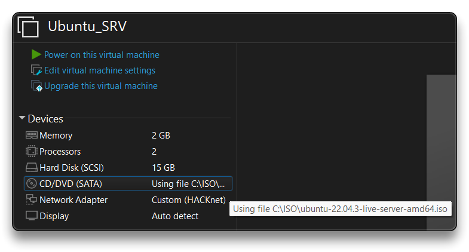
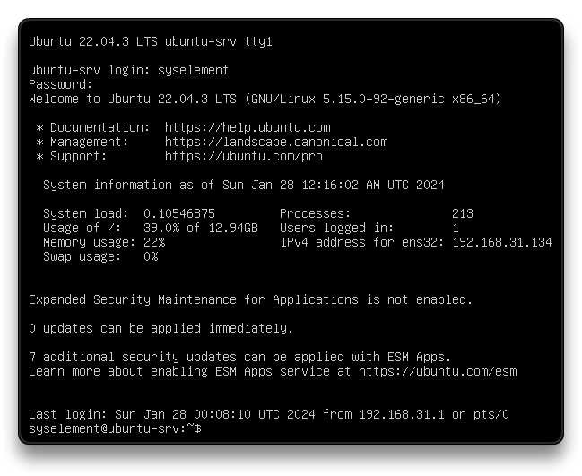

# Ubuntu Server - VM

 [Ubuntu Server](https://ubuntu.com/server/docs)

---

## 🌐 Resources 🔗

> - [Ubuntu Server docs](https://documentation.ubuntu.com/server/)

---

## [First Install - Virtual Machine](https://documentation.ubuntu.com/server/tutorial/basic-installation/)

- Create a new Virtual Machine in VMWare with preferred specs:
  - **Processors**: `1 CPU - 2 Cores`
    - enable `Virtualize Intel VT-x/EPT or AMD-V/RVI`
  - **RAM** Memory: `2 GB`
  - **Hard Disk**: `15 GB`
  - **CD**: use the **Ubuntu Server LTS** .iso image file - [Download here](https://ubuntu.com/download/server) - and check *Connect at power on*
  - **Network**: set it as `NAT`
  - **Display**: Deactivate `Accelerate 3D graphics`
  - Edit virtual machine and ***Remove***: `Printer`
- Boot the virtual machine and proceed with the [Ubuntu Server Installation](https://ubuntu.com/server/docs/installation)





**Installation Process**

1. Boot to `Try or Install Ubuntu Server`
2. Choose the language
3. `Update to the new installer` (if offered)
4. Select keyboard layout
5. Select `Ubuntu Server` as base for the install
6. Wait for Network connection to establish via DHCP (continue without networking if this fails)
   - Do not configure a proxy
7. Leave Ubuntu archive mirror as it is (or change based on necessity)
8. For storage, leave `Use an entire disk` checked, and choose a disk to install to
   - `Edit` the `ubuntu-lv` logical volume by assigning it the max size
9. Select `Done` on the configuration screen and confirm the install
10. Enter a username, hostname and password
11. `Skip for now` the Ubuntu Pro upgrade
12. On the SSH Setup, check the `Install OpenSSH server`, select `Done` for the next 2-3 slides
13. Select `Reboot`

---

## First Boot & Update

- Disable **CD** *Connect at power on*
- Boot Ubuntu Server
- Connect through SSH and/or Run the following commands

```bash
sudo apt -y update && sudo apt -y dist-upgrade && sudo apt -y autoremove
```

- Reboot the system

```bash
reboot
```

---

## Configurations

- `SSH` into the VM

```bash
# TIMEZONE
sudo timedatectl set-timezone Europe/Rome

# DISABLE AUTOMATIC UPDATES
sudo sed -i 's/1";/0";/' /etc/apt/apt.conf.d/20auto-upgrades
sudo systemctl disable apt-daily{,-upgrade}.timer
sudo systemctl mask apt-daily{,-upgrade}.service

# If not using Ubuntu PRO:
# Disable Ubuntu Pro ESM Hook and MOTD Spam - thanks to UnspamifyUbuntu
sudo mv /etc/apt/apt.conf.d/20apt-esm-hook.conf /etc/apt/apt.conf.d/20apt-esm-hook.conf.disabled
sudo sed -Ezi.orig \
  -e 's/(def _output_esm_service_status.outstream, have_esm_service, service_type.:\n)/\1    return\n/' \
  -e 's/(def _output_esm_package_alert.*?\n.*?\n.:\n)/\1    return\n/' \
  /usr/lib/update-notifier/apt_check.py
sudo /usr/lib/update-notifier/update-motd-updates-available --force
sudo sed -i 's/^ENABLED=.*/ENABLED=0/' /etc/default/motd-news

# Change "root" user password
sudo passwd root
```

### Bash aliases or ZSH

```bash
nano $HOME/.bash_aliases
```

```bash
touch $HOME/.bash_aliases
cat <<'EOF' > $HOME/.bash_aliases
# Custom aliases
# Alias to update the system
alias updateos='sudo sh -c "apt update && apt -y upgrade && apt -y autoremove"'

# Additional Aliases
alias bat="batcat"
alias df='df -h'
alias diff='diff --color=auto'
alias dir='dir --color=auto'
alias egrep='egrep --color=auto'
alias fgrep='fgrep --color=auto'
alias grep='grep --color=auto'
alias h='history'
alias hl='history | less'
alias hs='history | grep'
alias hsi='history | grep -i'
alias ipa='ip -br -c a'
alias l='eza -lah --group-directories-first'
alias la='ls -A'
alias ll='l -T'
alias ls='ls -lh --color=auto'
alias mask='awk '\''{ printf substr($0, 1, 5); for (i=6; i<=length($0); i++) printf "*"; print "" }'\'''
alias p3='python3'
alias ports='ss -tunlp'
alias python='python3'
alias sudo='sudo -v; sudo '
alias ugq='ugrep --pretty --hidden -Qria'
alias vdir='vdir --color=auto'

EOF
```

> - Follow the guide here to setup `ZSH` with `Oh-My-Zsh` - [Zsh & Oh-My-Zsh - syselement](../tools/zsh.md)
> - Remove unwanted spam with [UnspamifyUbuntu - Github Skyedra](https://github.com/Skyedra/UnspamifyUbuntu)

### Expand Partition and Filesystem

- Turn off the VM, increase disk space on the hypervisor, turn on the VM
- Proceed with expanding the necessary partition on the server

```bash
sudo -i
apt -y install cloud-guest-utils gdisk
df -h
lsblk

growpart /dev/sda 3 # 3 is the partition number
lsblk
resize2fs /dev/sda3

# or this for LVM
lvextend -r -l +100%FREE /dev/mapper/ubuntu--vg-ubuntu--lv

df -h
```

---

## Network

### Static IP

- Set a static IP in the **netplan** `.yaml` if not configured during OS installation.

```bash
# Show listening sockets and running services
sudo ss -atpu

# List available network interfaces and use the interface ens32
ip -br -c a

# Disable cloud-init networking configuration - if necessary
sudo nano /etc/cloud/cloud.cfg.d/subiquity-disable-cloudinit-networking.cfg
# Make sure it is "disabled"
# network: {config: disabled}

# Open the netplan configuration file for editing
sudo nano /etc/netplan/00-installer-config.yaml
# or
sudo nano /etc/netplan/50-cloud-init.yaml

    # This is the network config written by 'subiquity'
network:
  version: 2
  ethernets:
    ens32:
      addresses: [<IP>/24]
      gateway4: <GATEWAY_IP>
      nameservers:
        addresses: [1.1.1.1, 9.9.9.9]
            
# Exit and save

# Apply the netplan configuration changes
sudo netplan apply

# Reboot the system
```

- If necessary and the VM has 2 NICs, add the seccond one in the **netplan** `.yaml`

```bash
# List available network interfaces and check the second interface name
ip -br -c a

# Example of DHCP on both network interfaces
sudo nano /etc/netplan/50-cloud-init.yaml

    network:
        ethernets:
            enp0s3:
                dhcp4: true
            enp0s8:
                dhcp4: true
        version: 2
```


---

## Tuning

### Basic Tools

```bash
# Tools
sudo add-apt-repository ppa:zhangsongcui3371/fastfetch


packages=(
  apt-transport-https
  aptitude
  bat
  btop
  ca-certificates
  coreutils
  curl
  duf
  eza
  fastfetch
  gdu
  git-all
  gnupg
  gping
  htop
  iftop
  ipcalc
  iperf3
  jq
  lm-sensors
  locate
  nano
  net-tools
  nload
  nmap
  npm
  pipx
  s-tui
  software-properties-common
  speedtest-cli
  sshpass
  stress
  sysstat
  tmux
  tree
  ugrep
  vim
  wget
  zsh
)
apt update
apt install -y -o Debug::pkgProblemResolver=yes "${packages[@]}"

mkdir -p $HOME/.local/bin
ln -s /usr/bin/batcat $HOME/.local/bin/bat
```

```bash
# Asciinema
sudo apt-add-repository ppa:zanchey/asciinema
sudo apt update && sudo apt install asciinema
```


---

### [Docker - Ubuntu](https://docs.docker.com/engine/install/ubuntu/)

```bash
sudo su
apt install curl

# Docker Engine - Convenience Script
sh <(curl -sSL https://get.docker.com)

# Docker Compose
LATEST=$(curl -sL https://api.github.com/repos/docker/compose/releases/latest | grep '"tag_name":' | cut -d'"' -f4)
DOCKER_CONFIG=${DOCKER_CONFIG:-$HOME/.docker}
mkdir -p $DOCKER_CONFIG/cli-plugins
curl -sSL https://github.com/docker/compose/releases/download/$LATEST/docker-compose-linux-x86_64 -o $HOME/.docker/cli-plugins/docker-compose
chmod +x $DOCKER_CONFIG/cli-plugins/docker-compose
docker compose version

# Add the current user to the "docker" group to let it run Docker
sudo groupadd docker
sudo gpasswd -a "${USER}" docker
```

- Alternative to install Docker Engine (via APT)

```bash
# Install Docker Engine via APT repository

sudo apt update && sudo apt install -y curl apt-transport-https software-properties-common ca-certificates gnupg

packages=("docker.io" "docker-doc" "docker-compose" "podman-docker" "containerd" "runc")
for pkg in "${packages[@]}"; do
    sudo apt remove "$pkg" -y
done &&

sudo sh -c '
    curl -fsSL https://download.docker.com/linux/debian/gpg | gpg --dearmor -o /usr/share/keyrings/docker.gpg &&
    chmod a+r /usr/share/keyrings/docker.gpg &&
    echo "deb [arch="$(dpkg --print-architecture)" signed-by=/usr/share/keyrings/docker.gpg] https://download.docker.com/linux/debian bullseye stable" |  tee /etc/apt/sources.list.d/docker.list &&
    apt update && 
    apt install -y docker-ce docker-ce-cli containerd.io docker-buildx-plugin docker-compose-plugin
'

# Add the current user to the "docker" group to let it run Docker
sudo groupadd docker
sudo gpasswd -a "${USER}" docker

# Enable the services at boot
sudo systemctl enable --now docker.service containerd.service

# OR Disable the services at boot
sudo systemctl disable docker.service containerd.service
# still has docker.socket active to start the Docker service only when necessary

# Reboot and Test
reboot
docker run hello-world
```

#### [ctop](https://github.com/bcicen/ctop)

- ctop - concise commandline monitoring for containers

```bash
sudo apt-get install -y ca-certificates curl gnupg lsb-release
curl -fsSL https://azlux.fr/repo.gpg.key | sudo gpg --dearmor -o /usr/share/keyrings/azlux-archive-keyring.gpg
echo \
  "deb [arch=$(dpkg --print-architecture) signed-by=/usr/share/keyrings/azlux-archive-keyring.gpg] http://packages.azlux.fr/debian \
  $(lsb_release -cs) main" | sudo tee /etc/apt/sources.list.d/azlux.list >/dev/null
sudo apt-get update
sudo apt-get install -y docker-ctop
```


---

## Hardening

### SSH-key-based authentication

Ubuntu Server with OpenSSH pre-installed comes with `PasswordAuthentication yes` parameter already set inside `/etc/ssh/sshd_config.d/50-cloud-init.conf` (or `/etc/ssh/sshd_config`). If the parameter is commented, the default is `yes` (password auth permitted) for the [sshd_config](https://man7.org/linux/man-pages/man5/sshd_config.5.html).

- Generate an SSH Key Pair on the **local HOST** from which the connection is established

```bash
# Local HOST
cd
mkdir -p $HOME/.ssh
cd $HOME/.ssh
ssh-keygen -t ed25519
# Type a secure passphrase when asked

chmod 700 $HOME/.ssh
chmod 600 $HOME/.ssh/*

# Add the SSH private key to the ssh-agent
eval "$(ssh-agent -s)" && ssh-add $HOME/.ssh/id_ed25519
```

- Add the Public Key to a system/sudo user on the Ubuntu Server VM

> If you want to use the same key saved on Github profile, having already the private key in the Ubuntu Local HOST (commands above), **ssh** into the Ubuntu Server VM and use the following commands:
>
> ```bash
> # Ubuntu Server VM
> mkdir -p $HOME/.ssh
> 
> curl -s https://github.com/<github-username>.keys >> $HOME/.ssh/authorized_keys
> 
> # e.g.
> curl -s https://github.com/syselement.keys >> $HOME/.ssh/authorized_keys
> 
> chmod 700 $HOME/.ssh && chmod 600 $HOME/.ssh/*
> ```

```bash
# Automatic (if password SSH is allowed)
ssh-copy-id <SUDO_USER>@<REMOTE_SERVER_IP>
```

```bash
# Manually

# Local HOST
cat $HOME/.ssh/id_ed25519.pub
# copy the string
# Should start with ssh-ed25519 AAAA... or ssh-rsa AAAA... (if rsa)

# Ubuntu Server VM
mkdir -p $HOME/.ssh
echo "pubkey_string" >> $HOME/.ssh/authorized_keys
# Set permissions
chmod 700 $HOME/.ssh && chmod 600 $HOME/.ssh/*
```

- Log out and log in using the Private Key

```bash
ssh <SUDO_USER>@<REMOTE_SERVER_IP>

# ssh -i $HOME/.ssh/id_ed25519 <SUDO_USER>@<REMOTE_SERVER_IP>

# Enter the key Passphrase if necessary
```

- Disable SSH password authentication

```bash
# Delete sshd_config.d/50-cloud-init.conf
sudo rm /etc/ssh/sshd_config.d/50-cloud-init.conf

# Inside /etc/ssh/sshd_config set PasswordAuthentication to "no"
sudo sed -i '/^[#]*[[:space:]]*PasswordAuthentication[[:space:]]*yes/c\PasswordAuthentication no' /etc/ssh/sshd_config

# Restart SSH service
sudo systemctl restart sshd
```

- Test SSH access (on the new port if changed) before closing the current session
  - **Only SSH-key-base authentication is permitted**


### SSH-Hardened configuration

```bash
sudo nano /etc/ssh/sshd_config.d/10-hardening.conf
```

e.g. `10-hardening.conf` file:

```bash
# ----- Network hardening -----
Port 2222                   # uncomment & pick a high port if you want less noise
#AddressFamily inet         # stick to IPv4 unless you need IPv6
#ListenAddress 0.0.0.0      # set explicitly only if you need to bind a specific IP

# ----- Host keys (modern default) -----
HostKey /etc/ssh/ssh_host_ed25519_key

# ----- Logging -----
SyslogFacility AUTHPRIV
LogLevel INFO

# ----- Authentication (keys only) -----
PubkeyAuthentication yes
AuthenticationMethods publickey
PasswordAuthentication no
KbdInteractiveAuthentication no
PermitEmptyPasswords no
UsePAM yes

# ----- No direct root logins -----
PermitRootLogin no

# Restrict who can SSH
AllowUsers syselement

# ----- Session limits & timeouts -----
LoginGraceTime 30s
MaxAuthTries 3  # Limit authentication attempts to reduce brute-force risk
MaxSessions 5  # Limit concurrent sessions per user
ClientAliveInterval 300  # Send keep-alive every 5 minutes
ClientAliveCountMax 3  # Disconnect after 3 missed keep-alives

# ----- Features -----
AllowAgentForwarding no
AllowTcpForwarding no
X11Forwarding no
PermitTunnel no
PermitTTY yes
UseDNS no
```

```bash
sudo sshd -t
sudo ufw allow 2222/tcp
sudo systemctl restart sshd

# Test SSH access on the new port before closing the current session
ssh -p 2222 <SUDO_USER>@<REMOTE_SERVER_IP>
```


---

... more to come ...

---

