# Ubuntu Desktop - VM

 [Ubuntu](https://ubuntu.com/)

---

## VirtualBox VM

### Download and Install VirtualBox

> Use the latest VirtualBox version (Screenshots may not be updated)

VirtualBox is a virtualization open source software that runs on Linux, Windows and Mac OS.

- Download latest **VirtualBox** and **VirtualBox Extension Pack** [here](https://www.virtualbox.org/wiki/Downloads) based on your platform (Windows in this tutorial).

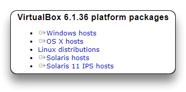


- Install VirtualBox with default settings.
- Install VirtualBox Extension Pack.

---

### Download Linux Image

For this tutorial **Ubuntu Desktop** Linux will be used.

If you want to use another distro check the [Popular Linux Distributions](README.md) list.

- Download the latest **Ubuntu Desktop LTS** `.iso` file [here](https://ubuntu.com/download/desktop).

---

### Create Virtual Machine

- Run VirtualBox.
- Click on the ***New*** button to create a new virtual machine (***VM***)

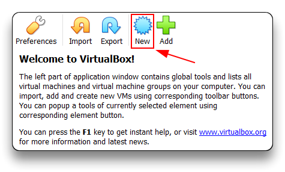

- Click on **Expert Mode**

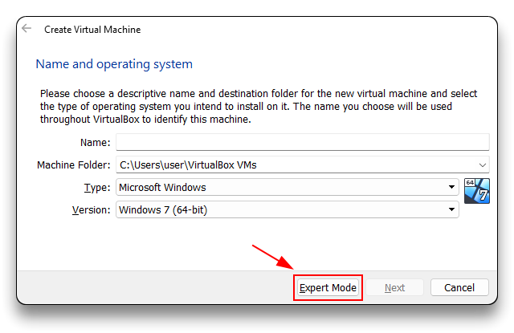

- Set the VM *Name*, the *machine folder* to store the VM, *type* (**`Linux`**) and *version* (**`Ubuntu 64bit`**).
- Set the Memory size (RAM) at **`4096 MB`** (4GB) or use the default settings **`1024 MB`**
- Select `Create a virtual hard disk now`
- Proceed with the ***Create*** button

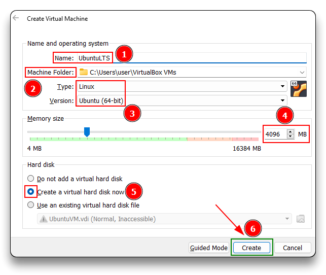

- Set the File size (disk size) at **`20 GB`**
- Set the Hard disk file type as **`VDI - Dynamically allocated`**
- Proceed with the ***Create*** button to initialize the machine.

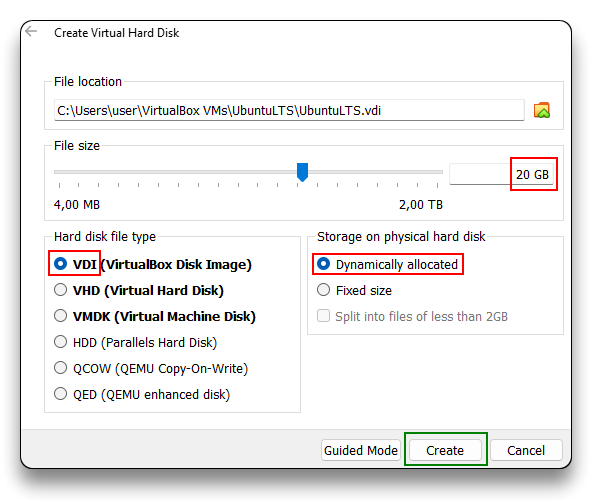

- Select the new VM in the manager windows and click on the ***Settings*** button.

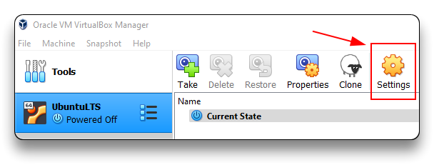

- Navigate to the ***Sistem*** tab and:

  - remove Floppy from boot order
  - set Chipset to **`PIIX3`** (default)
  - **`Enable PAE/NX`** in the Processor menu
  - check Acceleration menu to have **`Default Paravirtualization`** and **`Enable Nested Paging`** checked

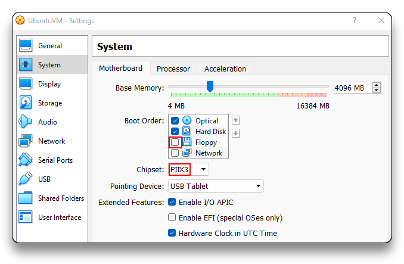

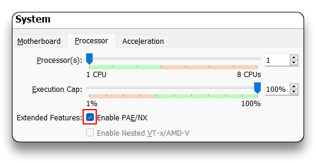

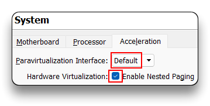

- Navigate to the ***Display*** tab and increase the **`Video Memory`** to **`128 MB`**

- **`Graphics Controller`** must be **`VMSVGA`** to be able to use VirtualBox Guest Additions

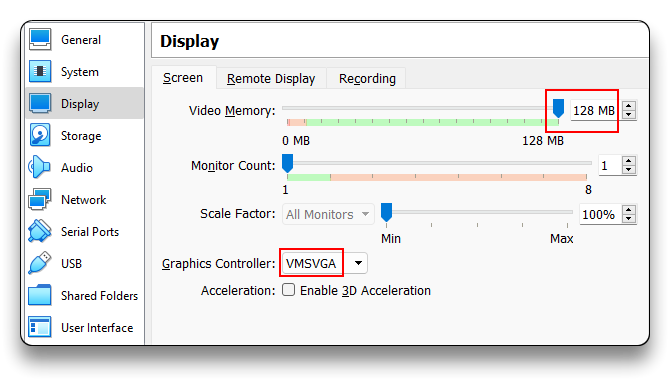

---

### Install Linux Image

- Select the new VM and click on the ***Start*** button to start it

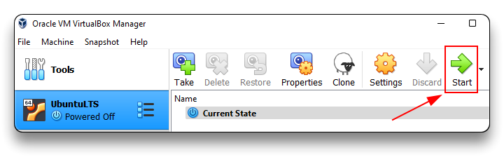

- Click on the file icon to open the Optical disk selector

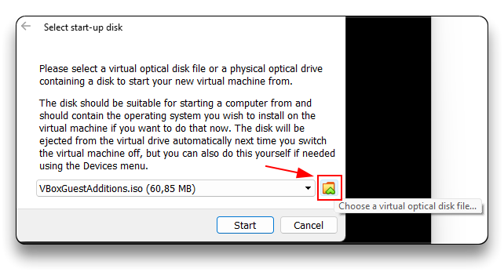

- Use the ***Add*** button to select the `.iso` file previously downloaded, select it from the list and ***Choose*** it
- Click on the ***Start*** button to start he machine with the mounted `ubuntu-22.04-desktop-amd64.iso` (in this case)

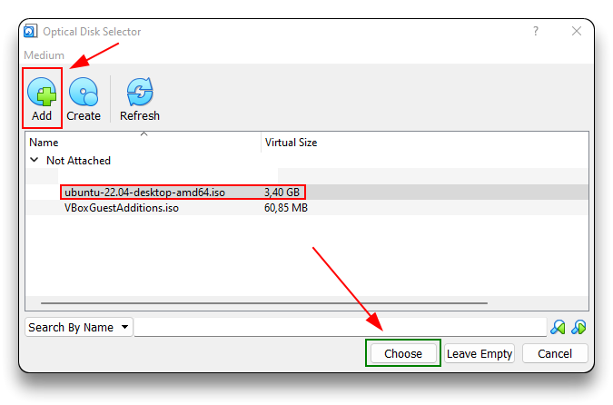

- Wait for the Ubuntu boot and installation menu
- Select your language and click ***Install Ubuntu***

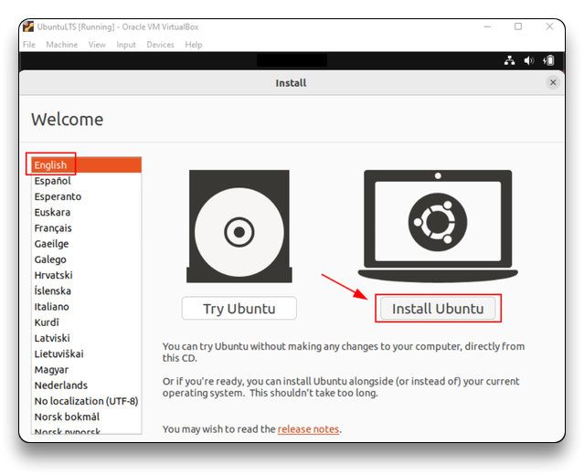

- Select your **Keyboard layout** and continue
- Choose **`Normal installation`** and check both ***Other options*** boxes (you must be connected to the Internet)

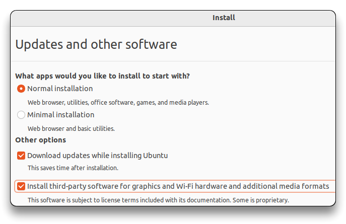

- Choose **`Erase disk and install Ubuntu`** and continue the installation without enabling encryption
  - I suggest using LVM for better dynamic disk management


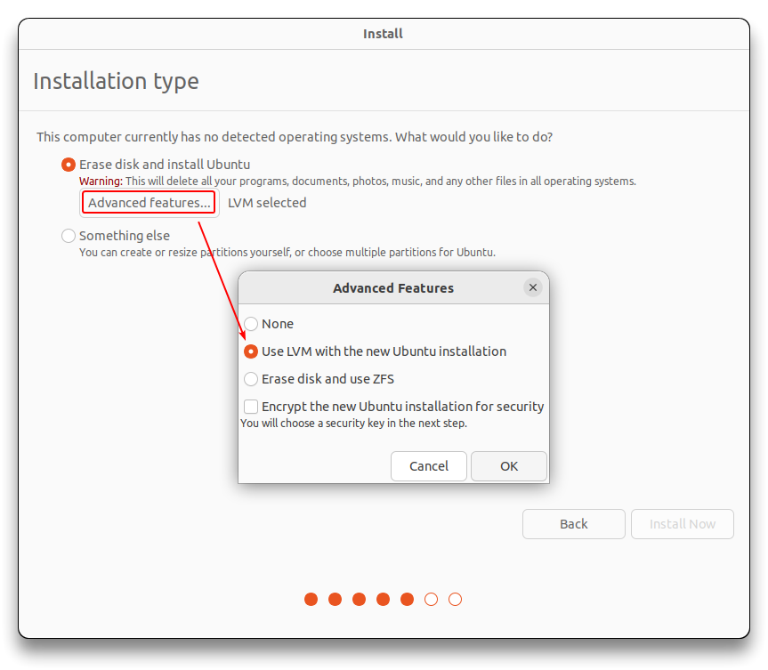

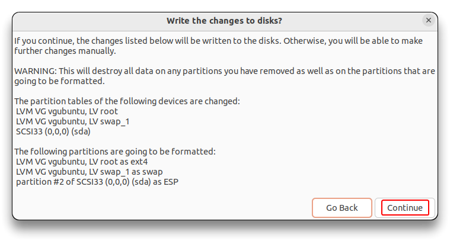

- Select your **Location** and time zone from the map screen
- Create your login details as `hostname`, `username` and `password`
- Proceed with the ***Continue*** button that will start Ubuntu installation

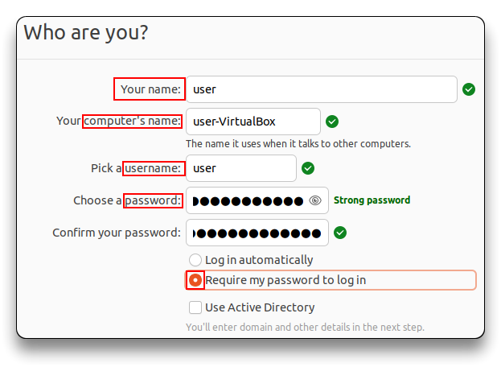

- **Restart** your VM once the installation has completed.

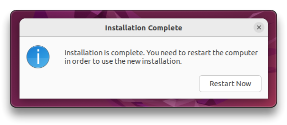

---

### Install VirtualBox Guest Additions

Guest Additions software unlocks some advanced features of VirtualBox to better integrate the VM and the host machine, as well as improved video support using VMSVGA graphics controller.

- Complete the VM first boot and login to Ubuntu desktop
- On the VirtualBox menu select ***Devices - Insert Guest Additions CD image...***

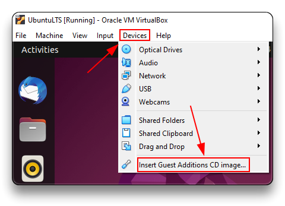

- Run the VBox_GAs disk inside the virtual machine desktop
- **Run** the installation when prompted
  - If the prompt do not auto-start, open the disk, right-click on the **`autorun.sh`** file and ***Run as a Program***
  - Enter your password to install it

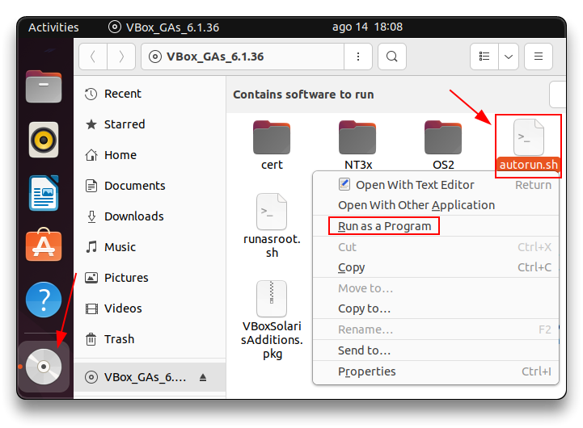

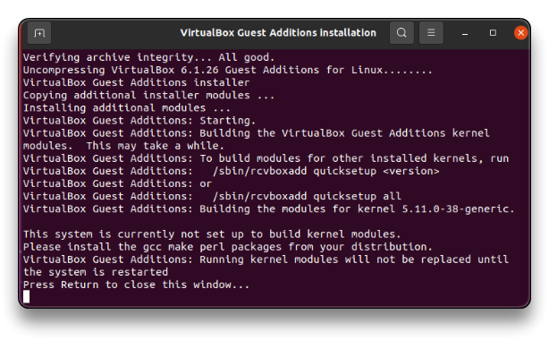

- Restart the VM
- Right-click on the disk and **Eject** it

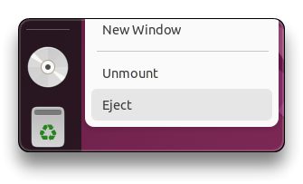

- Activate the *shared clipboard* from the **`Devices - Shared Clipboard - Bidirectional`** menu

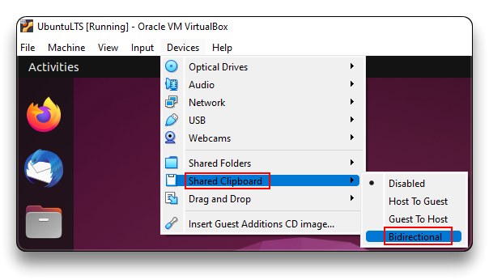

---

## Update Linux

Keep the Ubuntu O.S. updated using one of the next methods.

- Update it via the **Software Updater** app

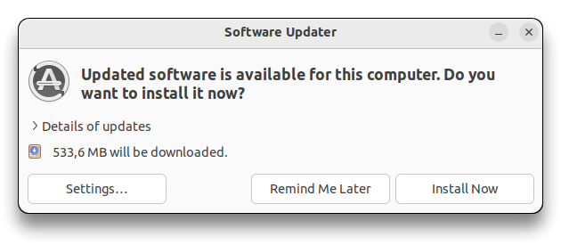

- Open a **Terminal** window (**`Ctrl+Alt+T`**) and update the system with the next command.
  - This can be used when connected via SSH too.

```bash
sudo apt -y update && sudo apt -y dist-upgrade && sudo apt -y autoremove && sudo snap refresh
```

> 📌 Refer to the official documentation of the distribution for instructions on installing alternative Linux distributions.

---

## Configurations

### Basic config

```bash
# Timezone for "Europe/Rome"
sudo unlink /etc/localtime
sudo ln -s /usr/share/zoneinfo/Europe/Rome /etc/localtime
sudo timedatectl set-timezone "Europe/Rome"

# Change "root" user password
sudo passwd root

# Disable Password prompt for sudo group
sudo sed -i.bak 's/%sudo\s\+ALL=(ALL:ALL) ALL/%sudo ALL=(ALL:ALL) NOPASSWD: ALL/' /etc/sudoers

# Set GRUB Timeout
sudo sed -E '/^GRUB_TIMEOUT=/s/=(.*)/=1/' -i /etc/default/grub
sudo update-grub

# Set OS DARK MODE - GNOME
gsettings set org.gnome.desktop.interface color-scheme 'prefer-dark'

# Disable APT Automatic updates
sudo sed -i 's/1";/0";/' /etc/apt/apt.conf.d/20auto-upgrades
sudo systemctl disable apt-daily{,-upgrade}.timer
sudo systemctl mask apt-daily{,-upgrade}.service

# If not using Ubuntu PRO:
# Disable Ubuntu Pro ESM Hook and MOTD Spam - thanks to UnspamifyUbuntu
sudo mv /etc/apt/apt.conf.d/20apt-esm-hook.conf /etc/apt/apt.conf.d/20apt-esm-hook.conf.disabled
sudo sed -Ezi.orig \
  -e 's/(def _output_esm_service_status.outstream, have_esm_service, service_type.:\n)/\1    return\n/' \
  -e 's/(def _output_esm_package_alert.*?\n.*?\n.:\n)/\1    return\n/' \
  /usr/lib/update-notifier/apt_check.py
sudo /usr/lib/update-notifier/update-motd-updates-available --force
```

### SSH keys

- **Host SSH keys** - resets the host's SSH identity and **enables SSH** (disable if not necessary)
- **User SSH key pair** - creates a new personal SSH login key
- **Add to ssh-agent** - loads the key for automatic use

```bash
# Host ssh keys
sudo /bin/rm -v /etc/ssh/ssh_host_*
sudo dpkg-reconfigure openssh-server
sudo systemctl enable --now ssh

# User ssh key pair
cd
mkdir -p $HOME/.ssh
cd $HOME/.ssh
ssh-keygen -t ed25519
# Type a secure passphrase when asked
chmod 700 $HOME/.ssh
chmod 600 $HOME/.ssh/*

# Add the SSH private key to the ssh-agent
eval "$(ssh-agent -s)" && ssh-add $HOME/.ssh/id_ed25519
```

- Add the Public Key to a system/sudo user on a potential Ubuntu Server VM

```bash
# Local HOST (Ubuntu Desktop VM)
cat $HOME/.ssh/id_ed25519.pub
# copy the string
# Should start with ssh-ed25519 AAAA... or ssh-rsa AAAA... (if rsa)

# Ubuntu Server VM
echo "pubkey_string" >> $HOME/.ssh/authorized_keys
# Set permissions
chmod -R go= $HOME/.ssh
```

```bash
ssh <sudo_user>@<remote_Server_IP>
```

---

### Install [JetBrainsMono Nerd Font](https://www.nerdfonts.com/font-downloads)

```bash
cd
mkdir -p $HOME/.local/share/fonts
cd $HOME/.local/share/fonts
curl -fLO https://github.com/ryanoasis/nerd-fonts/releases/latest/download/JetBrainsMono.zip
unzip JetBrainsMono.zip
rm JetBrainsMono.zip

fc-cache -fv
```

### [Terminator](https://github.com/gnome-terminator/terminator)

```bash
sudo apt install -y terminator
```

- Config file -> `$HOME/.config/terminator/config`
  - Make sure to have already installed the necessary font

```bash
rm -f "$HOME/.config/terminator/config"
mkdir -p "$HOME/.config/terminator" && touch "$HOME/.config/terminator/config"

# Basic layout with maximized windows, custom font, infinite scrollback, no transparency

cat > "$HOME/.config/terminator/config" << 'EOF'
[global_config]
  window_state = maximise
[keybindings]
[profiles]
  [[default]]
    font = JetBrainsMono Nerd Font Mono 16
    foreground_color = "#f6f5f4"
    show_titlebar = False
    scrollback_infinite = True
    disable_mousewheel_zoom = True
    use_system_font = False
[layouts]
  [[default]]
    [[[window0]]]
      type = Window
      parent = ""
    [[[child1]]]
      type = Terminal
      parent = window0
[plugins]
EOF
```

### Zsh & Oh-My-Zsh

> - Follow the guide here to setup `ZSH` with `Oh-My-Zsh` - [Zsh & Oh-My-Zsh - syselement](../tools/zsh.md) and some useful aliases
> - Remove unwanted spam with [UnspamifyUbuntu - Github Skyedra](https://github.com/Skyedra/UnspamifyUbuntu)

---

## Tools

### Basic Tools

```bash
# Tools
sudo add-apt-repository ppa:zhangsongcui3371/fastfetch

packages=(
    apt-transport-https
    aptitude
    bat
    btop
    ca-certificates
    coreutils
    curl
    duf
    eza
    fastfetch
    filezilla
    flameshot
    flatpak
    fonts-firacode
    fonts-noto-color-emoji
    fzf
    gdu
    git-all
    gnome-shell-extensions
    gnome-shell-extension-manager
    gnupg
    gpg
    htop
    iftop
    imagemagick
    ipcalc
    iperf3
    locate
    nano
    net-tools
    nload
    nmap
    npm
    pipx
    software-properties-common
    speedtest-cli
    sshpass
    sysstat
    terminator
    tmux
    tor
    tree
    ugrep
    vim
    vlc
    wget
    xclip
    zsh
    # Add package here
)
# Install apt packages
sudo apt update
sudo apt install -y -o Debug::pkgProblemResolver=yes "${packages[@]}"

mkdir -p $HOME/.local/bin
ln -s /usr/bin/batcat $HOME/.local/bin/bat
```

---

### [Sublime](https://www.sublimetext.com/docs/linux_repositories.html)

```bash
sudo sh -c '
    wget -qO- https://download.sublimetext.com/sublimehq-pub.gpg | gpg --dearmor -o /usr/share/keyrings/sublimehq-archive.gpg &&
    echo "deb [arch="$(dpkg --print-architecture)" signed-by=/usr/share/keyrings/sublimehq-archive.gpg] https://download.sublimetext.com/ apt/stable/" | tee /etc/apt/sources.list.d/sublime-text.list &&
    apt update &&
    apt install -y sublime-text
'
```

```bash
# APT DEB822 source format
sudo sh -c '
	wget -qO - https://download.sublimetext.com/sublimehq-pub.gpg | tee /usr/share/keyrings/sublimehq-pub.asc > /dev/null &&
	cat <<EOF > /etc/apt/sources.list.d/sublime-text.sources
Types: deb
URIs: https://download.sublimetext.com/
Suites: apt/stable/
Signed-By: /usr/share/keyrings/sublimehq-pub.asc
EOF &&
	apt update &&
	apt install sublime-text
'
```


- Run it with **`subl`** command.

---

### [Brave](https://brave.com/linux/)

```bash
sudo sh -c '
    apt install -y curl &&
    curl -fsSLo /usr/share/keyrings/brave-browser-archive-keyring.gpg https://brave-browser-apt-release.s3.brave.com/brave-browser-archive-keyring.gpg &&
    echo "deb [arch="$(dpkg --print-architecture)" signed-by=/usr/share/keyrings/brave-browser-archive-keyring.gpg] https://brave-browser-apt-release.s3.brave.com/ stable main" | tee /etc/apt/sources.list.d/brave-browser-release.list &&
    wget http://archive.ubuntu.com/ubuntu/pool/main/libu/libu2f-host/libu2f-udev_1.1.10-3.2_all.deb &&
    dpkg -i libu2f-udev_1.1.10-3.2_all.deb &&
    apt update &&
    apt install -y brave-browser &&
    rm -rf libu2f-udev_1.1.10-3.2_all.deb
'
```

---

### [Typora](https://typora.io/#linux)

```bash
sudo sh -c '
	rm -f /etc/apt/trusted.gpg.d/typora.asc
	rm -f /usr/share/keyrings/typora.gpg
    curl -fsSLo /usr/share/keyrings/typora.gpg https://downloads.typora.io/typora.gpg &&
    echo "deb [arch="$(dpkg --print-architecture)" signed-by=/usr/share/keyrings/typora.gpg] https://typora.io/linux ./" | tee /etc/apt/sources.list.d/typora.list &&
    apt update &&
    apt install -y typora unzip
'

## Install Typora-Themeable theme
mkdir -p "$HOME/.config/Typora/themes"
cd "$HOME/.config/Typora/themes" &&
curl -L https://github.com/jhildenbiddle/typora-themeable/releases/latest/download/typora-themeable.zip -o typora-themeable.zip &&
unzip typora-themeable.zip &&
rm -f typora-themeable.zip
```

---

### [Emote](https://github.com/tom-james-watson/Emote?tab=readme-ov-file)

```bash
sudo snap install emote
```

---

### [VirtualBox](https://www.virtualbox.org/wiki/Linux_Downloads)

```bash
sudo apt install -y virtualbox
sudo usermod -a -G vboxusers $USER

# Download VirtualBox Extension Pack and open it with VirtualBox to install
```

---

### [DBeaver](https://dbeaver.io/download/)

```bash
sudo sh -c '
    sudo wget -O /usr/share/keyrings/dbeaver.gpg.key https://dbeaver.io/debs/dbeaver.gpg.key
	echo "deb [signed-by=/usr/share/keyrings/dbeaver.gpg.key] https://dbeaver.io/debs/dbeaver-ce /" | sudo tee /etc/apt/sources.list.d/dbeaver.list
    sudo apt update && sudo apt install -y dbeaver-ce
'
```

---

### [Postman](https://www.postman.com/downloads/)

```bash
sudo snap install postman
```

---

### [Flameshot](https://flameshot.org/docs/guide/wayland-help/#gnome-shortcut-does-not-trigger-flameshot)

```bash
sudo apt install flameshot
```

- Config file -> `$HOME/.config/flameshot/flameshot.ini`
  - Make sure to have already installed the necessary font

```bash
mkdir -p "$HOME/.config/flameshot/" && touch "$HOME/.config/flameshot/flameshot.ini"

cat > "$HOME/.config/flameshot/flameshot.ini" << 'EOF'
[General]
contrastOpacity=188
copyPathAfterSave=false
saveAfterCopy=true
saveAsFileExtension=png
saveLastRegion=true
savePath=/home/syselement/Pictures/flameshot
savePathFixed=true
showHelp=false
showMagnifier=false
showStartupLaunchMessage=false
squareMagnifier=true
startupLaunch=true
EOF
```

-  Set this as a custom **Keyboard shortcut** for `flameshot`
   -  I use `Shift+Alt+S`

```bash
script --command "flameshot gui" /dev/null
```


---

### [Docker - Ubuntu](https://docs.docker.com/engine/install/ubuntu/)

```bash
# Install Docker Engine via APT repository

sudo apt update && sudo apt install -y curl apt-transport-https software-properties-common ca-certificates gnupg

packages=("docker.io" "docker-doc" "docker-compose" "podman-docker" "containerd" "runc")
for pkg in "${packages[@]}"; do
    sudo apt remove "$pkg" -y
done &&

sudo sh -c '
    curl -fsSL https://download.docker.com/linux/debian/gpg | gpg --dearmor -o /usr/share/keyrings/docker.gpg &&
    chmod a+r /usr/share/keyrings/docker.gpg &&
    echo "deb [arch="$(dpkg --print-architecture)" signed-by=/usr/share/keyrings/docker.gpg] https://download.docker.com/linux/debian bullseye stable" |  tee /etc/apt/sources.list.d/docker.list &&
    apt update && 
    apt install -y docker-ce docker-ce-cli containerd.io docker-buildx-plugin docker-compose-plugin
'

# Add the current user to the "docker" group to let it run Docker
sudo groupadd docker
sudo gpasswd -a "${USER}" docker

# Enable the services at boot
sudo systemctl enable --now docker.service containerd.service

# OR Disable the services at boot
sudo systemctl disable docker.service containerd.service
# still has docker.socket active to start the Docker service only when necessary

# Reboot and Test
reboot
docker run hello-world
```

---

## DevOps Tools

### [VSCode](https://code.visualstudio.com/docs/setup/linux#_debian-and-ubuntu-based-distributions)

```bash
sudo apt update && sudo apt install -y software-properties-common apt-transport-https wget

sudo sh -c '
    wget -qO- https://packages.microsoft.com/keys/microsoft.asc | gpg --dearmor | sudo tee /usr/share/keyrings/packages.microsoft.gpg > /dev/null
    echo "deb [arch=amd64,arm64,armhf signed-by=//usr/share/keyrings/packages.microsoft.gpg] https://packages.microsoft.com/repos/code stable main" > /etc/apt/sources.list.d/vscode.list
    sudo apt update && sudo apt install -y code
'

EXTENSIONS=(
	ms-azuretools.vscode-docker
	mhutchie.git-graph \
	esbenp.prettier-vscode \
	redhat.vscode-yaml \
	Tim-Koehler.helm-intellisense \
	oderwat.indent-rainbow \
	ms-kubernetes-tools.vscode-kubernetes-tools \
	ms-python.python \
)

for EXT in "${EXTENSIONS[@]}"; do
	code --install-extension "$EXT"
done
```

- Open `VSCode`. From **File** > **Preferences** > **Settings**, search for `telemetry`, and set the **Telemetry: Telemetry Level** setting to `off`.
- Set `Git` user name and email address

```bash
# e.g.
git config --global user.name "John Doe"
git config --global user.email johndoe@example.com
```

#### or [VS Codium](https://github.com/VSCodium/vscodium)

```bash
sudo sh -c '
    curl -fsSLo /usr/share/keyrings/vscodium-archive-keyring.asc https://gitlab.com/paulcarroty/vscodium-deb-rpm-repo/raw/master/pub.gpg &&
	echo "deb [ signed-by=/usr/share/keyrings/vscodium-archive-keyring.asc ] https://paulcarroty.gitlab.io/vscodium-deb-rpm-repo/debs vscodium main" > /etc/apt/sources.list.d/vscodium.list &&
	apt update &&
	apt install -y codium
'
```

---

### [PyCharm](https://www.jetbrains.com/help/pycharm/installation-guide.html#standalone)

```bash
sudo snap install pycharm-community --classic
```

---

### [Homebrew](https://brew.sh/)

```bash
# Install brew
/bin/bash -c "$(curl -fsSL https://raw.githubusercontent.com/Homebrew/install/HEAD/install.sh)"

(echo; echo "eval \"\$(/home/linuxbrew/.linuxbrew/bin/brew shellenv)\"") >> /home/$(whoami)/.zshrc
eval "$(/home/linuxbrew/.linuxbrew/bin/brew shellenv)"
```

---

### [k9s](https://k9scli.io/topics/install/) / [kubectl](https://kubernetes.io/docs/tasks/tools/install-kubectl-linux/#install-using-native-package-management) / [kubectx](https://github.com/ahmetb/kubectx)

```bash
# Install k9s
brew install derailed/k9s/k9s
brew upgrade

# Install kubectl
# Fix this with correct version from
# https://kubernetes.io/docs/tasks/tools/install-kubectl-linux/

sudo sh -c '
	sudo apt install -y apt-transport-https ca-certificates curl gnupg
	sudo mkdir -p -m 755 /etc/apt/keyrings
	curl -fsSL https://pkgs.k8s.io/core:/stable:/v1.33/deb/Release.key | gpg --dearmor -o /etc/apt/keyrings/kubernetes-apt-keyring.gpg
	chmod 644 /etc/apt/keyrings/kubernetes-apt-keyring.gpg
	echo "deb [signed-by=/etc/apt/keyrings/kubernetes-apt-keyring.gpg] https://pkgs.k8s.io/core:/stable:/v1.33/deb/ /" | sudo tee /etc/apt/sources.list.d/kubernetes.list
	chmod 644 /etc/apt/sources.list.d/kubernetes.list
	sudo apt update && sudo apt install -y kubectl
'
mkdir -p $HOME/.kube
sudo touch -f $HOME/.kube/config
sudo chown $(id -u):$(id -g) $HOME/.kube && chmod 700 $HOME/.kube
sudo chown $(id -u):$(id -g) $HOME/.kube/config && chmod 600 $HOME/.kube/config

# Install kubectx
sudo apt install -y kubectx
```

---

### [minikube](https://minikube.sigs.k8s.io/docs/start/)

- Enable `VT-X/AMD-v` for the VM.

```bash
# Install minikube
curl -LO https://storage.googleapis.com/minikube/releases/latest/minikube_latest_amd64.deb
sudo dpkg -i minikube_latest_amd64.deb
```

---

### [Helm](https://helm.sh/docs/intro/install/)

```bash
sudo sh -c '
    curl -fsSL https://baltocdn.com/helm/signing.asc | gpg --dearmor -o /usr/share/keyrings/helm.gpg > /dev/null
    sudo apt install -y apt-transport-https
    echo "deb [arch=$(dpkg --print-architecture) signed-by=/usr/share/keyrings/helm.gpg] https://baltocdn.com/helm/stable/debian/ all main" | sudo tee /etc/apt/sources.list.d/helm-stable-debian.list
    sudo apt update && sudo apt install -y helm
'
```

---

### [Terraform](https://developer.hashicorp.com/terraform/tutorials/aws-get-started/install-cli)

```bash
# Install Terraform
sudo apt update && sudo apt install -y gnupg software-properties-common
sudo sh -c '
    wget -O- https://apt.releases.hashicorp.com/gpg | sudo gpg --dearmor -o /usr/share/keyrings/hashicorp-archive-keyring.gpg > /dev/null
    #TR_DIST=$(lsb_release -cs)
    TR_DIST="jammy"
    echo "deb [signed-by=/usr/share/keyrings/hashicorp-archive-keyring.gpg] https://apt.releases.hashicorp.com $TR_DIST main" | sudo tee /etc/apt/sources.list.d/hashicorp.list
    sudo apt update && sudo apt install -y terraform
    terraform -install-autocomplete
'
```

---

### [Ansible](https://docs.ansible.com/ansible/latest/installation_guide/intro_installation.html#installing-ansible-on-specific-operating-systems)

```bash
pipx install --include-deps ansible
pipx ensurepath
```

---

### [Azure Cli](https://learn.microsoft.com/en-us/cli/azure/install-azure-cli)

```bash
sudo sh -c '
    curl -sLS https://packages.microsoft.com/keys/microsoft.asc | sudo gpg --dearmor -o /etc/apt/keyrings/microsoft.gpg > /dev/null
    #AZ_DIST=$(lsb_release -cs)
    AZ_DIST="jammy"
    echo "deb [arch="$(dpkg --print-architecture)" signed-by=/etc/apt/keyrings/microsoft.gpg] https://packages.microsoft.com/repos/azure-cli/ $AZ_DIST main" | sudo tee /etc/apt/sources.list.d/azure-cli.list
    sudo apt update && sudo apt install -y azure-cli
'

# Azure kubelogin
sudo az aks install-cli
```

---

### [gcloud CLI](https://cloud.google.com/sdk/docs/install#deb)

- [GCP gke-gcloud-auth-plugin](https://cloud.google.com/blog/products/containers-kubernetes/kubectl-auth-changes-in-gke)

```bash
# ATTENTION ! it installs its own kubectl and symlinks /usr/bin/kubectl to it 

# GCloud CLI, Gloud-auth-plugin
sudo sh -c '
    sudo apt install -y apt-transport-https ca-certificates gnupg curl
    curl -fsSL https://packages.cloud.google.com/apt/doc/apt-key.gpg | gpg --dearmor -o /usr/share/keyrings/cloud.google.gpg
    echo "deb [signed-by=/usr/share/keyrings/cloud.google.gpg] https://packages.cloud.google.com/apt cloud-sdk main" | sudo tee /etc/apt/sources.list.d/google-cloud-sdk.list
    sudo apt update && sudo apt install -y google-cloud-cli google-cloud-sdk-gke-gcloud-auth-plugin
'
```

---

### [iximiuz Labctl](https://labs.iximiuz.com/dashboard)

```bash
curl -sf https://labs.iximiuz.com/cli/install.sh | sh
```

---

