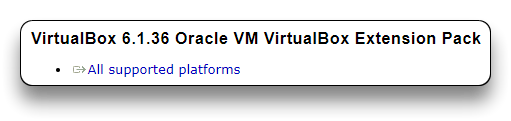

# Ubuntu - VM VirtualBox

❗➡️ [TO-UPDATE]

## Download and Install VirtualBox

VirtualBox is a virtualization open source software that runs on Linux, Windows and Mac OS.

- Download **VirtualBox** and **VirtualBox Extension Pack** [here](https://www.virtualbox.org/wiki/Downloads) based on your platform (Windows in this tutorial).




- Install VirtualBox with default settings.
- Install VirtualBox Extension Pack.

## Download Linux Image

For this tutorial Ubuntu Desktop Linux will be used.

If you want to use another distro check the [Popular Linux Distributions](linux-distributions.md) list.

- Download the latest **Ubuntu Desktop LTS** `.iso` file [here](https://ubuntu.com/download/desktop).

## Create Virtual Machine

- Run VirtualBox.
- Click on the ***New*** button to create a new virtual machine (***VM***)


- Click on **Expert Mode**


- Set the VM *Name*, the *machine folder* to store the VM, *type* (**`Linux`**) and *version* (**`Ubuntu 64bit`**).
- Set the Memory size (RAM) at **`4096 MB`** (4GB) or use the default settings **`1024 MB`**
- Select `Create a virtual hard disk now`
- Proceed with the ***Create*** button


- Set the File size (disk size) at **`20 GB`**
- Set the Hard disk file type as **`VDI - Dynamically allocated`**
- Proceed with the ***Create*** button to initialize the machine.


- Select the new VM in the manager windows and click on the ***Settings*** button.


- Navigate to the ***Sistem*** tab and:

  - remove Floppy from boot order
  - set Chipset to **`PIIX3`** (default)
  - **`Enable PAE/NX`** in the Processor menu
  - check Acceleration menu to have **`Default Paravirtualization`** and **`Enable Nested Paging`** checked


- Navigate to the ***Display*** tab and increase the **`Video Memory`** to **`128 MB`**

- **`Graphics Controller`** must be **`VMSVGA`** to be able to use VirtualBox Guest Additions


## Install Linux Image

- Select the new VM and click on the ***Start*** button to start it


- Click on the file icon to open the Optical disk selector


- Use the ***Add*** button to select the `.iso` file previously downloaded, select it from the list and ***Choose*** it
- Click on the ***Start*** button to start he machine with the mounted `ubuntu-22.04-desktop-amd64.iso` (in this case)


- Wait for the Ubuntu boot and installation menu
- Select your language and click ***Install Ubuntu***


- Select your **Keyboard layout** and continue
- Choose **`Normal installation`** and check both ***Other options*** boxes (you must be connected to the Internet)


- Choose **`Erase disk and install Ubuntu`** and continue the installation without enabling encryption


- Select your **Location** and time zone from the map screen
- Create your login details as `hostname`, `username` and `password`
- Proceed with the ***Continue*** button that will start Ubuntu installation


- **Restart** your VM once the installation has completed.


## Install VirtualBox Guest Additions

Guest Additions software unlocks some advanced features of VirtualBox to better integrate the VM and the host machine, as well as improved video support using VMSVGA graphics controller.

- Complete the VM boot and login to Ubuntu desktop
- On the VirtualBox menu select ***Devices - Insert Guest Additions CD image...***


- Run the VBox_GAs disk inside the virtual machine desktop
- **Run** the installation when prompted
  - If the prompt do not auto-start, open the disk, right-click on the **`autorun.sh`** file and ***Run as a Program***
  - Enter your password to install it


- Restart the VM
- Right-click on the disk and **Eject** it


- Activate the *shared clipboard* from the **`Devices - Shared Clipboard - Bidirectional`** menu


## Update Linux

Keep the Ubuntu O.S. updated using one of the next methods.

- Update it via the **Software Updater** app


- Open a **Terminal** window (**`Ctrl+Alt+T`**) and update the system with the next command.
  - This can be used when connected via SSH too.

```bash
sudo apt update && sudo apt upgrade -y
```

> 📌 Check the official documentation of the distro for the installation of other Linux distributions.

- Disable Ubuntu Pro ESM Hook

```bash
sudo sed -i'' -e 's/^\(\s\+\)\([^#]\)/\1# \2/' /etc/apt/apt.conf.d/20apt-esm-hook.conf
```

## Tools

### [Docker - Ubuntu](https://docs.docker.com/engine/install/ubuntu/)

```bash
for pkg in docker.io docker-doc docker-compose podman-docker containerd runc; do sudo apt remove $pkg -y; done

sudo apt update && sudo apt install -y ca-certificates curl gnupg

curl -fsSL https://download.docker.com/linux/ubuntu/gpg | sudo gpg --dearmor -o /usr/share/keyrings/docker.gpg
sudo chmod a+r /usr/share/keyrings/docker.gpg

sudo sh -c 'echo "deb [arch="$(dpkg --print-architecture)" signed-by=/usr/share/keyrings/docker.gpg] https://download.docker.com/linux/ubuntu "$(. /etc/os-release && echo "$VERSION_CODENAME")" stable" | sudo tee /etc/apt/sources.list.d/docker.list'

sudo apt update && sudo apt install -y docker-ce docker-ce-cli containerd.io docker-buildx-plugin docker-compose-plugin

sudo systemctl enable docker --now
sudo gpasswd -a "${USER}" docker
reboot

# Test
docker run hello-world
```


#### Wordpress Docker Instance

> 🔗 Thanks to [AppSecExplained](https://gist.github.com/AppSecExplained/8bbf5366c6279ffc44beec16e6c39855) for the `yml` file.

```bash
sudo mkdir /opt/wordpress
sudo nano /opt/wordpress/docker-compose.yml
```

```bash
version: "3"
services:
  database:
    image: mysql
    restart: always
    environment:
      MYSQL_ROOT_PASSWORD: wppassword
      MYSQL_DATABASE: wpdb
      MYSQL_USER: wpuser
      MYSQL_PASSWORD: wppassword
    volumes:
      - mysql:/var/lib/mysql

  wordpress:
    depends_on:
      - database
    image: wordpress:latest
    restart: always
    ports:
      - "80:80"
    environment:
      WORDPRESS_DB_HOST: database:3306
      WORDPRESS_DB_USER: wpuser
      WORDPRESS_DB_PASSWORD: wppassword
      WORDPRESS_DB_NAME: wpdb
    volumes:
      ["./:/var/www/html"]
volumes:
  mysql: {}
```

```bash
cd /opt/wordpress
docker compose up
```

- Open the Wordpress site

`http://localhost/wp-admin/`

- Fix `localhost` with the VM's `IP` address in the Wordpress General Settings.


**Some commands**

```bash
docker ps -a
docker exec -it <CONTAINER-ID> bash
```

------

