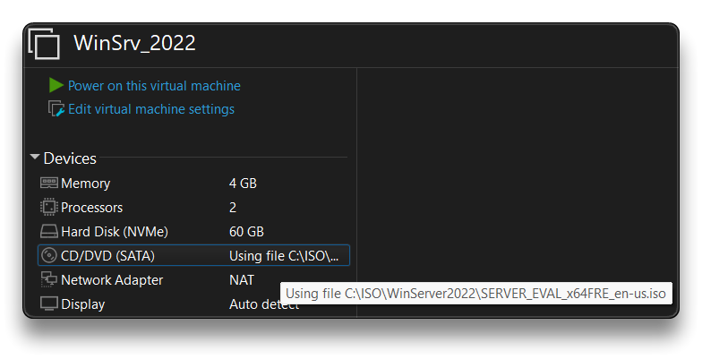

# Windows Server 2025 - VM

## First Install - Virtual Machine

* Create a new Virtual Machine in VMWare with preferred specs:
  * **Processors**: `1 CPU - 2 Cores`
  * **RAM** Memory: `4 GB`
  * **Hard Disk**: `60 GB`
  * **CD**: use the Win Server Evaluation `.iso` image file - [Direct download here - Win Server 2025](https://software-static.download.prss.microsoft.com/dbazure/888969d5-f34g-4e03-ac9d-1f9786c66749/26100.1742.240906-0331.ge_release_svc_refresh_SERVER_EVAL_x64FRE_en-us.iso) or from [Eval Center](https://www.microsoft.com/en-us/evalcenter/download-windows-server-2025) (same .iso) - and check `Connect at power on`
  * **Network**: set it as `NAT`
  * Edit virtual machine and _**Remove**_: `Sound Card` and `USB Controller`
* Boot the virtual machine and proceed with the [Win Server 2022 Installation - petri.com](https://petri.com/install-windows-server-2022/)



\[TO\_DO]

## Basic Configuration

### Change to Dark Theme

* Open **`CMD` as Administrator** and run:

**Dark theme**

```powershell
reg add HKCU\SOFTWARE\Microsoft\Windows\CurrentVersion\Themes\Personalize /v AppsUseLightTheme /t REG_DWORD /d 0 /f
reg add HKCU\SOFTWARE\Microsoft\Windows\CurrentVersion\Themes\Personalize /v SystemUsesLightTheme /t REG_DWORD /d 0 /f
```

**Light theme**

```powershell
reg add HKCU\SOFTWARE\Microsoft\Windows\CurrentVersion\Themes\Personalize /v AppsUseLightTheme /t REG_DWORD /d 1 /f
reg add HKCU\SOFTWARE\Microsoft\Windows\CurrentVersion\Themes\Personalize /v SystemUsesLightTheme /t REG_DWORD /d 1 /f
```

***
