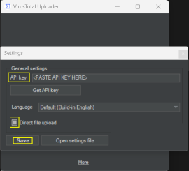
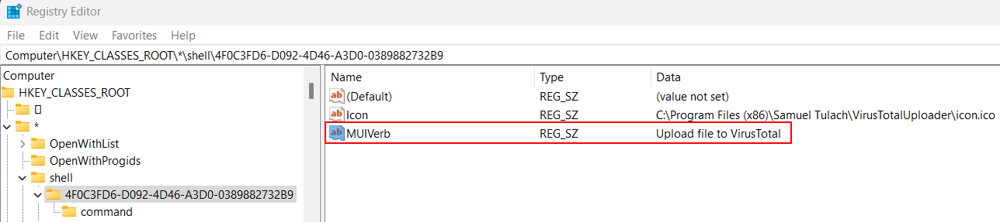
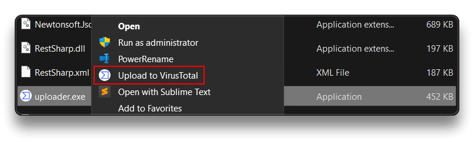

# 📃 Everything Windows


> 📜 In this 🪟 **Windows** notes repository, I store all of my notes related to the Windows operating system and Win apps.
>
> - 📌 *Some commands can be outdated.*

## Install

### Windows 11 without Internet

> 🔗 [How to bypass internet connection to install Windows 11 - Pureinfotech](https://pureinfotech.com/bypass-internet-connection-install-windows-11/)

- Install Windows 11 via [USB ISO](https://pureinfotech.com/create-bootable-windows-11-usb-install-media/)
- At the first boot in OOBE (Out-of-the-box experience), select Region and Keyboard layout
- On the "Let's connect you to a network" screen, press `SHIFT+F10` on the keyboard to open the `Command Prompt`, type the following command and wait for the reboot.

```bash
OOBE\BYPASSNRO
```

- After the reboot, click `I don't have internet` when asked to connect and `Continue with limited setup`.
- Create a local default Windows 11 account and proceed.
  - Disable and answer `No` to all the Privacy Settings if not needed.

Proceed with the final [Configuration](#configuration).

------

## Configuration

> 📝 *Tip*: The following settings should be used with a [clean Windows install](https://pureinfotech.com/clean-install-windows-11/); otherwise, **proceed with caution** ⚠️.

### Privacy Settings

-TBA-

### Disable Bing Search

> 🔗 [How To Disable Bing Search On Windows 11](https://www.onmsft.com/how-to/how-to-disable-bing-search-on-windows-11/)
>

```powershell
reg add HKCU\Software\Microsoft\Windows\CurrentVersion\Search /v BingSearchEnabled /t REG_DWORD /d 0 /f
```

### Debloat Win

> 🔗 [BloatyNosy - by Builtbybel](https://github.com/builtbybel/BloatyNosy/)
>
> 🔗 [Windows11-Debloat-Privacy-Guide](https://github.com/TheWorldOfPC/Windows11-Debloat-Privacy-Guide)

**Removing Telemetry and other unnecessary services**

- Open `cmd.exe` and type the following commands

```powershell
sc delete DiagTrack
sc delete dmwappushservice
sc delete WerSvc
sc delete OneSyncSvc
sc delete MessagingService
sc delete wercplsupport
sc delete PcaSvc
sc config wlidsvc start=demand
sc delete wisvc
sc delete RetailDemo
sc delete diagsvc
sc delete shpamsvc 
sc delete TermService
sc delete UmRdpService
sc delete SessionEnv
sc delete TroubleshootingSvc
for /f "tokens=1" %I in ('reg query "HKLM\SYSTEM\CurrentControlSet\Services" /k /f "wscsvc" ^| find /i "wscsvc"') do (reg delete %I /f)
for /f "tokens=1" %I in ('reg query "HKLM\SYSTEM\CurrentControlSet\Services" /k /f "OneSyncSvc" ^| find /i "OneSyncSvc"') do (reg delete %I /f)
for /f "tokens=1" %I in ('reg query "HKLM\SYSTEM\CurrentControlSet\Services" /k /f "MessagingService" ^| find /i "MessagingService"') do (reg delete %I /f)
for /f "tokens=1" %I in ('reg query "HKLM\SYSTEM\CurrentControlSet\Services" /k /f "PimIndexMaintenanceSvc" ^| find /i "PimIndexMaintenanceSvc"') do (reg delete %I /f)
for /f "tokens=1" %I in ('reg query "HKLM\SYSTEM\CurrentControlSet\Services" /k /f "UserDataSvc" ^| find /i "UserDataSvc"') do (reg delete %I /f)
for /f "tokens=1" %I in ('reg query "HKLM\SYSTEM\CurrentControlSet\Services" /k /f "UnistoreSvc" ^| find /i "UnistoreSvc"') do (reg delete %I /f)
for /f "tokens=1" %I in ('reg query "HKLM\SYSTEM\CurrentControlSet\Services" /k /f "BcastDVRUserService" ^| find /i "BcastDVRUserService"') do (reg delete %I /f)
for /f "tokens=1" %I in ('reg query "HKLM\SYSTEM\CurrentControlSet\Services" /k /f "Sgrmbroker" ^| find /i "Sgrmbroker"') do (reg delete %I /f)
sc delete diagnosticshub.standardcollector.service
reg add "HKEY_CURRENT_USER\SOFTWARE\Microsoft\Siuf\Rules" /v "NumberOfSIUFInPeriod" /t REG_DWORD /d 0 /f
reg delete "HKEY_CURRENT_USER\SOFTWARE\Microsoft\Siuf\Rules" /v "PeriodInNanoSeconds" /f
reg add "HKLM\SYSTEM\ControlSet001\Control\WMI\AutoLogger\AutoLogger-Diagtrack-Listener" /v Start /t REG_DWORD /d 0 /f
reg add "HKEY_LOCAL_MACHINE\SOFTWARE\Policies\Microsoft\Windows\AppCompat" /v AITEnable /t REG_DWORD /d 0 /f
reg add "HKEY_LOCAL_MACHINE\SOFTWARE\Policies\Microsoft\Windows\AppCompat" /v DisableInventory /t REG_DWORD /d 1 /f
reg add "HKEY_LOCAL_MACHINE\SOFTWARE\Policies\Microsoft\Windows\AppCompat" /v DisablePCA /t REG_DWORD /d 1 /f
reg add "HKEY_LOCAL_MACHINE\SOFTWARE\Policies\Microsoft\Windows\AppCompat" /v DisableUAR /t REG_DWORD /d 1 /f
reg add "HKLM\SOFTWARE\Policies\Microsoft\MicrosoftEdge\PhishingFilter" /v "EnabledV9" /t REG_DWORD /d 0 /f
reg add "HKLM\SOFTWARE\Policies\Microsoft\Windows\System" /v "EnableSmartScreen" /t REG_DWORD /d 0 /f
reg add "HKCU\Software\Microsoft\Internet Explorer\PhishingFilter" /v "EnabledV9" /t REG_DWORD /d 0 /f
reg add "HKCU\Software\Microsoft\Windows\CurrentVersion\Policies\Explorer" /v "NoRecentDocsHistory" /t REG_DWORD /d 1 /f
reg add "HKLM\SOFTWARE\Microsoft\Windows NT\CurrentVersion\Image File Execution Options\CompatTelRunner.exe" /v Debugger /t REG_SZ /d "%windir%\System32\taskkill.exe" /f
reg add "HKLM\SOFTWARE\Microsoft\Windows NT\CurrentVersion\Image File Execution Options\DeviceCensus.exe" /v Debugger /t REG_SZ /d "%windir%\System32\taskkill.exe" /f
```

**Scheduled tasks**

```powershell
schtasks /Change /TN "Microsoft\Windows\AppID\SmartScreenSpecific" /disable
schtasks /Change /TN "Microsoft\Windows\Application Experience\AitAgent" /disable
schtasks /Change /TN "Microsoft\Windows\Application Experience\Microsoft Compatibility Appraiser" /disable
schtasks /Change /TN "Microsoft\Windows\Application Experience\ProgramDataUpdater" /disable
schtasks /Change /TN "Microsoft\Windows\Application Experience\StartupAppTask" /disable
schtasks /Change /TN "Microsoft\Windows\Autochk\Proxy" /disable
schtasks /Change /TN "Microsoft\Windows\CloudExperienceHost\CreateObjectTask" /disable
schtasks /Change /TN "Microsoft\Windows\Customer Experience Improvement Program\BthSQM" /disable
schtasks /Change /TN "Microsoft\Windows\Customer Experience Improvement Program\Consolidator" /disable
schtasks /Change /TN "Microsoft\Windows\Customer Experience Improvement Program\KernelCeipTask" /disable
schtasks /Change /TN "Microsoft\Windows\Customer Experience Improvement Program\Uploader" /disable
schtasks /Change /TN "Microsoft\Windows\Customer Experience Improvement Program\UsbCeip" /disable
schtasks /Change /TN "Microsoft\Windows\DiskDiagnostic\Microsoft-Windows-DiskDiagnosticDataCollector" /disable
schtasks /Change /TN "Microsoft\Windows\DiskFootprint\Diagnostics" /disable
schtasks /Change /TN "Microsoft\Windows\FileHistory\File History (maintenance mode)" /disable
schtasks /Change /TN "Microsoft\Windows\Maintenance\WinSAT" /disable
schtasks /Change /TN "Microsoft\Windows\PI\Sqm-Tasks" /disable
schtasks /Change /TN "Microsoft\Windows\Power Efficiency Diagnostics\AnalyzeSystem" /disable
schtasks /Change /TN "Microsoft\Windows\Shell\FamilySafetyMonitor" /disable
schtasks /Change /TN "Microsoft\Windows\Shell\FamilySafetyRefresh" /disable
schtasks /Change /TN "Microsoft\Windows\Shell\FamilySafetyUpload" /disable
schtasks /Change /TN "Microsoft\Windows\Windows Error Reporting\QueueReporting" /disable
schtasks /Change /TN "Microsoft\Windows\WindowsUpdate\Automatic App Update" /disable
schtasks /Change /TN "Microsoft\Windows\License Manager\TempSignedLicenseExchange" /disable
schtasks /Change /TN "Microsoft\Windows\Clip\License Validation" /disable
schtasks /Change /TN "\Microsoft\Windows\ApplicationData\DsSvcCleanup" /disable
schtasks /Change /TN "\Microsoft\Windows\Power Efficiency Diagnostics\AnalyzeSystem" /disable
schtasks /Change /TN "\Microsoft\Windows\PushToInstall\LoginCheck" /disable
schtasks /Change /TN "\Microsoft\Windows\PushToInstall\Registration" /disable
schtasks /Change /TN "\Microsoft\Windows\Shell\FamilySafetyMonitor" /disable
schtasks /Change /TN "\Microsoft\Windows\Shell\FamilySafetyMonitorToastTask" /disable
schtasks /Change /TN "\Microsoft\Windows\Shell\FamilySafetyRefreshTask" /disable
schtasks /Change /TN "\Microsoft\Windows\Subscription\EnableLicenseAcquisition" /disable
schtasks /Change /TN "\Microsoft\Windows\Subscription\LicenseAcquisition" /disable
schtasks /Change /TN "\Microsoft\Windows\Diagnosis\RecommendedTroubleshootingScanner" /disable
schtasks /Change /TN "\Microsoft\Windows\Diagnosis\Scheduled" /disable
schtasks /Change /TN "\Microsoft\Windows\NetTrace\GatherNetworkInfo" /disable
del /F /Q "C:\Windows\System32\Tasks\Microsoft\Windows\SettingSync\*" 
```


------

## CMD commands

> ❗ Most of the following commands have to be run by opening **`CMD` as Administrator**.

### Change Windows Theme

> 🔗 [How to Change Themes in Window 11 Without Activating Windows](https://techwiser.com/change-theme-windows-11/)
>

**Dark theme**

```powershell
reg add HKCU\SOFTWARE\Microsoft\Windows\CurrentVersion\Themes\Personalize /v AppsUseLightTheme /t REG_DWORD /d 0 /f
reg add HKCU\SOFTWARE\Microsoft\Windows\CurrentVersion\Themes\Personalize /v SystemUsesLightTheme /t REG_DWORD /d 0 /f
```

**Light theme**

```powershell
reg add HKCU\SOFTWARE\Microsoft\Windows\CurrentVersion\Themes\Personalize /v AppsUseLightTheme /t REG_DWORD /d 1 /f
reg add HKCU\SOFTWARE\Microsoft\Windows\CurrentVersion\Themes\Personalize /v SystemUsesLightTheme /t REG_DWORD /d 1 /f
```

### Winget Upgrade Script

- Create a `UpgradePackages.bat` with the following content and run it to upgrade installed packages

```powershell
@echo off
:: Check for admin rights
>nul 2>&1 "%SYSTEMROOT%\system32\cacls.exe" "%SYSTEMROOT%\system32\config\system"

:: If error flag set, we do not have admin rights, so prompt for them
if '%errorlevel%' NEQ '0' (
    echo Requesting administrative privileges...
    powershell.exe -Command "Start-Process '%~dpnx0' -Verb RunAs"
    exit /B
)

:: Set the execution policy to allow local scripts to run
powershell -NoProfile -Command "Set-ExecutionPolicy RemoteSigned -Scope CurrentUser -Force"

:: Run the winget upgrade command and log the output live
powershell -NoProfile -Command "Start-Transcript -Path UpgradeLog.txt -Force; winget upgrade --all; Stop-Transcript"

:: Indicate completion
echo All packages have been upgraded. Press any key to exit...
pause
```

### Basic, Network, I/O, Task, Process

```powershell
# System
set
set /?
ver
systeminfo
chkdsk
driverquery
sfc /scannow
shutdown /r
shutdown /a

# Network
ipconfig /all
ping example.com
tracert example.com
nslookup example.com
netstat -abon
netstat -abon | findstr :3389

# Files and Disk
cd
dir
dir /a
dir /s
mkdir dirname
rmdir dirname
type
more
copy
copy *.md
move
del
erase

# Tasks and Processes
tasklist
tasklist /FI "imagename eq notepad.exe"
tasklist /FI "pid eq 1516"
taskkill /PID targetpid
```


------

## Powershell commands

### [Winget](https://learn.microsoft.com/en-us/windows/package-manager/winget/upgrade)

```bash
# Upgrade all installed packages to the latest version if available
winget upgrade --all
```

### Powercat ###

```powershell
Set-ExecutionPolicy Unrestricted
IEX (New-Object System.Net.webclient).DownloadString('https://raw.githubusercontent.com/besimorhino/powercat/master/powercat.ps1')

powercat -l -p 9000 -v
powercat -h
```


------

## Software

### [Sysinternals](https://learn.microsoft.com/en-us/sysinternals/)

> 🔗 Web: [https://live.sysinternals.com/](https://live.sysinternals.com/)
>

- Via Windows Explorer:

```powershell
\\live.sysinternals.com\tools
```

- **`e.g.`** Copy `tools` folder to `C:\Program Files\` and rename it to **`sysinternals`**

### [VirusTotal Uploader ContextMenu](https://github.com/SamuelTulach/VirusTotalUploader)

1. Download `vt_setup.msi` from [https://github.com/SamuelTulach/VirusTotalUploader/releases](https://github.com/SamuelTulach/VirusTotalUploader/releases)
2. Run `vt_setup.msi` and install **VirusTotalUploader**
3. Create an account and Get an **API key** from [VirusTotal.com](https://www.virustotal.com/)
4. Copy the **API key**
5. Run `VirusTotalUploader`, paste API key and select *`Direct file upload`*



6. *EXTRA*: Change the *context menu handler* by opening `regedit.exe` and searching for `VirusTotalUploader`.
   - It should be in `HKEY_CLASSES_ROOT\*\shell`
   - Change the `MUIVerb` data value, **e.g.** *Upload to VirusTotal*.



7. Now you can right-click any file an select "*Upload to VirusTotal*" to scan it using VirusTotal



> | VirusTotal - Free public API | Limits                 |
> | :--------------------------- | ---------------------- |
> | Request rate                 | 4 lookups / min        |
> | Daily quota                  | 500 lookups / day      |
> | Monthly quota                | 15.5 K lookups / month |


### VMware Workstation Pro

- Delay the bios boot in a VM

```bash
# Add line to .vmx file:

bios.bootDelay = "5000"
```


------

## Troubleshooting

### Delete GRUB files from a Boot EFI partition in Windows

> 🔗 [How to delete GRUB files from a Boot EFI partition in Windows 10](https://linuxbsdos.com/2015/09/05/how-to-delete-grub-files-from-a-boot-efi-partition-in-windows-10/)

- Run a `cmd.exe` process with administrator privileges
- Run `diskpart`
- Type: `list disk` then `sel disk X` where X is the drive your boot files reside on
- Type `list vol` to see all partitions (volumes) on the disk (the EFI volume will be formatted in FAT, others will be NTFS)
- Select the EFI volume by typing: `sel vol Y` where Y is the SYSTEM volume (this is almost always the EFI partition)
- For convenience, assign a drive letter by typing: `assign letter=M:` where M is a free (unused) drive letter
- Type `exit` to leave disk part
- While still in the `cmd` prompt, type: `M:` and hit enter, where M was the drive letter you just created.
- Type `dir` to list directories on this mounted EFI partition
- If you are in the right place, you should see a directory called EFI
- Type `cd EFI` and then `dir` to list the child directories inside EFI
- Type `rmdir /S ubuntu` to delete the ubuntu boot directory

```powershell
## These commands are used to identify and select the hard drive

diskpart
list disk
sel disk 0

## These commands are used to list the partitions, select the Boot EFI partition, 
## then assign it a drive letter

list vol
sel vol 2
assign letter=D:
exit

## These commands are used to change into the Boot EFI folder and delete the GRUB folder

cd /d D:
ls
ls EFI
cd EFI
ls
rmdir /s ubuntu
```

---

### VMware performance - Disable Memory Integrity

> ❗ I do not assume any responsibility for the potential risks or consequences associated with the disabled memory integrity.
>
> 🔗 [Options to optimize gaming performance in Windows 11 - Microsoft Support](https://support.microsoft.com/en-us/windows/options-to-optimize-gaming-performance-in-windows-11-a255f612-2949-4373-a566-ff6f3f474613)
>
> 🔗 [Enable or Disable Core Isolation and Memory Integrity in Windows 11](https://www.thewindowsclub.com/core-isolation-and-memory-integrity-in-windows-10)
>
> 🔗 [How to Disable or Remove Hyper-V in Windows 11](https://www.makeuseof.com/windows-11-disable-hyper-v/)
>
> - **This is done to ensure VMware Workstation virtualization operates smoothly without any performance issues.**
> - **Memory integrity** (hypervisor-protected code integrity) is a security feature of Core isolation that prevents attacks from inserting malicious code into high-security processes. Take your own risk by disabling it.

- Disable `Memory Integrity` - Windows Security -> Device Security -> Core Isolation details
- Open `cmd` as Administrator and run

```powershell
# Disables power throttling for the VMware virtual machine executable (64-bit version)
powercfg /powerthrottling disable /path "C:\Program Files (x86)\VMware\VMware Workstation\x64\vmware-vmx.exe"

# Disables power throttling for the main VMware Workstation executable
powercfg /powerthrottling disable /path "C:\Program Files (x86)\VMware\VMware Workstation\vmware.exe"

# Disables the Windows Hyper-V
bcdedit /set hypervisorlaunchtype off
```

**Enable or Disable Core Isolation and Memory Integrity using Registry**

```powershell
HKEY_LOCAL_MACHINE\SYSTEM\CurrentControlSet\Control\DeviceGuard\Scenarios\HypervisorEnforcedCodeIntegrity
```

1. Open `regedit`
2. Navigate to `HKEY_LOCAL_MACHINE\SYSTEM\CurrentControlSet\Control\DeviceGuard\Scenarios\`
3. Right-click on *Scenarios > New > Key*.
4. Name it as `HypervisorEnforcedCodeIntegrity`.
5. Create a New `DWORD (32-bit) Value`.
6. Name it as `Enabled`.
7. Set the Value data as `0` to disable.
8. Restart the computer.

---


---

## 🌐 Resources 🔗

### Install

- [PERFORM CLEAN INSTALL OF WINDOWS 11 (SIX WAYS)](https://pureinfotech.com/clean-install-windows-11/)

### Privacy

- [How to protect your privacy in Windows 11](https://www.computerworld.com/article/3684413/how-to-protect-your-privacy-in-windows-11.html)

- [Enable or Disable Choose Privacy Settings Experience at Sign-in in Windows 11 - ElevenForum](https://www.elevenforum.com/t/enable-or-disable-choose-privacy-settings-experience-at-sign-in-in-windows-11.12027/)

- [Enable or Disable Location Services in Windows 11](https://www.elevenforum.com/t/enable-or-disable-location-services-in-windows-11.3003/)
- [Enable or Disable Find My Device in Windows 11](https://www.elevenforum.com/t/enable-or-disable-find-my-device-in-windows-11.3861/)
- [Change Diagnostic Data Settings in Windows 11](https://www.elevenforum.com/t/change-diagnostic-data-settings-in-windows-11.2621/)
- [Enable or Disable Improve Inking and Typing in Windows 11](https://www.elevenforum.com/t/enable-or-disable-improve-inking-and-typing-in-windows-11.7575/)
- [Enable or Disable Tailored Experiences in Windows 11](https://www.elevenforum.com/t/enable-or-disable-tailored-experiences-in-windows-11.7554/)
- [Enable or Disable Advertising ID for Personalized Ads in Apps in Windows 11](https://www.elevenforum.com/t/enable-or-disable-advertising-id-for-personalized-ads-in-apps-in-windows-11.3730/)
- [10 Settings You Should Change to Protect Your Privacy on Windows 11](https://beebom.com/change-windows-11-settings-protect-privacy/)
- [Disable the Telemetry on Windows 11 and Stop Microsoft From Logging Your Data](https://wccftech.com/how-to/disable-the-telemetry-on-windows-11-and-stop-microsoft-from-logging-your-data/)


### Debloat Windows 11

- [BloatyNosy - by Builtbybel](https://github.com/builtbybel/BloatyNosy/)
- [Windows11-Debloat-Privacy-Guide](https://github.com/TheWorldOfPC/Windows11-Debloat-Privacy-Guide)

---

