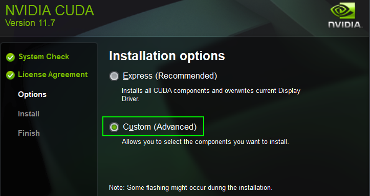

# Hashcat

## Windows Installation

- Full installation guide - https://miloserdov.org/?p=7501
- Download link here - https://hashcat.net/hashcat/
- Download and unzip it into a folder e.g. **c:\temp**
  - Download and install latest NVIDIA Driver - https://www.nvidia.com/Download/index.aspx
  - Download, install latest CUDA Toolkit and **reboot pc** -  https://developer.nvidia.com/cuda-downloads




## Usage

- Run Windows Powershell:

```powershell
cd C:\temp\hashcat-6.2.5
.\hashcat.exe -I
```


- Run the benchmark to test the performance:

```powershell
.\hashcat.exe -b

CUDA API (CUDA 11.7)
====================
* Device #1: NVIDIA GeForce GTX 1060 6GB, 5222/6143 MB, 10MCU

OpenCL API (OpenCL 3.0 CUDA 11.7.101) - Platform #1 [NVIDIA Corporation]
========================================================================
* Device #2: NVIDIA GeForce GTX 1060 6GB, skipped

Benchmark relevant options:
===========================
* --optimized-kernel-enable

-------------------
* Hash-Mode 0 (MD5)
-------------------

Speed.#1.........: 13355.2 MH/s (49.35ms) @ Accel:512 Loops:256 Thr:512 Vec:8

----------------------
* Hash-Mode 100 (SHA1)
----------------------

Speed.#1.........:  4594.1 MH/s (72.30ms) @ Accel:64 Loops:1024 Thr:512 Vec:1

---------------------------
* Hash-Mode 1400 (SHA2-256)
---------------------------

Speed.#1.........:  1637.8 MH/s (50.84ms) @ Accel:8 Loops:1024 Thr:1024 Vec:1

---------------------------
* Hash-Mode 1700 (SHA2-512)
---------------------------

Speed.#1.........:   537.5 MH/s (77.50ms) @ Accel:32 Loops:512 Thr:256 Vec:1

-------------------------------------------------------------
* Hash-Mode 22000 (WPA-PBKDF2-PMKID+EAPOL) [Iterations: 4095]
-------------------------------------------------------------

Speed.#1.........:   235.7 kH/s (84.50ms) @ Accel:32 Loops:512 Thr:512 Vec:1

-----------------------
* Hash-Mode 1000 (NTLM)
-----------------------

Speed.#1.........: 24373.0 MH/s (54.40ms) @ Accel:256 Loops:1024 Thr:512 Vec:8

---------------------
* Hash-Mode 3000 (LM)
---------------------

Speed.#1.........: 10911.2 MH/s (60.89ms) @ Accel:512 Loops:1024 Thr:128 Vec:1

--------------------------------------------
* Hash-Mode 5500 (NetNTLMv1 / NetNTLMv1+ESS)
--------------------------------------------

Speed.#1.........: 13142.1 MH/s (50.45ms) @ Accel:128 Loops:512 Thr:1024 Vec:2

----------------------------
* Hash-Mode 5600 (NetNTLMv2)
----------------------------

Speed.#1.........:   845.9 MH/s (49.20ms) @ Accel:32 Loops:256 Thr:512 Vec:1

--------------------------------------------------------
* Hash-Mode 1500 (descrypt, DES (Unix), Traditional DES)
--------------------------------------------------------

Speed.#1.........:   446.8 MH/s (93.09ms) @ Accel:128 Loops:1024 Thr:32 Vec:1

------------------------------------------------------------------------------
* Hash-Mode 500 (md5crypt, MD5 (Unix), Cisco-IOS $1$ (MD5)) [Iterations: 1000]
------------------------------------------------------------------------------

Speed.#1.........:  4343.3 kH/s (60.04ms) @ Accel:32 Loops:1000 Thr:1024 Vec:1

----------------------------------------------------------------
* Hash-Mode 3200 (bcrypt $2*$, Blowfish (Unix)) [Iterations: 32]
----------------------------------------------------------------

Speed.#1.........:     8762 H/s (84.10ms) @ Accel:64 Loops:32 Thr:12 Vec:1

--------------------------------------------------------------------
* Hash-Mode 1800 (sha512crypt $6$, SHA512 (Unix)) [Iterations: 5000]
--------------------------------------------------------------------

Speed.#1.........:    80401 H/s (80.02ms) @ Accel:256 Loops:256 Thr:512 Vec:1

--------------------------------------------------------
* Hash-Mode 7500 (Kerberos 5, etype 23, AS-REQ Pre-Auth)
--------------------------------------------------------

Speed.#1.........:   175.6 MH/s (59.41ms) @ Accel:32 Loops:1024 Thr:32 Vec:1

-------------------------------------------------
* Hash-Mode 13100 (Kerberos 5, etype 23, TGS-REP)
-------------------------------------------------

Speed.#1.........:   185.8 MH/s (56.08ms) @ Accel:256 Loops:128 Thr:32 Vec:1

---------------------------------------------------------------
* Hash-Mode 15300 (DPAPI masterkey file v1) [Iterations: 23999]
---------------------------------------------------------------

Speed.#1.........:    40584 H/s (83.16ms) @ Accel:16 Loops:1024 Thr:512 Vec:1

---------------------------------------------------------------
* Hash-Mode 15900 (DPAPI masterkey file v2) [Iterations: 12899]
---------------------------------------------------------------

Speed.#1.........:    19054 H/s (81.59ms) @ Accel:8 Loops:512 Thr:512 Vec:1

------------------------------------------------------------------
* Hash-Mode 7100 (macOS v10.8+ (PBKDF2-SHA512)) [Iterations: 1023]
------------------------------------------------------------------

Speed.#1.........:   226.6 kH/s (77.15ms) @ Accel:32 Loops:127 Thr:512 Vec:1

---------------------------------------------
* Hash-Mode 11600 (7-Zip) [Iterations: 16384]
---------------------------------------------

Speed.#1.........:   163.1 kH/s (57.55ms) @ Accel:32 Loops:4096 Thr:128 Vec:1

------------------------------------------------
* Hash-Mode 12500 (RAR3-hp) [Iterations: 262144]
------------------------------------------------

Speed.#1.........:    26991 H/s (93.49ms) @ Accel:128 Loops:16384 Thr:32 Vec:1

--------------------------------------------
* Hash-Mode 13000 (RAR5) [Iterations: 32799]
--------------------------------------------

Speed.#1.........:    20358 H/s (60.28ms) @ Accel:4 Loops:1024 Thr:1024 Vec:1

-----------------------------------------------------------------------
* Hash-Mode 6211 (TrueCrypt RIPEMD160 + XTS 512 bit) [Iterations: 1999]
-----------------------------------------------------------------------

Speed.#1.........:   137.9 kH/s (67.45ms) @ Accel:8 Loops:256 Thr:1024 Vec:1

-----------------------------------------------------------------------------------
* Hash-Mode 13400 (KeePass 1 (AES/Twofish) and KeePass 2 (AES)) [Iterations: 24569]
-----------------------------------------------------------------------------------

Speed.#1.........:    17053 H/s (49.73ms) @ Accel:128 Loops:128 Thr:128 Vec:1

----------------------------------------------------------------
* Hash-Mode 6800 (LastPass + LastPass sniffed) [Iterations: 499]
----------------------------------------------------------------

Speed.#1.........:  1178.8 kH/s (40.55ms) @ Accel:16 Loops:249 Thr:1024 Vec:1

--------------------------------------------------------------------
* Hash-Mode 11300 (Bitcoin/Litecoin wallet.dat) [Iterations: 200459]
--------------------------------------------------------------------

Speed.#1.........:     2534 H/s (65.77ms) @ Accel:128 Loops:256 Thr:1024 Vec:1

Started: Wed Aug 10 21:40:09 2022
Stopped: Wed Aug 10 21:46:24 2022
```

------

