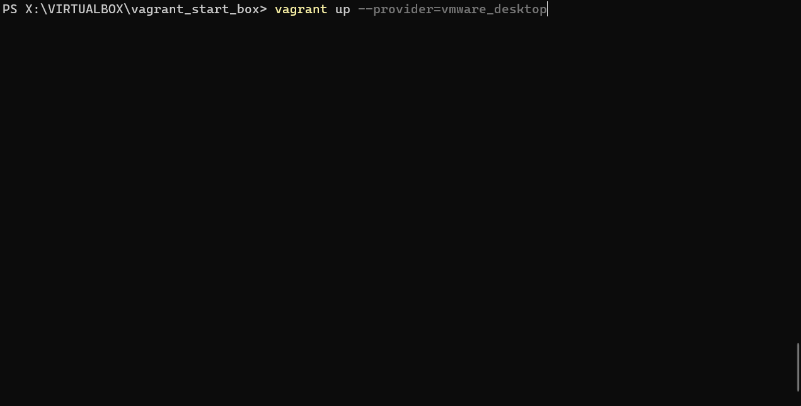

# Vagrant - Windows

> - [Vagrant Installation](https://developer.hashicorp.com/vagrant/docs/installation)
>   - [Download](https://developer.hashicorp.com/vagrant/downloads) and Run the installer for Windows system.
>   - The installer will automatically add `vagrant` to your system path so that it is available in terminals.
>   - Verify the correct installation using the **`vagrant`** command inside PowerShell.
>
> - The primary function of the [Vagrantfile](https://developer.hashicorp.com/vagrant/docs/vagrantfile) is to describe the type of machine required for a project, and how to configure and provision these machines. Vagrantfiles are called Vagrantfiles because the actual literal filename for the file is `Vagrantfile`.
> - Vagrant is meant to run with one Vagrantfile per project.
> - When you run any `vagrant` command, Vagrant climbs up the directory tree looking for the first Vagrantfile it can find, starting first in the current directory.
>   - This feature lets you run `vagrant` from any directory in your project.
> - Find more boxes at [HashiCorp's Vagrant Cloud box catalog](https://vagrantcloud.com/boxes/search)


## Default Provider

- *If you have the VMware provider installed, it will always take priority over VirtualBox.*
- Check more infos about Default Providers [here](https://developer.hashicorp.com/vagrant/docs/providers/basic_usage#default-provider)
- E.g.

```
Vagrant.configure("2") do |config|
  # ... other config up here

  # Prefer VirtualBox before VMware Workstation
  config.vm.provider "virtualbox"
  config.vm.provider "vmware_desktop"
end
```


## VirtualBox

- Install [VirtualBox](https://www.virtualbox.org/wiki/Downloads) & VirtualBox Extension Pack (default Vagrant provider)
- Create a new directory for the **vargrant project**
- Open `PowerShell` and move into the project directory
- Initialize the directory with a box, in this case the [`hashicorp/bionic64`](https://app.vagrantup.com/hashicorp/boxes/bionic64) box will be used

```powershell
vagrant init hashicorp/bionic64
```


- `box add` subcommand can be used to install a box without creating a new Vagrantfile
  - ***do not** add it if already initialized*

```powershell
vagrant box add hashicorp/bionic64
```

> This will download the box named `hashicorp/bionic64` from [HashiCorp's Vagrant Cloud box catalog](https://vagrantcloud.com/boxes/search), where you can find and host boxes.
>
> Boxes are globally stored for the current user. Each project uses a box as an initial image to clone from, and never modifies the actual base image. This means that if you have two projects both using the `hashicorp/bionic64` box you just added, adding files in one guest machine will have no effect on the other machine.

- Use the box as a base in the project by opening the `Vagrantfile`. Content must be:

```powershell
Vagrant.configure("2") do |config|
  config.vm.box = "hashicorp/bionic64"
end
```

> The `hashicorp/bionic64` in this case must match the name you used to add the box above. This is how Vagrant knows what box to use. If the box was not added before, **Vagrant will automatically download and add the box when it is run.**

- Bring up the virtual machine

```powershell
vagrant up --provider=virtualbox
```


- VirtualBox - created and started VM


- SSH into the machine:

```bash
vagrant ssh

vagrant@127.0.0.1's password:
Welcome to Ubuntu 18.04.3 LTS (GNU/Linux 4.15.0-58-generic x86_64)

 * Documentation:  https://help.ubuntu.com
 * Management:     https://landscape.canonical.com
 * Support:        https://ubuntu.com/advantage

  System information as of Wed Feb  1 21:46:32 UTC 2023

  System load:  0.08              Processes:           91
  Usage of /:   2.5% of 61.80GB   Users logged in:     0
  Memory usage: 11%               IP address for eth0: 10.0.2.15
  Swap usage:   0%
[...]

vagrant@vagrant:~$ logout
Connection to 127.0.0.1 closed.
```

- Destroy the machine

```powershell
vagrant destroy
```


- Remove the box

```powershell
vagrant box list
	hashicorp/bionic64 (virtualbox, 1.0.282)
vagrant box remove hashicorp/bionic64
```

- Extras:

  - Suspend the VM
    - The virtual machine will still use disk space while suspended, and requires additional disk space to store the state of the virtual machine RAM.
  
  
  ```powershell
  vagrant suspend
  ```
  
  - Gracefully shutdown the VM
    - Halting your machine will cleanly shut it down, preserving the contents of disk and allowing you to cleanly start it again.
  
  
  ```powershell
  vagrant halt
  ```
  
  

## VMware Workstation

- Install VMware
- To upgrade the Vagrant VMware utility, download the latest version from the [Vagrant VMware utility downloads page](https://developer.hashicorp.com/vagrant/downloads/vmware) and install the system package to your local system.
- You can install or update the Vagrant VMware plugin to the latest version by re-running the install command:

```powershell
vagrant plugin install vagrant-vmware-desktop
```


- Create a new directory for the **vargrant project**
- Open `PowerShell` and move into the project directory
- Initialize the directory with a box, in this case the [`hashicorp/bionic64`](https://app.vagrantup.com/hashicorp/boxes/bionic64) box will be used

```powershell
vagrant init hashicorp/bionic64
```


- Set the GUI in the `Vagrantfile` to show the VMs in the VMware dashboard ([provider settings here](https://developer.hashicorp.com/vagrant/docs/providers/vmware/configuration))

```ruby
config.vm.provider "vmware_desktop" do |v|
    v.gui = true
end
```

- Bring up the virtual machine and try to SSH into it

```powershell
vagrant up --provider=vmware_desktop
vagrant ssh
```



- VMware Workstation - created and started VM


- Shutdown the VM and destroy it

```powershell
vagrant halt
vagrant destroy
```

> - After stopping the VM with `vagrant halt`, at the second boot with `vagrant up` this error could appear:
>
> *Vagrant encountered an error while attempting to prune unused
> port forward entries*
>
> - To solve this port forwarding issue use this command:
>
> ```powershell
> vagrant cap provider scrub_forwarded_ports
> ```
>
> - Then bring up again the VM with `vagrant up --provider=vmware_desktop` command.

------

