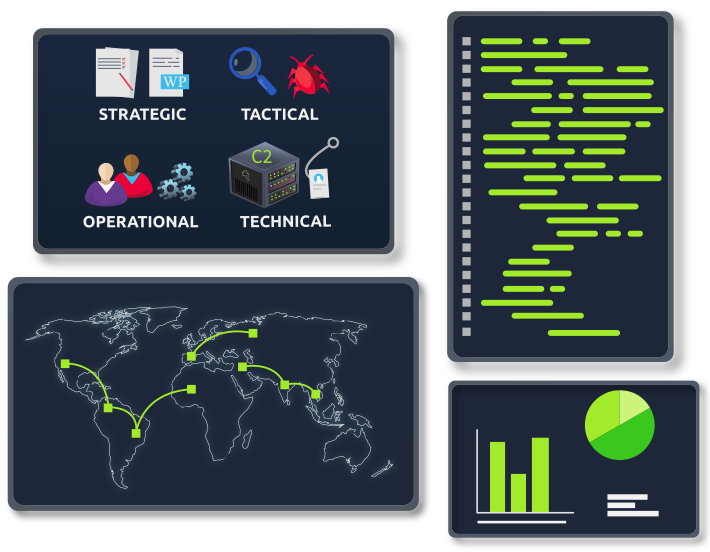

# Cyber Threat Intelligence

> 🌐 [Cyber Threat Intelligence - Tryhackme Module](https://tryhackme.com/module/cyber-threat-intelligence)
>
> *Learn about identifying and using available security knowledge to mitigate and manage potential adversary actions.*
>
> 

# [Intro to Cyber Threat Intel](https://tryhackme.com/jr/cyberthreatintel)

> Introducing cyber threat intelligence and related topics, such as relevant standards and frameworks.]

# [Threat Intelligence Tools](https://tryhackme.com/jr/threatinteltools)

> Explore different OSINT tools used to conduct security threat assessments and investigations.

# [Yara](https://tryhackme.com/jr/yara)

> Learn the applications and language that is Yara for everything threat intelligence, forensics, and threat hunting!

# [OpenCTI](https://tryhackme.com/jr/opencti)

> Provide an understanding of the OpenCTI Project

# [MISP](https://tryhackme.com/jr/misp)

> Walkthrough on the use of MISP as a Threat Sharing Platform

